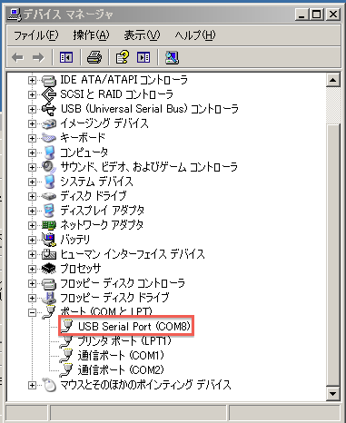
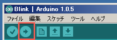
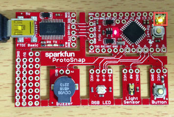

オリジナルの作成：2014/02/15

# 01-Arduinoのセットアップ
高岡に拠点をおくNPO法人NATの事務所をお借りして、2014年1月25日からArduino勉強をしています。

共に皆さんの指導をして頂くのは、同じくNATのメンバーの中山司郎さんです。

はじめての人にArduinoを使ってもらうには、どうしてもArduino IDEのインストールが必要になります。 

## Windowsユーザのインストール手順
Windowsユーザは、以下のURLにジャンプし、Windows Installerをクリックしてください。

- http://arduino.cc/en/Main/Software#toc1

ダウンロードしたexeファイルがインストーラになっていますので、指示に従ってインストールしてください。 最後にシリアルドライバーのインストールもしてくれるので、こちらもインストールすればインストール完了です。

### シリアルポートの確認
Arduino IDEを起動する前に、シリアルポートのCOMnの番号を確認します。

最初にArduinoをUSBコネクターに差すと、新しいハードウェアの検出が始まり、ドライバーがセットされます。 USB Serial Portのインストールが完了したら、 次にWindowsのコントロールパネルを開き、デバイスマネージャーを開きます。 ポート（COMとLPT）で、USB Serial Port(COMn)のnの番号を確認します。

私のXPでは、以下の様にでます。COM8がArduinoにシリアルポートだとメモしておきます。

### ボードの設定と動作確認
Arduino IDEを起動して、ツールメニューからシリアルポートを選択し、先ほど確認したCOM番号を選択します。

次に、Arduinoの型番号をセットします。ツールメニューからマイコンボードを選択し、お手持ちのArduino（ProtoSnap Pro Miniの場合Arduino UNO）を選択します。

これですべての設定が完了しましたので、例題を動かして動作を確認してみましょう。 ファイルメニュー→スケッチの例→01.Basics→Blinkを選択し、○に右矢印の「マイコンボードに書き込む」アイコンをクリックします。

「スケッチをコンパイルしています」→「マイコンボードに書き込んでいます」→「マイコンボードへの書き込みが完了しました」とでたら成功です。

ボードのLEDが1秒間隔で点滅しているのが確認できます。

