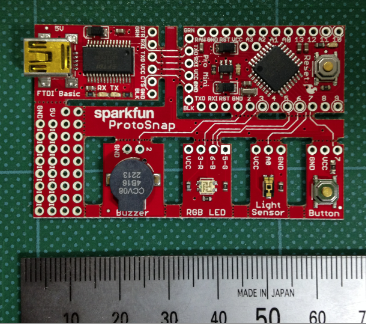
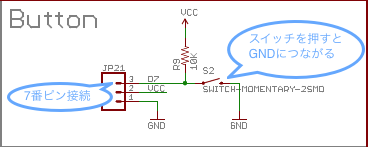
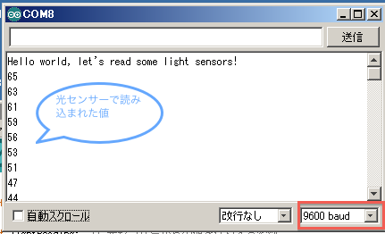
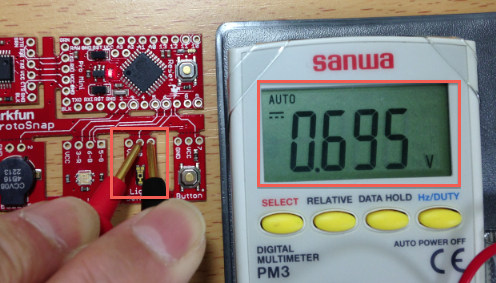
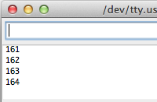

オリジナルの作成： 2014/02/15

# 02-ProtoSnap Pro Miniを使ってみる（その１）
私たちのArduino勉強会は、小学生、ご婦人から目の見えない方まで幅広い人が参加されています。

できるだけ、初心者でも分かるように、またArduino経験者にも楽しいでもらえるように進めています。

## LEDチカチカ
Arduino勉強会/01-Arduinoのセットアップの最後に使ったBlinkを使ってArduinoの動作について 説明します。小学生もいるので、Blinkのコメントを日本語にして、説明します

Arduinoではプログラムをスケッチと呼びます。[1](#Ref_1)

Arduinoでは、//から行末までと/* から */までがコメントとして扱われます。コメントには、スケッチの説明を書いておくとよいでしょう。

Blinkのスケッチ（行番号を追加）を見ながら、簡単に動作を説明します。

```C++
    1     /*
    2       Blink
    3       1秒LEDを点灯し、次の1秒は消灯、これを繰り返します．
    4     
    5       この例題はパブリックドメイン（自由に使ってよいプログラムのこと）
    6      */
    7     
    8     // ほとんどのArduinoボードでは、13ピンにLEDが接続されています．
    9     // 13番ピンにledという名前を付けます．
   10     int led = 13;
   11    
   12     // Arduinoに電源を入れたり、リセットボタンを押すと最初に1回だけsetup関数が実行されます．
   13     void setup() {               
   14       // ledのデジタルピンを出力用に初期化します．
   15       pinMode(led, OUTPUT);    
   16     }
   17    
   18     // loop関数は無限に繰り返します．
   19     void loop() {
   20       digitalWrite(led, HIGH);   // LEDを点灯する（HIGHは電圧レベル）
   21       delay(1000);               // 1秒間待つ
   22       digitalWrite(led, LOW);    //電圧をLOWにして、LEDを消灯する
   23       delay(1000);               // 1秒間待つ
   24     } 
```

- Blinkスケッチの説明（１から6行目まで）
- 変数ledにLEDの13番をセット（10行目）
- setup関数でledの13番のデジタルピンを出力用に初期化（13行から16行）
- loopは無限に呼び出される関数で、その中でLEDの点灯、1秒待つ、LEDの消灯、1秒待つを繰り返す（19行から24行）

たったこれだけのスケッチでLEDチカチカができるのがArduinoの魅力です。

### 困ったときの対処
上手く動かないと困ったときには、日本語のマニュアルが役に立ちます。

Arduinoの日本語のマニュアルが武蔵野電波のホームページ 
[Arduinoマニュアル](http://www.musashinodenpa.com/arduino/ref/)
に公開されていますので、分からない場合は参照して下さい。

## ProtoSnap Pro Miniボードの特徴
どんなArduinoを用意したら、初心者にも使ってもらえるか色々悩んだ結果、ブレッドボードを使わなくても いくつかの実験ができ、後でブレッドボードを使った実験にスムーズに移行できることからsparkfunの 
[ProtoSnap Pro Mini QUickstart Guide](https://www.sparkfun.com/tutorials/303)
を使うことにしました。



ProtoSnap Pro Miniには、Arduinoを試すために必要な以下のものが一つにパッケージされています。

- Arduino UNOをブレッドボードで使えるサイズに小さくしたArduino Pro Mini
- パソコンと通信したりプログラムを書き込む時に使用する通信ボードFTDI Basic
- タクトスイッチ
- 光センサー
- カラー(RGB)LED
- ブザー

部品とArduino Pro Miniのピンの接続は以下のようになっています。

| 部品のピン	| Arduino Pro Miniのピン |
|:-------------|:---------------------------:|
| ボタン  | 7 |
| 光センサー	| A0 |
| 緑のLED	| 5 |
| 青のLED	| 6 |
| 赤のLED	| 3 |
| ブザー	| 2 |


## スイッチとLEDを連動させる 
ProtoSnap Pro Miniボードの部品を使って色々な実験をしましょう。最初にボタンスイッチ(Button)を使ってLEDのオン・オフを制御するスケッチを描いてみます。

Arduino IDEからファイル→新規ファイルを選択し、以下のスケッチをコピーし、新しいスケッチに貼り付けてください。

```C++
int buttonPin = 7;  // ボタンは 7番ピンにつながっています
int ledPin = 13;  // LEDは 13番ピンにつながっています

int buttonStatus; // ボタンの状態を保持するための変数

void setup() {
  pinMode(buttonPin, INPUT);  // ボタンピンを入力として初期設定
  pinMode(ledPin, OUTPUT);  // LEDピンを出力として初期設定
}

void loop() {
  /* 最初にボタンの状態を読み込みます
  HIGH = ボタンが押されていない状態
  LOW = ボタンが押されている状態 */
  buttonStatus = digitalRead(buttonPin);
 
  if (buttonStatus == LOW) {
    digitalWrite(ledPin, HIGH);  // ボタンが押されていたらLEDを点灯する
  }
  else {
    digitalWrite(ledPin, LOW);  // そうでなければLEDを消す
  }
}
```

Blinkと同様に書き込みボタンをクリックしてスケッチをArduinoに書き込みます。 ボタンを押すとLEDが点灯することを確認してください。

Blinkスケッチとの違いを見ながら、スケッチの説明をします。

- LEDのピン番号13をledPin、ボタンスイッチのピン番号7をbuttonPinにセット
- setup関数では、buttonPinのモードをINPUTに初期化しています
- digitalReadがデジタルピンの値（HIGH、LOW）を読み込む関数です． digitalReadで読み込んだ結果をbuttonStatusにセットします．
- if文は、条件によって処理が分かれる部分です。{}で括った文をブロックと呼び、以下の様に処理されます．
```C++
if(条件)
     条件が真の時に処理するブロック
else
     条件が偽の時に処理するブロック
```

if文の使い方が分かったところで、どうしてbuttonStatusがLOWの時にLEDを点灯するのか、 その理由を簡単に説明します。

以下の図がボタンの回路です。ボタンを押していないときには、7番ピンには抵抗を通じて少量の電流が流れ7番ピンの電圧がHIGHのレベルになっています。これに対してスイッチを押すとGNDにつながるので、7番ピンの電圧はGND=LOWになります。 そのため、buttonStatusがLOWの時にLEDを点灯しているのです。



## 光センサーの電圧を測ってみる
これまでは、デジタルピンを使ってきましたが、電圧を読み込む場合にはアナログピンを使用します。 アナログピンの電圧を読み込むときには、analogRead関数を使います。

analogReadは読み込んだ電圧を0-1023の値に変えて教えてくれます。
Arduino Pro Miniの電圧が5Vなので、1023で5V、512で2.5Vを相当します。 

光センサーは、A0のアナログピンにつながっていますので、光センサーの電圧を読み込むスケッチではlightPinとしてA0を使います。 

どのように光センサーの電圧を読み込んでいるのか説明するよりも動かしてみた方が何をしているか感覚が掴めるのではないかと思います。 

まず、以下のスケッチをArduinoに書き込んで下さい（CTRL-U）。ファイルメニューから新規ファイルを選択し、以下のスケッチをコピー&ペーストしてください。

```C++
int lightPin = A0;  // 光センサーはA0につながっている

int lightReading;  // 光センサーからの値を保持する変数

void setup() {
  /* シリアル通信の速度を9600ボーにセットし、最初にHello…のメッセージを表示する */
  Serial.begin(9600);
  Serial.println("Hello world, let's read some light sensors!");
}

void loop() {
  lightReading = analogRead(lightPin);  // 光センサーから値を読み込む
  Serial.println(lightReading, DEC);  // 読み込んだ値をシリアル通信を使ってシリアルモニターに送る
  delay(250);  // 次の読み込みまで待つ
}
```

### 光センサーの測定結果をパソコンに送る
光センサーの測定結果をみるために、光センサーの値をシリアル通信を使ってパソコンに送ります。

Arduino IDEのツールメニューからシリアルモニターを選択（CTRL-Shift-M）すると以下の様なシリアルモニターが表示されます。 ここで、右下の転送速度が9600 baud（ボーと呼びます）になっていることを確認してください。

次々にArduinoの光センサーから読み取られた値がパソコンに送られてくるのが分かります。



### スケッチの説明
スケッチの動きが分かったところで、スケッチの中身を見ていきましょう。

- 光センサーは、アナログピンA0につながっているので、lightPinにA0をセットします
- 読み込んだ値を保持するために、lightReading変数を用意（宣言）します
- setup関数で、シリアル通信の速度を9600ボーにセットし、”Hello world, let's read some light sensors!”の文字列をパソコンに送ります
- loop関数では、analogRead関数を使って光センサーから電圧を読み取り、Serial.printlnで電圧の値を10進（DECimal）でパソコンに送ります
- 最後のdelay(250)を入れないとシリアルポートに一度にたくさんの結果が送られるので、1回の測定の測定の後に250ミリ秒（0.25秒）待ちます

今回はこれまで、次回をお楽しみに！

## 補足
光センサーのパソコンに返す値とセンサーの電圧との関係を分かってもらえるように、テスターでセンサーの電圧を測ってみました。
[2](#Ref_2)

以下がテスターの値です。



シリアルモニターに返された値は、160近辺の値です。



Arduinoは、4.78Vで動いていましたので、予想される値149と大体同じ程度の値になっています。 
[3](#Ref_3)

- 予想されるパソコンの値： 0.695/4.78 * 1023 = 149

## 脚注
- <a name="Ref_1">[1]</a> Arduinoの兄弟プロジェクトProcessingでも同様にスケッチと呼びます。こちらの方がスケッチらしいです。
- <a name="Ref_2">[2]</a> 第3回Arduino勉強会にて
- <a name="Ref_3">[3]</a> 光センサーの値は結構振れ幅があるのと、測定タイミングずれているので大まかな比較とみてください。
