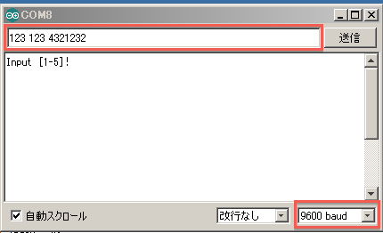
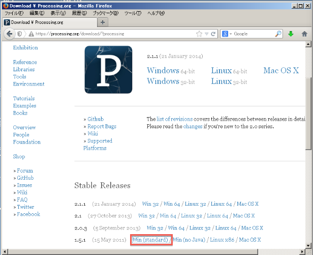
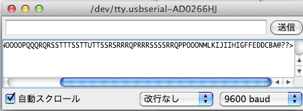
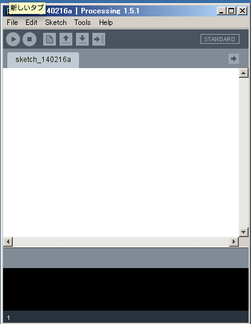
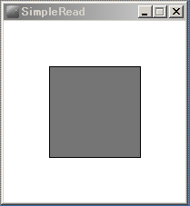
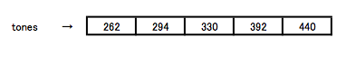
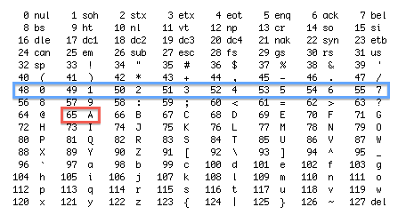

オリジナルの作成: 2014/02/16

# 03-ProtoSnap Pro Miniを使ってみる（その２）
こちらは、次回2月22日の勉強会の資料と補足情報です。

## パソコンからArduinoにデータを送る
前回の光センサーの例題では、Arduinoからパソコンに読み込んだ値を送っていましたが、 今回は、パソコンから数字を送ってProtoSnap Pro Miniの圧電スピーカから音階を出す例題を試してみましょう。

[Arduino/ProtoSnap Pro Miniを試す](http://www.pwv.co.jp/~take/TakeWiki/index.php?Arduino%2FProtoSnap%20Pro%20Mini%E3%82%92%E8%A9%A6%E3%81%99#f8a975a0)
で紹介した「ブザーを使って音を出す」を再度使います。

この例題は、ド、レ、ミ、ド、ラの５つの音に対して、パソコンから数字で1、２，３，４，５を入力して、 指定された音をArduinoから鳴らすという簡単なものです。

音階と周波数については、以下のページが見やすいです。

- [音階と周波数](http://hpcgi3.nifty.com/prismwave/wiki/wiki.cgi?p=%B2%BB%B3%AC%A4%C8%BC%FE%C7%C8%BF%F4)

音の出力には、tone関数を使います。

以下のスケッチをコピー&ペーストして、Arduinoに書き込んで下さい（CTRL-U）。

```C++
// Tone
int toneDuration = 40;     // 音のでる間隔（40ミリ秒）
int speakerPin = 2;        //ブザーのピン番号
int index = 0;                // 何番目の配列かを示す値（配列の添え字を求める）
char ch;                        // パソコンから読み込んだ文字（コード） 
int tones[]={262,294,330,392,440};  // ド、レ、ミ、ソ、ラ
 
void setup() {
  /* シリアル通信の速度を9600ボーにセットし、最初にHello…のメッセージを表示する */
  Serial.begin(9600);
  Serial.println("Input [1-5]!");
}

void loop() {
     ch = Serial.read();     // パソコンから1文字読み込む
     if (ch >= '1' && ch <= '5') {     // 読み込んだ値が1から5の文字なら、音を鳴らす
          index = ch - '1';                    // 1の文字から0のインデックスを求めるために、'1'を引く
          tone(speakerPin, tones[index], toneDuration);
     }
     delay(500);  // 次の読み込みまで待つ
}
```

次に、パソコンのArduino IDEのシリアルモニターを開きます。 Arduino IDEのツールメニューからシリアルモニターを選択（CTRL-Shift-M）すると以下の様なシリアルモニターが表示されます。 ここで、右下の転送速度が9600 baud（ボーと呼びます）になっていることを確認してください。

シリアルモニターの入力欄に123 123 4321232と入力してみてください。なんか懐かしいメロディーが聞こえてきませんか。



## ProcessingとArduinoの連携
2回目の勉強会でパソコンとArduinoを連携させることはできないかとご質問を頂いたので、 Arduinoの兄弟プロジェクトProcessingを使ってArduinoの光センサーで読み込んだ値でパソコンのProcessingの画面の円の色を変えてみます。


### Processingのダウンロード
最初にProcessingを以下のサイトからバージョン1.5.1をダウンロードしてください。
[1](#Ref_1)

- https://processing.org/download/?processing



Windowsの場合、ダウンロードしたzipファイルを解凍すると、processing-1.5.1のフォルダが作られるので、デスクトップなど適当な場所に置いておきます。

## 光センサーの値をパソコンに送る
前回の光センサーの例題では、センサーから読み取った値を文字列に変えて、パソコンに送りましたが、 Processingの例題では、読み込んだ値をそのまま送ります。 
[2](#Ref_2)

```C++
int lightPin = A0;  // 光センサーはA0につながっている

int lightReading;  // 光センサーからの値を保持する変数

void setup() {
  /* シリアル通信の速度を9600ボーにセットし、最初にHello…のメッセージを表示する */
  Serial.begin(9600);
}

void loop() {
  lightReading = analogRead(lightPin);  // 光センサーから値を読み込む
  Serial.write(lightReading);               // 読み込んだ値ををパソコンに送る
  delay(100);  // 次の読み込みまで待つ
}
```

スケッチのArduinoへの書込が完了したら、シリアルモニターを使って動いているか確認してみましょう。 メニューからツール→シリアルモニターを選択して、なにやら変な記号や文字がでてきます。 これは、光センサーの値をそのままパソコンに送っているため、このように表示されています。



**確認が終わったら、必ずシリアルモニターを閉じて下さい。**


## Arduinoから送られた値をパソコンで表示
processingを起動してみましょう。何となくArduino IDEと似ていると思いませんか。




### Processingのスケッチ
ProcessingでArduinoからの情報を受け取る例題として、File→example→Libraries→Serial→SimpleReadがあります。 今回は、これを少し変更してみます。

以下のスケッチをProcessingにコピー＆ペーストしてください。 
[3](#Ref_3)

```C++
/**
 * Simple Read
 * シリアルポートから値を読み込み、四角の色を変える例題です。
 */

import processing.serial.*;

Serial myPort;  // シリアルポートを保持する変数myPortを宣言します．
int val;      // 読み込んだ値を保持する変数valを宣言します．

void setup()
{
  size(200, 200);
  // MacだとSerial.list()[0]がシリアルポートになっています．
  // Windowsでは、Serial.list()[0]がCOM1なので、Arduinoで
  // 使っているシリアルポートをSerial.list()[n]のnを調節して
  // ください．
  String portName = Serial.list()[0];
  println(portName);     // COMnを確認するために、portNameを出力
  myPort = new Serial(this, portName, 9600);     // シリアル通信の速度を9600ボーで作成します．
}

void draw()
{
  if ( myPort.available() > 0) {  // データが送られてきたら
    val = myPort.read();         // シリアルポートmyPortから値を読み込む
  }
  background(255);             // 背景色を白にセット
  fill(val);                           // 読み込んだ値で四角を塗りつぶす
  rect(50, 50, 100, 100);     // 四角を表示
}
```

Arduinoの例題ではCOMnをセットしましたが、Processingでは、何番がArduinoのCOMnか分かりません。 スケッチの以下の部分の数字を調節してみてください。

```C++
String portName = Serial.list()[0];
```

ArduinoとProcessingを動かしてみて下さい。画面に以下のようなウィンドウが出てきて、Arduinoの光センサー に反応して色が変わるのが分かります。



今回は、これでお終いです。 次回は、いよいよProtoSnap Pro Miniをバラバラにして、ブレッドボードを使ってみることにしましょう。

## 補足 
2月22日のArduino勉強会で気づいた点、説明が不足していた部分をここで補足します。

### 配列って何
変数は、値を保持する入れ物（箱）だと説明しましたが、配列は連続した箱を持つ入れ物で、n番目の値（インデックス）を取り出す時には、



パソコンから読み込んだ文字chから'1'を引くことでtonesのインデックスを計算しているのは、 ASCIIコードで０から９の数字が連続して定義されていることを利用しています。

```C++
          index = ch - '1';                    // 1の文字から0のインデックスを求めるために、'1'を引く
```

### 文字コードって何
「ブザーを使って音を出す」の例題では、パソコンから送られた文字（コード）をchを配列tonesの添え字 [4](#Ref_4)

indexに変える部分で文字コードという名前を出しましたので、代表的な ASCIIコードで文字コードについて説明します。
[5](#Ref_5)



パソコンでは、人が使っている文字をパソコンで理解できる数値で表現しています。例えばアルファベットのAは、 ASCIIコードでは65という数値で表されます。光センサーの値をシリアルモニターで見たときにアルファベットの大文字がたくさん表示されたのは、65近辺の値をパソコンに送っていたからです。

ASCIIコードの最初の方は、制御コードと言って目に見えない文字（改行やバックスペース等）が含まれています。 このような文字コードを使ってパソコンが文字を表示していることを覚えておいて下さい。

## 脚注
- <a name="Ref_1">[1]</a> 2.1.1は日本語が文字化けする。
- <a name="Ref_2">[2]</a> delayの値を100より小さくするとスケッチの書き込みができなくなる。
- <a name="Ref_3">[3]</a> コピー&ペーストで最後の}を入れ忘れるとFound one too many { characters without a } to match it.のエラーがでます。エラーが出た場合、{}の対をチェックしてみてください。
- <a name="Ref_4">[4]</a> これをインデックスと言います。
- <a name="Ref_5">[5]</a> MacOS等のターミナルソフトでman asciiとして出力された表を使いました。
