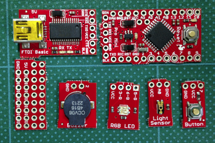
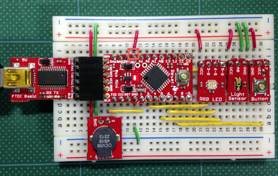
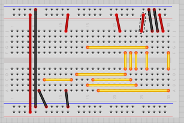
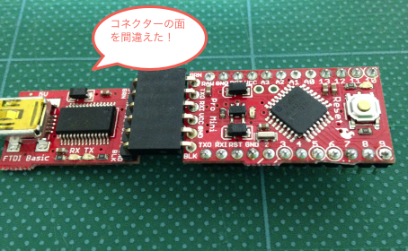
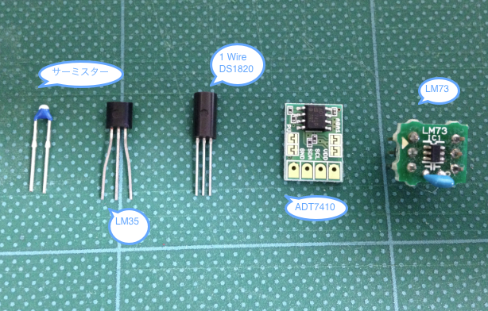
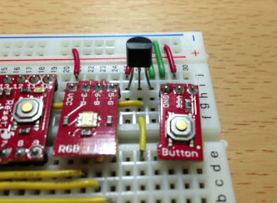
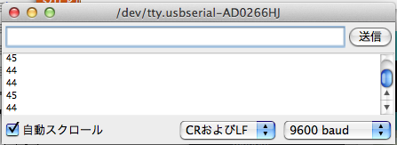
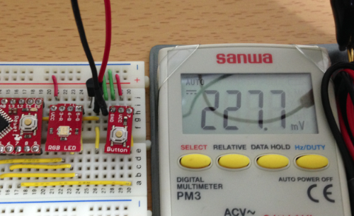
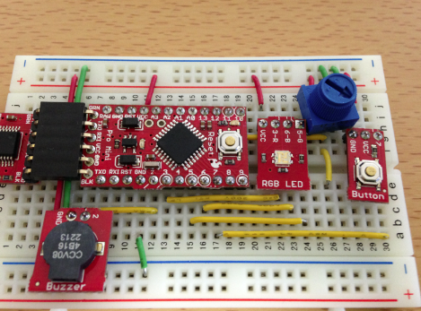
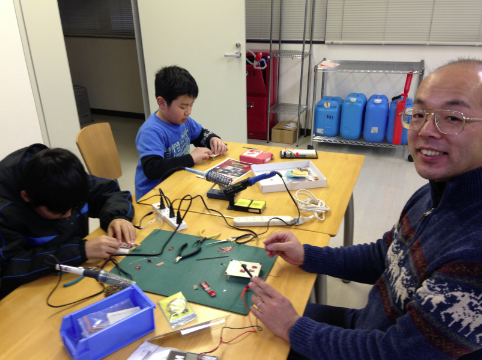

オリジナルの作成: 2014/02/23

# 04-Protosnapをバラして組み立てる
第4回目の勉強会の資料です。

## ProtoSnap Pro Miniボードをバラバラにする
さあ、これまで難なく動いていたProtoSnap Pro Miniボードをバラバラにしてみましょう。

ボードから部品を切り離すときには、ニッパを使うと便利です。 
[1](#Ref_1)



## ブレッドボードに組み立てる
私は、シリアルボードのL字ピンの付ける面を間違えてしまいました。 上ではなく下に付けた方が使いやすいです！



ブレッドボードの配線は、以下の図をみてください。



## 動作確認
組み立てたボードがきちんと動くか確かめましょう。



Blinkをボードに書き込んでArduino Pro Miniのボードが動作するか見てみましょう。 ファイル→スケッチの例→01.Basics→Blinkを選択して、Arduinoに書き込んで緑のLEDが点滅することを確認してください。

### Arduino Pro miniをブレッドボードに差す
電源を入れる前に、もう一度ブレッドボードのVCCとGNDの位置が合っているか確認しましょう！ 写真の赤い四角で囲まれたところがVCCのピンと合っているか確かめて下さい

順番に動作を確認します。

- 電源を入れます。先ほどのBlinkが同じように動くことを確認してください。
- カラーLEDの接続確認：pin2の値を、１個づつ5（緑）、6（青）、3（赤）に変えて書き込みLEDの点滅を確認してください。
```C++
int pin2 = 2;
```
- スイッチの確認：1回目に使ったスイッチのスケッチを使って動作を確かめてます。

```C++
int buttonPin = 7;  // ボタンは 7番ピンにつながっています
int ledPin = 13;  // LEDは 13番ピンにつながっています

int buttonStatus; // ボタンの状態を保持するための変数

void setup() {
  pinMode(buttonPin, INPUT);  // ボタンピンを入力として初期設定
  pinMode(ledPin, OUTPUT);  // LEDピンを出力として初期設定
}

void loop() {
  /* 最初にボタンの状態を読み込みます
  HIGH = ボタンが押されていない状態
  LOW = ボタンが押されている状態 */
  buttonStatus = digitalRead(buttonPin);
 
  if (buttonStatus == LOW) {
    digitalWrite(ledPin, HIGH);  // ボタンが押されていたらLEDを点灯する
  }
  else {
    digitalWrite(ledPin, LOW);  // そうでなければLEDを消す
  }
}
```

- スピーカー：スピーカーの例題を動かします。

```C++
// Tone
int toneDuration = 40;     // 音のでる間隔（40ミリ秒）
int speakerPin = 2;        //ブザーのピン番号
int index = 0;                // 何番目の配列かを示す値（配列の添え字を求める）
char ch;                        // パソコンから読み込んだ文字（コード）
int tones[]={262,294,330,392,440};  // ド、レ、ミ、ソ、ラ
 
void setup() {
  /* シリアル通信の速度を9600ボーにセットし、最初にHello…のメッセージを表示する */
  Serial.begin(9600);
  Serial.println("Input [1-5]!");
}

void loop() {
     ch = Serial.read();     // パソコンから1文字読み込む
     if (ch >= '1' && ch <= '5') {     // 読み込んだ値が1から5の文字なら、音を鳴らす
          index = ch - '1';                    // 1の文字から0のインデックスを求めるために、'1'を引く
          tone(speakerPin, tones[index], toneDuration);
     }
     delay(500);  // 次の読み込みまで待つ
}
```

- 光センサー：同様に光センサーの例題を動かします。シリアルモニターがセンサーの値がでてくることを確認してください。

```C++
int lightPin = A0;  // 光センサーはA0につながっている

int lightReading;  // 光センサーからの値を保持する変数

void setup() {
  /* シリアル通信の速度を9600ボーにセットし、最初にHello…のメッセージを表示する */
  Serial.begin(9600);
  Serial.println("Hello world, let's read some light sensors!");
}

void loop() {
  lightReading = analogRead(lightPin);  // 光センサーから値を読み込む
  Serial.println(lightReading, DEC);  // 読み込んだ値をシリアル通信を使ってシリアルモニターに送る
  delay(250);  // 次の読み込みまで待つ
}
```

## 温度センサーを使ってみる
温度センサーには、いろんなタイプがあります。



### LM35を使ってみる
電圧を測るだけで、温度が分かるLM35はとても使いやすいセンサーです。



シリアルモニターの出力は、44から46の値が出ています。



テスターで電圧を測ってみると、以下の様に227.7mVとなりました。 温度は、22.7℃になります。

$$
frac{46}{1023}  \times 4.78 V = 0.2149 V
$$

Arduinoの出力した値も21.5℃と良い値を示しています。




## 半固定抵抗を使ってみる
今度は、LM35の代わりにスイッチサイエンスからブレッドボードにそのままささる、 
[つまみの大きい半固定抵抗10KΩ ](http://www.switch-science.com/catalog/1039/)
を使ってみます。



先ほどと同じスケッチで動かしてみて下さい。 つまみを回すと値が0から1023に変わるのを確かめて下さい。

## ハンダ付けの様子 
参加者の皆さんが、ハンダ付けに挑戦している様子をアップします



## 脚注

- <a name="Ref_1">[1]</a> 切り離すときは、部品を壊さないように気を付けましょう。
