オリジナルの作成: 2014/03/29

# 05-声を出してみる

## 音声合成モジュール
秋月から販売されている 
[音声合成モジュールATP3011F4-PU](http://akizukidenshi.com/catalog/g/gI-05665/)
をATMegaボードに差して、動作を確認してみました。

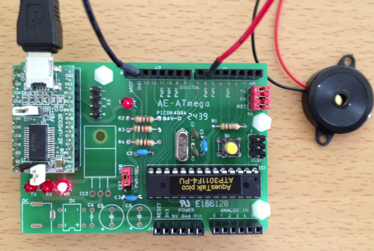

ちょっと乱暴ですが、圧電スピーカを以下の様に接続しました。

- GND: 黒線
- D6: 赤線

Arduino IDEを起動し、シリアルモニターを起動します。 改行の設定を「CRおよびLF」にし、ボーレートは9600 baudとします。

最初に、?を入力して音声合成モジュールにボーレートを調整させます。

この時">>"と返ってきます。

次に発生させたい言葉をローマ字で入力します。

```Console
ohayou
```

と入力すると、それっぽくスピーカら音声が出力され、シリアルモニターには、 "*>"と返ってきます。

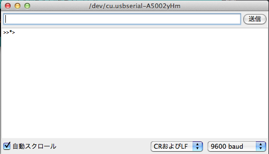


## 音声合成モジュールの使い方
音声合成モジュールの使い方は、 
[音声合成ＬＳＩ(ATP3011F4-PU)を使ってみます](http://www.geocities.jp/zattouka/GarageHouse/micon/TalkIC/ATP3011.htm)
に詳しく紹介されています。

音声合成モジュールのピン配置を上記サイトの図を引用して説明します。

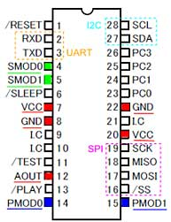

### 動作モード
音声合成モジュールには、４つの動作モードがあります。モードの設定は、PMOD0, PMOD1で行います。 未接続の場合には、セーフモードになっているみたいです。

| 動作モード	| 意味  | PMOD0 | PMOD1|
|:------------|:------|:---------:|:--------:|
| コマンド入力モード | 外部シリアルインタフェースを使ってメッセージを出力する | 1 | 1|
| セーフモード | 内部設定に関わらず、UART(9600bau)またはI2Cでのシリアル通信を使用する | 0 | 1 |
| スタンドアロンモード | PC0~PC3で指定されたプリセットメッセージを出力する | 1 | 0 |
| デモモード | プリセットメッセージを繰り返し出力する | 0 | 0 |

上記サイトのブレッドボードの配線を参考にデモモードを試してみました。

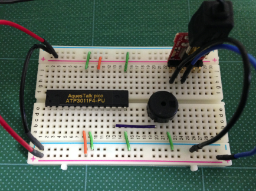


## シリアル通信の指定
シリアル通信には、UART(9600bau)、I2C, SPIを使用できます。使用するシリアル通信は、SMOD0, SMOD1で設定します。 未接続の場合には、UARTが選択されるみたいです。

| 通信モード | SMOD0 | SMOD1 |
|:------------|:----------:|:---------:|
| UART | 1 | 1 |
| I2C | 0 | 1 |
| SPI(mode3) | 1 | 0 |
| SPI(mode0) | 0 | 0 |

## 秋月のATMegaボードを使う
初心者にお薦めなのが、秋月のATMegaボードを使う方法です。ブレッドボードで何本も結線すると間違いも多くなります。

今回使用する部品は、以下の7点です。
[1](#Ref_1)

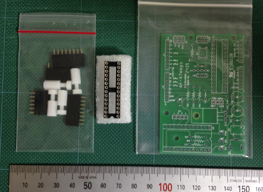

| 部品名 | 型名 | 値段 |
|:--------|:------|------:|
| 音声合成ＬＳＩ | ＡＴＰ３０１１Ｆ１－ＰＵ（ゆっくりな女声） |  850円 |
| ＡＴＭＥＧＡ１６８／３２８用マイコンボード（Ｉ／Ｏボード） | AE-ATmega328 | 150円|
| 丸ピンICソケット(28P) | 2227MC-28-03 | 70円 |
| ピンソケット (6P) | C-03784 | 20円x2 = 40円 |
| ピンソケット (8P) | C-03784 | 30円x2 = 60円 |
| プラスチックスペーサー | P-01864 | 100円/2 = 50円 |
| スピーカー | P-03285 | 100円 |

組み立てると以下の様になります。
[2](#Ref_2)

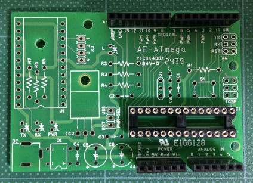

## 音声合成モジュールを載せて動かしてみる
音声合成モジュールを載せて、動かしてみます。

シリアルモジュールと使って音声合成モジュールを接続します。
シリアルモジュールのピンは、右から以下のようになっています。

| ピン番号 | 意味 |
|:--|:------|
| 1 | DTR |
| 2 | 	RX-I |
| 3 | 	TX-O |
| 4 | 	VCC |
| 5	 | CTS(GND) |
| 6	 | GND |

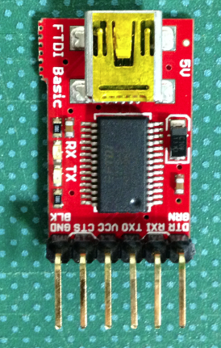

シリアルモジュールとATMegaボードの接続は、以下の様につなぎます。

| シリアルモジュール	 | ATMegaボード |
|:----------------------|:-----------------:|
| GND | J4-GND |
| VCC | J4-5V |
| RX-I | J1-1(TX) |
| TX-O | J1-0(RX) |

スピーカーとの接続は、以下の様にします。

| スピーカーの線色 | 接続先 |
|:---|:--|
| 赤	| J1-6 |
| 黒	| GND |

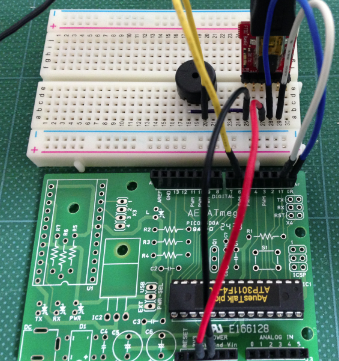

## 動作確認
シリアルモニターを9600bauにセットして開きます。以下のように?を入力し、リターンキーを押すと
が表示されれば接続はOKです。

入力：
```Console
?
```
出力：
```Console
>>
```

つぎに好きな言葉をローマ字で入力してみましょう。ohayouと入力すると「おはよう」としゃべります。

入力：
```Console
ohayou
```
出力：
```Console
*>
```


## Arduinoとの接続
Arduinoと接続して、パソコンからローマ字を入力する場合には、音声合成モジュールを以下の様に設定します。

- 動作モード：セーフモード（PMOD0=0, PMOD1=1）
- 通信モード：UART（SMOD0=1, SMOD1=1）

さらに音声合成モジュールとArduino（Arduinoは単に電源供給とPCとの接続に使う）との接続は、以下の様にします。

| Arduino | 音声合成モジュール |
|:----------|:-----------------------|
| 0 Rx | 2 RxD |
| 1 Tx | 3 TxD |

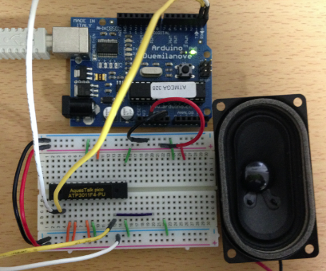

## 音声メニューに挑戦
今度は、Arduinoから音声合成モジュールにじゃべらせてみます。

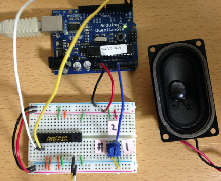

Arduinoから音声モジュールにしゃべらせたいローマ字を出力するには、Serial.println関数を使います。 今回は、複数のボタンを使う代わりにつまみの大きな可変抵抗を使います。

ArduinoのA0を可変抵抗の真ん中のピンにセットし、両端をGNDと5Vに接続します。

音声モジュールとArduinoの接続を先ほどは、逆につなぎ替えます。

| Arduino | 音声合成モジュール |
|:----------|:-----------------------|
| 1 Tx | 2 RxD |
| 0 Rx | 3 TxD |

スケッチは、以下の様にします。

```C++
int  led = 13;
int  tumami = A0;
int  sentaku = -1;

void setup() {
   Serial.begin(9600);
   pinMode(led, OUTPUT);
   mainMenu();
}

void mainMenu() {
  Serial.println("meinmenyudesu");
  delay(2000);
  Serial.println("eruediwo tenntousurubaaiha ichiwo");
  delay(4000);
  Serial.println("eruediwo syoutousurubaaiha niwo");
  delay(4000);
  Serial.println("mouichido menyuwo kikubaaiha sya-puwo");
  delay(4000);
  Serial.println("oshitekudasai"); 
}

void loop() {
  sentaku = map(analogRead(tumami), 0, 1023, 0, 3);
  switch (sentaku) {
    case 0:
      digitalWrite(led, HIGH);
      break;
    case 1:
      digitalWrite(led, LOW);
      break;
    case 2:
    default:
      mainMenu();
  }
  delay(1000);
}
```

つまみを変えるとLEDを点灯したり、消灯したり、音声メニューをしゃべらせたりできます。


## ATMegaボードとArduino Pro Miniボードの接続
ブレッドボードで音声合成モジュールの設定が確認できましたので、 ATMegaボードとArduino Pro Miniボードをつないで、音声メニューを作ってみましょう。

ブレッドボードと音声合成モジュールの接続は、以下の様にします。

- ブレッドボードの結線（両端の赤と青を接続しておく）

| ブレッドボード | 接続先 |
|:---------------|:---------|
| ブレッドボード 赤(5V) | Arduino Pro VCC |
| ブレッドボード 青(GND) | Arduino Pro GND |
| ブレッドボード 赤(5V) | 可変抵抗-左 |
| ブレッドボード 青(GND) | 可変抵抗-右 |
| 可変抵抗-中 | Arduino Pro A0 |

- 音声合成モジュールの結線

| 音声合成モジュール | 接続先 |
|:-----------------------|:--------|
| J1-0R | Arduino Pro Mini TxD |
| J1-1T | Arduino Pro Mini RxD |
| J1-2(SMOD0) | ブレッドボード 赤(5V) |
| J1-3(SMOD1) | ブレッドボード 赤(5V) |
| J1-6 | スピーカ 赤 |
| J2-8(PMOD0) | ブレッドボード 青(GND) |
| J2-9(PMOD1) | ブレッドボード 赤(5V) |
| J4-5V | ブレッドボード 赤(5V) |
| J4-GND | ブレッドボード 青(GND) |

接続したら、こんな感じです。これで音声メニューのスケッチを動かしてみて下さい。

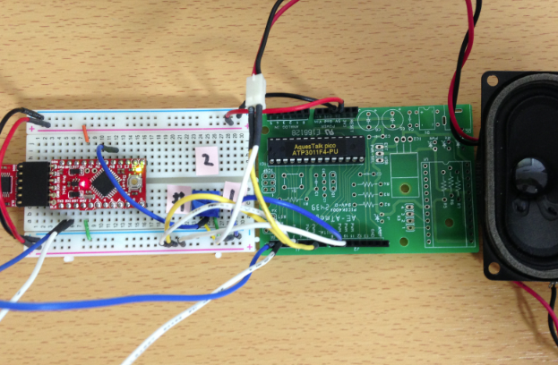

## 音声温度計
次に、可変抵抗の代わりに温度センサーLM35DZを接続して、温度をしゃべる「音声温度計」を作ってみましょう。

LM35DZのピンを底からみたピンの配置をデータシートから引用します。

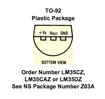

LM35DZのラベルを見て、左のピンが5Vになるようにブレッドボードに差します。

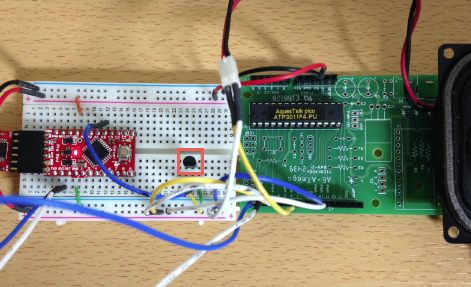

以下のスケッチを使ってLM35DZの電圧から温度を読み上げるようにします。

```C++
int  lm32 = A0;

void setup() {
   Serial.begin(9600);
   Serial.println("onsei ondokeide_su");
   delay(2000);
}

void loop() {
  float t = (float)analogRead(lm32)/1023*500.0;
  Serial.print("imano onndowa <NUMK VAL=");
  Serial.print(t, 1);
  Serial.println(">dode_su");
  delay(3000);
}
```

温度の部分を以下の様にすることで、数字を正しく読み上げます。

```code
<NUMK VAL=温度>
```

## 脚注

- <a name="Ref_1">[1]</a> すべて秋月で購入可能
- <a name="Ref_2">[2]</a> 他の部品を追加すると単体で動くArduinoになります
