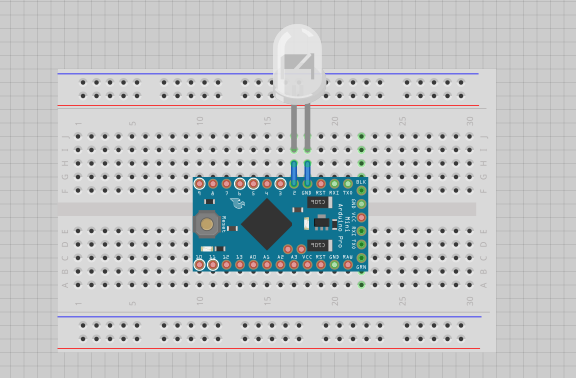
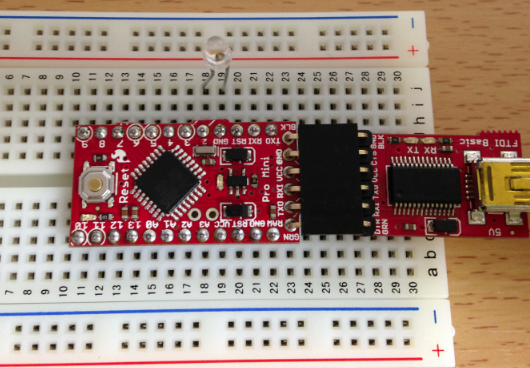
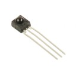
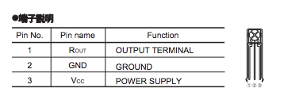
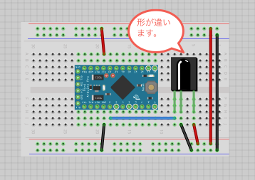
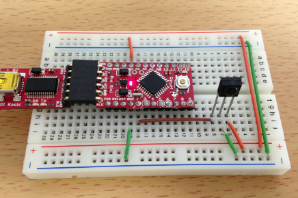
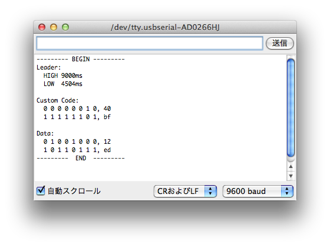
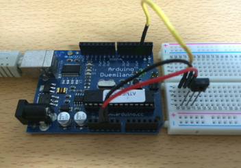

オリジナルの作成: 2014/05/03

# 06-赤外線を使ってみる


## 赤外線リモコンのフォーマット
赤外線リモコンには、以下の3つのフォーマットがありますが、ここではNEC方式を使用します。 
[1](#Ref_1)

- NEC（現ルネサスエレクトロニクス）フォーマット
- AEHA（家製協）フォーマット
- SONYフォーマット

### NECフォーマットについて
最もよく使われているNECフォーマットを使って実験することにします。

NECフォーマットでは、ビット情報は38KHz（1/3duty）で送信され、Frameと呼ばれるデータ単位 に続いてRepeatと呼ばれるFrameの終わりを表すデータがボタンが押されている間繰り返されます。

Frameは、以下の形式を持っています。データが１の時には、0.56msのON, 1.69msのOFFを送り、 データが0の場合には、0.56msのON, 1.69msのOFFを送ります。

- Leader（9msのON, 4.5msのOFF）
- Customer Code（16bitのカスタマコードをLSBから順に送信）
- Data（8bit）
- Dataのビット反転値（8bit）
- EStopビット

## Arduinoを使ってNECフォーマットのデータを送る
38KHzでオン・オフを繰り返すには、digitalWriteでは時間がかかるため、PORTDに直接ビットをセットします。 このため使用可能なデジタルピンは、0から7番までとなっています。

Arduinoを使って赤外線リモコンを送信する例題は、いくつかありましたが、今回参考にさせて頂いたのは、以下の3サイトです。

- Arduinoで遊ぶページの 
[赤外線リモコンの実験](http://garretlab.web.fc2.com/arduino/lab/infrared_controller/index.html)
- 戸田よろず研究所の
[赤外線リモコンの複製2（38 kHzをソフトウェアで制御）](http://tyk-systems.com/ircopy2/ircopy2.html)
- セミコロンラボの
[Arduinoで赤外線リモコン送信](http://www.cjpr.sakura.ne.jp/arduino/irrcsend.html)

ここでは、Arduinoで遊ぶページをメインに参考にさせて頂き、東芝REGZAの電源オン・オフを試みます。

### リモコン側のブレッドボード
ちょっと乱暴ですが、動作を確認するだけなので、赤外線LEDの線の長い方を直接2番と短い方をGNDに接続して試してみます。

今回使った赤外線LEDは、スイッチサイエンスの 
[SIR-34ST3F](http://www.switch-science.com/catalog/1484/)
です。



### リモコン側のスケッチ
使用するスケッチは、以下の様にします。

```C++
class IrControlNecFormat {
  public:
    // constructor
    IrControlNecFormat(byte ledPin, byte custom0, byte custom1);
    void sendCommand(byte data);
  private:
    byte _ledPinMask;   // the pin mask which the LED is connected
    byte _custom0;  // custom code
    byte _custom1;  // custom code'
  
    void sendData(byte date);
    void on(int num);
};

IrControlNecFormat::IrControlNecFormat(byte ledPin, byte custom0, byte custom1) {
  _ledPinMask = 1 << ledPin;
  _custom0 = custom0;
  _custom1 = custom1;
 
  pinMode(ledPin, OUTPUT);  // set the ledPin as an OUTPUT
}

void IrControlNecFormat::sendCommand(byte data){
  on(346);                  // leader code(ON)
  delayMicroseconds(4500);  // leader code(OFF)
 
  sendData(_custom0);       // custom code
  sendData(_custom1);       // custom code
 
  sendData(data);           // data
  sendData(~data);          // ~data
 
  on(22);                   // stop bit
}

void IrControlNecFormat::sendData(byte data) {
  for(int i = 0; i < 8; i++) {
    on(22);
    int delayU_Sec = ( data & 0x01 ) ? 1690 : 565;
    delayMicroseconds( delayU_Sec );
    data = data >> 1;
  }
}

void IrControlNecFormat::on(int num) {
  for(int i = 0; i < num; i++) {
    PORTD |= _ledPinMask;
    delayMicroseconds(9);
    PORTD &= ~_ledPinMask;
    delayMicroseconds(17);
  }
}

// 赤外線LEDを2番ピンとGNDに接続
// 東芝REGZAのカスタマコードは、 0x40, 0xBF
IrControlNecFormat controller(2, 0x40, 0xBF);

void setup() {
}

void loop() {
  // REGZAの電源コードは、0x12
  controller.sendCommand(0x12);
  // 5秒間隔でオン・オフを繰り返す
  delay(5000);
}
```

スケッチの以下の部分で2番ピンにカスタマコードとして、0x40, 0xBFとして、IrControlNecFormatクラスのインスタンスを生成します。

```C++
IrControlNecFormat controller(2, 0x40, 0xBF);
```

これで、東芝REGZAのコントロールができるcontrollerができます。 これに、0x12（電源のコード）をsendCommandで送ると電源のオン・オフを繰り返します。

### 実際に動かしてみる。
ブレッドボードを組み立てて、LEDをテレビに向けてリセットスイッチを押してみて下さい。 5秒間隔でオン・オフを繰り返します。
[2](#Ref_2)



### 他の操作方法
上記のスケッチのカスタマコードとコードを変えるといろんな処理ができるようになります。

以下のPDFに各種テレビのカスタムコードとデータの意味がまとめられています。

- [NECフォーマット 赤外線リモコン コード表](http://www.ne.jp/asahi/o-family/extdisk/ATBextension/ATBIRrecvNEC/ATBIRrecvNEClst.pdf)

## 赤外線受信機
赤外線リモコンのコードが公開されていない場合には、どうしたらよいのでしょう。

今回は、スイッチサイエンスの 
[RPM6938リモコン受光モジュール](http://www.switch-science.com/catalog/list/?keyword=RPM6938)
を使って実験してみます。



ピンの配置は、データシートから引用します。丸い突起のある面の左からRout, GND, Vccとなっています。



### 赤外線受光器のブレッドボード
以下の様にブレッドボードを組み立てます。受光モジュールが同じものがなかったので、形の似たもので表示しています。



### 赤外線コード解析
Arduinoで遊ぶページの
[赤外線リモコンコード解析(NECフォーマット) ](http://garretlab.web.fc2.com/arduino/make/infrared_sensor_nec_format/)
に紹介されている赤外線リモコン解析スケッチが重宝します。

以下に引用して表示します。

```C++
#define COUNT_NUM 68

const int pin = 2;              /* 赤外線センサの出力を接続するデジタルピン */
unsigned long time[COUNT_NUM];  /* 時刻を格納する配列 */

void setup () {
  pinMode(pin, INPUT);
  Serial.begin(9600);
}

void loop () {
  int repeat = 0;
  int mode; /* 読み取るデータを決める */
  char str[64];
 
  /* 68回データを読み取る */
  mode = HIGH; /* 最初はHIGH */
  for (int i = 0; i < COUNT_NUM; i++) {
    while(digitalRead(pin) == mode) { /* 状態が変わるまで待つ */
        ;
    }
    time[i] = micros(); /* 時刻を記録する */
   
    if (mode == HIGH) { /* onとoffが交互に来るので，待つべき状態を変える */
      mode = LOW;
    } else {
      mode = HIGH;
    }
   
    /* リーダコードのoffが2.25msだと次にストップビットが来て終了 */
    /* 3000ms以下かどうかで判定 */
    if ((i == 3) && ((time[2] - time[1])) < 3000)  {
      repeat = 1;
      break;
    }
  }
 
  /* データの出力 */
  Serial.print("--------- BEGIN ---------\n");
 
  sprintf(str, "Leader:\n  HIGH %dms\n", (time[1] - time[0]));
  Serial.print(str);
  sprintf(str, "  LOW  %4dms\n\n", (time[2] - time[1]));
  Serial.print(str);
 
  if(repeat) {
    Serial.println("Repeat");
  } else {
    Serial.println("Custom Code:");
    print_data(2);
    print_data(18);

    Serial.println("");
 
    Serial.println("Data:");
    print_data(34);
    print_data(50);
   
    Serial.print("---------  END  ---------\n\n");
  }
}

void print_data(int start) {
  int code = 0;
  char str[32];
 
  sprintf(str, "  ");
  for (int i = 0; i < 8; i++) {
    if ((time[2 * i + start + 2] - time[2 * i + start]) > 1500) {
      code |= 1 << i;
      sprintf(&str[2 * (i + 1)], "1 ");
    } else {
      sprintf(&str[2 * (i + 1)], "0 ");
    }
  }
 
  sprintf(&str[17], ", %02x", code);
  Serial.println(str);
}
```

### 赤外線コード解析を動かしてみる
それでは、赤外線コード解析スケッチを動かしてみます。



シリアルモニターを起動し、テレビ（REGZA）の電源ボタンを押すと以下の様に返ってきます。



最初に作った通り、カスタマコード0x40, 0xBFとデータ0x12が受信されていることが確認できます。

これを使えば、他のリモコンの解析もできます。

### 再確認
小出さまのご質問で、再度実験をしてみました。

もしかしてCPUのクロックが影響しているのかと思い、今回はDuemilanoveを使いました。



起動直後は、きちんと動いていましたが、蛍光灯の明かりを消すと急に以下の様にシリアスコンソールに 表示されました。

```Console
--------- BEGIN ---------
Leader:
  HIGH 2152ms
  LOW   324ms

Repeat
--------- BEGIN ---------
Leader:
  HIGH 80ms
  LOW  2572ms

Repeat
```

出力を遡ってみると、東芝のリモコンを押したときには、きちんとCustom Codeの出力でていました。

```Console
--------- BEGIN ---------
Leader:
  HIGH 72ms
  LOW  -18344ms

Custom Code:
  1 1 1 1 1 1 1 1, ff
  0 1 0 1 1 1 1 0, 7a

Data:
  1 0 0 0 0 1 0 0, 21
  0 0 0 1 0 1 0 0, 28
---------  END  ---------
```

## 脚注
- <a name="#Ref_1">1</a> 
[赤外線リモコンの通信フォーマット](http://elm-chan.org/docs/ir_format.html)
を参考にしました
- <a name="#Ref_2">2</a> どうもREGZAでは電源オフで上手くできないことがあります
