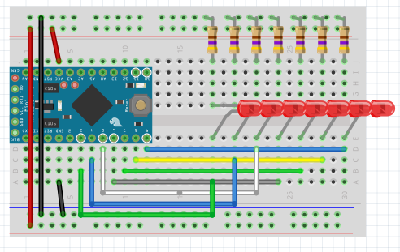
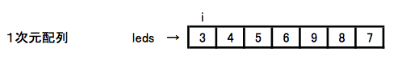
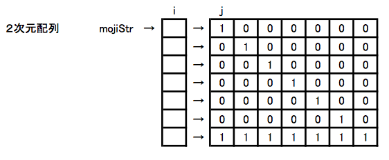
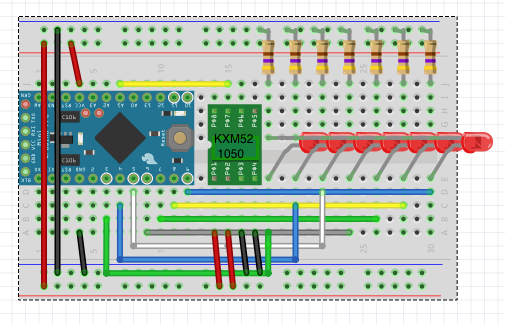
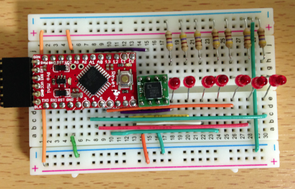
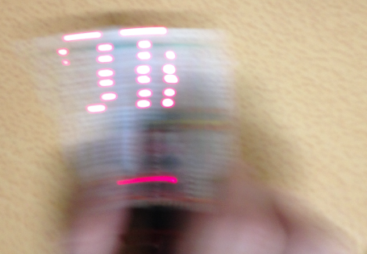

オリジナルの作成: 2014/12/13

# 07-LEDで文字を表示する
今回はクリスマスも近くなので、参加者の皆さんと話し合ってLEDで文字を表示してみようと いうことになりました。

## 文字を表示するブレッドボード
文字を表示するために、７個のLEDを使います。

以下の様に、Arduino Mini Pro, LED, 抵抗<a href="#Ref_1">1</a>
を配線します。

LEDとArduinoとの間は、手元にある線の長さで自由につないで下さい。 図では、分かりやすいように順番でつないでいます。



### LEDがきちんと点灯するか確かめる
一番右（振るときには一番上）のLEDから0〜6番と番号を付けて、各LEDがつながっているデジタルピンの 番号をledsにセットします。

以下のスケッチでLEDが順番に点灯し、最後にすべて点灯するか確かめて下さい。

```C++
#define  NUM_OF_LED (7)
#define  NUM_OF_CHARS  (8)

static int mojiStr[][NUM_OF_LED] = {
     {1,0,0,0,0,0,0},
     {0,1,0,0,0,0,0},
     {0,0,1,0,0,0,0},
     {0,0,0,1,0,0,0},
     {0,0,0,0,1,0,0},
     {0,0,0,0,0,1,0},
     {0,0,0,0,0,0,1},
     {1,1,1,1,1,1,1}
   };
                           
static int leds[] = {3,4,5,6,9,8,7};    

void setup() {
  for (int i = 0; i < NUM_OF_LED; i++) {
    pinMode(leds[i], OUTPUT);
  }
}

void loop() {
  for (int i = 0; i < NUM_OF_CHARS; i++) {
    for (int j = 0; j < NUM_OF_LED; j++) {
      digitalWrite(leds[j], mojiStr[i][j]);
    }
    delay(500);
  }
}
```

### 配列の話し
ledsやmojiStrは配列と呼ばれるものです。

これまで、配列についてきちんと説明していなかったので、 ここで改めて配列って何なのか説明します。

配列は、複数の値を連続した領域に保存したもので、［］の中に添え字と呼ばれる数値または変数を 使って配列の中の値を読み込んだり、セットしたりすることができます。

ledsは、１個の［］で定義された１次元配列です。 ledsという変数は、数値3, 4, 5, 6, 9, 8, 7が連続して保存された領域を指し、添え字を使って値を取って きます。

配列の添え字は、０からはじまっており、配列ledsから２番目の4の値を取ってくるときには、

```C++
leds[1]
```

のように書きます。

先ほどのスケッチのsetup関数では、変数iを使ってledsに入っているデジタルピン番号を使って pinModeをOUTPUTにしています。

```C++
  for (int i = 0; i < NUM_OF_LED; i++) {
    pinMode(leds[i], OUTPUT);
  }
```



次に２個の［］で定義された２次元配列mojiStrをみてみましょう。 mojiStrの値は、以下の様にセットされています。



2次元配列は、1次元配列を縦にしたものと各行の値を持っている2つの領域に保存されています。

mojiStr[0]と指定すると一番上の1,0,0,0,0,0,0が入った領域を指し、mojiStr[0][0]と1番上の行の最初の値1を取ってきます。

このようにして、7個のLEDの値を添え字jのループでセットしているのが、loop関数の以下の部分です。

```C++
    for (int j = 0; j < NUM_OF_LED; j++) {
      digitalWrite(leds[j], mojiStr[i][j]);
    }
```

少しずつ点灯しているLEDを変えることで、文字のが形を作り出すのが今回の目的です。

## 左右対称の文字の表示 
縦に並んだLEDを左右に振ることで、文字のような形を写しだしてみましょう。

表示する文字（図形）は、左右対称であれば何でもかまいません。

以下のスケッチでは、「TAO」を表示してみます。

```C++
#define  NUM_OF_LED    (7)
#define  NUM_OF_HEIGHT NUM_OF_LED
#define  NUM_OF_WIDTH  (5)
#define  NUM_OF_CHARS  (3)
static int mojiStr[][NUM_OF_HEIGHT][NUM_OF_WIDTH] = {
  // TAO
 { {1,1,1,1,1},
   {0,0,1,0,0},
   {0,0,1,0,0},
   {0,0,1,0,0},
   {0,0,1,0,0},
   {0,0,1,0,0},
   {0,0,1,0,0} },

 { {0,0,1,0,0},
   {0,1,0,1,0},
   {1,0,0,0,1},
   {1,0,0,0,1},
   {1,1,1,1,1},
   {1,0,0,0,1},
   {1,0,0,0,1} },

 { {0,1,1,1,0},
   {1,0,0,0,1},
   {1,0,0,0,1},
   {1,0,0,0,1},
   {1,0,0,0,1},
   {1,0,0,0,1},
   {0,1,1,1,0} }
};  
                           
static int leds[] = {3,4,5,6,9,8,7};    

void setup() {
  for (int i = 0; i < NUM_OF_LED; i++) {
    pinMode(leds[i], OUTPUT);
  }
}

void loop() {
  for (int i = 0; i < NUM_OF_CHARS; i++) {
    for (int j = 0; j < NUM_OF_WIDTH; j++) {
      for (int k = 0; k < NUM_OF_HEIGHT; k++) {
        digitalWrite(leds[k], mojiStr[i][k][j]);
      }
      delay(4);
    }
    delay(8);
  }
}
```

### スケッチの説明 
できるだけ、文字の形を確認しながら動かしたいので、mojiStrには3次元の配列にしました。

3次元の配列は、2次元の配列が何枚も重なっているようなものをイメージすると分かりやすいと思います。

loop関数のforループの一番内側では、i, j, kの添え字が、i, k, jとなっているところがポイントです。

```C++
        digitalWrite(leds[k], mojiStr[i][k][j]);
```

このようにループの順番を変えることで、表示順と定義の順番を入れ替えています。

LEDを左右に振ると何となくT, O, Aに似た文字が出てくると思います。

## 振る方向で表示の順番を変える
3軸の加速度をアナログ電圧で出力するセンサーKXM52-1050
<a href="#Ref_2">2</a>
を使ってY軸（横方向）の加速度から振る方向を判断して、文字を表示する順番を変えてみました。

以下の様にKXM52-1050をつなぎます。



ブレッドボードは、以下の様に作成しました。



### スケッチ
まだ、完成とまでは言えませんが、現段階のスケッチを以下に示します。

```C++
#define  NUM_OF_LED    (7)
#define  NUM_OF_HEIGHT NUM_OF_LED
#define  NUM_OF_WIDTH  (5)
#define  NUM_OF_CHARS  (3)
#define  ZERO          505
#define  SHIKI_CHI     200
static int mojiStr[][NUM_OF_HEIGHT][NUM_OF_WIDTH] = {
  // TAO
 { {1,1,1,1,1},
   {0,0,1,0,0},
   {0,0,1,0,0},
   {0,0,1,0,0},
   {0,0,1,0,0},
   {0,0,1,0,0},
   {0,0,1,0,0} },

 { {0,0,1,0,0},
   {0,1,0,1,0},
   {1,0,0,0,1},
   {1,0,0,0,1},
   {1,1,1,1,1},
   {1,0,0,0,1},
   {1,0,0,0,1} },

 { {0,1,1,1,0},
   {1,0,0,0,1},
   {1,0,0,0,1},
   {1,0,0,0,1},
   {1,0,0,0,1},
   {1,0,0,0,1},
   {0,1,1,1,0} }
};  
                           
static int leds[] = {3,4,5,6,9,8,7};    
int  dir = 1;
int  start_i = 0;
int  start_j = 0;
static int  accPin = A1;

void setup() {
  Serial.begin(9600);
  Serial.println("Output acc value");
  for (int i = 0; i < NUM_OF_LED; i++) {
    pinMode(leds[i], OUTPUT);
  }
}

void loop() {
  int  value = analogRead(accPin);
  // Serial.println(value);
  // delay(100);
  if (abs(value - ZERO) >= SHIKI_CHI) {
    // 方向に合わせて順序を変える
    if (value - ZERO > 0) {
      dir = -1;
      start_j = NUM_OF_WIDTH-1;
      start_i = NUM_OF_CHARS-1;
    }
    else {
      dir = 1;
      start_j = 0;
      start_i = 0;
    }
    int ii = 0;
    int jj = 0;
    for (int i = 0; i < NUM_OF_CHARS; i++) {
      ii = dir < 0 ? start_i - i : 0;
      for (int j = 0; j < NUM_OF_WIDTH; j++) {
        jj = dir < 0 ? start_j - j : 0;
        for (int k = 0; k < NUM_OF_HEIGHT; k++) {
          digitalWrite(leds[k], mojiStr[ii][k][jj]);
        }
        delay(4);
      }
      // 消灯
      for (int k = 0; k < NUM_OF_HEIGHT; k++) {
        digitalWrite(leds[k], 0);
      }
      delay(4);
    }
    // 消灯
    for (int k = 0; k < NUM_OF_HEIGHT; k++) {
      digitalWrite(leds[k], 0);
    }
  }
}
```

文字は、はっきりしませんが、以下の様にでました。



## 脚注

- <a name="Ref_1">1</a> 手元にあった470Ωを使っています
- <a name="Ref_2">2</a> 秋月のXSC7-2050等も使用可能、ただし軸のピンの配置が異なります
