オリジナルの作成: 2014/12/20

# 08-オシロスコープを使ってみる
Arduinoのもう一つの用途は、測定機器としての活用です。

これまでできなかったことがArduinoによって簡単にできることをオシロスコープの例で 実感してみてください。

## 九州工業大学の簡易オシロスコープを使ってみる
オシロスコープは、信号を波形として表示する測定器です。 安い物でも10万円以上もすることから、電子工作に使うことが難しかった測定機器の一つです。

九州工業大学の簡易オシロスコープの 
[公開ページ ](http://www.iizuka.kyutech.ac.jp/faculty/physicalcomputing/pc_kitscope/)
にある以下のダウンロードサイトからkit_scope_20130222.zipをダウンロードします。

- [kit_scopeダウンロードサイト](http://webdisk-i.isc.kyutech.ac.jp/public/EZPcwAvIoY7AXW0BTdxTZ7Cgb0yRl3HpF4WIR_4s_BEd)

### Arduinoスケッチの書き込み
zipファイルを展開するとArduinoとProcessingの2つのフォルダにkit_scopeというフォルダが ありますから、Arduinoの中のkit_scopeを~/Documents/Arduinoのフォルダに入れます。

Arduinoを起動して、ファイル→スケッチブック→kit_scopeを選択して、スケッチをArduinoに 書き込みます。

### Arduinoとの接続
公開ページの接続図を以下に引用します。

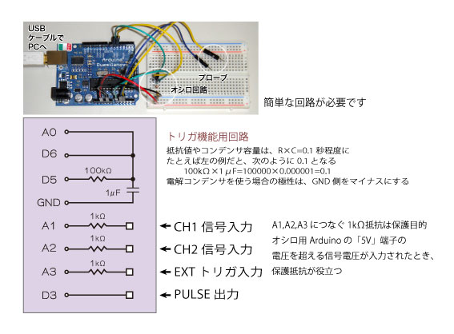

## CR_積分回路を試す
AnalogDiscoveryを試す/01-CR積分回路の回路にkit_scopeの1KHzのクロックを入れて、 どの程度の解像度が得られるのか試してみます。

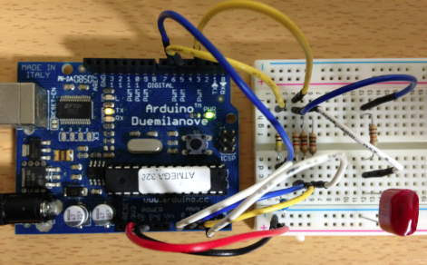

### Processingのkit_scopeの起動
zipファイルを展開したProcessingの中のkit_scopeを~/Documents/Processingのフォルダに入れます。

Processingを起動して、File→ScketchBook→kit_scopeを選択します。

- MODE signalをクリックして、DUALにセット

以下の様な波形が表示されます。これはまさに AnalogDiscoveryを試す/01-CR積分回路 でAnalogDiscoveryを使って測定した波形と同じで、ArduinoとProcessingを使ったオシロスコープ でもこんなにきれいな波形が表示できることに驚きました。

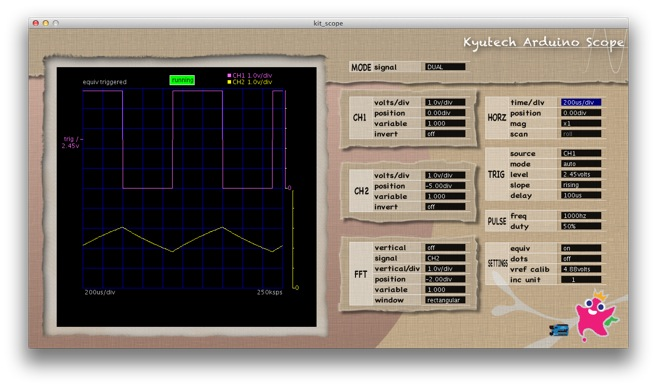

### CR積分回路の測定
50Hz, 500Hz, 5kHzの波形は、特別なツールを用いるのではなく、もう一つのArduinoを使ったとても簡単なスケッチを使用しました。

以下の様な回路を組みました。CR積分回路は、セラミックコンデンサーと抵抗でつくる簡単な物ですが、 理論やLTSpiceのシミュレーションと同じような波形が観測されました。

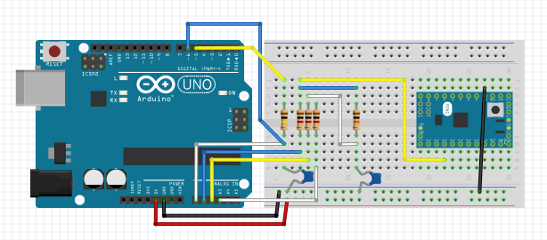

信号を生成するArduino Mini Proのスケッチは、以下の様にしました。 delayMicrosecondsの値を10000, 1000, 100に変えることで、50Hz, 500Hz, 5kHzになります。 
<a href="#Ref_1">1</a>

```C++
int out = 13;

void setup() {
  pinMode(out, OUTPUT);
}

void loop() {
  digitalWrite(out, HIGH);
  delayMicroseconds(10000);
  digitalWrite(out, LOW);
  delayMicroseconds(10000);
}
```

50Hz, 500Hzの波形は、以下の様になります。 非常に安価に、CR積分回路の挙動を視覚的に確認できることに驚きます。

5KHzでは、ほとんど変化がありません。

<table style="border-style: none;">
    <tr style="border-style: none;">
        <td style="border-style: none;">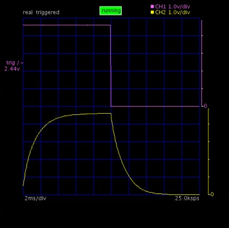</td>
        <td style="border-style: none;">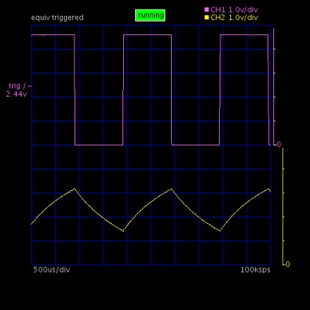</td>
    </tr>
    <tr style="border-style: none;">
        <td style="border-style: none;">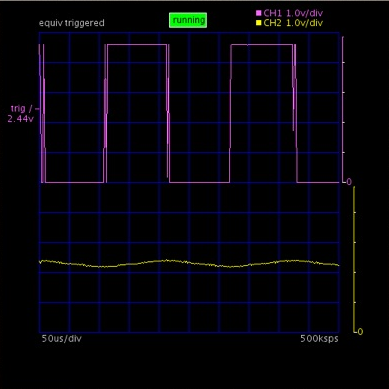</td>
        <td style="border-style: none;"></td>
    </tr>
</table>

ブレッドボードを使った実験の様子を以下に示します。

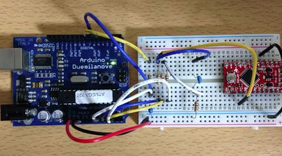

## トランジスタで作るNAND回路
トラ技2004/09は、 
[NANDゲートの手作りから始めるロジック設計の超入門!トランジスタで学ぶディジタル回路](http://toragi.cqpub.co.jp/tabid/231/Default.aspx)
の特集でした。

トランジスタを使ってNAND回路を組み立て、それを複数使った様々な回路を作っていくとても興味深い内容でした。

### 信号生成ツールの波形
最初にNANDの実験に使用する2種類の方形波を生成するGENSIGをオシロスコープで測定してみます。

GENSIGの回路をトラ技2004/09の図２−１３から引用します。この回路は74HC74のDフリップフロップ と74HC04のインバータを使った発振回路で周期が1:2の2つの方形波を生成しています。 RとCを調整することで、様々な周波数の波形を作れるのでとても便利です。

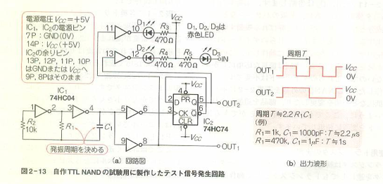

この回路を以下の様なプリント基板に実装しました。
<a href="#Ref_2">2</a>

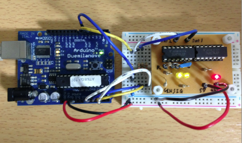

測定された波形は、以下の通りです。

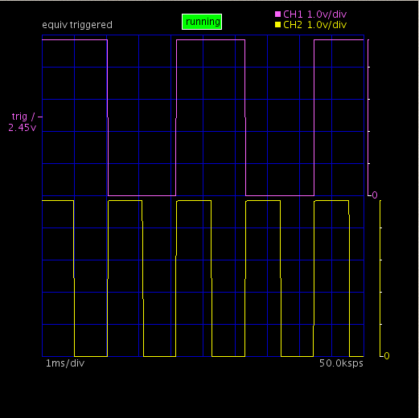

### NAND回路
NANDとは、AND回路の出力を反転（INV）した回路です。 NANDの真理表は、以下の様になります。

| 入力1 | 入力2 | 出力 |
|:-------:|:-------:|:-----:|
| L | 	L | 	H |
| L | 	H | 	H |
| H | 	L | 	H |
| H | 	H | 	L |

LTSpiceを使ってNAND回路に周期2msの方形波（V1）と周期4msの方形波（V2）を入力したときの シミュレーションをしてみます。

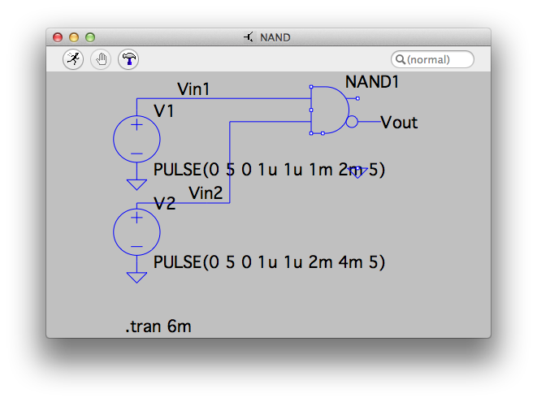

ちょっと見づらいですが、シミュレーションの結果は、真理表の通りなっており、V1とV2がHの場合に Lとなり、2msのところ
<a name="#Ref_3">3</a>
に、瞬間的にLになる「ひげ」が現れます。

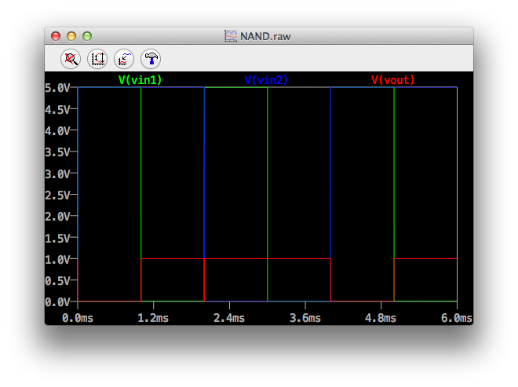


## トランジスタでNAND回路を作る
トラ技2004/09で紹介されている1ゲート分のNANDをTTL(Transistor-Transistor Logic)で作った回路を図2-14から引用します。

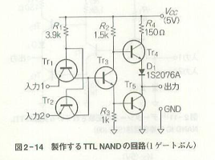

これを以下の様にブレッドボードに実装しました。

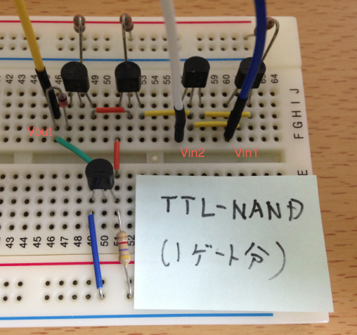

## ArduinoオシロスコープでNAND波形を測定
以下の様に接続して、Arduinoオシロスコープを使って信号生成ツールから2つの方形波の NAND信号を表示してみました。

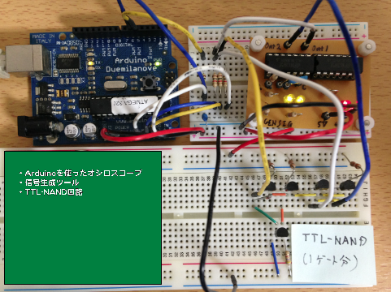

Arduinoオシロスコープの波形です。2チャンネルしか表示できないので、2msのVin1とVoutを表示しています。 ひげもはっきり測定できます。

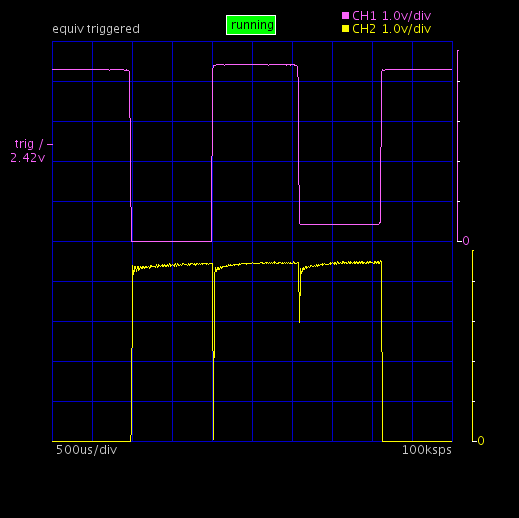


## 脚注

- <a name="Ref_1">[1]</a> スケッチを直接変更して周波数を変える方が、手早く実験できます
- <a name="Ref_2">[2]</a> 初めてEagleで作ったプリント基板です
- <a name="Ref_3">[3]</a> V1がL→H, V2がH→Lに変わる時
