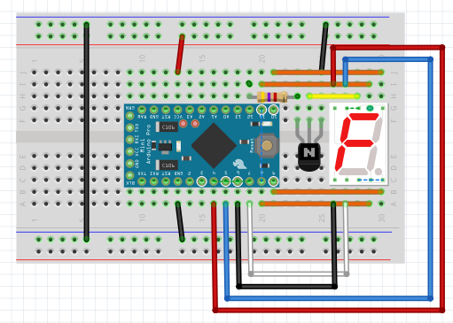
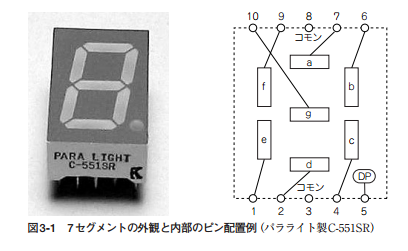
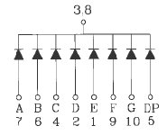
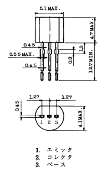
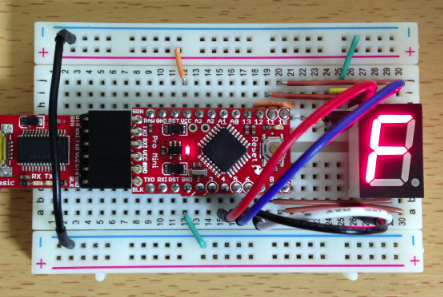

オリジナルの作成: 2014/12/21

# 09-７セグメントLEDを使ってみる
数字（＋アルファベット一部）を表示できる７セグメントLEDを使ってみましょう。

## ブレッドボードを組み立てる
7セグメントLEDをつないでみましょう。

必要な部品は、以下の通りです。
- Arduino （今回はArduino Pro Miniを使います）
- 7セグメントLED（C-551SR）１個（カソード共通タイプです）
- トランジスター（2SC1815）１個
- 抵抗（4.7KΩ）１個

部品が揃ったら、以下の様につないで下さい。



### 7セグメントのピン配置
７セグメントのピンの配置 
<a href="#Ref_1">1</a>
は、以下の様になっています。



C-551SRは、以下の様にカソードを共通とするタイプです。



### 2SC1815のピン配置
トランジスターは、7セグメントLEDをArduinoで駆動するための電流を供給するのと、 出力タイミングを制御するために使用します。 使用するトランジスターはよく使われる2SC1815です。

2SC1815のデータシートで、ピンの設定を確認します。下の図は、下から見たピンの位置です。



セレクターとベース間の抵抗は、7セグメントLEDの各LEDに10mAを供給すると70mAが必要となりので、

$$
ベース電流 = \frac{5V - 0.6V}{4.7KΩ} = 0.9mA
$$

これから増幅率hf = 100として、以下の関係から90mAと十分な電流を供給できます。

$$
コレクター電流 = ベース電流*hf = 0.9 \times 100 = 90mA
$$


## スケッチで動作確認
できたブレッドボードの回路を以下のスケッチで動かしてみます。

```C++
int  a = 11;
int  b = 10;
int  c = 8;
int  d = 7;
int  e = 6;
int  f = 5;
int  g = 4;

int  leds[] = { a, b, c, d, e, f, g};
int  sel = 12;

int  ptrn[][7] = {
  {1,1,1,1,1,1,0},
  {0,1,1,0,0,0,0},
  {1,1,0,1,1,0,1},
  {1,1,1,1,0,0,1},
  {0,1,1,0,0,1,1},
  {1,0,1,1,0,1,1},
  {1,0,1,1,1,1,1},
  {1,1,1,0,0,0,0},
  {1,1,1,1,1,1,1},
  {1,1,1,0,0,1,1},
  {1,1,1,0,1,1,1},
  {0,0,1,1,1,1,1},
  {1,0,0,1,1,1,0}, 
  {0,1,1,1,1,0,1},
  {1,0,0,1,1,1,1},
  {1,0,0,0,1,1,1},
  {0,0,0,0,0,0,0}
};

void setup() {
  pinMode(sel, OUTPUT);
  pinMode(a, OUTPUT);
  pinMode(b, OUTPUT);
  pinMode(c, OUTPUT);
  pinMode(d, OUTPUT);
  pinMode(e, OUTPUT);
  pinMode(f, OUTPUT);
  pinMode(g, OUTPUT);

  digitalWrite(sel, HIGH); 
}

void loop() {
  for (int i = 0; i < 17; i++) {
    for (int j = 0; j < 7; j++) {
      digitalWrite(leds[j], ptrn[i][j]); 
    }
    delay(1000);
  }
}
```

上手くできていたら、以下の様に０〜Fと全て消灯を１秒間隔で切り替えて表示します。


