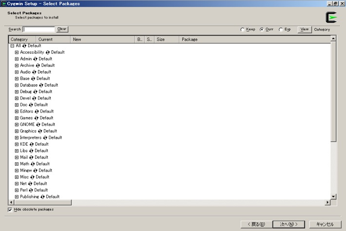
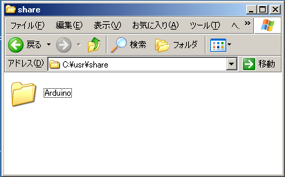
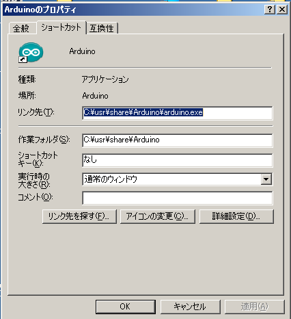

オリジナルの作成：2014/07/06

# 0B-Windowsへのinoのインストールと使い方
## Windowsでinoを使う
[0A-MacOSXへのinoのインストールと使い方](http://nbviewer.jupyter.org/github/take-pwave/letsArduino/blob/master/0A-ino-install-MacOSX.ipynb)
に続いて、 Windowsでinoを使う方法を調べて見ました。

## inoのインストール
Windowsでinoを使うには、以下のソフトが必要です。

- Arduino IDE Windows版
- cygwin
    - python27
    - python-setuptools
    - make
    - gcc-core
    - nano（テキストエディタ）
- picocom

以下では、Arduino IDEがインストールされ、動いているものとして説明を進めます。

### cygwinのインストール
Cygwinの以下のサイトから、お使いのWindowsに合ったsetup-xxxx.exeをダウンロードしてください。 私は、古いXPにインストールしたので、setup-x86.exeをダウンロードしました。

cygwinのインストールで分かりにくいのが、このsetup-x86.exeのセットアップです。 以下の手順にそってインストールして下さい。

- ネットワークにアクセスできるようにして、ダウンロードしたsetup-x86.exeをダブルクリック
- Cygwin Net Release Setup Programの画面で、「次へ」ボタンを押す
- Choose A Download SourceでInstall from Internetを選択し、「次へ」ボタンを押す
- Select Root Install DirectoryとSelect Local Package Directoryは、そのまま「次へ」ボタンを押す
- Select Your Internet Connectionは、Direct Connectionを選択し、「次へ」ボタンを押す
- Choose A Download Siteでは、http://ftp.iij.ad.jp を選択し、「次へ」ボタンを押す

次が一番の難関のパッケージ選択画面です。



- Select Packages画面から
    - Develをクリックし、makeとgcc-coreをクリックし、バージョン番号を表示
    - Pythonをクリックし、pythonをクリックし、バージョン番号を表示
    - Editorsをクリックし、nanoのSkipをクリックし、バージョン番号を表示
- 最後に次にボタンを押すと、ダウンロードとインストールが実行されます（最初は時間がかかります）
- 完了ボタンをおして終わりです

### Arduino IDEの移動
準備ができたので、inoのインストールに進みます。

最初に、Arduino IDEをProgram FilesからC:\user\shareという名前のディレクトリを作成し、そこにArduinoという名前で 移動します。



デスクトップのArduinoショートカットでArduino IDEが使えるようにショットカットの プロパティを以下の様に変更します。



### inoのインストールとセットアップ
Cygwin Terminalのショートカットをダブルクリックし、Cygwin Terminalを起動します。

最初にArduino IDEへのシンボリックリンクを作成し、inoをインストールします。

```bash
$ ln -s /cygdrive/c/usr/share/Arduino/ /usr/share/arduino
$ easy_install ino
```

### picocomのインストール
以下のpicocomのダウンロードサイトからpicocom-1.7.tar.gzをダウンロードし、C:\cygwin\homeの下の ユーザのディレクトリに保存します。

- [picocomダウンロードサイト](https://code.google.com/p/picocom/downloads/list)
Cygwin Terminalで以下の様に展開し、makeコマンドを実行します。

```bash
$ tar xzvf  picocom-1.7.tar.gz
$ cd picocom-1.7
$ make
$ cp picocom.exe /usr/local/bin/
```

## inoの動作確認
準備ができたので、inoの動作確認をします。

```bash
$ mkdir sample
$ cd sample
$ ino init -t blink
$ ls -R
.:
lib  src

./lib:

./src:
sketch.ino
$ ino build -m atmega328
Searching for Board description file (boards.txt) ... /usr/share/arduino/hardware/arduino/boards.txt
Searching for Arduino lib version file (version.txt) ... /usr/share/arduino/lib/version.txt
Detecting Arduino software version ...  1.0.5 (1.0.5)
途中省略
Linking libarduino.a
Linking firmware.elf
Converting to firmware.hex
```

上記のように無事firmware.hexが作成されればインストールは完了です。

### スケッチのアップロード
inoは、LinuxやMacOSXなどのUNIXベースの環境を前提にしているため、inoのuploadコマンドは 使えません。

その代わりにアップロードスクリプトを用意します。 テキストエディタnanoを使って以下のテキストを入力（コピー＆ペースト）してください。 Ctrl-Oで書き込み、Ctrl-Xで終了します。

```bash
$ nano upload.sh
#!/bin/sh
MODEL=uno
MCU=atmega328p
PORT=COM3
SPEED=115200
case $# in
4) MODEL=$1; MCU=$2; SPEED=$3; PORT=$4 ;;
0) ;;
*) echo "Usage: upload.sh MODEL MCU SPEED PORT"; exit 1 ;;
esac

/usr/share/arduino/hardware/tools/avr/bin/avrdude \
-C /usr/share/arduino/hardware/tools/avr/etc/avrdude.conf \
-p $MCU -P $PORT -b $SPEED -c arduino \
-D -U "flash:w:.build/$MODEL/firmware.hex:i"
```

作成したスクリプトを/usr/local/bin/コピーします。

```bash
$ chmod +x upload.sh
$ cp upload.sh /usr/local/bin/
```

upload.shの引数は、C:\usr\share\Arduino\hardware\arduinoのboards.txtを見て 調べて下さい。 私の持っているArduino Duemilanoveだと以下の様になっていました。 ここから、次の値をメモします。MODEL名には、list-modelsのモデル名を使用します。

- atmega328.build.mcu
- atmega328.upload.speed

```
##############################################################

atmega328.name=Arduino Duemilanove w/ ATmega328

atmega328.upload.protocol=arduino
atmega328.upload.maximum_size=30720
atmega328.upload.speed=57600

atmega328.bootloader.low_fuses=0xFF
atmega328.bootloader.high_fuses=0xDA
atmega328.bootloader.extended_fuses=0x05
atmega328.bootloader.path=atmega
atmega328.bootloader.file=ATmegaBOOT_168_atmega328.hex
atmega328.bootloader.unlock_bits=0x3F
atmega328.bootloader.lock_bits=0x0F

atmega328.build.mcu=atmega328p
atmega328.build.f_cpu=16000000L
atmega328.build.core=arduino
atmega328.build.variant=standard

##############################################################
```

以下の様にしてアップロードします。

```bash
$ upload.sh atmega328 atmega328p 57600 COM10
$ upload.sh atmega328 atmega328p 57600 COM10

avrdude.exe: AVR device initialized and ready to accept instructions

Reading | ################################################## | 100% 0.02s

avrdude.exe: Device signature = 0x1e950f
avrdude.exe: reading input file ".build/atmega328/firmware.hex"
avrdude.exe: writing flash (1076 bytes):

Writing | ################################################## | 100% 0.55s

avrdude.exe: 1076 bytes of flash written
avrdude.exe: verifying flash memory against .build/atmega328/firmware.hex:
avrdude.exe: load data flash data from input file .build/atmega328/firmware.hex:
avrdude.exe: input file .build/atmega328/firmware.hex contains 1076 bytes
avrdude.exe: reading on-chip flash data:

Reading | ################################################## | 100% 0.53s

avrdude.exe: verifying ...
avrdude.exe: 1076 bytes of flash verified

avrdude.exe done.  Thank you.
```

### シリアルポートの使い方
piccomは、Cygwinの/dev/ttySnを使って通信します。nには、COMの番号-1の値をセットします。 COM10の場合には、/dev/ttyS9を指定します。

```bash
$ ino serial -p /dev/ttyS9
picocom v1.7

port is        : /dev/ttyS9
flowcontrol    : none
baudrate is    : 9600
parity is      : none
databits are   : 8
escape is      : C-a
local echo is  : no
noinit is      : no
noreset is     : no
nolock is      : yes
send_cmd is    : sz -vv
receive_cmd is : rz -vv
imap is        :
omap is        :
emap is        : crcrlf,delbs,

Terminal ready
0
999
1999
3000
4000
5000
6000
7001
8001
9001
10002

Thanks for using picocom
term_exitfunc: reset failed for dev /dev/pty0: Resource temporarily unavailable
```

残念ながら、ttyのリセットで失敗するようで、終了後

```bash
$ stty echo 
```

で文字が表示できるようになりますが、改行キーの後にもどらない現象が残ります。

ここは、今後の課題です。
