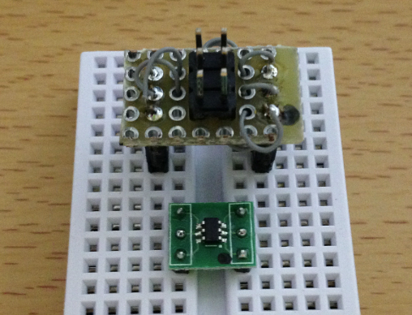
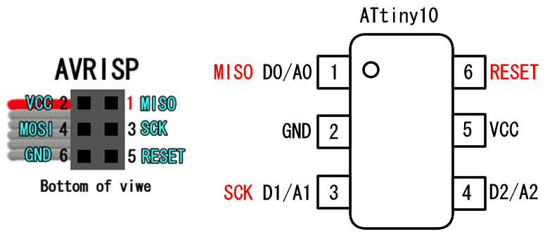
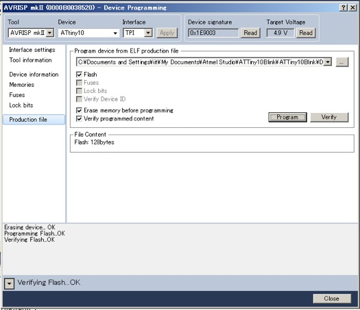
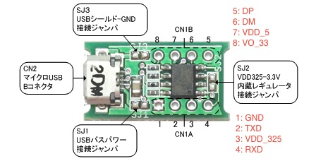
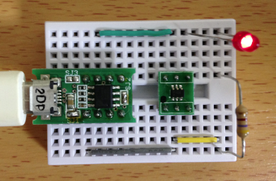
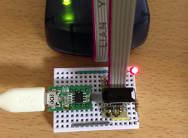
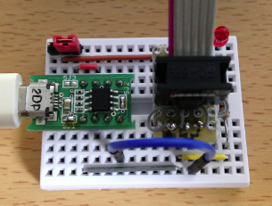

オリジナルの作成：2014/08/31

# 0C-米粒Arduinoを使ってみる
## 米粒Arduinoを使ってみる
Arduino勉強会のメンバーの岡野さんに米粒大のAVR ATtiny10を紹介して頂きました。 調べて見るとArduino用にライブラリーを提供している人もいるので、米粒Arduinoを 使ってみることにしました。

### Atmel Studioの入手
ATTiny10に書き込むには、Atmel Studio６を使ってAVR MkIIのファームウェアを書き替える 必要があるのですが、最新の6.2にはtoolメニューにAVR Tools Firmware Upgradeがありません。

そこで、以下のサイトから6.1betaをダウンロードしました。

- http://atmel-studio.software.informer.com/6.1b/

### ライターの変換モジュール
ATtiny10はとても小さいので、秋月の実装モジュールを運良く購入できました。

変換基板も秋月にありますので、自分でハンダ付けすることも可能です。

- http://akizukidenshi.com/catalog/g/gP-03659/

最初に用意したのは、ATtiny10へのライターとATtiny10との変換モジュールです。 配線は、 
[米粒AVR(ATtiny10)をArduino IDEで使う。暫定レポート２](http://make.kosakalab.com/make/attiny10-2/)
を参考にさせて頂きました。



変換モジュールの結線は、以下の通りです。

 | AVR MkII	 | ATtiny10 | 
 | ---|---|
 | 1: MISO	 | 1: D0/A0 | 
 | 2: VCC	 | 5: VCC | 
 | 3: SCK	 | 3: D1/A1 | 
 | 5: RESET	 | 6: RESET | 
 | 6: GND	 | 2: GND | 
 
ピン配置は、以下の画像を参照してください



### ライターの動作確認
変換モジュールができたので、正しく動作することをAtmelStudioを使って確かめます。

良く例題にでているのは、D0にLEDを接続するものですが、これではライターを識別できず、書き込めません。 そこで、D2にLEDを接続するように修正しました。

```C++
#include <avr/io.h>
#include <util/delay.h>

int main() {
     DDRB = 0xff;

     for ( ; ; ) {
          PORTB |= 4;
          _delay_ms(500);
          PORTB &= 0xfb;
          _delay_ms(500);
     }
}
```

書込には、Tools Device Programmingを選択し、Tool: AVRISP mkII, Device: ATtiny10をセットします。 Production fileでビルドされたelfファイルを指定して、Programボタンを押すと書込が始まります。

書き込む時には、ATtiny10に5Vの電源を供給し、書き込み後はリセット（電源を再度つなぎ直すことで対応） する必要があります。



### 電源とUSBシリアル変換モジュール
ATtiny10への電源供給とUSBシリアル変換を行うために、マルツパーツの

[【MPL2303SA】超小型USBシリアル・モジュール ](http://www.marutsu.co.jp/shohin_137791/)
を使用しました。

MPL2303SAのピン配置は、以下の通りです。



### LED点灯の様子
MPL2303SAとATtiny10をつないで、LEDを点滅している様子です。 LED点灯のプログラムで、128Byteになります。ATtiny10のフラッシュは、 1024Byteなので、約1割を使ってLEDの点滅が動いています。



## ATtiny10をArduino IDEで使う
世の中にはすごい人がいるもので、ATtiny10をArduino IDEでプログラミングできるようになりました。 kosakalabの方がその方法を公開されています。

- [米粒AVR(ATtiny10)をArduino IDEで使う。暫定レポート２](http://make.kosakalab.com/make/attiny10-2/)

MacとWindowsに対応していますが、ここではMacの方法のみを簡単に整理しておきます。

- ATtiny用定義ファイル群(
[attiny.zip](data/attiny.zip)
)をダウンロードし、Arduinoのスケッチが保存されるフォルダーにhardwareというフォルダを作成し、その中に展開したattinyフォルダを入れる
- [AVR-GCCコンパイラー](http://www.obdev.at/products/crosspack)をダウンロードし、インストール
- Arduino IDEの内容を以下の手順でターミナルから変更($ はシェルのプロンプトです)

```bash
$ cd /Applications/Arduino.app/Contents/Resources/Java/hardware/tools/
$  mv avr avr-original
$  ln -s /usr/local/CrossPack-AVR /Applications/Arduino.app/Contents/Resources/Java/hardware/tools/avr
```

### 使い方
準備ができたので、Arduino IDEでATtiny10のスケッチを作成し、書き込んでみます。

- 「ツール」→「マイコンボード」→「ATtiny10 (Internal 8MHz clock)」を選択します
- 「ツール」→「書込装置」→「AVRISP mkII」を選択します

LED点滅を書き込みます。最初の例題との違いが分かるように点滅時間を短くしてみます。 ledの番号は2を使います。

```C++
int led = 2;

void setup() {                
  pinMode(led, OUTPUT);     
}

void loop() {
  digitalWrite(led, HIGH);   
  delay(200);              
  digitalWrite(led, LOW);   
  delay(200);            
}
```

実際に書き込んで動作している様子です。



## シリアル通信（送信のみ）を試す
LED点滅だけでは、つまらないのでシリアル通信をしようと 「スケッチの例題」→「04.Communication」→「ASCIITable」 をコンパイルするとエラーになってしまいました。ATtiny10にはシリアル モジュールがないので、当たり前と言えばその通りです。 それでSoftSerialを使って見たのですが、こちらも未対応でエラーになりました。

調べて見るとATtinyでシリアル通信（送信）を実行した人がいらっしゃいました。

- [米粒AVRでシリアル通信（ただし送信だけ）](http://s2jp.com/2012/08/attiny10-serial/)

ここで紹介されているシリアル関数を使ってArduino IDEからHello World!を表示するスケッチを 作って見ました。

```C++
#define  led  2

void setup() {
  serialBegin();
  pinMode(led, OUTPUT); 
}

void loop() {
  digitalWrite(led, HIGH);
  delay(1000);
  digitalWrite(led, LOW);
  delay(1000); 
  // 直接文字を出力しないとタイミングがずれて文字化けする
  serialWrite('H');
  serialWrite('e');
  serialWrite('l');
  serialWrite('l');
  serialWrite('o');
  serialWrite(' ');
  serialWrite('W');
  serialWrite('o');
  serialWrite('r');
  serialWrite('l');
  serialWrite('d');
  serialWrite('!');
  serialWrite('\n');
}
```

ここで、タブにTinySerialを追加します。

```C++
#include <avr/io.h>
#include <util/delay.h>

#define DELAY  500
// 9600bps
#define SERIAL_TIME_PER_BIT1    104
#define SERIAL_TIME_PER_BIT2    102

#define SERIAL_TX_PIN            PB1

void serialBegin() {
  CCP = 0xD8;
  CLKMSR = 0x00;
  CCP = 0xD8;
  CLKPSR = 0x00;

  DDRB |= _BV(SERIAL_TX_PIN);
  PORTB |= _BV(SERIAL_TX_PIN);
}

void serialWrite(uint8_t data) {
  PORTB &= ~(_BV(SERIAL_TX_PIN));    // start bit
  _delay_us(SERIAL_TIME_PER_BIT1);
  uint8_t i;
  for(i=1;i;i<<=1) {
    if(data&i) {
      PORTB |= _BV(SERIAL_TX_PIN);
    }
    else {
      PORTB &= ~(_BV(SERIAL_TX_PIN));
      asm volatile ("nop");
    }
    _delay_us(SERIAL_TIME_PER_BIT2);
  }
  PORTB |= _BV(SERIAL_TX_PIN);    // stop bit
  _delay_us(SERIAL_TIME_PER_BIT1);
}
```

書き込む前に、ATtinyの3番（D1）とMPL2303SAの4番（RXD）を結ぶ線は外しておいて下さい。

ATtiny10への書込が成功したら、上記の線を結線し、MPL2303SAをUSBに接続し直し、シリアルモニターを表示し、9600ボーで受信して下さい。 LEDが点滅した後、Hello World!が表示（たまに文字化けがあります）されます。



### タイミングのずれ?
ここで、なぜSerialWriteをforループで書かないのか疑問がでると思いますが、Forループの処理を 入れると文字化けしたり、止まったりするのです。

以下がForループを使ったスケッチです。

```C++
#define  led  2

char  *msg = "Hello World!\n";

void setup() {
  serialBegin();
  pinMode(led, OUTPUT); 
}

void loop() {
  digitalWrite(led, HIGH);
  delay(1000);
  digitalWrite(led, LOW);
  delay(1000); 
  for (char *s = msg; *s; s++)
    serialWrite(*s);
}
```

## bitDuinoに切替
Twitterにこのページを紹介したら、まりすさんからbitDuinoを紹介して頂きました。

- [世界最小？のArduino互換ボードを作ってみた(暫定版)](http://100year.cocolog-nifty.com/blog/2014/08/arduino-f0f0.html)

コンパイルサイズも小さく、動かなかったForループを使ったスケッチが動くようになりました。 Forループのスケッチは、以下の通りです。

```C++
#define  led  2

static char  *msg = "Hello World!\n";

void setup() {
  serialBegin();
  pinMode(led, OUTPUT); 
}

void loop() {
  digitalWrite(led, HIGH);
  delay(1000);
  digitalWrite(led, LOW);
  delay(1000); 
  for (char *s = msg; *s; s++)
    serialWrite(*s);
}
```
