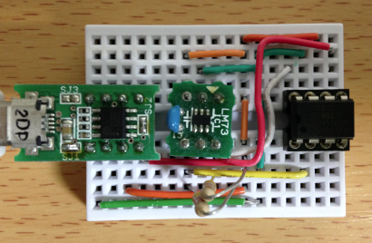
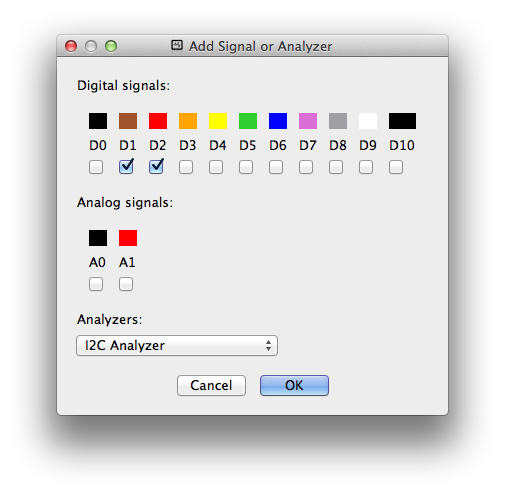
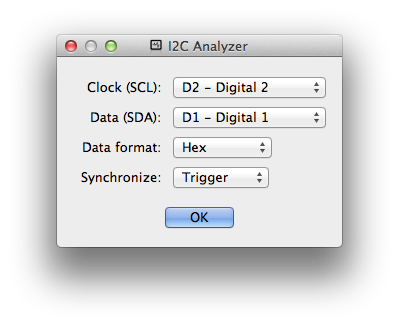
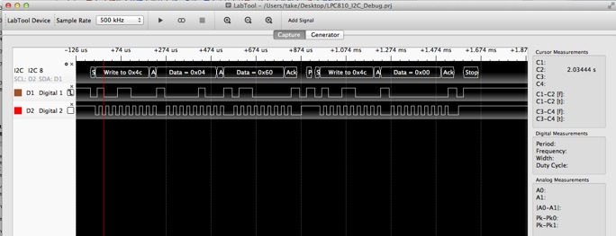
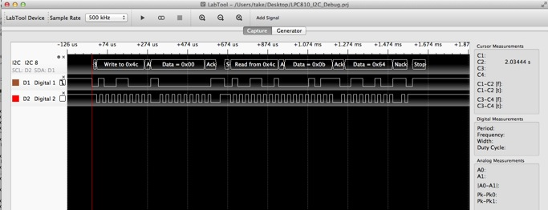
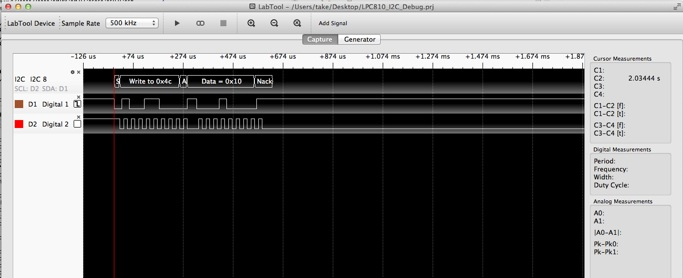

オリジナルの作成：2014/11/16

# 0D-LPC810でI2Cデバイスの値を取得する
勉強会の参加者で、I2Cのデバイスを使ってパソコンにデータを送る小さなアダプターあると便利という ご意見があり、LPC810を使って試してみようと思います。

ここで、紹介しているプログラムは、Githubにlbed/LBED_LPC810から取得できます。

- https://github.com/take-pwave/lbed

## LPC810を使ったI2Cデバイスのシリアル読み込みプログラム 
サンプリングレートが1秒間に1回程度なので、パソコンへはGPIOを使ったソフトシリアルで通信します。 

LPC810の5番ピンをソフトシリアルの送信用に使用します。 LM73を使って温度センサーの値をシリアルに送信ガジェットをブレッドボードに組みました。



## 変なエラー
どうもI2Cデバイスからの応答が2回目以降表示されない、奇妙なバグが発生しました。

こんな時には、プロトコルアナライザとして購入しておいたLabToolの出番です。

### LabToolでデバッグ
ターゲットデバイスとLabToolの結線を以下に示します。 

ここでは、D1, D2にSDA, SCLを接続しました。

 | LabTool	 | LPC810 | 
 |---|---|
 | D1: 茶	 | 8: SDA | 
 | D2: 赤	 | 2: SCL | 

LabToolを起動し、Newを選択する。
Add Signalをクリックし、D1, D2をチェックし、Analyzers:でI2C Analyzerを選択する。



I2C AnalyzerでSDAにD1, SCLにD2を選択し、Synchronize: Triggerを選択する



### Analyzerの結果
デバッガでI2C関連の関数でブレークポイントをセットし、

- 初期化
- 1回目の読み込み
- 2回目の読み込み

をアナライザーに掛けてみると以下のようになりました。

初期化は、プログラム通りの動きを確認

- 0x4CのアドレスにData 0x04, 0x60を書き込み
- 0x4CのアドレスにData 0x00を書き込む



1回目の読み込みでは、

- 0x4Cのアドレスに0x00を送ると
- 0x4Cのアドレスから0x0b, 0x64が返される



一方2回目の読み込みでは、

0x4Cのアドレスに0x10を送って、ここで止まっている。



### 障害の原因
これまで何回も使っていたLM73::readメソッドにバグがあることが判明しました。 送信用のコマンド0x00をセットするのを忘れていた。

```C++
int LM73::read()
{
    char cmd[2];
     // cmdの1バイト目を0をセットし忘れている。2014/11/16発見
     cmd[0] = 0;
     i2c.read( LM73_ADDR, cmd, 2); // Send command string
     int int_val = cmd[0] <<1 | cmd[1]>>7;
     int ceil_val = ((cmd[1] & 0x7f)*200) >>8;
     return (int_val*10 + ceil_val/10);
}
```

### 完成したI2Cからシリアルへの送信プログラム
LPC810では、float型を使用すると急にプログラムサイズが大きくなるため、 温度センサーLM73の戻り値を小数点1桁までの温度を整数とする値に変更しました。

以下にI2Cから読み込んだ値をシリアルに送信するプログラムを示します。 このプログラムは、I2CデバイスLM73から値を読み取り、シリアルに4800ボーで送信する 簡単なものです。

```C++
#include "lbed.h"
#include "SoftSerialTxOnly.h"
#include "LPC8xx.h"

// 4800bps
#define SERIAL_TIME_PER_BIT1    105
#define SERIAL_TIME_PER_BIT2    104

SoftSerialTxOnly::SoftSerialTxOnly(PinName pin) : _out(pin) {

}

int SoftSerialTxOnly::_putc(int value) {
     uint8_t data = value;
     _out = 0;
     wait_us(SERIAL_TIME_PER_BIT1);

     uint8_t i;
     for (int cnt = 0, i=0x01; cnt < 8; i<<=1, cnt++) {
          if (data & i)
               _out = 1;
          else
               _out = 0;
          wait_us(SERIAL_TIME_PER_BIT2);
     }
     _out = 1;
     wait_us(SERIAL_TIME_PER_BIT1);

     return value;
}
メインのプログラムは、以下の通りです。

/*
  SoftSerialTxOnly
  I2CデバイスLM73から値を読み取り、シリアルに4800ボーで送信する
 */

#ifdef __USE_CMSIS
#include "LPC8xx.h"
#endif

#include <cr_section_macros.h>

#include "lbed.h"
#include "SoftSerialTxOnly.h"
#include "LM73.h"

int main(void) {
    // lbedライブラリの初期化
    lbed_setup();
     /* I2C用スイッチマトリックスの設定 */
     I2C_SwitchMatrix_Init();

     // 8番ピンSDA, 2番ピンSCL
     LM73lm73(P8, P2);
     // 5番ピンをURARTのRxに接続
     SoftSerialTxOnly pc(P5);
     pc.println("Hello World\n");
     while(1) {
         pc.print("temp=");
        //pc.print(lm73.read(), 2);
        // floatを使うとサイズオーバーになるので、0.1度までを整数で出力
        int v = lm73.read();
        pc.print(v, DEC);
        pc.println();
        wait_ms(1000);// 1秒待つ
    }
    return 0 ;
}
```
