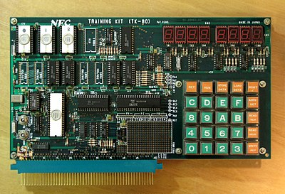
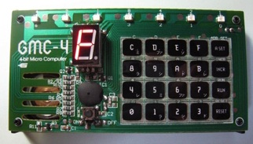
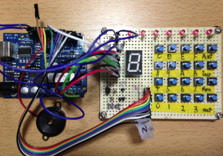
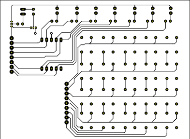
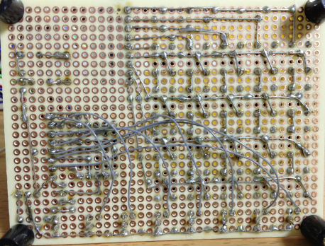
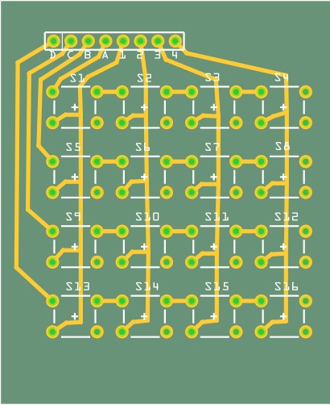
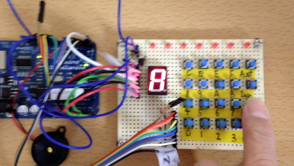

オリジナルの作成：2014/12/29

# 0E-GMC4をArduinoで作ってみる
## GMC-4との出会い
私が最初にマイコンを見たのが、「秋葉原のBIT-INN」に展示されていたTK-80でした。



この基板の上にテンキーと７セグメントLEDが８個付いたのが、コンピューターかと思われるかも 知れませんが、初期のマイコンはテンキーを使って直接マシン語を打ち込んでプログラムを 入力していました。 

2009年６月に学研の「大人の科学Vol.24」 にTK-80を思わせる4-bitマイコンGMC-4が付録に付いてきたので、すぐに購入しました。



そこで、GMC-4用にC言語ライクな簡易言語コンパイラーを作った記事が 
[GMC-4コンパイラー](http://www.pwv.co.jp/~take/TakeWiki/index.php?GMC-4%E3%82%B3%E3%83%B3%E3%83%91%E3%82%A4%E3%83%A9%E3%83%BC)
です。

この時は、アセンブラからマシン語に手で変換して、プログラムを組むことが大変だと思って 簡易言語のコンパイラーを１日仕事で作って公開しました。

## Arduinoを使ってGMC-4を作る
Arduino勉強会で何を作りたいかと聞かれ、とっさに「GMC-4をArduinoで作ってみたい」と答えた のは、GMC-4を子供たちが作って、キーボードからプログラムを入力したら、マイコンのイメージ が変わるのではないかと思ったからです。

### Arduino版GMC-4の部品
Arduino版GMC-4には、１個の7セグメントLEDと７個のLED、そして20個のタクトスイッチに ２個のトランジスタと１０個の抵抗をユニバーサル基板に載せただけのとても簡単なものです。 後はArduinoのプログラムですべて処理します。



### 回路図
７セグメントの接続が画像と異なりますが、KiCADの練習で回路を書きました。
（ikkei blogの
[４×４のキーパッドを試してみた](http://blog.goo.ne.jp/jh3kxm/e/0a71a45afbed826346d605347b83ded0)
から引用）

- [fileGMC-4_sch.pdf](data/GMC-4_sch.pdf)

ついでに、プリント基板のパターンを作りました。



現バージョンのボードの配線は、以下の通りです。




### キーボードは配線だけ 
Arduinoのライブラリにkeypadがあり、これはタクトスイッチを以下の様に配線するだけで マトリックスキーボードを作ることができる素晴らしいクラスです。



## スケッチの作成
ハードは下手くそでもソフトなら大丈夫ということで、以下のクラスを用意しました。

- キーボード: KeyBoard.h
- ７セグメントLED: LED7Seg.h
- LEDアレイ: LEDArray.h

### KeyBoard.h
KeyBoard.hでは、Keypadに渡す、キーマップと、入力文字から値を取り出すgetCode、キーが押されているかどうか 調べるisPressedメソッドを用意しました。

- [KeyBoard.h](code/0E/KeyBoard.h)

### LED7Seg.h
７セグメントLEDとLEDアレイは、交互に表示するため、on、offのメソッドと値をセットするdrawメソッド 用意しました。

- [LED7Seg.h](code/0E/LED7Seg.h)

### LEDArray.h
LEDアレイは、アドレスを表示するために使用するので、setAddressとgetAddressメソッドで値の読み書きをしています。

- [LEDArray.h](code/0E/LEDArray.h)

### GMC4.h
GMC4をシミュレーションしているのが、GMC4.hに定義されているGMC4クラスです。 この中の、stepメソッドが１命令毎に処理するメソッドです。

GMC4.hの処理を理解するには、
[FX-マイコン・全マニュアル](http://otonanokagaku.net/magazine/vol24/pdf/vol24manual.pdf)
を参照してください。 

- [GMC4.h](code/0E/GMC4.h)

### メインのスケッチ
メインのスケッチだけ、ソースをそのまま示します。 処理としては、キーボードからの入力に対する処理の切替をしているだけですが、 一つだけオリジナルのGMC4と異なる点があります。

それは、Arduinoのシリアルモニターを使ってGMC4用の機械語をパソコンから入力できることです。 これによってプログラムの確認がとても簡単になりました！

```C++
#include <Keypad.h>
#include <SoftwareSerial.h>
#include "GMC4.h"

SoftwareSerial mySerial(0, 11); // RX, TX

LEDArray  ledArray;
LED7Seg   led7Seg;
KeyBoard  keyBoard;
GMC4      gmc4(&keyBoard, &ledArray, &led7Seg);


byte lastCode;
byte addr;
byte mode;
byte key;

void setup() {
  mySerial.begin(9600);
  lastCode = gmc4.resetAll();
  ledArray.setAddress(0);
  led7Seg.setValue(0xF);
  mode = PROGRAM;
}

void readProgram() {
  while(mySerial.available()) {
    key = mySerial.read();
    if (key >= '0' && key <= '9')
      lastCode = key - '0';
    else if (key >= 'A' && key <= 'F')
      lastCode = key - 'A' + 10;
    else if (key == 'T') {
      gmc4.longTone();
      lastCode = gmc4.reset();
      ledArray.setAddress(gmc4.getAddr());
      led7Seg.setValue(lastCode);
      mode = PROGRAM; 
    }
    lastCode = gmc4.incr(lastCode);
    ledArray.setAddress(gmc4.getAddr());
    led7Seg.setValue(lastCode);           
  }
}

void loop() {
  if (mode == PROGRAM || mode == STEP_LedOffBeepOff || mode == STEP_LedOnBeepOn) {
    if (mySerial.available())
      readProgram();
    else
      key = gmc4.getKey();
   
    if (key != NO_KEY) {
      if ((key >= '0' && key <= '9') || (key >= 'A' && key <= 'F')) {
        addr = (lastCode > 0) ? lastCode << 4 : 0;
        lastCode = gmc4.getCode();
        addr += lastCode;
        led7Seg.setValue(lastCode);
      }
      else {
        switch (key) {
          case 'S':  // A SET
            lastCode = gmc4.addrSet(addr);
            ledArray.setAddress(gmc4.getAddr());
            led7Seg.setValue(lastCode);
            break;
          case 'I':  // INCR
            if(mode == PROGRAM) {
              lastCode = gmc4.incr(lastCode);
              ledArray.setAddress(gmc4.getAddr());
              led7Seg.setValue(lastCode);       
            }
            else if (mode == STEP_LedOffBeepOff || mode == STEP_LedOnBeepOn) {
              mode = gmc4.step();
              if (mode == STEP_LedOnBeepOn)
                ledArray.setAddress(gmc4.getAddr());
            }
            break;
          case 'R':  // RUN
            switch (lastCode) {
              case 1:
                mode = RUN_LedOffBeepOff;
                break;
              case 2:
                mode = RUN_LedOnBeepOff;
                break;
              case 5:
                mode = STEP_LedOffBeepOff;
                break;
              case 6:
                mode = STEP_LedOnBeepOn;
                break;
              default:
                mode = RUN_LedOnBeepOn;
            }
            gmc4.reset();
            ledArray.setAddress(gmc4.getAddr());
            gmc4.setMode(mode);
            break;
          case 'T':  // RESET
            gmc4.longTone();
            lastCode = gmc4.reset();
            ledArray.setAddress(gmc4.getAddr());
            led7Seg.setValue(lastCode);
            mode = PROGRAM; 
            break;       
        }
        addr = 0;
      }
    }
  }
  else {
    mode = gmc4.step();
  }
  gmc4.draw();
}
```

GMC4のスケッチは、以下のファイルをダウンロードしてください。

- [GMC4Main.zip](data/GMC4Main.zip)

### デバッグの方法
GMC4のようなシミュレータをArduinoで作る場合、デバッグがとても大変になります。

GMC4.hのデバッグは、MacOSのEclipseでダミーのKeyBoard, LED7Seg, LEDArrayを用意して 行いました。

参考として以下にソースを置いておきます。

- [GMC4_Mac.zip](data/GMC4_Mac.zip)

### 動作確認
プログラムの動作を確認するため、FX-マイコン・全マニュアルの以下のサンプルで動作を確かめました。

- No. 8, 9, 10, 11, 12, 13, 14, 15, 16, 17, 18, 19, 20, 21, 22, 23, 24, 25, 26, 27, 28, 29, 30, 31, 32
- No. 43, 44, 45, 46, 47, 48, 49, 50, 67, 68, 69, 70, 71, 72, 73

以下に大人の科学のProgram1 １５秒カウンタを動かしたときの画像とFacebookの動画のURLを 示します。

GMC4のプログラムは、以下の通りです。

 | アドレス	 | 命令記号	 | 命令コード | 
 |---|---|---|
 | 01	 | TIY	 | A | 
 | 01	 | 1	 | 1 | 
 | 02	 | TIA	 | 8 | 
 | 03	 | 9	 | 9 | 
 | 04	 | CAL	 | E | 
 | 05	 | TIMR	 | C | 
 | 06	 | CY	 | 3 | 
 | 07	 | AO	 | 1 | 
 | 08	 | CY	 | 3 | 
 | 09	 | CAL	 | E | 
 | 0A	 | SHTS	 | 9 | 
 | 0B	 | AIY	 | B | 
 | 0C	 | 1	 | 1 | 
 | 0D	 | JUMP	 | F | 
 | 0E	 | 1	 | 1 | 
 | 0F	 | 3	 | 3 | 
 | 10	 | JUMP	 | F | 
 | 11	 | 0	 | 0 | 
 | 12	 | 2	 | 2 | 
 | 13	 | CAL	 | E | 
 | 14	 | ENDS	 | 7 | 
 | 15	 | JUMP	 | F | 
 | 16	 | 1	 | 1 | 
 | 17	 | 5	 | 5 | 
 
最後に、Resetボタンを押します。

Arduinoのシリアルモニターから入力する場合には、上記の命令コードを並べて入力し、最後にTを付けます。

```
A189EC313E9B1F13F02E7F15T
```

実行するには、Runボタンを押します。




facebook URL
- https://www.facebook.com/hiroshi.takemoto.94/videos/721780911262271/


## lbeDuinoを使った2号機
lbeDuinoを使った2号機の記事を以下にまとめました。

- Arduino勉強会/0L-lbeDuinoで2代目GMC4を作ってみる
