オリジナルの作成：2015/01/17

## lbeDuino誕生の理由
安く、ソースデバッガーが使えて、豊富なライブラリーが使える開発環境を作ろうと少しずつ開発を進めてきました lbed ですが、Arduinoのシールドを意識しながら、lbeDuinoと言う形で整理してみたいと思います。

この記事は、鈴木哲哉さんの著書 
[作って遊べるArduino互換機 ](http://www.amazon.co.jp/dp/4883378802/)
に強く影響を受けています。 Arduinoのシールドとの変換シールドを作れば、安くて簡単な万能基板が使えることは、 気軽に電子工作を楽しむ第一歩になると考えたからです。

lbeDuinoでは、プログラムの開発はLpcExpresso Ver.6以降を使っています。 デバッガには、トラ技のARMデバッガを使用しましたが、LPC-LINK, LPC-LINK2も使えます。

### beDuinoの作成方針
Arduino勉強会では、ProtoSnap Pro Mini を使っているので、シリアル通信とUSBからの電源供給は、 FTDI USBシリアル変換アダプターを使います。 シリアル変換アダプターを購入されるのなら、 スイッチサイエンスの 
[FTDI USBシリアル変換アダプター(5V/3.3V切り替え機能付き) ](https://www.switch-science.com/catalog/1032/)
が便利かと思います。

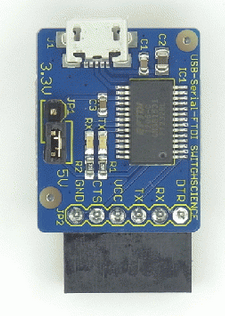

ピンの使い方は、mbed LPC1114FN28を参考にしました。

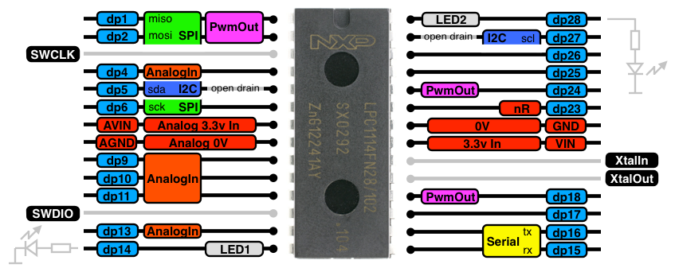

### lbeDuinoの回路図
手書きで申し訳ありませんが、lbeDuinoの回路を以下に示します。

回路のミスについて

- AREFをAnalogInに接続
- 3.3VとGNDにパスコンを追加
- TA48M033Fの1, 3, 2ピンに5V, GND, 3.3Vであり、セラミックコンデンサーは5V, 電解コンデンサーは3.3Vに接続
- D13とD10を入れ替えました（2015/02/08）

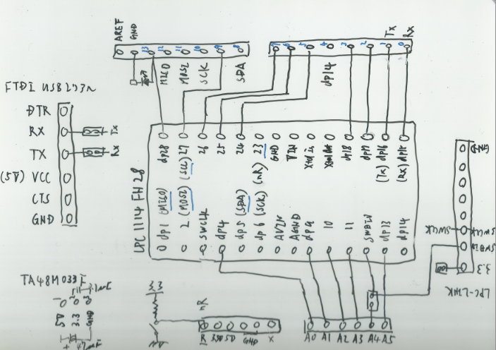

### lbeDuinoの組み立て
出来上がったlbeDuinoは、以下の様になりました。

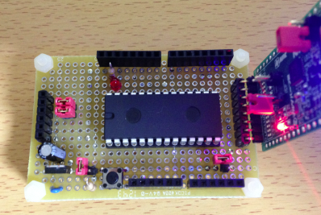

### lbeDuinoの動作確認
Arduinoの動作確認と言えばblinkなので、lbeDuinoでも以下の様なBlink.cpp作って動作を確認しました。

今回Arduino版のlbedと同じスケッチが使えるようにサンプルプログラムをArduino風に書きました。

lbedのArduino版については、Arduino/Arduinoでmbedユーザライブラリーを動かすを参照してください。

ledをDigitalOutのインスタンスとして作成し、LEDのオン・オフをled = !ledのように書けるところがmbed風 のプログラミングの分かりやすいところです。

```C++
#include"lbed.h"

DigitalOut led(D13);

void setup() {}

void loop() {
    led = !led;
    wait_ms(1000);
}
```

## lbedユーザライブラリの動作確認
これまで作ったlbed用のユーザライブラリをlbeDuinoで動かしてみます。

### テキストLCD(TextLCD)
mbedのTextLCDをlbedで動かしてみます。

3.3Vで動作するLCDは、オレンジボードに載せたものだけなので、以下の様にオレンジボードと接続して 動作を確認しました。

 | オレンジボード	 | lbeDuino | 
 |---|---|
 | p24(rs)	 | D0 | 
 | p26(e)	 | D1 | 
 | p27(d4)	 | D2 | 
 | p28(d5)	 | D3 | 
 | p29(d6)	 | D4 | 
 | p30(d7)	 | D5 | 
 
動作確認をしたときの画像は、以下の通りです。

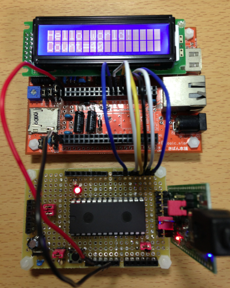

### TextLCDの動作確認
TextLCDの場合も、mbedのTextLCDの例題がそのまま使えます。

Arduino風に書いたTextLCD.cppは、以下の通りです。リセットするとHello Worldが上手く表示できないので、 少し調整が必要ですが、なんとか動きそうです。

```C++
#include "lbed.h"
#include "TextLCD.h"

DigitalOut led(D13);
TextLCD lcd(D0, D1, D2, D3, D4, D5);     // rs, e, d4-7
int     count = 0;

void setup() {
     lcd.print("Hello World!");
}

void loop() {
     lcd.locate(0, 1);
     lcd.print("Count=");
     lcd.print(count++);
     led = !led;
    wait_ms(1000);
}
```

### シリアル通信
パソコンとのシリアル通信（Serial）をArduinoのシリアルモニタを使ってテストしてみます。

シリアルを使う時には、FTDI USBシリアル変換アダプターを接続し、Rx, Txのジャンパーを結線します。

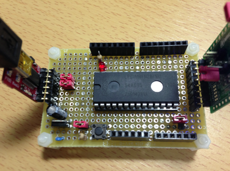

### シリアルの動作確認
シリアルの動作確認にSerial.cppを作成し、予めArduinoのシリアルモニターを起動し、 ボーレイトを9600にセットして下さい。

```C++
#include "lbed.h"

DigitalOut myled(D13);
Serial pc(D0, D1);

void setup() {
     pc.baud(9600);
     pc.println("Hello World!");
}

void loop() {
     char c = pc.read();
     pc.write(c + 1);
     myled = !myled;
}
```

最初にHello Worldを出力し、次に入力した文字の次の文字を返します。abcefgと入力するとbcdfghと返してきます。

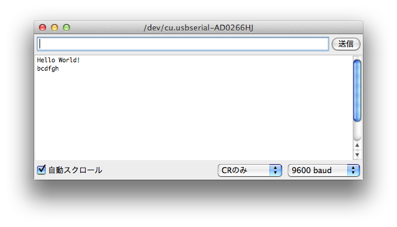


### DigitalIn
LBEDのLPC1114版ではDigitalIn, AnalogInを実装していなかったので、LPC1343版から移植し、動作を確認しました。

DigitalInでは、以下のようにタクトスイッチに10KΩの抵抗でプルアップした回路を組み、スイッチを押したときに LEDを点灯するプログラムを作成して、動作を確認しました。

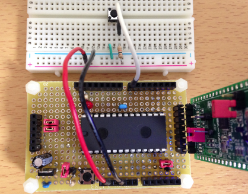

### DigitalInの動作確認
以下のプログラムButtonSwtich.cppを作成し、動作を確認しました。

```C++
#include "lbed.h"
// Pin 13 has an LED connected on most lbeDuino boards.
DigitalOut led(D13);
// Pin 7 has an tact switch on bread board.
DigitalIn  sw(D7);          // #A

// the setup routine runs once when you press reset:
void setup() {
}

// the loop routine runs over and over again forever:
void loop() {
  led = !sw;                // #B
  wait_ms(200);             // wait for 200 mili seconds.
}
```

### AnalogIn
AnalogInは、可変抵抗（potensiometer）を使って電圧を変えて動作を確認しました。

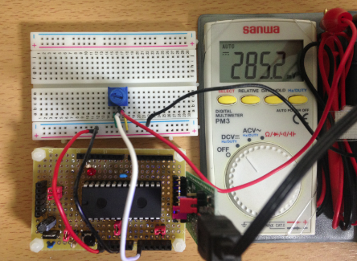

### AnalogInの動作確認
AnalogInの動作確認には、電圧が参照電圧ARefの0.1倍になったらLEDを消すプログラムPotensioMeter.cpp を作って確認しました。

```C++
/*
  PotentioMeter
  Turns on an LED on when potentiometer > 0.33V(0.1).

  This example code is in the public domain.
 */
#include "lbed.h"

// Pin 13 has an LED connected on lbeDuino.
DigitalOut   led(D13);
// Pin A0 has a analog input.
AnalogIn     sensor(A0);  // #A

// the setup routine runs once when you press reset:
void setup() {
}

// the loop routine runs over and over again forever:
void loop() {
  float value = sensor;
  if (value > 0.1)             // #B
    led = 1;
  else
    led = 0;
  wait_ms(200);              // wait for 200 mili seconds.
}
```

### Tone
Toneは、PWMを使用しているため、LPC1114で使えるピンが限られます。 D3, D6, A0がToneとして使用できます。

以下の様にタクトスイッチを押すと圧電ブザーがなるようにブレッドボードで回路を組みます。

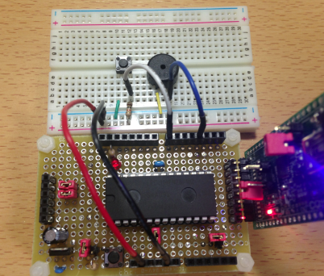


### Toneの動作確認
以下の様なBuzzer.cppを作成し、タクトスイッチを押すとド、レ、ミとなるように します。*2

```C++
/*
  Buzzer
  Sound on an buzzer on when button pressed.

  This example code is in the public domain.
 */
#include "lbed.h"
#include "Tone.h"

int duration = 500;

// Pin 7 has an tact switch on lbeDuino.
DigitalIn     sw(D7);
// Pin 2 has a buzzer on lbeDuino.
Tone          buzzer(D3);     // #A

// the setup routine runs once when you press reset:
void setup() {
}

// the loop routine runs over and over again forever:
void loop() {
  if (!sw) {                         // #B
    buzzer.tone(262, duration);     // ド, 500 msec
    wait_ms(500);
    buzzer.tone(294, duration);     // レ, 500 msec
    wait_ms(500);
    buzzer.tone(330, duration);     // ミ, 500 msec
  }
}
```

### I2C接続のLCD（AQCM0802）
秋月でも販売しているI2C接続のLCD *3 とmbedの AQCM0802のライブラリ をlbedに移植したものを使用しました。

lbedとの接続は、以下の通りです。

 | lbeDuino	 | AQCM0802ボード | 
 |---|---|
 | 3.3V	 | 1番(VCC)、2（nRESET） | 
 | GND	 | 5番 GND | 
 | D8(SDA)	 | 4番(SDA) | 
 | D9(SCL)	 | 3番(SCL) | 
 
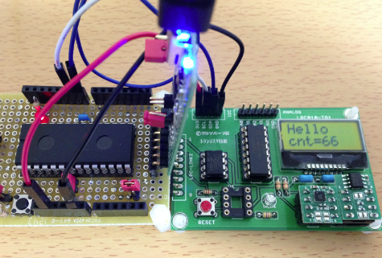

### I2C接続のLCD（AQCM0802）の動作確認
以下のI2cLCD.cppを使ってAQCM0802での動作を確認しました。

```C++
#include "lbed.h"
#include "AQCM0802.h"

// D13番ピンにLEDを接続
DigitalOut     led(D13);
// D8番ピンSDA, D9番ピンSCL
AQCM0802     lcd(D8, D9);
// カウンター
int     counter = 0;

void setup() {
     lcd.setup();
     lcd.print("Hello");
}

void loop() {
     led = !led;
     lcd.locate(0, 1);
     lcd.print("cnt=");
     lcd.print(counter++);
     wait_ms(1000);
}
```

## lbeDuinoのソースの取得
ここで紹介しましたlbeDuinoのソースは、以下のGitHubから取得できます。

- https://github.com/take-pwave/lbed

lbeDuinoに必要なフォルダーは以下の通りです。

- CMSISv2p00_LPC11xx
- LBED_lbeDuino
- LBED_lbeDuino_USERLIB
- LBED_lbeDuino_MAIN

テストプログラムは、LBED_lbeDuino_MAIN/src に置いて下さい。

サンプルプログラムは、Examplesにあります。

## lbeDuino2号機
lbeDuinoは思った以上に使えるので、テクノペンとジャンパー線で2号機を作ってみました。

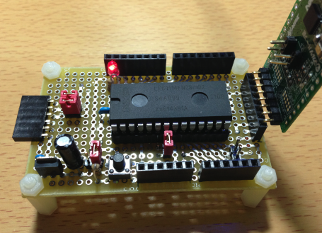

1号機に対して以下の改良をしました。

- シリアルコネクターをL字型に変更
- LPC-LINKとの接続コネクターを一番端に1つずらした。*4

テクノペンのパターンとジャンパー線は、以下の通りです。

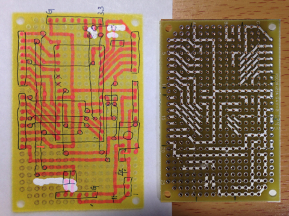

今回は勇気を出してジャンパー線も公開します。

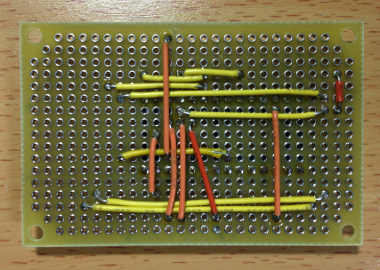


## この後
lbeDuinoのシールドについては、

- Arduino勉強会/0G-lbeDuinoシールドを作る

lbeDuinoの開発環境構築手順については、

- Arduino勉強会/0I-lbeDuinoの開発環境構築

をご覧下さい。
