オリジナルの作成：2015/01/25

ここは、 Arduino勉強会/0F-lbeDuino誕生で紹介した LPC1114FN28を使ったmbedライクなクラスライブラリLBEDとArduinoのようなピン配置をもつ lbeDuino用のシールド作成ページです。

## バッテリーシールドを作る
[作って遊べるArduino互換機 ](http://www.amazon.co.jp/dp/4883378802/)
でも最初に紹介されているのがバッテリー（移動用電源）シールドです。

これまであまり必要性を感じていなかったのですが、作ってみると「あると便利だなぁ」 と感じました。

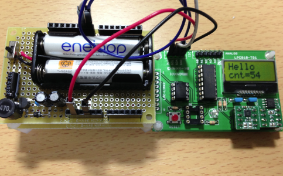

バッテリーシールドの回路を 作って遊べるArduino互換機 図５−４から引用します。

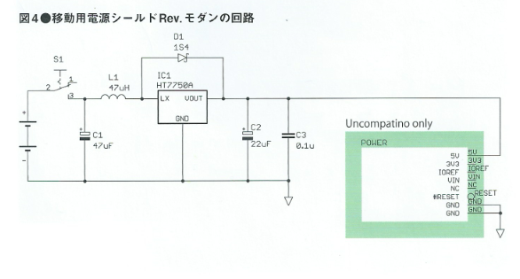


### 必要な部品
lbeDuinoは、3.3Vで動くので、HT7750Aの代わりにHT7733Aを使用しました。 データシートの回路はHT7750Aと同じでした。

 | 品名	 | 秋月コード	 | 数量	 | 備考 | 
 |---|---|---|---|
 | ＤＣ／ＤＣコンバータ  HT7733A	 | I-02799	 | 1	 | 4個入り | 
 | 整流用ショットキーダイオード 1S4	 | I-00127	 | 1	 |  | 
 | 電解コンデンサー47μF	 | P-03120	 | 1 |  | 	
 | 電解コンデンサー22μF	 | P-03177	 | 1	 | 今回は10μFを2個で代用 | 
 | 積層セラミックコンデンサー0.1μF	 | P-04064	 | 1	 | 10個入り | 
 | 小型スライドスイッチ	 | P-02736	 | 1	 | 4個入り | 
 | インダクター（４７μＨ１．２Ａ）	 | P-04047	 | 1	 | 4個入り | 
 | 電池ボックス　単４ｘ２本用	 | P-02245	 | 1	 |  | 
 | ピンソケット　１ｘ６	 | C-04045	 | 2	 |  | 
 | ピンソケット　１ｘ８	 | C-04046	 | 2	 |  | 
 | 両面スルホール・ガラス・ユニバーサル基板　Ｃタイプ	 | P-00189	 | 1	 |  |  | 

### テクノペンで配線
lbeDuinoをユニバーサル基板のCタイプと同じサイズにしたのには、 テクノペン を使って配線したいと考えていました。 

秋月から両面スルホール・ガラス・ユニバーサル基板の画像をダウンロードし、プリンターで印刷した紙に回路を 描いて、テクノペンで同じようになぞって、ドライヤーで乾燥（稼働中のファンヒーターで代用）すると基板の完成です。

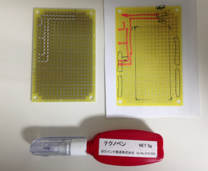

### 部品を付けたバッテリーシールド
基板に部品をハンダ付けして、完成したバッテリーシールドです。

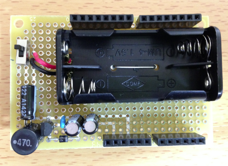

### 電池1本でも大丈夫
データシートに0.7Vから変換するとあったので、電池1本で試してみました。

当たり前ですが、ちゃんと3.3Vがでています。これなら電池付きの試作に使えます。

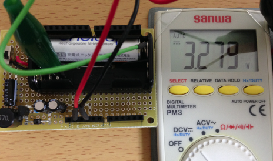

## I2C LCDとボタンの入出力シールド
lbeDuinoの基板では、通常のLCDは載らないので、 
[ストロベリーリナックスのI2C LCD](https://strawberry-linux.com/catalog/items?code=27001)
を使って入出力シールドを作ります。

必要な部品は以下の通りです。 

 | 品名	 | 秋月コード	 | 数量	 | 備考 | 
 |---|---|---|---|
 | I2C低電圧キャラクタ液晶モジュール（１６ｘ２行）		 |  | 1	 | ストロベリーリナックス | 
 | タクトスイッチ（白）	 | P-03648	 | 1	 |  | 
 | タクトスイッチ（黒）	 | P-03647	 | 1	 |  | 
 | 抵抗4.7KΩ	 | R-25472	 | 2	 | 100本入り | 

### ピン配置
最初に部品の配置と接続するピンを決め、ジャンパーする線を探します。 以下のスケッチの青線がジャンパー線です。

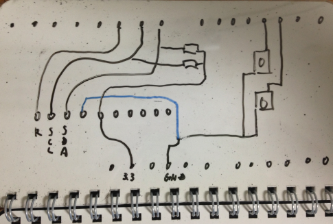


### ブレッドボードで動作を確認
回路が正しく動くかブレッドボードで確認します。

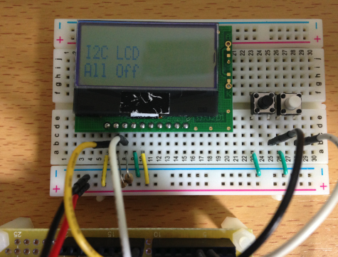

テストに使うプログラムI2cLCDShield.cppは、以下の通りです。

```C++
#include "lbed.h"
#include "AQCM0802.h"

// D13番ピンにLEDを接続
DigitalOut     led(D13);
// D8番ピンSDA, D9番ピンSCL
AQCM0802     lcd(D8, D9);
// タクトスイッチ
DigitalIn     sw1(D2);
DigitalIn     sw2(D3);

void setup() {
     sw1.mode(PullUp);
     sw2.mode(PullUp);
     lcd.setup();
     lcd.print("I2C LCD");
}

void loop() {
     led = !led;
     lcd.locate(0, 1);
     if (!sw1) {
          lcd.print("SW1 On ");
     }
     else if (!sw2) {
          lcd.print("SW2 On ");
     }
     else {
          lcd.print("All Off");
     }
     wait_ms(1000);
}
```

### ユニバーサル基板の配線パターン
次に秋月の両面ユニバーサル基板の画像に配線図を書き込みます。

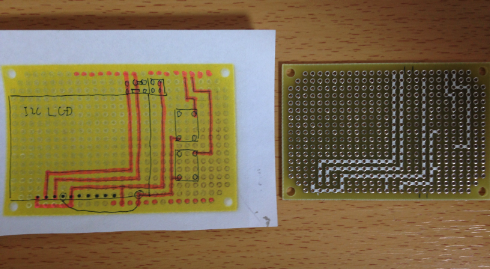

### 部品を載せて完成
テクノペンで描いた配線の上から部品の載せます。 タクトスイッチを押すと下の行にSW1 Onと表示します。

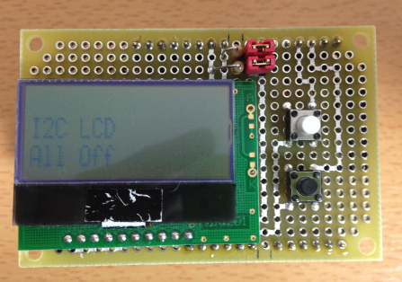

## Arduino-lbeDuino変換シールド
Arduino勉強会/0H-アイロンプリントのすすめ
で作成したArduino-lbeDuino変換シールドは、とても重宝しています。

特にlbeDuino用に作ったシールドがそのまま3.3VのUncompatinoでも使えます。以下の図は3.3V Uncompatinoの上に、 Arduino-lbeDuino変換シールを載せ、その上にバッテリーシールドを載せている場面です。

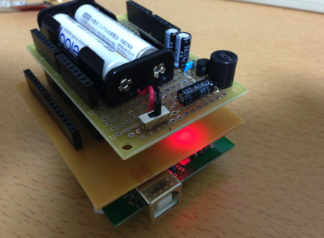

### SDカードシールド
作って遊べるArduino互換機 に倣って、秋月電子で販売されているマイクロSDカードスロットAE-MIXCRO-SD-DIPを使って、 lbeDuino用のSDカードシールドを作ってみました。

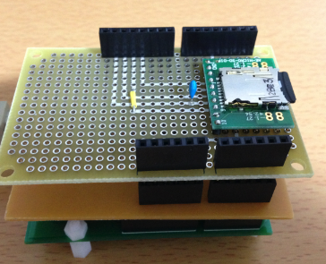

テクノペンを使った配線は、以下の通りです。

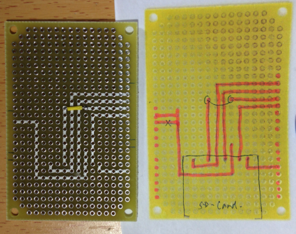

### Arduinoで動作確認
最初は、Arduinoのスケッチを使って、動作確認をしました。

Arduino IDEでファイル→スケッチの例→SD→Dataloggerを選択します。 スケッチをすべてコピー＆ペーストで、新規のスケッチに複製します。

29行目のchipSelectを４にします。

```C++
const int chipSelect = 4;
```

Arduinoにスケッチをアップロードすると、 SDカードにアナログピンの数値をどんどん書き込んでいきますので、途中でSDカードを抜いてやります。

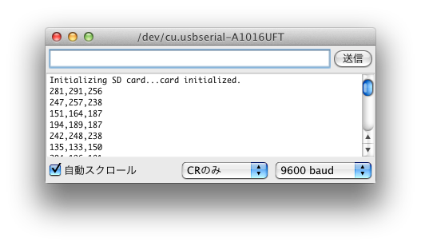

SDカードをPCに入れると、DATALOG.TXTというファイルができており、内容が上記のような値になっています。

これで、SDカードシールドが正しく動作することが確認できました。

### SDライブラリの移植
別途紹介する予定ですが、ArduinoのSDライブラリをlbeDuino用に移植しました。 

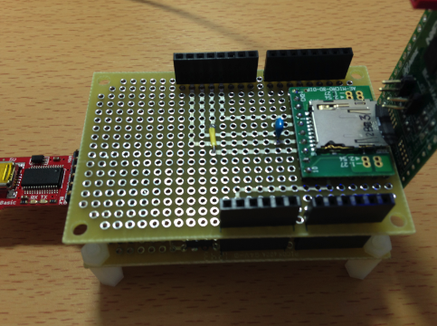

以下のSDCard_Info.cppを作成して、SDカードの情報をシリアルモニターに表示します。

```C++
#include "lbed.h"
#include "SD.h"

const int chipSelect = D4;

void setup() {
     /*
      SD.begin(chipSelect);

      File dataFile = SD.open("test.txt", FILE_WRITE);

      // if the file is available, write to it:
      if (dataFile) {
      dataFile.println("test");
      dataFile.close();
      }
      */
     Serial pc(D0, D1);
     pc.baud(9600);
     pc.print("\nInitializing SD card...");

     Sd2Card card;
     SdVolume volume;
     SdFile root;
     if (!card.init(SPI_HALF_SPEED, chipSelect)) {
          pc.println("initialization failed. Things to check:");
          pc.println("* is a card is inserted?");
          pc.println("* Is your wiring correct?");
          pc.println(
                    "* did you change the chipSelect pin to match your shield or module?");
          return;
     } else {
          pc.println("Wiring is correct and a card is present.");
     }
     // print the type of card
     pc.print("\nCard type: ");
     switch (card.type()) {
     case SD_CARD_TYPE_SD1:
          pc.println("SD1");
          break;
     case SD_CARD_TYPE_SD2:
          pc.println("SD2");
          break;
     case SD_CARD_TYPE_SDHC:
          pc.println("SDHC");
          break;
     default:
          pc.println("Unknown");
     }

     // Now we will try to open the 'volume'/'partition' - it should be FAT16 or FAT32
     if (!volume.init(card)) {
          pc.println(
                    "Could not find FAT16/FAT32 partition.\nMake sure you've formatted the card");
          return;
     }

     // print the type and size of the first FAT-type volume
     uint32_t volumesize;
     pc.print("\nVolume type is FAT");
     pc.print(volume.fatType(), DEC);
     pc.println();

     volumesize = volume.blocksPerCluster(); // clusters are collections of blocks
     volumesize *= volume.clusterCount();       // we'll have a lot of clusters
     volumesize *= 512;                    // SD card blocks are always 512 bytes
     pc.print("Volume size (bytes): ");
     pc.print(volumesize);pc.println();
     pc.print("Volume size (Kbytes): ");
     volumesize /= 1024;
     pc.print(volumesize);pc.println();
     pc.print("Volume size (Mbytes): ");
     volumesize /= 1024;
     pc.print(volumesize);pc.println();

     pc.println("\nFiles found on the card (name, date and size in bytes): ");
     root.openRoot(volume);

     // list all files in the card with date and size
     root.ls(LS_R | LS_DATE | LS_SIZE);

}

void loop() {
}
```

Mac OSXの場合、SDカードにゴミ箱やスポットライトの情報が隠れファイルとして作成されているため、 以下の様に出力されました。


## 非接触温度計TMP006シールド
作って遊べるArduino互換機 で紹介されているTMP006シールドをlbeDuino用に作成しました。

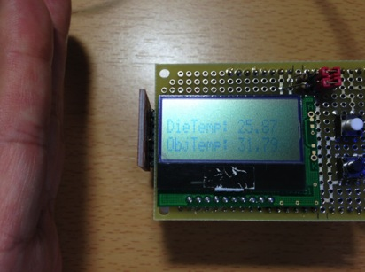

いつものようにテクノペンで基板のパターンをかきました。

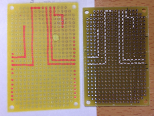
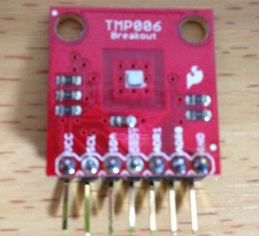

テストに使用するライブラリは、mbedの
[Sam Kirsch氏TMP006_lib](http://developer.mbed.org/users/sammacjunkie/code/TMP006_lib/) 
をlbeDuinoに移植して使いました。 

最初、値が正しく求まりませんでした。この原因はLBEDのI2C.readのバグでした。

温度を表示するスケッチは、以下の通りです。

```C++
#include "lbed.h"
#include "TMP006.h"
#include "AQCM0802.h"

#define Address (0x40<<1)

// D8番ピンSDA, D9番ピンSCL
TMP006           sensor(D8, D9, Address);
AQCM0802     lcd(D8, D9);

void setup() {
     lcd.setup();
     sensor.config(Address, 8);
}

void loop() {
     lcd.locate(0, 0);
     lcd.print("DieTemp: ");
     lcd.print(sensor.readDieTempC(Address), 2);
     lcd.locate(0, 1);
     lcd.print("ObjTemp: ");
     lcd.print(sensor.readObjTempC(Address), 2);
     wait_ms(1000);
}
```
