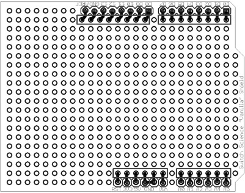
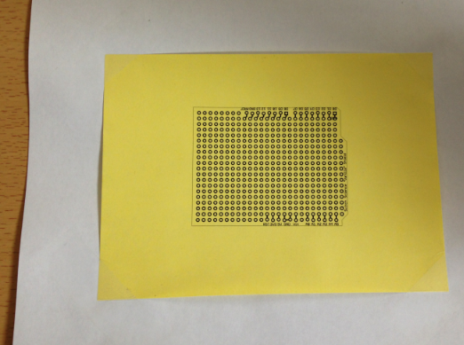
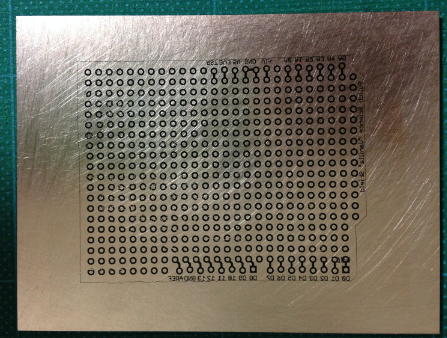
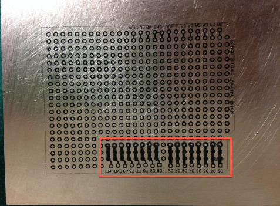
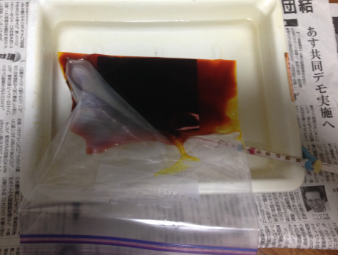
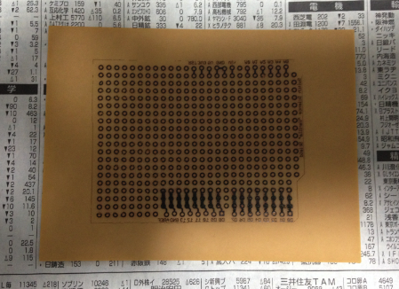
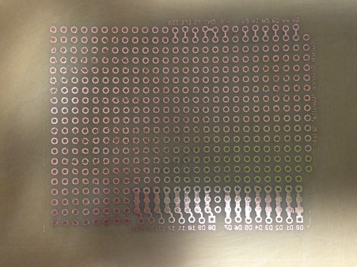
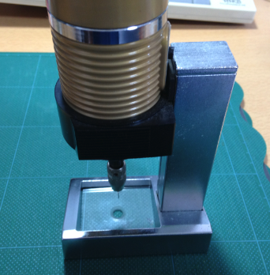
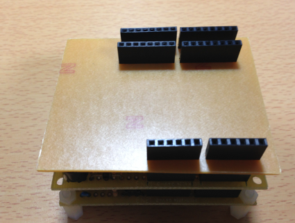

オリジナルの作成：2015/02/01

## 簡単アイロンプリント
Arduino用のシールドが簡単にできればと思い、プリントパターンを検索したところ、 スイッチサイエンスさんの バニラシールド のページに以下の画像を見つけました。

更に、EAGLE用のbrdファイルも公開されています。

- [filevanilla-shield.brd](http://trac.switch-science.com/attachment/wiki/VanillaShield/vanilla-shield.brd)

これを使って以下の様なPDFファイルを作成しました。

- [filevanilla-shield.pdf](data/filevanilla-shield.pdf)

### 1枚10円のアイロンプリント
久しぶりにアイロンプリントを検索すると安くできる方法が 「写真で見る工作室」の 
[熱転写紙とGreenTRF ](http://iizukakuromaguro.sakura.ne.jp/389_ttp/389_ttp.html)
に 
[サーマルトランスファーペーパー](http://ja.aliexpress.com/item/Hot-50pcs-PCB-circuit-board-thermal-transfer-paper-transfer-paper-A4-size-hot-sale-in-stock/1036906319.html)
という格安の熱転写紙が紹介されていました。

50枚で$8.88+送料$6.32（香港エクスプレスで1週間）で1,892円でした。 A4サイズの紙で1枚が約40円で、レーザープリンターでプリントするときには 1/4に切って紙に貼り付けて使うので、1枚のプリント基板では10円のコストになります。

### バニラシールドのパターンを生基板に転写
サーマルトランスファーペーパーにバニラシールドを印刷して、生基板に転写します。

私は、 熱転写紙とGreenTRF で紹介されていたラミネート機を使いましたが、転写時間がPress-n-Peel Blueと同じとあったので、 普通のアイロンで中温から高温の温度に設定し、1分から数分程押さえると転写できると思います。

Arduino勉強会に参加された方には、A4サイズのバニラシールドパターンを実費*1にてお分けします。

失敗しても、ステンレスたわしでこすれば何度でも生基板に転写できます。

### バニラシールドパターンに回路を描く
市販のマッキーペン を使って回路を生基板に転写したバニラシールドパターンに描きます。 間違ってもシンナーで簡単に消せるので、安心です。

## 変換シールドを作る
作って遊べるArduino互換機 で紹介されているシールドで最も感動したのが、Arduinoとの変換シールドです。

Arduino変換基板を例にプリント基板を作ってみます。赤の部分が変換シールド用に書き込んだ回路です。

市販のジップロックにエッジング液と基板を入れ、トレイにお湯（40℃）を付けて、 割り箸で銅が溶けるのを確かめながら、エッチングします。

不要な銅がとけたら、箸で取りだし、キッチンタオルでエッチング液を拭き取り、水洗いします。

シンナーでマッキーペンで描いた回路を消し、ステンレスたわしでこすって熱転写したトナーを取り除きます。

これでオリジナルArduinoシールドの完成です。

使ったエッチング液はまだ使えるので、ジュースのパックなどに入れて保管します。 使えなくなったら付属の中和剤を入れて、園芸用のコンクリートで固めて不燃物で出します。

穴開けには、 サンハヤトのD-3 とスタンド*4、 0.8mの半月型ドリルビット を使用しました。

完成したlbeDuino用Arduino変換シールドです。

