オリジナルの作成：2015/02/15

ここまで、 Arduino勉強会/0F-lbeDuino誕生、 Arduino勉強会/0G-lbeDuinoシールドを作る、 Arduino勉強会/0H-アイロンプリントのすすめ とlbeDuinoのハード関連の説明をしてきましたので、 lbeDuinoの開発環境について説明します。

lbeDuinoの最大の特徴は、同じソース、同じシールドをArduinoとlbeDuinoで使え、LPCXpressoを使ってデバッグできる点にあります。

## 準備するもの
開発に必要なものは、以下の２つです。

- トラ技ARMライタ
- LPCXpresso IDE（CMSI-DAPに対応したVersion６以降を使用して下さい）

### トラ技ARMライタ
プログラムの書き込みとデバッグには、CQ出版の 
[トランジスタ技術2014年3月号](http://toragi.cqpub.co.jp/tabid/710/Default.aspx)
の付録のトラ技ARMライタを使っています。

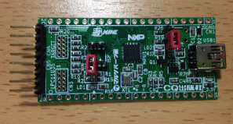

これにL字のピンとジャンバーピン（タクトスイッチの代用） を付けて使っています。ブレッドボードに差すこと考えメスのL字コネクターではオスのL字ピンを使いました。

トラ技ARMライタの書き込みは、トラ技で紹介されています。

## LPCXpresso IDE
LPCXpresso IDEを
[ダウンロードページ](http://www.lpcware.com/lpcxpresso/download)
からダウンロードします。
[トラ技のサポートページ](http://toragi.cqpub.co.jp/tabid/440/Default.aspx)
に手順が詳しく載っていますので、参考にしてください。

ダウンロードしたLPCXpressoは、フリー版でもアクティベートが必要です。

最初に、シリアル番号を取得します。 LPCXpressoを起動して、HelpメニューからActivate LPCXpresso (FreeEdition)→Create Serial number and Activate...のメニューを選択します。

Copy Serial Number to Clipboardにチェックを入れてOKボタンを押します。

アクティベートには、以下のページでregisterからユーザ登録して、loginしてください。 
[LPCXpresso Key Activation](http://www.lpcware.com/lpcxpresso/activate)

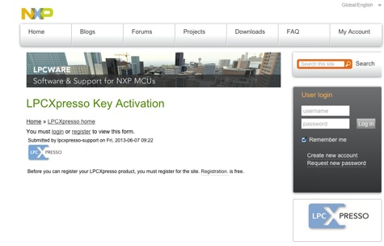

ログインに成功すると以下のアクティベーションページに移ります。

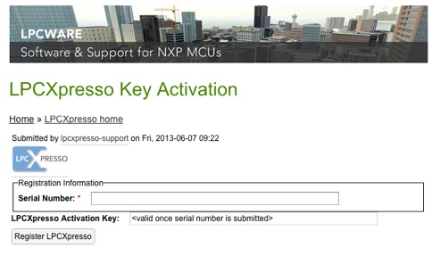

先ほどのシリアルナンバーをペーストし、 Register LPCXpressoを押すとしばらくしてユーザ登録したメールアドレスにアクティベーションキーが送られてきます。

HelpメニューからActivate→Activate (FreeEdition)を選択し、シリアルナンバーを入力すれば完了です。

## lbeDuinoソースのダウンロード
最新のソースは、Githubからダウンロードすることができます。 LBEDはまだ開発途中なので、更新が必要なのでgitを使って最新のページにすることをお薦めします。

ソースを保存するディレクトリに移動した後、ターミナルソフトで、以下のコマンドを入力してください。

```bash
$ git clone https://github.com/take-pwave/lbed
```

ソースを最新に更新するには、lbedのディレクトリで、以下のコマンドを入力してください。

```bash
$ git pull
```

gitが使えない場合には、以下のURLでGithubのlbedのページを表示して、Download ZIPボタンからzipファイルをダウンロードしてください。

- https://github.com/take-pwave/lbed

## LPCXpressoへのプロジェクトのインポート
lbedのディレクトリには、他のボードのlbedが含まれています。lbeDuinoでインポートするプロジェクトは以下の４つです。

- CMSISv2p00_LPC11xx
- LBED_lbeDuino
- LBED_lbeDuino_USERLIB
- LBED_lbeDuino_MAIN

### プロジェクトインポート手順
LPCXpressoを起動してProject Explorerのタブで右クリックすると以下のポップアップメニューが表示されます。

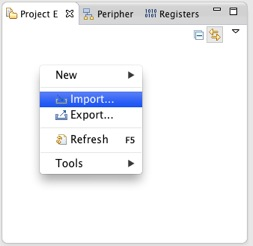

GeneralのExisting Projects into Workspaceを選択します。

th_import.jpg

Select root directoryのBrowse...ボタンでgitコマンドでダウンロードしたlbedの必要なプロジェクトのディレクトリを 選択し、Finishiボタンを押します。

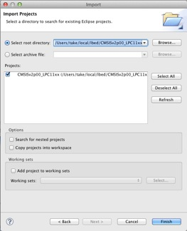

インポートされたプロジェクトがProject Exploreに追加されます。

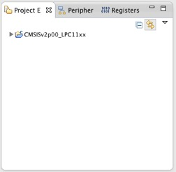

これを必要な４つのプロジェクトに対して繰り返します。

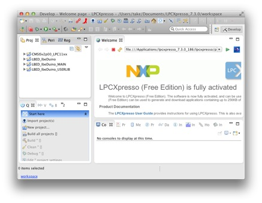

## Blinkを動かしてみる
lbeDuinoのメインのプロジェクトは、LBED_lbeDuino_MAINです。プロジェクトを展開すると、 以下の様になります。

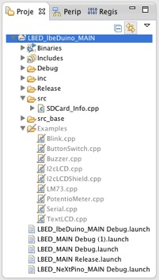

ユーザの使用するのは、srcと　Examplesの２つだけです。srcには、最新版でチェックしたスケッチが入っています。 これとExampleのBlink.cppを入れ替えます。

### Blinkのビルド
ビルドは、LBED_lbeDuino_MAINプロジェクトを右クリックして、Clean Projectを実行した後、Build Projectを選択します。

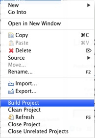

Consoleに以下の様にBuild Finishedが表示されればビルドの完成です。

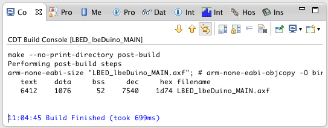


### Blinkの書き込み
トラ技ARMライタをlbeDuinoのソケットに差します。

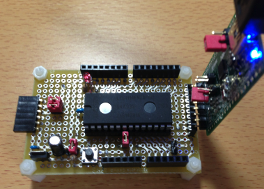

初回だけデバッグ用の設定を作成するために、Quickstart PanelからDebug 'LBED_lbeDuino_MAIN'[Debug]を選択します。 2回目以降は、メニューアイコンの虫をクリックするだけです。


最初は、トラ技ARMライタが認識できずに、以下のダイアログが出ます。

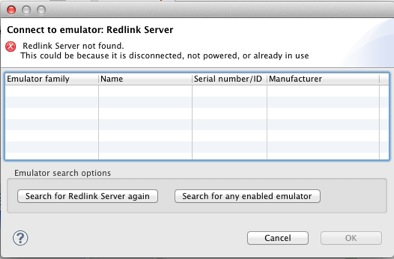

ここで、Search for any enabled emulatorボタンをクリックすると、Toragi_LPC Writer CMSI-DAPが見つかりますので、 ここで、OKボタンを押します。

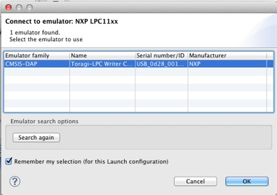

プログラムが無事lbeDuinoにダウンロードされたら、以下の様にデバッグ画面が表示されます。 ここで、RunメニューからResumeを選択するとBlinkが動き出します。

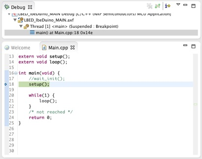

まだ、デバッガが有効なので、好きなタイミングでブレークポイントをセットして止めることができます。

デバッグを終了するには、RunメニューからTerminateを選択します。

## lbeDuinoのデバッグ
プログラムの書き込みとデバッグ開始手順は同じなので、ここからはデバッグの手順について説明します。

ユーザがsrcディレクトリに作成したスケッチは、src_baseにあるプログラムによって起動前の処理を行った後、 呼び出されます。 デバッガでは、src_base/Main.cppのmain関数で止まるように設定されています。

ユーザの作成したスケッチ（ここではBlink.cpp）で止めるには、2つの方法があります。

- デバッガのstep into機能を使って、setupやloop関数の内部に移動する
- ユーザのスケッチにブレークポイントをセットする

### デバッグアイコンの使い方
デバッグには、上部アイコンメニューのデバッグアイコンを使用します。


右から

- 終了（Terminate）
- 一時停止（Suspend）
- 続けて実行（Resume）
- Step Into
- Step Over
- Step Return
- Use Step Filter

があり、通常は、終了、続けて実行、Step Into、Step Over、Step Returnを使います。

main関数の最初のstep()で止まったところで、右から4番目のStep Intoを実行して下さい。 Blink.cppが開き、step()関数の最初（以下の図では6行目）で止まります。

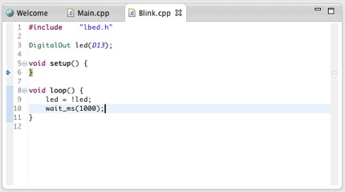

プログラムのチェックが終わり、処理の途中で関数の呼び出し元まで進めたいときには、 Step Returnを使用します。

今度は、Main.cppの21行目で止まりますので、またStep Intoを実行します。今度は、Blink.cppの9行目で止まります。

変数の値を見たいときには、変数の上にマウスを移動すると、変数の値が表示されます。

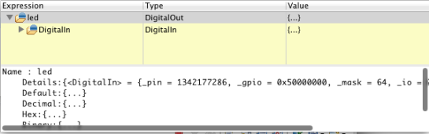

1行ずつ実行するには、Step Overを使用し、指定した行まで実行するには、止めたい行をマウスでクリックし、右クリックでRun to Lineを実行します。

## Arduinoでlbedライブラリを使う
lbedのダウンロードした時に作成されたArduinoの中のLbedをユーザのドキュメントディレクトリ/Arduino/librariesにコピーしてください。

Arduinoでlbedライブラリを使用する方法は、 Arduino/Arduinoでmbedユーザライブラリーを動かす に紹介しています。
