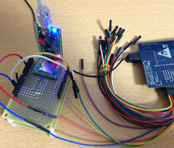
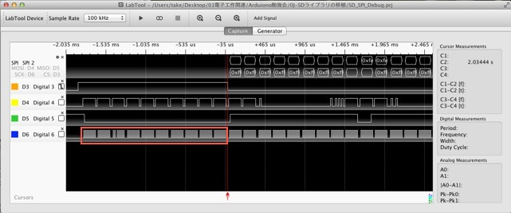
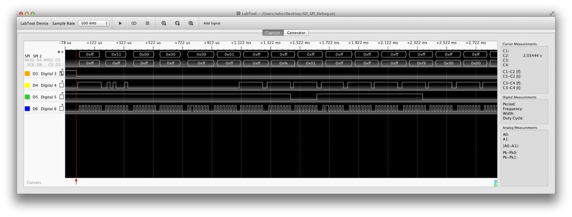
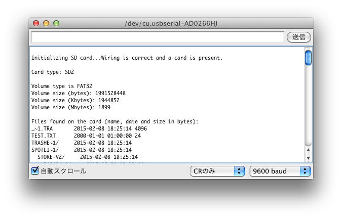

オリジナルの作成：2015/02/15

## Arduino SDカードライブラリ
SDカードシールドを作ってから、LBEDにはまだSDカードライブラリがないことに気づきました。

通常なら、LBEDは完全を目指す物では無いのでまぁいいや的になるのですが、 lbeDuinoではシールドを作成したガジェットを外に持ち運ぶことが想定されます。

このような状況で記録手段がないことは大きな問題と考え、思い腰を持ち上げてArduinoのSDライブラリの 移植に取り掛かりました。

この記事のみどころ？は、どうやって移植したかでは無く、どうやって動くようにしたかです。

### Arduino SDカードのマシン依存部
移植の元にしたのは、Arduinoアプリケーション配下の（MacOSX版で説明します）Contents/Resources/Java/libraries/SDです。

このソースはとても良くできていて、SDカードのSPIの処理に関連する部分は、utility/Sd2Card.cpp, SdCard.hに凝縮されています。

lbedへの移植は、Sd2Cardクラスのメンバ変数にSPIクラスの_spi変数とDigitalOutクラスのchipSelect_を追加し、初期化とspiSend, spiRec関数をlbedのSPI用に書き替えるだけです。 *1

Sd2Card.hの変更点

```C++
//#include "Sd2PinMap.h"
#include "SdInfo.h"
#include "lbed.h"     // LBEDのヘッダをインクルード


// コンストラクタの変更
  Sd2Card(void) : errorCode_(0), inBlock_(0), partialBlockRead_(0), type_(0),
  spi_(MOSI, MISO, SCKL), chipSelect_(D4){}


// spiSend, spiRecの変更
  void spiSend(uint8_t b) { spi_.write((int)b); };
  uint8_t spiRec(void) { return spi_.write((int)0xFF); };

// private:宣言の追加
  SPI spi_;
  DigitalOut chipSelect_;
```

ここでは、SDカードシールドに合わせchipSelectをD4に固定としています。

## 失敗談
最初は、SPIのSCKLのピンをD10に割り当てており、SDカードの初期化に失敗していました。

ここでもLabToolのプロトコルアナライザーが役に立ちました。



LabToolとlbeDuinoとの接続は、以下の通りです。

 | LabToolピン	 | ケーブルの色	 | 機能	 | lbeDuino | 
 |---|---|---|---|
 | DIO_3	 | Orange	 | SPI-SSEL	 | D4 | 
 | DIO_4	 | Yellow	 | SPI-MOSI	 | D11 | 
 | DIO_5	 | Green	 | SPI-MISO	 | D12 | 
 | DIO_6	 | Blue	 | SPI_SCK	 | D13 | 

### 初期化は規定どおり
SDカードの処理手順は、ChaNさんの 
[MMC/SDCの使いかた](http://elm-chan.org/docs/mmc/mmc.html)
を参考にさせて頂きました。

初期化のchipSelectがHightでSCKLを74クロック以上入れるとある部分では、80回のクロックを入れた後初期化コマンドを送っています。



## MBRの読込失敗
初期化でSDカードの情報のタイプはきちんと読み込んでいるのですが、SDカードのMBRを読み込んだ後にエラーとなってしまいます。

ここでもLabToolが役立ちました。以下の画面では、0x0が続いて読み込まれており、デバッガでもその値が正しく読み取れました。



このような状態ではSPIの読込が原因では無いことが明らかです。

そこで、FAT関連の構造体をよく見てみると原因が隠れていました。

FatStructs.hを見てみると、fat32BootSectorの構造体が以下の様に定義されています。

```C++
struct fat32BootSector {
           /** X86 jmp to boot program */
  uint8_t  jmpToBootCode[3];
           /** informational only - don't depend on it */
  char     oemName[8];
           /** BIOS Parameter Block */
  bpb_t    bpb;
           /** for int0x13 use value 0X80 for hard drive */
  uint8_t  driveNumber;
           /** used by Windows NT - should be zero for FAT */
  uint8_t  reserved1;
           /** 0X29 if next three fields are valid */
  uint8_t  bootSignature;
           /** usually generated by combining date and time */
  uint32_t volumeSerialNumber;
           /** should match volume label in root dir */
  char     volumeLabel[11];
           /** informational only - don't depend on it */
  char     fileSystemType[8];
           /** X86 boot code */
  uint8_t  bootCode[420];
           /** must be 0X55 */
  uint8_t  bootSectorSig0;
           /** must be 0XAA */
  uint8_t  bootSectorSig1;
}__attribute__ ((packed));
```

volumeSerialNumberの後に、char型でvolumeLabel[11], fileSystemType[8]と定義されています。 32bitマイコンのLPC1114では、構造体のアライメントが32bit単位となるので、volumeLabelとfileSystemTypeは連続した領域に割り当てられません。そこで、FatStructs.h内の構造体の終わりに
```
__attribute__ ((packed))
```
を付けてやりました。 これで何とかSDライブラリが動くようになりました。

### 動作確認
Arduino勉強会/0G-lbeDuinoシールドを作るの結果を再度掲載します。


