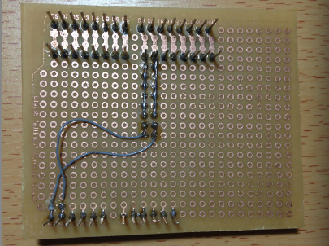
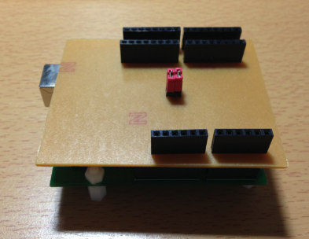
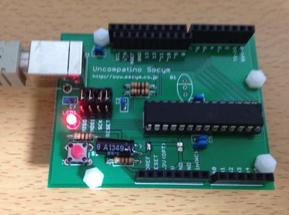
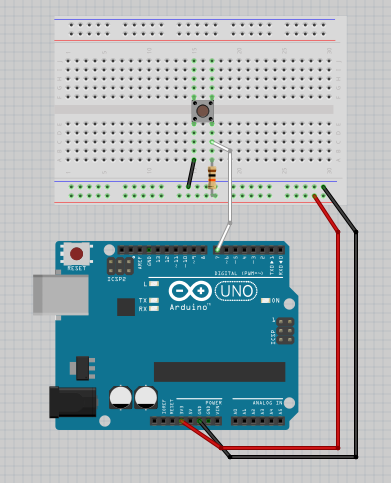
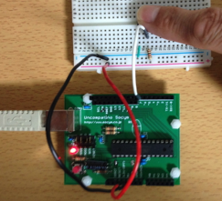
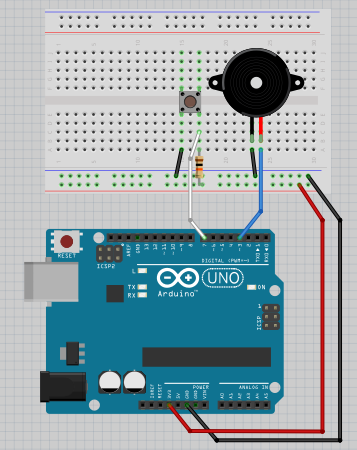
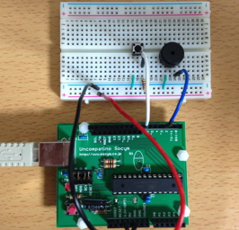
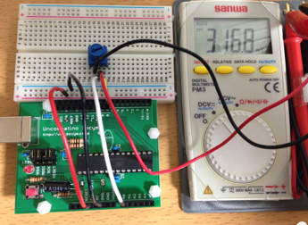
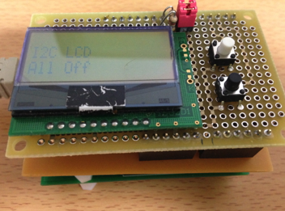
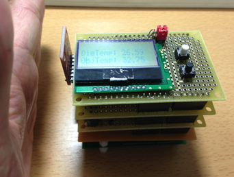

オリジナルの作成：2015/04/05

## lbeDuino開発の思い
鈴木哲哉さんの著書 
[作って遊べるArduino互換機](http://www.amazon.co.jp/dp/4883378802/)
に紹介されているArduino変換基板というアイディアを元にUnCompatino 3.3V（Arduino Pro3.3相当）と LPC1114FN28でプログラム（スケッチ）やライブラリ、上に載せるシールドを共有し、 EclipseベースのLpcExpressoを使ったソースレベルのデバッグ機能を使ってmbedやArduinoの両方で使える 環境を提供することが、lbeDuino開発の願いです。

## 変換基板の改造
ArduinoのSoftI2CMasterを使って何とかソフトウェアレベルでlbeDuinoとUnCompatino 3.3Vでライブラリを 共有できないかと頑張ってみたのですが、I2CベースのLCDがどうしても動作しないため、 Arduino勉強会/0H-アイロンプリントのすすめ で作成した、lbeDuino用Arduino変換シールドに以下のようなジャンパー線を追加することにしました。




### UnCompatino 3.3Vで試すlbeDuinoサンプル
Arduino勉強会/0F-lbeDuino誕生 で紹介した例題を使ってArduinoでmbed（lbeDuino）風のプログラミングを味わって頂きます。

最初に使用するArduinoをIDEに知らせるため、ツール→マイコンボード→Arduino Pro or Pro Mini(3.3V,8MHz) w/ ATmega328を選択します。 次に、シリアルポートセットしてください。

## BlinkLED（LEDの点滅）
最初は、DigitalOut（デジタル出力クラス）を使ったLEDの点滅スケッチ*2 からはじめましょう。

まず、BlinkLEDスケッチを読み込みます。 ファイル→スケッチの例→lbeDuino→BlinkLEDを選択すると、以下のスケッチが表示されます。

```C++
/*
  BlinkLED（LEDの点滅）
  １秒間隔でLEDを点滅します。
 */
#include "lbed.h"
 
// D13番ピンに接続されたLEDを使用
DigitalOut led(D13);

// リセット時に呼び出されるsetupでは、特に処理は必要ありません。
void setup() {               
}

// 毎回呼び出されるloopで、ledを切り替えて１秒待ちます。
void loop() {
  led = !led;        // LEDを切り替える（点灯→消灯、消灯→点灯）
  wait_ms(1000);     // １秒待つ（1000ミリ秒=１秒）
}
```

DigitalOutクラスのledには、0と1のいずれかの値を持ちます。値のセットは、=による代入を使い、値の読み出しはledをそのまま書きます。 とても直感的な表現がmbedのクラスの特徴です。

次にファイル→マイコンボードに書き込むを選択して、スケッチをArduinoに書き込みます。



## ButtonSwitch（ボタンスイッチの例）
次に、ボタンスイッチを押したときにArduinoのLEDを点灯させる例です。

以下の図のようにブレッドボードに回路を組みます。 抵抗は、10kΩを使います。今回は、Arduino3.3V版を使用しますので、 ブレッドボードの電源ライン（赤の線）には、Arduinoの3.3Vをつなぎます。



ファイル→スケッチの例→lbeDuino→ButtonSwitchを選択してスケッチを読み込みます。

```C++
/*
  ButtonSwitch（ボタンスイッチの例）
  ボタンを押すとLEDが点灯します。
*/
#include "lbed.h"
 
// D13番ピンに接続されたLEDを使用
DigitalOut     led(D13);
// D7番ピンに接続されたタクトスイッチを使用
DigitalIn     sw(D7);


// リセット時に呼び出されるsetupでは、特に処理は必要ありません。
void setup() {               
}


// 毎回呼び出されるloopで、タクトスイッチの値を読んで、LEDを点灯します。
void loop() {
  led = !sw;      // タクトスイッチは押すと0になるので、!で反転した値をledにセットします
  wait_ms(200);   // 200ミリ秒待つ
}
```

スケッチをArduinoに書き込んで、タクトスイッチを押してみて下さい。LEDが点灯すれば成功です。



## Buzzer（ブザーの例）
ボタンスイッチの応用として、LEDの代わりに圧電ブザーを鳴らしてみます。

ボタンスイッチの回路に以下のようにブザーを追加します。ブザーの１方をGNDに、他方をD3番につなぎます。



ファイル→スケッチの例→lbeDuino→Buzzerを選択してスケッチを読み込みます。

単なるブザーだと芸がないので、ド、レ、ミの音階を出してみます。

```C++
/*
  Buzzer（ブザーの例）
  ボタンを押すと圧電ブザーがド、レ、ミと鳴ります。
 */
#include "lbed.h"

int duration = 500;

// D７番ピンに接続されたタクトスイッチを使用
DigitalIn     sw(D7);
// D3番ピンに接続された圧電ブザーを使用
Tone          buzzer(D3);          // #A

// リセット時に呼び出されるsetupでは、特に処理は必要ありません。
void setup() {                
}

// 毎回呼び出されるloopで、タクトスイッチの値を読んで、ブザーを鳴らします。
void loop() {
  if (!sw) {                        // #B
    buzzer.tone(262, duration);     // ド, 500 msec
    wait_ms(500);
    buzzer.tone(294, duration);     // レ, 500 msec
    wait_ms(500);
    buzzer.tone(330, duration);     // ミ, 500 msec
  }
}
```

- #A: LEDの代わりに、Toneのbuzzerをピン番号D3に作成します
- #B: swが押された（値が０なので、!を付けて真にしています）時にbuzzerのtoneでブザーを鳴らします。

スケッチをArduinoに書き込んで、タクトスイッチを押してみて下さい。ちょっと無理があるけど、何となくド、レ、ミの音階がでているでしょう。



## 電圧の読込（可変抵抗を使った例）
AnalogInを使って、可変抵抗（potentiometer）の電圧を読み込んでみましょう。

以下の様に可変抵抗の真ん中の線をArduinoのA0につなぎ、両端はGNDと3.3Vにつなぎます。



ファイル→スケッチの例→lbeDuino→PotentioMeterを選択してスケッチを読み込みます。

```C++
/*
  PotentioMeter（電圧測定の例）
  電圧が規定電圧（3.3V）の0.1倍になったらLEDを消します。
 */
#include "lbed.h"

// D13番ピンに接続されたLEDを使用
DigitalOut   led(D13);
// A0番をアナログ入力に使用
AnalogIn     sensor(A0);    // #A

// リセット時に呼び出されるsetupでは、特に処理は必要ありません。
void setup() {
}

// 毎回呼び出されるloopで、potentiometerの値を読んで、0.33V以下ならLEDを消します。
void loop() {
  float value = sensor;
  if (value > 0.1)           // #B
    led = 1;
  else
    led = 0;
  wait_ms(200);              // 200ミリ秒待つ
}
```

## UnCompatino 3.3VとArduino変換シールドで試すlbeDuinoサンプル
次に変換シールドと連結してlbeDuinoのシールドを使ってみましょう。

シールドの作り方は、Arduino勉強会/0G-lbeDuinoシールドを作るで紹介しています。

### I2cLCDシールド
以下の様にArduino変換シールドとI2cLCDシールドをセットします。



ファイル→スケッチの例→lbeDuino→I2cLCDSheildを選択してスケッチを読み込みます。

```C++
#include "lbed.h"
#include "AQCM0802.h"


// D13番ピンにLEDを接続
DigitalOut     led(D13);
// D8番ピンSDA, D9番ピンSCL. ArduinoではハードI2Cを使用しているため、ピン番号は使用されていない。
AQCM0802     lcd(D8, D9);
// タクトスイッチ
DigitalIn     sw1(D2);
DigitalIn     sw2(D3);


void setup() {
     sw1.mode(PullUp);
     sw2.mode(PullUp);
     lcd.setup();
     lcd.print("I2C LCD");
}


void loop() {
     led = !led;
     lcd.locate(0, 1);
    
     if (!sw1) {
          lcd.print("SW1 On ");
     }
     else if (!sw2) {
          lcd.print("SW2 On ");
     }
     else {
          lcd.print("All Off");
     }
     wait_ms(1000);
}
```

lbeDuinoの例題と同じスケッチでArduinoでもI2cLCDSheildが動きます。

## 非接触温度計TMP006シールド
最後に、バッテリーシールドと非接触温度計TMP006シールドを付けて、単独で測定できる温度計を作ってみます。



ファイル→スケッチの例→lbeDuino→I2cLCDSheildを選択してスケッチを読み込みます。

```C++
#include "lbed.h"
#include "TMP006.h"
#include "AQCM0802.h"

#define Address (0x40<<1)

// D8番ピンSDA, D9番ピンSCL
TMP006           sensor(D8, D9, Address);
AQCM0802     lcd(D8, D9);

void setup() {
     lcd.setup();
     sensor.config(Address, 8);
}

void loop() {
     lcd.locate(0, 0);
     lcd.print("DieTemp: ");
     lcd.print(sensor.readDieTempC(Address), 2);
     lcd.locate(0, 1);
     lcd.print("ObjTemp: ");
     lcd.print(sensor.readObjTempC(Address), 2);
     wait_ms(1000);
}
```

手を近づけるとObjTempが高くなります。DieTempは、センサーの温度を示しているので、室温と同じになります。


## lbeDuinoForArduinoのインストール方法
以下のZIPファイルをダウンロードして、解凍して作成されたlbeDuinoForArduinoフォルダーのlbeDuinoとlbeDuinoUserをArduinoのユーザ用 ディレクトリ（Macの場合には、Document（文書）/Arduino/libraries/に入れて下さい。

- [filelbeDuinoForArduino.zip](data/filelbeDuinoForArduino.zip)

最新のソースは、Githubからダウンロードすることができます。

以下のURLでGithubのlbedのページを表示して、Download ZIPボタンからzipファイルをダウンロードしてください。

- https://github.com/take-pwave/lbed

解凍したフォルダーのArduino/lbeDuinoとArduino/lbeDuinoUserをArduinoのユーザ用 ディレクトリにコピーして下さい。
