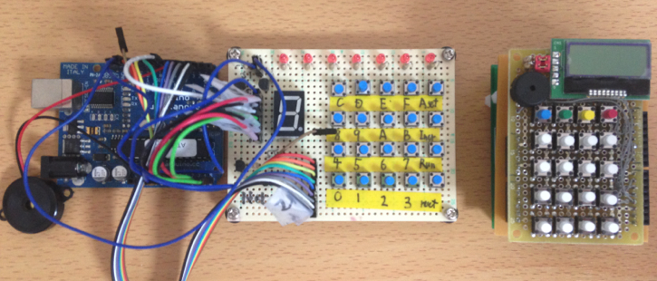
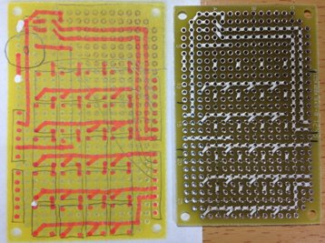
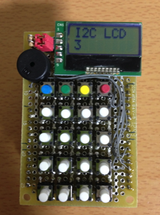
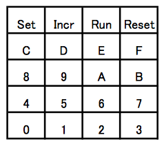
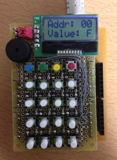

オリジナルの作成：2015/05/05

## 2代目GMC4
Arduino勉強会/0E-GMC4をArduinoで作ってみるで紹介したGMC4エミュレータ1号機ですが、 もっと小さくて、電池でも動くGMC4が欲しいということで、 lbeDuinoに電卓シールドを追加して、GMC4を動かしてみました。

1号機にくらべ、2号機はとてもコンパクトで、電池シールドを載せれば屋外でも 動かせます。



## 電卓シールドをつくる
いつものようにテクノペンで、以下の様に基板をつくりました。 ブザーをD3に接続するため、完成版は下図の結線とは若干異なっています。参考程度にしてください。



### 電卓シールドの動作確認
電卓シールドの動作確認に以下のスケッチを動かしてみました。

```C++
#include "lbed.h"
#include "AQCM0802.h"
#include "Keypad.h"

// D8番ピンSDA, D9番ピンSCL
AQCM0802     lcd(D8, D9);
// 圧電スピーカー
Tone          buzzer(D3);
// キーパッド

const byte rows = 5; // 5行
const byte cols = 4; // 4列
char keys[rows][cols] = {
  {'S','I','R','T'},
  {'C','D','E','F'},
  {'8','9','A','B'},
  {'4','5','6','7'},
  {'0','1','2','3'}
};
PinName     rowPins[rows] = {D12, D10, D7, D11, D2};
PinName     colPins[cols] = {D4, D5, D6, D13};
Keypad     keypad = Keypad( makeKeymap(keys), rowPins, colPins, rows, cols );

void setup() {
     lcd.setup();
     lcd.print("I2C LCD");
}

void loop() {
     char c =keypad.getKey();
     if (c) {
          buzzer.tone(440, 100);
          lcd.locate(0, 1);
          lcd.print(c);
     }
     wait_ms(100);
}
```

何とか上手く動いているようです。



## GMC4を動かす †
電卓シールドの確認ができたので、GMC4を動かしてみます。

キー配置は、以下の通りです。




### GMC4スケッチ
1号機では、LEDと7セグメントを使って表示していましたが、 2号機は、I2C版のLCD1個なので、表示制御は簡単です。

GMC4のスケッチは、以下の通りです。

```C++
#include "lbed.h"
#include <AQCM0802.h>
#include <Keypad.h>
#include "GMC4.h"

Display   display;
KeyBoard  keyBoard;
GMC4      gmc4(&keyBoard, &display);


byte lastCode;
byte addr;
byte mode;
byte key;

void setup() {
  Serial.begin(9600);
  display.setup();
  lastCode = gmc4.resetAll();
  display.setAddress(0);
  display.setValue(0xF);
  mode = PROGRAM;
}

void readProgram() {
  while(Serial.available()) {
    key = Serial.read();
    if (key >= '0' && key <= '9')
      lastCode = key - '0';
    else if (key >= 'A' && key <= 'F')
      lastCode = key - 'A' + 10;
    else if (key == 'T') {
      gmc4.longTone();
      lastCode = gmc4.reset();
      display.setAddress(gmc4.getAddr());
      display.setValue(lastCode);
      mode = PROGRAM; 
    }
    lastCode = gmc4.incr(lastCode);
    display.setAddress(gmc4.getAddr());
    display.setValue(lastCode);           
  }
}

void loop() {
  if (mode == PROGRAM || mode == STEP_LedOffBeepOff || mode == STEP_LedOnBeepOn) {

    if (Serial.available())
      readProgram();
    else
      key = gmc4.getKey();
   
    if (key != NO_KEY) {
      if ((key >= '0' && key <= '9') || (key >= 'A' && key <= 'F')) {
        addr = (lastCode > 0) ? lastCode << 4 : 0;
        lastCode = gmc4.getCode();
        addr += lastCode;
        display.setValue(lastCode);
      }
      else {
        switch (key) {
          case 'S':  // A SET
            lastCode = gmc4.addrSet(addr);
            display.setAddress(gmc4.getAddr());
            display.setValue(lastCode);
            break;
          case 'I':  // INCR
            if(mode == PROGRAM) {
              lastCode = gmc4.incr(lastCode);
              display.setAddress(gmc4.getAddr());
              display.setValue(lastCode);       
            }
            else if (mode == STEP_LedOffBeepOff || mode == STEP_LedOnBeepOn) {
              mode = gmc4.step();
              if (mode == STEP_LedOnBeepOn)
                display.setAddress(gmc4.getAddr());
            }
            break;
          case 'R':  // RUN
            switch (lastCode) {
              case 1:
                mode = RUN_LedOffBeepOff;
                break;
              case 2:
                mode = RUN_LedOnBeepOff;
                break;
              case 5:
                mode = STEP_LedOffBeepOff;
                break;
              case 6:
                mode = STEP_LedOnBeepOn;
                break;
              default:
                mode = RUN_LedOnBeepOn;
            }
            gmc4.reset();
            display.setAddress(gmc4.getAddr());
            gmc4.setMode(mode);
            break;
          case 'T':  // RESET
            gmc4.longTone();
            lastCode = gmc4.reset();
            display.setAddress(gmc4.getAddr());
            display.setValue(lastCode);
            mode = PROGRAM; 
            break;       
        }
        addr = 0;
      }
    }
    display.drawValue();
    display.drawAddr();
  }
  else {
    mode = gmc4.step();
  }
  gmc4.draw();
}
```

スケッチ全体をZipファイルにまとめてました。lbeDuinoと一緒に使ってください。

- [fileGMC4lbeDuino.zip](data/fileGMC4lbeDuino.zip)

### GMC4を動かしてみる。
例によって、15秒タイマーを動かしてみます。 Arduinoのシリアルモニターから以下の文字列を入力して、送信してください。

```
A189EC313E9B1F13F02E7F15T
```


