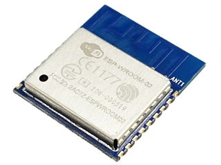
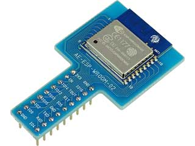
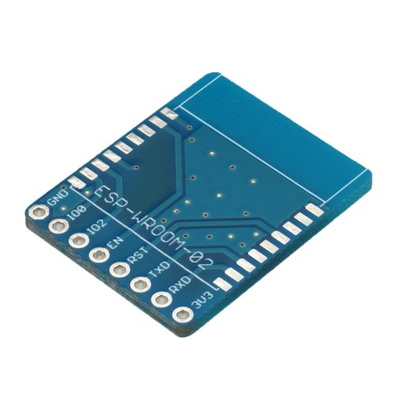
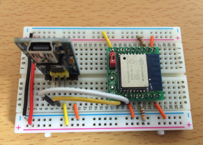
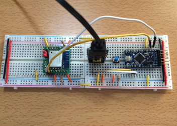
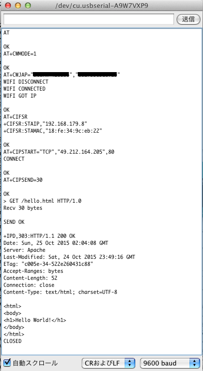
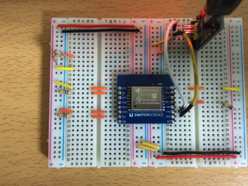
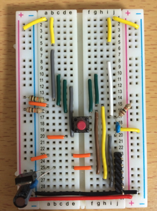
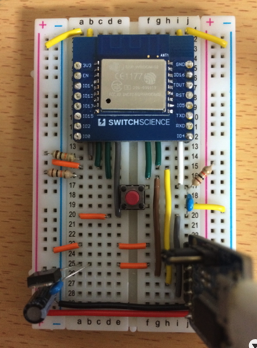

オリジナルの作成：2015/10/25

## お手軽IoTモジュールESP-WROOM-02
秋月で550円で購入できるWiFIモジュール ESP-WROOM-02*1は、 それ単体でもArduinoとして利用でき、アナログデータをサーバに送信することができます。



初めて使う時には、Ｗｉ－Ｆｉモジュール　ＥＳＰ－ＷＲＯＯＭ－０２　ＤＩＰ化キット（K-09758）



を使うか、スイッチサイエンスのESP-WROOM-02ピッチ変換済みモジュール《シンプル版》 （ボードのみ 162円） を使うと便利です。



## Arduinoで始めるWiFiモジュール
今回参考にしたサイトは、技適済みWi-Fiモジュール「ESP8266」で始めるIoT入門（ブレイクアウトボード実装編）です。

- http://tech-blog.cerevo.com/archives/859/

今回は、ESP-WROOM-02の取り付け基板として、上記サイトで紹介されていた CEREVOのブレークアウトボードを使いました。

最初は、ハンダ付けしたESP-WROOM-02が正しく動作するか確認します。



CEREVOのブレークアウトボードの端子の説明は、以下の通りです。


上記の資料を参考に以下の様にブレッドボードに接続しました。

 | CEREVO	 | ブレッドボード | 
 |---|---|
 | 1 3V3	 | 3.3V | 
 | 2 EN	 | 10KΩ抵抗で3.3V | 
 | 9 GND	 | GND | 
 | 11 RXD	 | USBシリアルのTXD | 
 | 12 TXD	 | USBシリアルのRXD | 
 | 13 GND	 | GND | 
 | 15 RST	 | 10KΩ抵抗で3.3V | 
 | 18 GND	 | GND | 

シリアルモジュールと USBシリアルモジュール  との接続は、以下の通りです。

 | CEREVO	 | USBシリアル | 
 |---|---|
 | 12 TXD	 | RXD | 
 | 11 RXD	 | TXD | 
 
USBシリアルモジュールをPCに接続し、Arduinoのシリアルモジュールを起動します。 通信速度は、115200 baudで「CRおよびLF」を選択します。

最初にATコマンドを入力して、OKが返ってくれば接続は大丈夫です。 次にESP-WROOM-02のファームウェアのバージョンをAT+GMRコマンドで確認しておきましょう。 



### 転送速度の変更
3.3Vで動作するArduino Pro Miniと接続する場合、115200 baudのデータ転送に対応できません。 そこで、ESP-WROOM-02の通信速度を9600 baudに変更します。

Arduinoのシリアルモニタから以下のコマンドを入力してください。

```
AT+UART_DEF=9600,8,1,0,0
AT+RST
```

このあとシリアルモニタの通信速度を9600 baudに変更してOKが表示されれば転送速度変更完了です。

## テストベンチの作成
Arduinoと接続してESP-WROOM-02の実験するために、以下の様にブレッドボードにテストベンチを組み立てました。

- PCからATコマンドを入力し、ESP-WROOM-02に転送
- メッセージを送信用のスイッチを追加


テストベンチ用のArduinoのスケッチは、以下の通りです。

```C++
#include <SoftwareSerial.h>

int sw_pin = 10;
int sTx_pin = 12;
int sRx_pin = 11;
int c;

SoftwareSerial  pc(sRx_pin, sTx_pin);

void setup() {
  pc.begin(9600);
  Serial.begin(9600);
  while (!Serial) {
    ; // wait for serial port to connect. Needed for Leonardo only
  }
  pinMode(sw_pin, INPUT);
  pc.println("ESP8266IF3tTest");
  delay(1000);
}

void loop() {
  if (pc.available()) {
    while((c = pc.read()) != -1)
      Serial.write(c);
  }
  if (Serial.available()) {
    while((c = Serial.read()) != -1)
      pc.write(c);
  }
  if (digitalRead(sw_pin) == LOW) {
    pc.println("SW pressed");
    delay(500);
  }
}
```

## 通信実験
さあWiFiモジュールを使って通信してみましょう。 一番簡単なテストは、Webサーバにアクセスすることです。 以下のSageサーバにHello World!を出力するページを作成しました。

- http://www15191ue.sakura.ne.jp/hello.html

まずは、このページを出力することを目標にしてみましょう。


### ESP-WROOM-02をルータに接続
最初にESP-WROOM-02をルータに接続するまでの手順を確認します。

- ESP-WROOM-02（今回は省略します）
- ATコマンドでOKが返ることを確認
- モード設定（Stationモード1）に設定
- ルータに接続
- 接続状況の確認（プログラム化では不要）

では順に試してみます。 シリアルモニタでATを入力してReturnキーまたは「送信」ボタンを押します。

```
AT

OK
```

次にAT+CWMODEコマンドでモードをStationモードの1にセットします。 AT+CWMODE=1と入力してください。

```
AT+CWMODE=1

OK
```

ルータに接続するために、AT+CWJAPコマンドを使います。 AT+CWJAP="ルータのSSID","ルータ接続パスワード"を入力してください。

```
AT+CWJAP= "ルータのSSID","ルータ接続パスワード"

WIFI DISCONNECT
WIFI CONNECTED
WIFI GOT IP

OK
```

AT+CIFSRコマンドで、接続状況を確認します。 AT+CIFSRと入力してください。

```
AT+CIFSR

+CIFSR:STAIP,"192.168.179.8"
+CIFSR:STAMAC,"18:fe:34:9c:eb:22"

OK
```

私の公開しているSageサーバのWebに接続します。 SageサーバのIPアドレスは、49.212.164.205です。 AT+CIPSTART="TCP","49.212.164.205",80と入力してください。

```
AT+CIPSTART="TCP","49.212.164.205",80
CONNECT

OK
```

AT+CIPSENDコマンドで送信するデータのバイト数を指定します。 今回は、"GET /hello.html HTTP/1.0\r\n\r\n\r\n"を送信するので、30バイトとなります。 AT+CIPSEND=30を入力してください。

つぎに送信する文字列を続けて入力してください。 GET /hello.html HTTP/1.0 次に、2回送信ボタンを押してください（HTTPプロトコルでヘッダと本文の区切りを表します）。

```
AT+CIPSEND=30

OK
> GET /hello.html HTTP/1.0
Recv 30 bytes

SEND OK

+IPD,303:HTTP/1.1 200 OK
Date: Sun, 25 Oct 2015 02:04:08 GMT
Server: Apache
Last-Modified: Sat, 24 Oct 2015 23:49:16 GMT
ETag: "c005e-34-522e260431c88"
Accept-Ranges: bytes
Content-Length: 52
Connection: close
Content-Type: text/html; charset=UTF-8

<html>
<body>
<h1>Hello World!</h1>
</body>
</html>
CLOSED
```

これで、無事SageサーバのWebからHello World!のHTMLが送れました。 とても簡単ですね。

Webサーバの場合は、自動的に接続が切れますが、 クライアントから接続を切る場合には、AT+CIPCLOSEコマンドを使います。

シリアルモニタに出力された一連の出力は以下の様になりました。



## スイッチサイエンスのピッチ変換モジュール
スイッチサイエンスの 
[ESP-WROOM-02ピッチ変換済みモジュール《フル版》 ](https://www.switch-science.com/catalog/2347/)
は、ブレッドボードの幅と同じサイズのため、以下のようにブレッドボードを2枚使うか、



以下の様にブレッドボードで配線をして、5V電源から3.3Vに変換して使ってください。




ESP-WROOM-02ピッチ変換モジュールとの結線は以下の通りです。

 | ESP-WROOM-02変換モジュール	 | ブレッドボード | 
 |---|---|
 | 3V3	 | VCC(3.3V) | 
 | EN	 | 10KΩでプルアップ | 
 | IO15	 | GNDに接続 | 
 | IO2	 | 10KΩでプルアップ | 
 | IO0	 | GND接続でDownloadモード、未接続でBootモード | 
 | RXD	 | USBシリアルのTXD | 
 | TXD	 | USBシリアルのRXD | 
 | RST	 | プルアップしたタクトスイッチに接続 | 
 | GND	 | GND | 

