オリジナルの作成：2015/11/01

# 0P-WiFiからIFTTTを使ってみる
## IFTTTについて
Makerが提供するIFTTT（イフトと発音するらしい）サービスを使うと ESP-WROOM-02モジュールからのデータを簡単にサーバに送り、 様々な処理を施すことができます。

詳しくは、スイッチサイエンスさんの 
[IFTTTにMaker Channelができました](http://mag.switch-science.com/2015/06/25/ifttt-maker-channel/)
を参照してください。

MakerのIFTTTに登録するとユーザIDにシークレットKEYが割り当てられます。 このKEYとイベントでIFTTTに情報を送ります。

### iPhoneアプリIF by IFTTT
iPhoneでMakerのIFTTTで作ったイベントを受け取るには、iPhoneアプリIF by IFTTTをインストールします。 詳しくは以下を参照してください。

- [IF by IFTTT](https://itunes.apple.com/jp/app/if-by-ifttt/id660944635?mt=8)

### Maker Channel画面
登録が終わり、http://ifttt.com/makerに行くと以下の様な画面になります。 Reconnect Channelを押すとKeyが再割り当てされますので、注意しましょう。

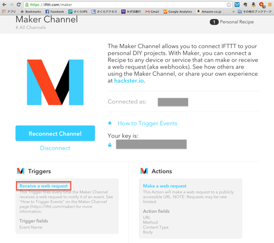

### トリガーイベントの作成
新しくイベントを作るには、Receive a web requestをクリックし、 Receive a web requestの「Create a new Recipe」ボタンを押すとレシピの作成画面に移動します。

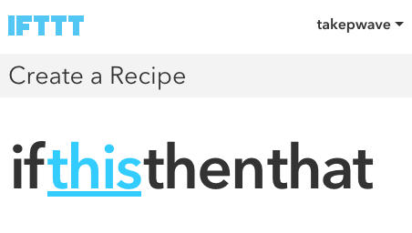

「this」をクリックし、Search ChannelsでMakerと入力し、 Makerのアイコンを選択します。

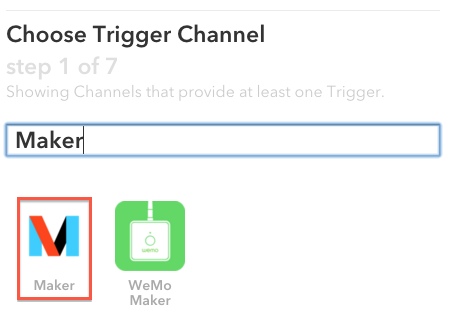

Choose a Trigger画面が表示され、Receive a web requestをクリックします。

以下の様なComplete Trigger Fields画面になりますので、ここでEvent Name を入力します。ここではLM35と入力しました。

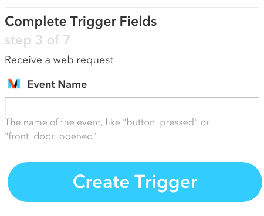

以下の画面でthatを選択します。

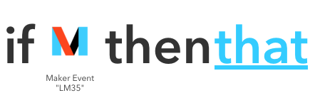

Choose Action Channelが表示されるので、iPhoneと入力し、iPhoneのIF Notificationを選択します。

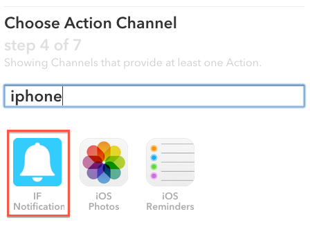

Choose an Action画面がでるので、Send a notificationをクリックします。

Complete Action Fields画面がでるので、Notificationに出すメッセージを入力します。 以下の様にキーワードを{{ }}で括って入力し、Create Actionボタンを押します。

```
温度センサLM35からイベント{{EventName}}と値{{Value1}}を受け取りました。 
```

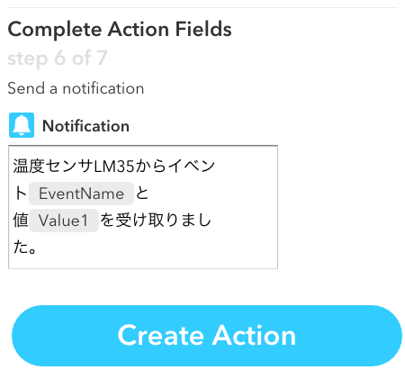

以下の最終確認でますので、Create Recipeボタンをクリックします。

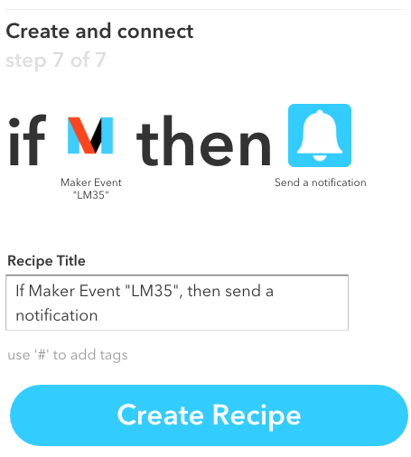

## レシピの確認
MakerのIFTTTで作ったイベントは、普通のHTTPプロトコルで送ることができるので、 ブラウザーからイベントのテストができます。

先ほど作ったLM35レシピを確認してみましょう。

ここではシークレットキーをSECRET_KEYで説明しますので、適宜置き替えてください。

- イベント名: LM35
- KEY: SECRET_KEY

ブラウザーから以下の様に入力します。

```
http://maker.ifttt.com/trigger/LM35/with/key/SECRET_KEY?value1=21.0
```

iPhoneに以下の様なNotificationが表示されます。

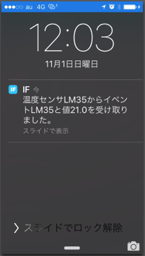


### IFTTTの受け付けるHTTP GET要求
MakerのIFTTTサーバは、
Arduino勉強会/0N-WiFiモジュールその１
で試したようなGET要求だけではエラーになることが分かりました。

調べたところ、以下の様にHTTPヘッダにHostとAcceptを追加すると上手くいきました。 

```bash
$ telnet 54.235.148.87 80
GET /trigger/test/with/key/SECRET_KEY HTTP/1.1
Host: maker.ifttt.com
Accept: */*
```


## ArduinoからLM35イベントを送る
スイッチサイエンスからESP-WROOM-02ピッチ変換済みモジュール《シンプル版》 が届いたので、 これを使って温度センサLM35から取得した温度をIFTTTイベントとして送ってみます。

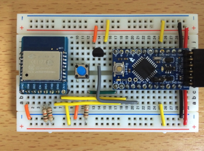

### ピッチ変換モジュールのハンダ付け
ESP-WROOM-02をピッチ変換モジュールにハンダ付けします。 裏面のジャンパーは、SJ1とSJ2をハンダでショートします。

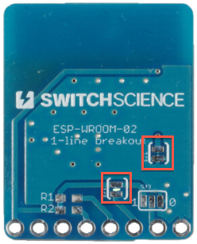

### ブレッドボードの組み立て
ブレッドボードにESP-WROOM-02とArduino Pro Mini(3.3V)とLM35を以下の様に配置します。 抵抗は10KΩを使いました。

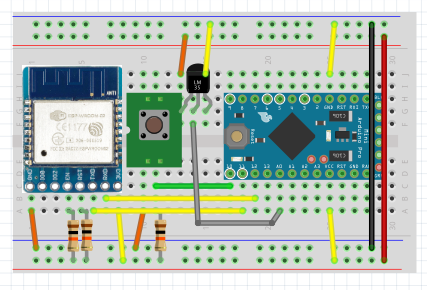


### スケッチ
Arduino勉強会/0O-WiFiモジュールその２
で作ったEspClientのatCipSendを 以下の様に修正し、シリアルもSoftwareシリアルでESP-WROOM-02で接続することに しました。この結果シリアルモニタの出力は文字化けしますが、この方が開発が簡単になります。

```C++
int  EspClient::atCipSend(char *uri, char *host) {
  sprintf(buf, "GET %s HTTP/1.1\r\nHost: %s\r\nAccept: */*\r\n%s", uri, host, CRLF2);
  int len = strlen(buf);
  char tmp[32];
  sprintf(tmp, "AT+CIPSEND=%d%s", len, CRLF);
  // uriを送る
  atCommand(tmp, 1000);
  esp.print(buf);
  // 応答を待つ
  waitForResponse();
}
```

LM35の温度を送るテスト用スケッチは、以下の通りです。
```C++
#include "EspClient.h"
#include <SoftwareSerial.h>

#define ST_SSID       "take-iPhone5s"
#define ST_PASSWD     "jpb67k42hgq5z"

#define SERVER_ADDR   "54.235.148.87"  // maker.ifttt.comのIPアドレス
#define SERVER_PORT   80

#define EVENT         "LM35"
#define SECRET_KEY    "ここにSECRET_KEYを入れてください"

int sw_pin = 10;
int sTx_pin = 12;
int sRx_pin = 11;
int lm35_pin = A0;
int lm35_value;

char  buf[128];
EspClient  esp(sRx_pin, sTx_pin);

void setup() {
  pinMode(sw_pin, INPUT);
  esp.begin(9600);
  esp.println("ESP8266IF3tTest");
  esp.atCwMode(STATION_MODE);
  esp.atCwJap(ST_SSID, ST_PASSWD);
}

void loop() {
  if (digitalRead(sw_pin) == LOW) {
    esp.println("SW pressed");
    // チャタリング防止
    delay(500);
    lm35_value = analogRead(lm35_pin);  // LM35から値を読み取る
    int temp10 = (int)((lm35_value*3.3)/1023.0*1000);  // 温度を0.1度までの整数に変換
    sprintf(buf, "temp=%d.%df", temp10/10, temp10%10);
    esp.println(buf);    
    esp.atCipStart(SERVER_ADDR, SERVER_PORT);
    sprintf(buf, "/trigger/%s/with/key/%s?value1=%d.%d", EVENT, SECRET_KEY, temp10/10, temp10%10);
    esp.atCipSend(buf, "maker.ifttt.com");      
  }
}
```

### 動作確認
起動後に、ボタンを押してイベントをIFTTTサーバに送ります。 シリアルモニタは以下の様に文字化けしますが、イベントはきちんと送られています。

```
ESP8266IF3tTest
AT+CWMODE=1

OK
AT+CWJAP="take-iPhone5s","jpb67k42hgq5z"

WIFI DISCONNECT
WIFDo wait onece
WIFI GOT IP

OK
SW pressed
temp=25.4f
AT+CIPSTART="TCP","54.235.148.87",80CONNECT

OK
AT+CIPSEND=112

busy p...

OK
> GE@½ÑÉ¥½cªz½[½¹©Q]©Íå¥aY©-Ùµ±ý±
±ÕÅëªr¢BBEõ(rjõkÑéj
ɹKÑÑѹ½µ5
ÁÑéRzRjÔÔ¨HHTÖ,¤¦L&H¬_]Y®Cá
SEND OK
```

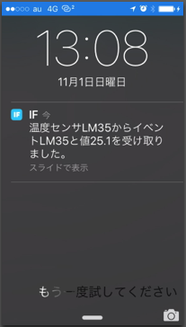

### スケッチのダウンロード
スケッチを以下からダウンロードできます。

- [ESPClientスケッチ EspIFTClient.zip](data/EspIFTClient.zip)

## 温度を記録する
つぎにGoogleのスプレッドシートに温度とイベントが発生時刻を記録してみましょう。

### IFTTTの定義
以下の様にActionでspreadsheetに行を追加するRecordLM35イベントを作成します。

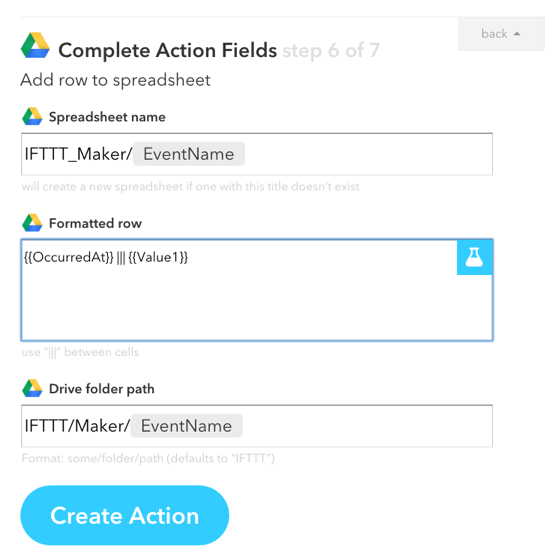

### ブラウザーでテスト
以下のURLをブラウザー入力します。

```
http://maker.ifttt.com/trigger/RecordLM35/with/key/<<ここにSECRET_KEYを入れる>>?value1=18.0
```

Googleドライブにアクセスすると、IFTTT/Maker/RecordLM35のディレクトリが作られ
IFTTT_MakerRecordLM35スプレッドシートに以下のような記録が作成されます。

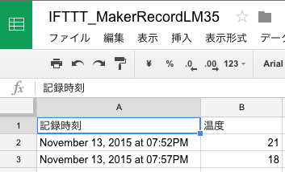
