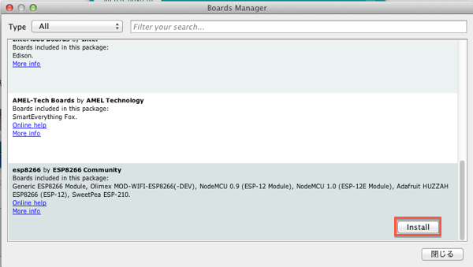
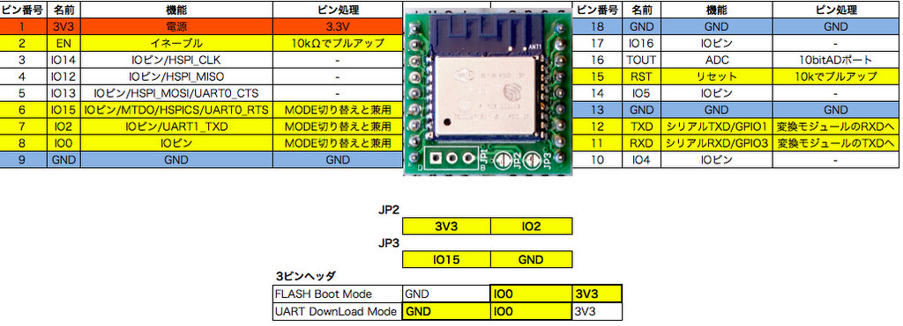
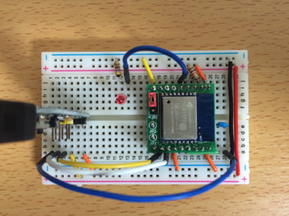
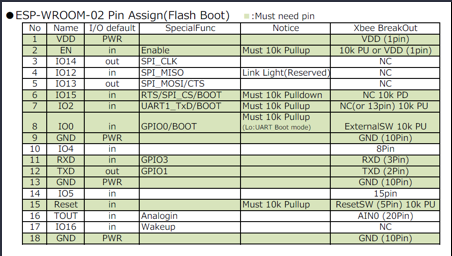
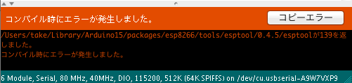
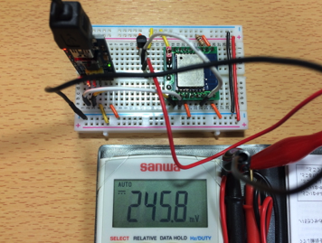
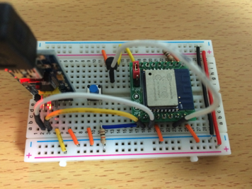
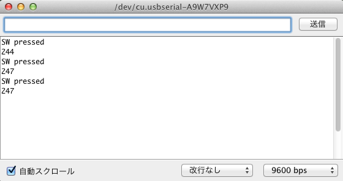
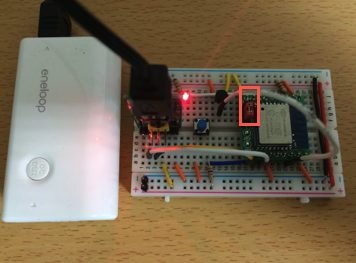
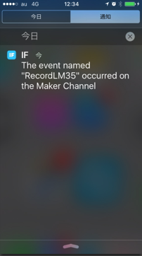

オリジナルの作成：2015/11/03

注意！ ESP8266を単体で使うと、初期に書き込まれているプログラムを上書きし、ATコマンドが使えなくなります。 WiFiを使う場合には、ESP8266のWiFi用APIを使用することになります。

# 0R-ESP8266を単体で使う
## ESP8266の使い方
ESP-WROOM-02に搭載されているESP8266は、単体としてもArduinoと同じように 使えることが以下のサイトに紹介されていました。

- [技適済み格安高性能Wi-FiモジュールESP8266をArduinoIDEを使ってIoT開発する為の環境準備を10分でやる方法](http://qiita.com/azusa9/items/264165005aefaa3e8d7d)

これに習って開発環境を整えてみます。

### ArduinoIDEを整備
esp8266をArduinoIDEで開発できるようにコミュニティが活動されています。

- https://github.com/esp8266/Arduino

esp8266の開発には1.6.4のArduino IDEを使いました。

- https://www.arduino.cc/en/Main/OldSoftwareReleases#previous

開発環境には少し古い1.6.4-673-g8cd3697（2015/05/22版）のバージョンを使用します。 Arduino IDEを起動し、Arduino Preferrencesを起動し、 Additional Boards Manager URLs: に以下のURLをコピーしてください。

```
http://arduino.esp8266.com/versions/1.6.4-673-g8cd3697/package_esp8266com_index.json
```

ツール→Boards Managerを選択し、スクロールするとesp8266が表示されるので、 これをクリックし、Installボタンを押します。



これで、ボードメニューの下に「Generic ESP8266 Module」が表示されますので、これを選択します。

### ブレッドボードでLチカを試す
ESP8266のピン配置をCerevo TechBlogさんのブログから再度引用します。



JP1は、GNDとIO0をショートさせてUART DownLoad Modeにします。 

シリアルモジュールと USBシリアルモジュール との接続は、以下の通りです。RSTとシリアルのDTRの間に0.1μFのコンデンサーを入れ、 ArduinoIDEの書き込み時にリセットが掛かるようにします。

 | ESP-WROOM-02	 | USBシリアル | 
 |---|---|
 | 12 TXD	 | RXD | 
 | 11 RXD	 | TXD | 
 | 15 RST  | 0.1μF経由	DTR | 
 



### ESP8266のピン配置
ねむいさんのブログからESP-WROOM-02のピンの仕様を引用します。



ESP8266用のArduinoについては、以下のマニュアルを参照できます。

- https://github.com/esp8266/Arduino/blob/master/doc/reference.md

ユーザが利用可能なピンは以下の通りです。

 | ESP-WROOM-02	 | Name	 | I/O	 | ArduinoIDE | 
 |---|---|---|---|
 | 4	 | IO12	 | INPUT, OUTPUT, INPUT_PULLUP, PWM, SDA	 | 12 | 
 | 5	 | IO13	 | INPUT, OUTPUT, INPUT_PULLUP, PWM	 | 13 | 
 | 10	 | IO4	 | INPUT, OUTPUT, INPUT_PULLUP, PWM	 | 4 | 
 | 14	 | IO5	 | INPUT, OUTPUT, INPUT_PULLUP, PWM, SCL	 | 5 | 
 | 16	 | TOUT	 | AnalogIn (0 - 1.0V)	 | A0 | 
 | 17	 | IO16	 | INPUT, OUTPUT, INPUT_PULLDOWN_16,PWM	 | 16 | 

### バージョン1.6.5ではコンパイルできない
バージョンではMac OSX10.7.5でコンパイルすると以下の様なエラーがでましたので、 Arduino IDE1.6.4とesp8266の開発環境も1.6.4を使用します。



```
/Users/ユーザ名/Library/Arduino15/packages/esp8266/tools/esptool/0.4.5/esptoolが139を返しました。
コンパイル時にエラーが発生しました。
```


### 定番LチカでI/Oをチェック
LEDと抵抗470Ωを直結してGNDに接続し、ESP-WROOM-02の5番ピン(Arduinoの13)に接続します。

これで、サンプルプログラムBlinkをアップロードすれば、Lチカの完成です。

上手く行ったら、以下のピンでも試してみてください。

- 4: Arduinoの12
- 5: Arduinoの13（最初に確認済み）
- 10: Arduinoの4
- 14: Arduinoの5
- 17: Arduinoの16

### 温度を測る
ESP-WROOM-02でのアナログリードについて、以下のサイトを参考にさせて頂きました。

- http://qiita.com/azusa9/items/26e74e4e0d5773ce9c41

注意：最初にリセットの配線をしていると、以下のSerialが正常に動作しません。 一度、LED点滅のテストが修了したら、リセットに使った配線は外して下さい。

USBシリアルのリセットを外したので、スケッチを書き込む時には一度 USBシリアルを外してから行ってください。

以下のスケッチでアナログ入力の値をみてみましょう。

```C++
#include <ESP8266WiFi.h>
extern "C" {
#include "user_interface.h"
}

void setup() {
  Serial.begin(9600);
  Serial.println("start");
}

void loop() {
  delay(1000);
  int val = system_adc_read();  //analogRead(A0);
  Serial.println(val);
}
```

analogRead(A0)を使うと外れた値（918）が返ってきました。 これを上記サイトのsystem_adc_read()に替えると、実測値に近い値（259）が テスターの値が245.8mVで259/1023x1.0V=0.253Vと近い値が返されます。




### タクトスイッチを追加
次に、タクトスイッチを追加して、ボタンを押したときだけ温度を測るように 修正します。

ブレッドボードに以下の様にタクトスイッチを追加します。 抵抗値は10KΩ、ESP-WROOM-02の10ピン（IO4）に接続します。



タクトスイッチを押すと、シリアルモニタにLM35の読み取り値が表示されます。



## IFTTTに温度を送る
準備が整ったで、LM35で読み取った温度をIFTTTに送ってみます。

スケッチは、以下の通りです。

```C++
#include <ESP8266WiFi.h>
extern "C" {
#include "user_interface.h"
}

#define ST_SSID       "SSID名"
#define ST_PASSWD     "SSIDのパスワード"
#define SERVER_NAME   "maker.ifttt.com"  
#define SERVER_PORT   80

#define EVENT         "RecordLM35"
#define SECRET_KEY    "ここにSECRET_KEYを入れてください"

int  sw_pin = 4;
int  led_pin = 13;
int  lm35_value;
char buf[128];
WiFiClient client;

void setup() {
  Serial.begin(9600);
  Serial.println("start");
  // ピンの初期設定
  pinMode(sw_pin, INPUT);
  pinMode(led_pin, OUTPUT);
  digitalWrite(led_pin, LOW);
  // WiFiの設定
  // WiFiクライアントモードに設定
  WiFi.mode(WIFI_STA);
  // WiFiへの接続
  WiFi.begin(ST_SSID, ST_PASSWD);
  // 接続が完了するまで、LEDを点滅
  while (WiFi.status() != WL_CONNECTED) {
    digitalWrite(led_pin, HIGH);
    delay(500);
    digitalWrite(led_pin, LOW);
    delay(500);
  }
  // 接続が完了したら、LEDを点灯
  digitalWrite(led_pin, HIGH);
}

void loop() {
  if (digitalRead(sw_pin) == LOW) {
    Serial.println("SW pressed");
    // チャタリング防止
    Serial.println(500);
    lm35_value = system_adc_read();  //analogRead(A0);
    int temp10 = (int)((lm35_value*1.0)/1023.0*1000);  // 温度を0.1度までの整数に変換
    sprintf(buf, "temp=%d.%df", temp10/10, temp10%10);
    Serial.println(buf);
    // 
    if (client.connect(SERVER_NAME, SERVER_PORT)) {
      Serial.println("connected");
      // makerのIFTTTにイベントを送る
      sprintf(buf, "GET /trigger/%s/with/key/%s?value1=%d.%d HTTP/1.1", EVENT, SECRET_KEY, temp10/10, temp10%10);
      client.println(buf);
      client.println("Host: maker.ifttt.com");
      client.println("Accept: */*");     
      client.println();
      Serial.println("Request has sent!");
    } 
  }  
}
```

ルータへの接続確認のために、LEDも付けました。 単独で動かすときには、JP1の2と3ピンにジャンパーをセットします。 



iPhoneには、IFTのイベントが発行されたとの通知が無事届きました。


