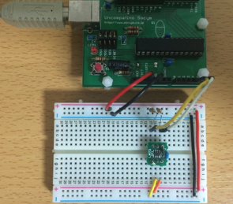
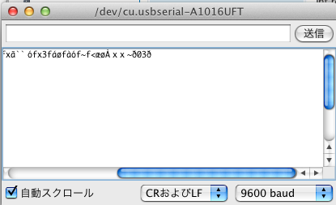
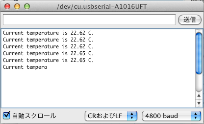
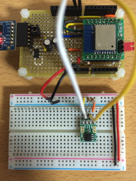
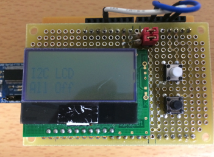
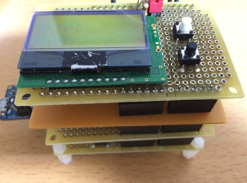

オリジナルの作成：2016/01/03

# 0T-ESP8266でI2Cを試す
## LM73
I2Cの動作確認は、いつも使っている温度センサーLM73でテストしてみることにします。 

LM73は入手が難しいとのご指摘がありますので、後ほど秋月で購入可能な温度センサーADT7410を使った例も示します。

プログラムの動作確認は自分が一番経験のある部品でするのが、良いと思うのです。


### ピン接続
ピンの配置1番ピンから反時計回りに採番

 | ピン番号	 | 機能	 | Arduinoのピン | 
 |---|---|---|
 | 1	 | 未使用	 | - | 
 | 2	 | GND	 | GND | 
 | 3	 | 3.3V	 | 3.3V
 | 4	 | SCL	 | A5 (SCL) | 
 | 5	 | 未使用	 | - | 
 | 6	 | SDA	 | A4 (SDA)  | 
 
Arduinoとの接続は以下の様になります。



### スケッチ
今回は、 初心者の電子の館 のスケッチを使わせて頂きました。 Wireライブラリは古いバージョンだったので、少し修正しました。

```C++
#include "Wire.h"

#define LM73_ADDR 0x4c          // 2進数なら 1 0 0 1   1 0 0

int ret;

void setup()                    // run once, when the sketch
{
  Wire.begin();
  Serial.begin(9600);
  delay(1000); // デバック用
 
  Wire.beginTransmission(LM73_ADDR);
  Wire.write((byte)0x04);  // Control/Status Registerを選択
  Wire.write(0x60);        // 14 bits modeにセットする
  ret=Wire.endTransmission();

  Wire.beginTransmission(LM73_ADDR);
  Wire.write(0x00);        // 次の通信のため温度レジスターをセットする。
  ret=Wire.endTransmission();
  delay(100); // 次の読み取りまで念のため0.1秒間をあける
 
}

void loop()                     // run over and over again
{

  int data=0 ;

  Wire.beginTransmission(LM73_ADDR);
  ret=Wire.requestFrom(LM73_ADDR, 2);
 
  data = 0;
  if (Wire.available()) {
    data = Wire.read();
  } else {
    Serial.println("Wire not available.");
  }
  if (Wire.available()) {
    data = (data << 8 )| Wire.read() ;
  }
   
  ret=Wire.endTransmission();
 
  printdata(data); // シリアルへ温度データを送る
  delay(2000);

}
void printdata(int data){
 
  int data2;
  int data3;
  float data_f;
 
  boolean negative=false;

  if (data < 0 ) {  // マイナスならbooleanにtrueをセットしプラスに変換
    negative=true;
    data = -data;
  }

  data2 = data >> 7; // 小数値切り捨て

  data_f = (float)(data >> 2 ) / 32;
  data_f = data_f - data2 ;

  data3 = data_f * 100 ;

  Serial.print ("Current temperature is ");
  if (negative) {
    Serial.print("-");
  }
  Serial.print(data2);
  Serial.print(".");
  Serial.print(data3/10);
  Serial.print(data3 % 10);
  Serial.println(" C. ");
}
```

どういうわけか、シリアルモニターは9600ボーの半分4800ボーにセットしないと 文字化けしました。



不思議なことに4800ボーにセットすると正しく読み取れます。



## ESP8266でLM73を使う
ArduinoでのLM73の動作が確認できたので、LM73をESP8266に接続して同じスケッチを動かしてみます。


### I2C用のピンについて
ネットで調べるとESP8266のI2C用のピンが色々変わっていて混乱していたところ、 macsbugさんの ESP8266 と I2C によると、0,2,4,5,12,13,14のすべてのピンの組み合わせでI2Cが動いたとの記事がありました。

今回は、SCL=IO14、SDA=IO4を使用することにしました。

 | ピン番号	 | 機能	 | ESP8266のピンNo | 
 |---|---|---|
 | 1	 | 未使用	 | - | 
 | 2	 | GND	 | 9 (GND) | 
 | 3	 | 3.3V	 | 1 (3.3V) | 
 | 4	 | SCL	 | 3(IO14) | 
 | 5	 | 未使用	 | - | 
 | 6	 | SDA	 | 10(IO4) | 
 
ESP8266のWireを使う場合、最初にI2Cに使用するピンをsetupでセットする必要があります。

```C++
void setup() {
     Wire.begin(4, 14);     // begin(SDA, SCL);のように指定
```

## ESP8266でLBEDを使ってみる
Arduino版LBEDは、I2CのWire関連をライブラリの外に出すことにしたので、 ESP8266版Arduino IDEでも使うことができるようになりました。

### 秋月で購入できる温度センサーADT7410を使う
ADT7410とESP8266との接続には、ESP8266版lbeDuinoのD8（SDA）とD9（SCL）と ADT7410のSDA、SCLをそれぞれ接続します。 ADT7410にモジュール内にプルアップの抵抗が付いていますが、今回はブレッドボードの4.7KΩの抵抗を付けてプルアップしています。



ADT7410のライブラリには、 Tom Kreycheさんがmbed用に公開されている ADT7410ライブラリ を使わせてもらいます。

ADT7410ライブラリの修正箇所は、ADT7410.hのmbed.hのインクルード文をlbed.hに変更するだけです。

```C++
// #include "mbed.h"
#include "lbed.h"
スケッチは、以下の様にします。たったこれだけでADT7410温度センサーが使えるようになります。

#include "Wire.h"
#include "lbed.h"
#include "ADT7410.h"

ADT7410 healthThemometer(D8, D9, 0x90, 400000);

void setup() {
  Wire.begin(4, 14); // Wire.begin();
  Serial.begin(9600);
  healthThemometer.setConfig(ONE_SPS_MODE);
}

void loop() {
  float temp = healthThemometer.getTemp();
  Serial.print("Current temperature is ");
  Serial.print(temp, 2);
  Serial.println(" C. ");
  wait_ms(1000);
}
```

### I2CLcdシールド
ESP8266版lbeDuinoは、使えるピンが少ないので、Arduinoピン変換シールドを使って D2をD12に、D3をD5に付け替えて実行します。



スケッチは、以下のとおりです。

```C++
#include "Wire.h"
#include "lbed.h"
#include "AQCM0802.h"

// D13番ピンにLEDを接続
DigitalOut     led(D13);
// D8番ピンSDA, D9番ピンSCL. ArduinoではハードI2Cを使用している。
AQCM0802     lcd(D8, D9);
// タクトスイッチ
DigitalIn     sw1(D5);
DigitalIn     sw2(D12);

void setup() {
     // ESP8266では、D8に4（SDA）, D9に14（SCL）が接続されている
     Wire.begin(4, 14);    // Wire.begin();     sw1.mode(PullUp);
     sw2.mode(PullUp);
     lcd.setup();
     lcd.print("I2C LCD");
}

void loop() {
     led = !led;
     lcd.locate(0, 1);
     
     if (!sw1) {
          lcd.print("SW1 On ");
     }
     else if (!sw2) {
          lcd.print("SW2 On ");
     }
     else {
          lcd.print("All Off");
     }
     wait_ms(1000);
}
```

### BME280温度・湿度・気圧センサ
I2CLcdが動けば、その他のI2Cセンサも動くはずです。



```C++
#include "Wire.h"
#include "lbed.h"
#include "AQCM0802.h"
#include "BME280.h"

// D13番ピンにLEDを接続
DigitalOutled(D13);
// D8番ピンSDA, D9番ピンSCL
AQCM0802lcd(D8, D9);
BME280sensor(D8, D9);

// タクトスイッチ
DigitalIn     sw1(D5);
DigitalIn     sw2(D12);

intlast_mode = 0;
chardegree = 0xdf;
void setup() {
     // ESP8266では、D8に4（SDA）, D9に14（SCL）が接続されている
     Wire.begin(4, 14);    // Wire.begin(); 
     sw1.mode(PullUp);
     sw2.mode(PullUp);
     lcd.setup();
     sensor.setup();
     lcd.locate(0, 0); lcd.print("BME280");
     lcd.locate(0, 1); lcd.print("Demo");
     wait_ms(2000);
}

void loop() {
     led = ! led;
     if (sw1 == 1) {
        if (last_mode == 0)
            lcd.cls();
        lcd.locate(0, 0);
        lcd.print(sensor.getTemperature(), 2);
        lcd.print(degree); lcd.print("C");
        lcd.locate(0, 1);
        lcd.print(sensor.getHumidity(), 2); lcd.print("%");
        last_mode = 1;
    }
    else {
        if (last_mode == 1)
            lcd.cls();
        lcd.locate(0, 0);
        lcd.print(sensor.getTemperature(), 2);
        lcd.print(degree); lcd.print("C");
        lcd.locate(0, 1);
        lcd.print(sensor.getPressure(), 2); lcd.print("hPa");
        last_mode = 0;
    }
    wait_ms(1000);
}
```

## ESP8266版LBEDソース
ESP8266版で使ったlbedライブラリのソースを添付します。 ユーザのArduino用ディレクトリ/librariesに以下を展開して、 lbeDuino, lbeDuinoUserをコピーしてください。

- [Arduino_lbed.zip](data/Arduino_lbed.zip)
