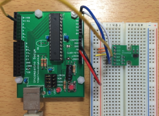
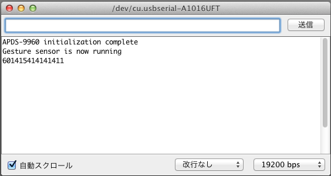
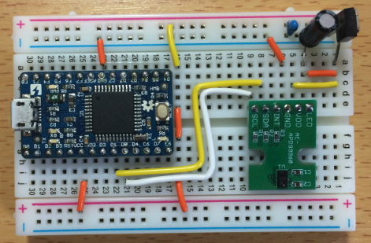

オリジナルの作成：2016/04/10

# 0U-ジェスチャースクロール

## 光学ジェスチャーセンサ
ジェスチャーセンサを調べて以下のサイトを見つけました。

- [自作ジェスチャセンサ](http://meerstern.seesaa.net/article/419830439.html)

そこで、秋月で600円で販売されているAPDS9960の存在を知りました。

- http://akizukidenshi.com/catalog/g/gK-09754/

[製造元のサイト](http://www.avagotech.co.jp/products/optical-sensors/integrated-ambient-light-and-proximity-sensors/apds-9960)
によると、このセンサはとても優れもので、以下の機能を持っています。

- 上下左右と接近・離反のジェスチャー検出
- 照度検出
- 接近センサ

このセンサの仕組は以下のサイトで丁寧に紹介されています。

- [EdisonとAPDS9960でジェスチャー認識](http://qiita.com/masato_ka/items/37a5e89602ce3d1332be)

また、Arduinoを使ったスケッチが以下のサイトに紹介されています。

- [ジェスチャーセンサ(APDS-9960)を動作させて見ます](http://www.geocities.jp/zattouka/GarageHouse/micon/Arduino/Gesture/APDS.htm)

## 子供たちにうけの良さそうな例題
APDS9960を使ってArduino勉強会に参加される子供たちに受けの良さそうな例題を探したところ、 以下のサイトを見つけました。

- Arduinoでも使えるジェスチャーセンサAPDS-9960

このサンプルには、Sparkfun版のライブラリが必要です。 Arduino IDEのメニューで「Include library」→「Manage library」を選択してライブラリマネジャーを開き、 そこでAPDS-9660を検索すると簡単にインストールできます。

また、以下のサイトからもダウンロードできます。

- https://github.com/sparkfun/SparkFun_APDS-9960_Sensor_Arduino_Library/

### Arduino Uno互換機3.3V版を使って例題を試す
APDS9960は3.3Vを使用するので、Arduino勉強会でも紹介した 作って遊べるArduino互換機 の3.3Vを使って動かしてみます。

Arduino Uno互換機3.3V版との接続は、以下の様にします。

 | Arduino	 | APDS-9960 | 
 |---|---|
 | 3.3V	 | LED | 
 | 3.3V	 | VDD | 
 | GND	 | GND | 
 | D2	 | INT | 
 | A4(SDA)	 | SDA | 
 | A5(SCL)	 | SCL | 
 


上記サイトのサンプルプログラムからGestureTestDueP5.inoの内容を新規スケッチにコピーし、 Arduino Uno互換機3.3V版に書き込みます。 シリアルモニターを開いて、センサの上に手をかざして左右上下に動かしてみると、 数値が1個ずつ表示されます。 これでセンサのジェスチャ機能が正常に動作することが確認できました。



シリアルモニターを閉じてProcessingを起動し、gesture.pdeを開きます。 Arduinoのシリアルポートで接続されたポートの番号（0始まりで何番目かをメモし、 setup関数のSerial.list()[n];のnの部分を変更します。

```C++
void setup() {
  size(800, 600);
  String arduinoPort = Serial.list()[3];
  port = new Serial(this, arduinoPort, 19200);
  background(0);
}
```

スケッチメニューのRunを実行するとウィンドウが表示され、センサの上に手をかざすと 画面の色が変わります。

## GestureScroll
ジェスチャーセンサAPDS9660の動作確認ができたので、 これを使って空中で手を動かすとスクロールキーをPCに送るキーボードを作ってみましょう。

Arduino Leonardには、ArduinoをマウスやキーボードにするためのクラスMouseとKeyboardが用意 されています。今回は
Arduino/ATmega32UのArduino化
で紹介したArduino Leonard互換ボード ATmega32u4を使ってブレッドボードに以下のような回路を組みました。




### APDS9960とATmega32u4との接続
LeonardではD2がSDA、D3がSCLとなっているので、スケッチを作成するときには注意してください。

以下にATmega32u4とAPDS9960の結線を示します。 

 | ATmega32u4のピン	 | Arduino Leonard	 | APDS9960 | 
 |---|---|---|
 | 3.3Vを生成	 | 3.3V	 | LED | 
 | 3.3Vを生成	 | 3.3V	 | VDD | 
 | 未接続	 | 未接続	 | INT | 
 | D1	 | D2	 | SDA | 
 | D0	 | D3	 | SCL | 

### 特殊キーコード一覧
以下のサンプルスケッチでは、上下の動きにはスクロールキーを、左右の動きにはカーソルキーを割り当てました。 ArduinoのKeyboardで使えるキーは、以下のサイトを参照してください。

- https://www.arduino.cc/en/Reference/KeyboardModifiers

### スケッチを描く
以下のスケッチをATmega32u4に書き込むとジェスチャースクロールの完成です。 ブラウザーで手を上下に動かしてみて下さい。

```C++
/****************************************************************
Shawn Hymel @ SparkFun Electronics May 30, 2014
modified by musashinodenpa 2015

Hardware Connections:
IMPORTANT: The APDS-9960 can only accept 3.3V!
 Arduino Pin  APDS-9960 Board  Function
 3.3V         VCC              Power
 GND          GND              Ground
 A4           SDA              I2C Data
 A5           SCL              I2C Clock
 2            INT              Interrupt
****************************************************************/
/**
 上記のサンプルを参考にキーボードに応用
 竹本　浩 (2016/04/09)
 対象のボードはスイッチサイエンスのATmega32u4ボード
 初期のボードで、基板のポート番号にATmega32u4のポート番号が記載されている
 
 5Vなので、APDS-9960へは3.3Vを供給
 ATmega32u4 Pin APDS-9960      Function
 Converted 3.3V VCC            Power
 GND            GND            Ground
 D1(SDA)        SDA            I2C Data
 D0(SCL)        SCL            I2C Clock
 D1(Interrup0)  INT            Interrupt
 */

#include <Wire.h>
#include <SparkFun_APDS9960.h>

// Global Variables
SparkFun_APDS9960 apds = SparkFun_APDS9960();
int isr_flag = 0;
uint8_t proximity_data = 0;

void setup() {

  // 割込の初期化（2番ピンはLeonardではSDAに割り当てられている）
  pinMode(2, INPUT_PULLUP);
  // キーボードになる前に0.5秒待つ
  delay(500);
  // キーボードの初期化
  Keyboard.begin();  

  // 割込処理の初期化
  attachInterrupt(0, interruptRoutine, FALLING);

  // APDS-9960の初期化
  apds.init();

  // ジェスチャーエンジン開始
  apds.enableGestureSensor(true);
  
}

void loop() {
  if ( isr_flag == 1 ) {
    detachInterrupt(digitalPinToInterrupt(2));
    handleGesture();
    isr_flag = 0;
    attachInterrupt(digitalPinToInterrupt(2), interruptRoutine, FALLING);
  }
}

void interruptRoutine() {
  isr_flag = 1;
}

void handleGesture() {
  if ( apds.isGestureAvailable() ) {
    // ジェスチャーに応じてカーソル移動とスクロールを実行する
    int c = apds.readGesture();
    switch (c) {
    case 1:
      Keyboard.write(KEY_RIGHT_ARROW);
      break;
    case 2:
      Keyboard.write(KEY_LEFT_ARROW);
      break;
    case 3:
      Keyboard.write(KEY_PAGE_UP);
      break;
    case 4:
      Keyboard.write(KEY_PAGE_DOWN);
      break;
    default:
      ;
    }
  }
}
```

