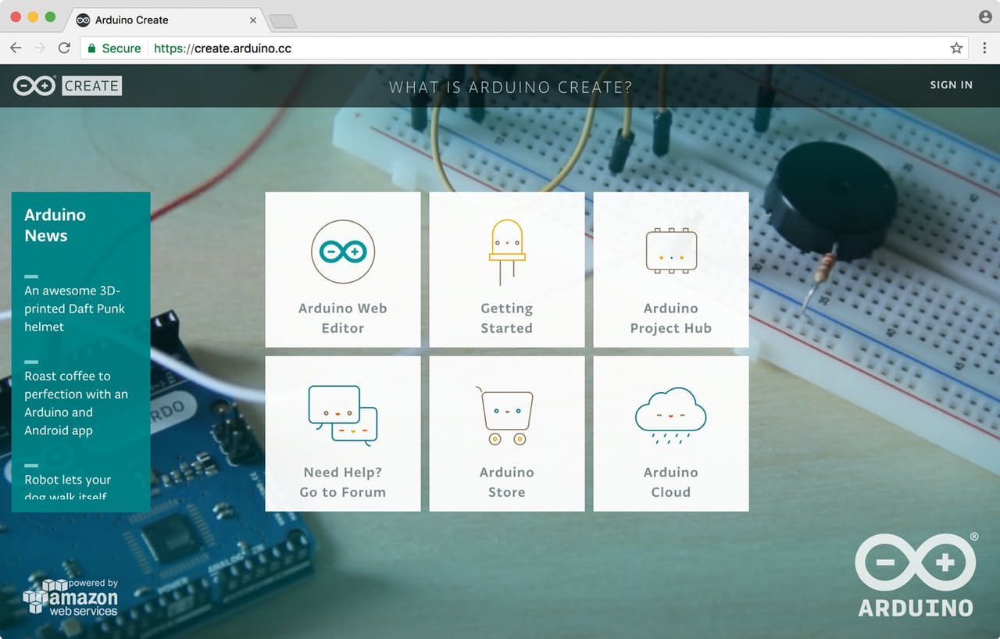
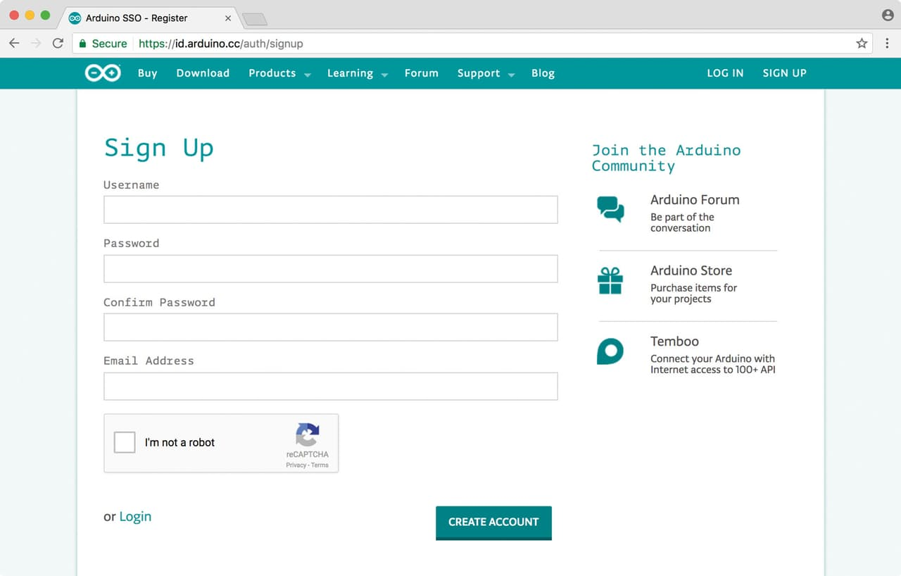
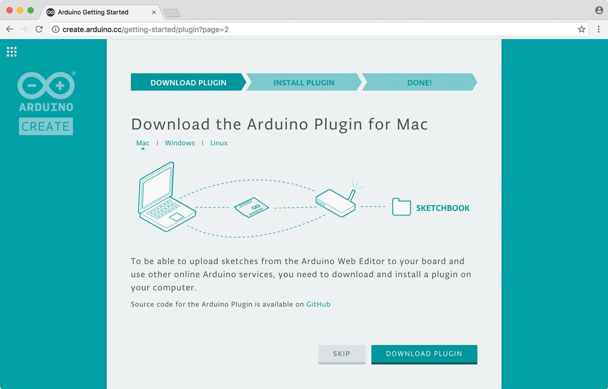
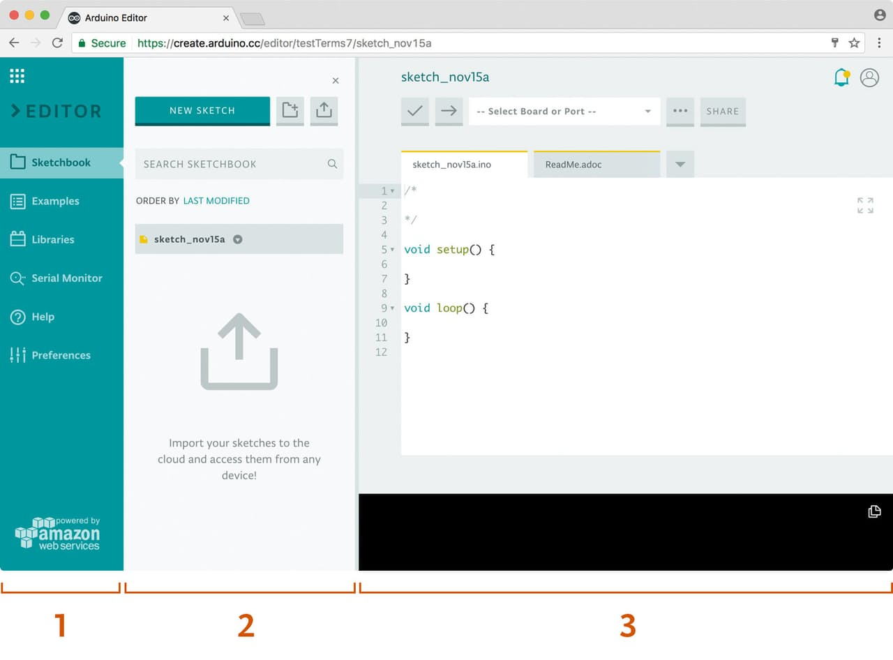

## ArduinoのWebEditorの紹介
ArduinoのプログラミングがWebブラウザ上でできるArduino Web Editorを紹介します。

Arduino Web Editorを使うには、以下のサイトにアクセスすると以下の画面が表示されます。
- https://create.arduino.cc/



「Arduino Web Editor」をクリックすると以下のユーザ登録（Sign Up）画面が表示されます。



- Username: 自分の好きなユーザ名（アルファベットと半角数字）で入力
- Password: パスワードを入力
- Confirm Password: 確認のために同じパスワードを入力
- Email Address: メールアドレスを入力
- I'm not a robotの左の□にチェック
- 「CREATE ACCOUNT」をクリックします

入力したメールアドレスに送られてきますので、リンク（URLアドレス）をクリックして登録を有効にします。


### Arduino Web Editor pluginのインストール
ユーザ登録が完了したら、以下のURLに入ってください。
- https://create.arduino.cc/editor

利用条件を受け入れ（Accept）ます。

次にスケッチをArduinoに書き込むために、Arduino Web Editor Pluginをインストールします。




## Arduino Web Editorを使ってみる
ログインが完了すると以下のArduino Web Editor画面が表示されます。

左端のカラムはナビゲーション用です。
- Your Sketchbook: ユーザが作成したスケッチブックを開きます
- Examples: サンプルスケッチ（読み込み専用）を開きます
- Libraries: スケッチ含むライブラリを指定します
- Serial monitor: シリアルモニタを開きます
- Help: ヘルプ画面（英語）
- Preferences: オプション（文字サイズ、色等）の設定画面

上記のメニューを選択すると2列目のカラムに選択画面が表示されます。

第3列目にスケッチを描く画面が表示されます。




## 内蔵Lチカ
内蔵のLEDを点滅させるLチカを作って見ました。

自分の作ったスケッチで「SHARE」ボタンを押すと、他の人と共有するためのURLが表示されます。
これを開くと以下の様な画面が表示されます。

```python
%%HTML
<iframe src="https://create.arduino.cc/editor/takepwave/66734154-6cce-4de7-96a1-1202ac1f8d29/preview?embed" style="height:510px;width:100%;margin:10px 0" frameborder="0"></iframe>
```
