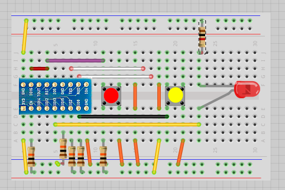
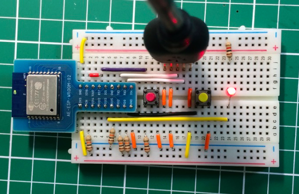
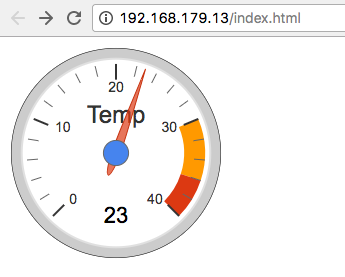
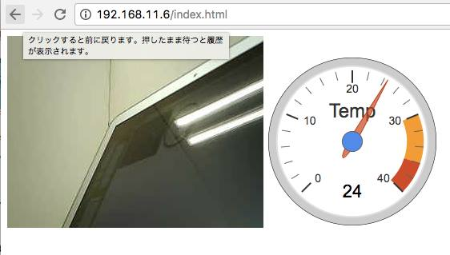
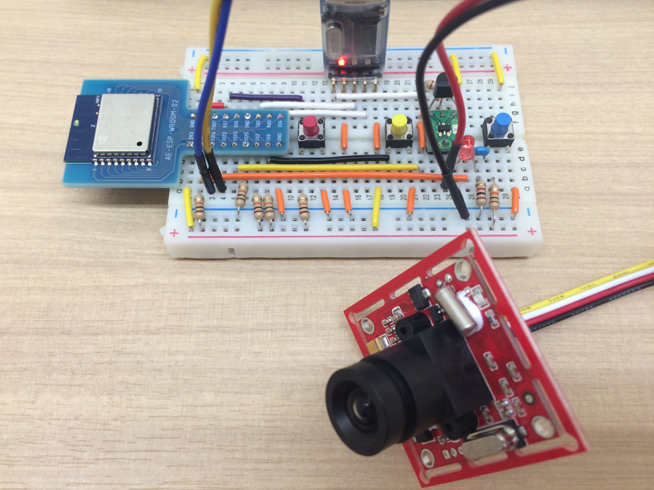

# 0Y-ESP8266_Part_II

## トラ技2017/03号のおさらい
トラ技の2017/03のESP8266の特集記事は、消費電力を抑えることと、
既存のツールとの組み合わせをうまく使った例だと思います。

ここでは、以下の処理をトラ技の2017/03の特集記事を参考に試してみます。
- Deep Sleepからの復帰
- UDPブロードキャストを使った通知
- 消費電力を抑えたカメラモジュールの使い方
- data upload plugin を使ったWebサーバの構築
- dockerを使ったデータ収集


## 開発環境インストール
前回から時間が経っているので、環境を再構築しました。
ArduinoIDE 1.8.1、ESP8266は安定バージョンをインストールしました。

Arduino IDEを起動し、Arduino Preferrencesを開き、
Additional Boards Manager URLs: に以下のURLをコピーしてください。
```
http://arduino.esp8266.com/stable/package_esp8266com_index.json
```


### ブレッドボードの作成
最初にLチカからはじめましょう。



秋月のAE-ESP-WROOM-02モジュールを使って、ブレッドボードに結線します。
一度、このような基本形を作っておくと次に部品を追加するときに楽になります。
私の場合、シリアルにはaitendoで買ったPL2303を使って３．３Vを供給しています。


### 例題を使った動作確認
最近のArduinoの例題は、LEDのピン番号が番号がLED_BUILTINとなっているので、
昔のスケッチのように13番ピンを#define文で定義します。

```C++
#define LED_PIN 13

void setup() {
  pinMode(LED_PIN, OUTPUT);     
}

void loop() {
  digitalWrite(LED_PIN, LOW);   
  delay(1000);                  
  digitalWrite(LED_PIN, HIGH);  
  delay(1000);                  
}  
```

Arduino IDE に ESP8266 のボードマネージャーを設定する
ツール > マイコンボード で、Generic ESP8266 Module を選択します。
それから、 Reset Method を nodemcu に設定します。

Blinkをコンパイル、BOOT（黄色）ボタン、RESET（赤）の順で押し、RESETを離してから書き込み書き込みが開始されたらBOOTも離します。

Arduino IDEに...が表示され、書き込みの経過が%で表示されます。

```
最大434160バイトのフラッシュメモリのうち、スケッチが222249バイト（51%）を使っています。
最大81920バイトのRAMのうち、グローバル変数が31640バイト（38%）を使っていて、ローカル変数で50280バイト使うことができます。
Uploading 226400 bytes from /var/folders/jx/7nsrq4lw8xj553006s7bvdb80000gn/T/arduino_build_172714/Blink.ino.bin to flash at 0x00000000
................................................................................ [ 36% ]
................................................................................ [ 72% ]
..............................................................                   [ 100% ]
```　

まずは、Lチカの動作を確認しましょう。



スケッチは以下に置きました。
- ESP8266/Blink

## WiFiの例題
WiFiのテストは、nc(net cat)コマンドを使用します。ncは、TCP/UDPの送・受信を簡単に行うことができるツールです。

ncの使い方は、以下のサイトを参考しました。

- [ncnetcatコマンドで覚えておきたい使い方8個](https://orebibou.com/2015/11/ncnetcat%E3%82%B3%E3%83%9E%E3%83%B3%E3%83%89%E3%81%A7%E8%A6%9A%E3%81%88%E3%81%A6%E3%81%8A%E3%81%8D%E3%81%9F%E3%81%84%E4%BD%BF%E3%81%84%E6%96%B98%E5%80%8B/
)

```bash
$ nc 
usage: nc [-46AacCDdEFhklMnOortUuvz] [-K tc] [-b boundif] [-i interval] [-p source_port] [--apple-delegate-pid pid] [--apple-delegate-uuid uuid]
       [-s source_ip_address] [-w timeout] [-X proxy_version]
       [-x proxy_address[:port]] [hostname] [port[s]
```

サーバとしてデータを受信する場合、-lオプションを付けます。UDPの待ち受けの場合には、-ulを付けます。
ユーザが自由に使えるポート番号は、49152番～65535番（ダイナミックポート）なので、今回は50000番を使うことにします。

ESP8266はブロードキャストでメッセージを送るので、ネットワークアドレスを調べる必要はありません。

```bash
$  nc -ul -w 0 50000
Hello World!
$
```

トラ技のサンプルを参考にUDPClientのスケッチは、ブロードキャストを255.255.255.255にしました。これを実行すると上記のターミナルに"Hello World!"と表示されるはずです。

```C++
#include <ESP8266WiFi.h>
#include <WiFiUdp.h>

const char *ssid =  "WiFiのSSID";
const char *password =  "WiFiのパスワード";

#define SENDTO "255.255.255.255"
#define PORT 50000

void setup() {
    Serial.begin(115200);
    delay(500);

    WiFi.begin(ssid, password);
    WiFi.mode(WIFI_STA);
    Serial.println();
    Serial.println();
    Serial.print("Wait for WiFi... ");

    while(WiFi.status() != WL_CONNECTED) {
        Serial.print(WiFi.status());
        Serial.print(".");
        delay(500);
    }
    Serial.println("");
    Serial.println("WiFi connected");
    Serial.println("IP address: ");
    Serial.println(WiFi.localIP());
    delay(500);
}

void loop() {
    WiFiUDP udp;

    udp.beginPacket(SENDTO, PORT);
    udp.println("Hello World!");
    udp.endPacket();
    delay(5000);
}
```

## dockerを使う
WindowsユーザがUNIXツールを使う場合には、dockerが便利です。
dockerのインストール方法は、以下のサイトを参考にしてください。
- [Docker for Windows のインストール](http://docs.docker.jp/windows/step_one.html)

dockerは、仮想マシン環境を使うツールですが、サイズの小さいalpineのイメージを使えば、簡単にUNIXの環境を利用することができます。

更にalpineのサイズは、3.98MBと非常にコンパクトです。

```bash 
$ docker images alpine
REPOSITORY          TAG                 IMAGE ID            CREATED             SIZE
alpine              latest              88e169ea8f46        2 months ago        3.98 MB
```

dockerを使ってUDPのメッセージを出力するには、以下の様に入力します（$はプロンプト）。
-p 50000:50000/udp は、ホストマシンの50000番ポートに届いたUDPメッセージを仮想マシンの
50000番に転送するように指定しています。

```bash
$ docker run -it --rm -p 50000:50000/udp alpine:latest /bin/sh -c "nc -ul -p 50000"
```


## SPIFFS版Helloサーバ
ESP8266には、フラッシュをメモリカードのように使えるSPIFFSというファイルシステム
が提供されています。
さらに、PCのdataフォルダ以下をSPIFFSにアップロードするプラグインを使用すると
簡単にESP8266にPCのファイルをアップロードすることができます。

- https://github.com/esp8266/arduino-esp8266fs-plugin

アップロードは、BOOTボタンを押しながら、RESETボタンをクリックし、「EPS8266 sketch data upload」を選択します。

以下のHello world!を出力するだけのindex.htmlを使ってSPIFFS版Helloサーバを動かして見ましょう。

```html
<html>
<body>
  <h2>Hello World!</h2>
</body>
</html>
```

Arduinoのスケッチフォルダにdataという名前でフォルダを作成し、そこにアップロードしたいファイルやフォルダをコピーします。

Helloサーバのloopは、以下の様になります。
```C++
void loop() {
  // クライアントからの接続要求があるかチェック
  WiFiClient client = server.available();
  if (!client) {
    return;
  }
  
  // クライアントからのHTTP要求を待つ
  Serial.println("new client");
  while(!client.available()){
    delay(1);
  }

  // リクエスを読み込む
  String req = client.readStringUntil('\r');
  Serial.println(req);
  client.flush();

  // index.htmlの内容を返す
  File f = SPIFFS.open("/index.html", "r");
  if (!f) {
      Serial.println("file open failed");
      return;
  }  
  Serial.println("====== Reading from SPIFFS file =======");

  while(f.available()) {
    String line = f.readStringUntil('\n');
    client.print(line);
  }
  f.close();
  
  delay(1);
  Serial.println("Client disonnected");
}
```

Helloサーバの完全なスケッチは、以下にあります。
- ESP8266/WiFiHelloServer


## ゲージで温度を表示してみよう
SPIFFSにファイルをアップできると、javascriptを使った凝った表示可能になります。
Google APIのゲージは、インターネットに繋がっていないと使えないため、
以下に紹介されているD3.js版のゲージを使って温度を表示して見ます。

- [google style gauges using javascript d3.js](http://bl.ocks.org/tomerd/1499279)



ゲージを表示するjavascriptは、以下の様にします。

```javascript
        <script>                                        
            var gauges = [];            
            function createGauge(name, label, min, max)
            {
                var config = 
                {
                    size: 240,
                    label: label,
                    min: undefined != min ? min : 0,
                    max: undefined != max ? max : 100,
                    minorTicks: 5
                }               
                var range = config.max - config.min;
                config.yellowZones = [{ from: config.min + range*0.75, to: config.min + range*0.9 }];
                config.redZones = [{ from: config.min + range*0.9, to: config.max }];                
                gauges[name] = new Gauge(name + "GaugeContainer", config);
                gauges[name].render();
            }       
            function createGauges()
            {
                // ゲージは複数作成することができる
                createGauge("temperature", "Temp", -0, 40 );
            }           
            function updateGauges()
            {
                $.getJSON("getTemp", function(data){    
                    $.each(data, function(key) {
                        gauges[key].redraw(data[key]);
                    });
                });
            }                        
            function initialize()
            {
                createGauges();
                // 温度の更新は２秒ごと
                setInterval(updateGauges, 2000);
            }
            updateGauges();
        </script>
```

温度センサには、LM35を使いました。ESP8266のアナログの読み込みは、system_adc_readを使用します。

スケッチのloopは、以下の様になります。温度は、/getTemp要求にJSON形式で返します。
```C++
void loop() {
  // クライアントからの接続要求があるかチェック
  WiFiClient client = server.available();
  if (!client) {
    return;
  }
  // クライアントからのHTTP要求を待つ
  Serial.println("new client");
  while(!client.available()){
    delay(1);
  }
  // リクエスを読み込む
  String req = client.readStringUntil('\r');
  Serial.println(req);
  // HTTP要求からURIを取り出す
  char *uri = getReqURI(req);
  if (strcmp(uri, "/getTemp") == 0) {
    float t = ((float)system_adc_read())/1023.0*100;
    // float t = 21.0;
    client.print("{ \"temperature\" : ");
    client.print(t);
    client.println("}");
  }
  else {
    // Prepare the response
    File f = SPIFFS.open(uri, "r");
    if (!f) {
        Serial.println("file open failed");
        return;
    }  
    Serial.println("====== Reading from SPIFFS file =======");  
    while(f.available()) {
      if (!client.connected())
        break;  // 切断されたら転送終了
      int len = f.read(line, sizeof(line));
      if (len > 0)
        client.write((const uint8_t*)line, len);
      delay(1);  // WDT対策
    }
    f.close();   
  }
  client.flush();
  client.stop();
  
  delay(1);
  Serial.println("Client disonnected");
}
```

完全なスケッチは、以下に置いてあります。
- ESP8266/WiFiWebServer （カメラ取り込みも含んでいます）


## カメラも付けて完成
トラ技のサンプルでは、カメラの取り込みタイミングをUDPで送り、PCからwgetで取り込むというアイデアはすごいなぁと思いました。

ここでは、先の温度計にカメラを取り付けた例をお見せしておしまいにします。



ただし、USBからの電源供給でたくさん繋げすぎたのか、立ち上がりが不安定になりました。


