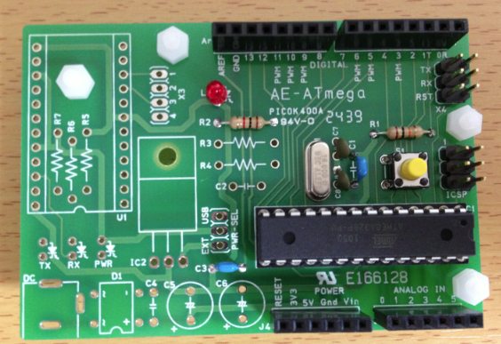
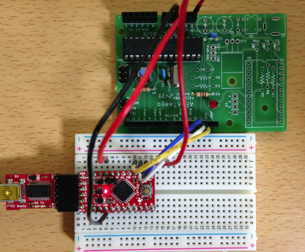
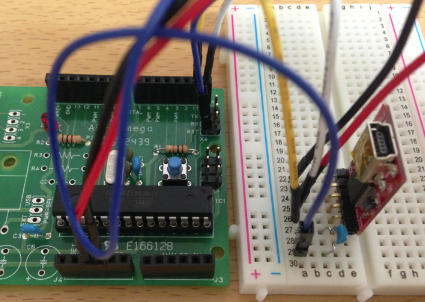
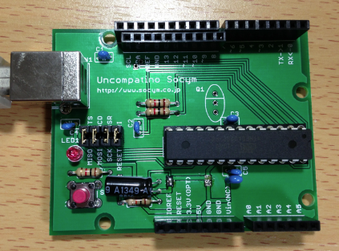
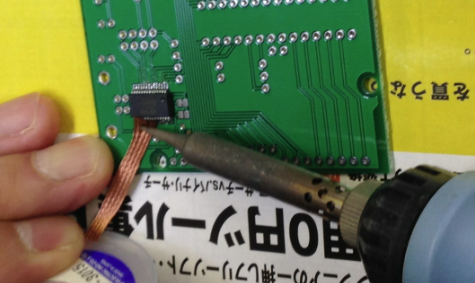
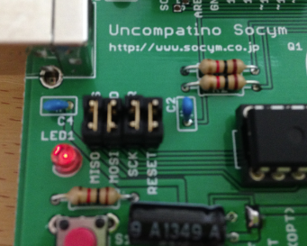
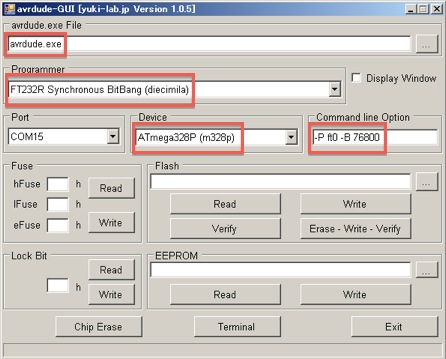
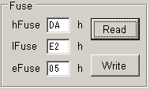
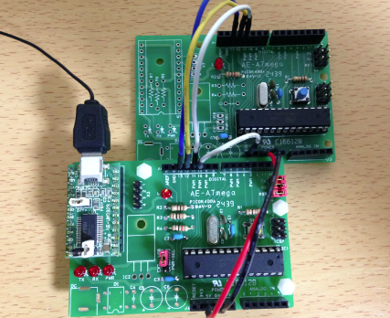

オリジナルの作成：2015/01/04

ここでは、以下のArduinoの作り方を紹介しています。

- Arduino勉強会/05-声を出してみるで使った秋月のATMegaボードでArduinoを作ってみましょう。
- Uncompatino 3.3V版

##  追加の部品
追加で用意する部品は、以下の通りです。

| No. | 品名| 秋月通販コード | 数量 | 価格 |
|---|---|---|---|---|
| 1 | ATmega328P | I-03142 | 1 | 250円 | 
| 2 | セラミック発振子 | P-00525 | 1 | 35円 | 
| 3 | 赤色 3mm LED | I-00562 | 1 | 100個入りで 350円 | 
| 3 | タクトスイッチ | P-03649 | 1 | 10円 | 
| 4 | ピンヘッダ 2x3 | C-00082 | 2 | 2x40で50円 | 
| 5 | 1KΩ抵抗 | R-25102 | 1 | 100個入りで100円 | 
| 6 | 10KΩ抵抗 | R-25103 | 1 | 100個入りで100円 | 
| 7 | 0.1μFセラミックコンデンサー | P-00090 | 3 | 10個入りで100円 | 

部品を以下の様にハンダ付けして、セットしてください。
(画像ではセラミック発信子の代わりに水晶発振子を使っています。)

## マスターのArduinoにArduinoISPを書き込む
買ってきたままのAtmega328PをArduinoとして使うには、Arduino用のブートローダ を書き込む必要があります。

Arduinoにはブートローダを書き込むためのスケッチが最初から提供されているので、 これを使います。

- ファイル→スケッチの例→ArduinoISPを選択し、ArduinoISPを書き込み用Arduino（親と記す）に書き込みます。

スケッチの書込が終わったら、以下の様に書き込み用Arduino（子と記す）とマスターを以下のように接続します。

 | 親Arduino | 子Arduino | 
 |--|--|
 | D10	 | RESET | 
 | D11	 | D11 | 
 | D12	 | D12 | 
 | D13	 | D13 | 
 | 5V	 | 5V | 
 | GND	 | GND | 
 
 
 
 ### 書き込み手順
書き込みのターゲットボードと書込装置を選択します。

- ツール→マイコンボード→ターゲットのMPUを持つマイコンボード（今回はArduino Uno）
- ツール→書込装置→Arduino as ISP

ブートローダを書き込みます。

- ツール→ブートローダを書き込む

### 子Arduinoの動作確認
ProtoSnap Pro MiniのUSBシリアルを使って、新しく作ったArduino（Arduino Pro Mini互換）にスケッチを書き込んで、 動作を確認してみます。 *2

ArduinoとUSBシリアルの接続は以下の通りです。

 | Arduino	 | USBシリアル | 
 |---|---|
 | 0: Rx	 | TXO | 
 | 1: Tx	 | RXI | 
 | RST	 | DTR + 0.1μFのコンデンサー | 
 | 5V	 | VCC | 
 | GND	 | GND | 
 
 

### スケッチの書き込み
Blinkスケッチを開きます。

- ファイル→スケッチの例→01 Basic→Blinkを選択

書込装置をAVR ISPにもどして、書き込みます。LEDが点滅すれば完成です。

- ツール→書込装置→AVR ISP
- ファイル→マイコンボードに書き込む

## Uncompatino 3.3V版
mini SDカード等多くの部品が3.3Vで稼働するようになり、Arduinoの5Vで使用するには レベルコンバータが必要になり、ちょっと不便なので 
[作って遊べるArduino互換機 ](http://www.amazon.co.jp/dp/4883378802/)
で紹介されているUncompatino 3.3V版を作ってみました。

必要な部品は以下の通りです。

 | 品名	 | 秋月コード	 | 数量	 | 備考 | 
 |---|---|---|---|
 | 『作って遊べるＡｒｄｕｉｎｏ互換機』パーツセット	 | K-06906	 | 1	 |  | 
 | ＵｎｃｏｍＰａｔｉｎｏ基板　（基板単品販売）	 | P-07487	 | 1	 |  | 
 | ＮＪＭ２８４５ＤＬ１－３３	 | I-02247	 | 1	 | 4個入り
 | 電解コンデンサー100μＦ	 | P-03122	 | 1	 |  | 
 | セラミックコンデンサー0.33μＦ	 | P-04227	 | 1	 | 10個入り | 

### 組み立て
一番の難関がFT232RLのハンダ付けでしょう。

以下の様にすると割と楽にできます。

- メンディングテープ等でFT232RLを固定
- フラックスをFT232RLのピンの周辺に塗る
- ハンダで一カ所だけを固定してテープを外し、位置を確認
- ブリッジができても構わず、おもいっきりピンにハンダを付ける
- 吸い取り線に半田こてを当てたまま、FT232RLから離れるようにずらす

他の部品のハンダ付けは、背の引く物から付けます。抵抗値や取り付け向きに気を付けましょう。

- 抵抗
- セラミックコンデンサー
- ICソケット
- 電解コンデンサー
- LED, タクトスイッチ、ピンソケット
- USBソケット

### ブートローダの書き込み
ブートローダの書き込みに使用するBitBangをまとめて以下のZIPファイルに入れました。

- [fileBitBang.zip](data/fileBitBang.zip)

最初にすべてのジャンパーを結線します。

次にavrdude-GUI.exeを起動し、

 | 項目名	 | 設定方法 | 
 |---|---|
 | avrdude exe File	 | avrdude.exeを入力 | 
 | Programmer	 | FT232R Synchronous BitBang(diecimila)を選択 | 
 | Port	 | Uncompatinoのシリアルポート | 
 | Device	 | Atmega328P(m328p)を選択 | 
 | Command line Option	 | -P ft0 -B 76800 | 

FuseのReadボタンを押すと現在の設定でます。以下の設定を入力し、Writeを実行します。

ブートイメージの書き込みは、Flashに Arduinoのフォルダ/hardware/arduino/bootloaders/atmega/AtmegaBOOT_168_atmega328_pro_8MHz.hex を選択し、Erase-Write-Verifyを実行します。

あるいは、先のように別のArduinoを使って書き込んでも構いません。

