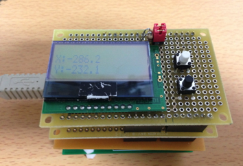
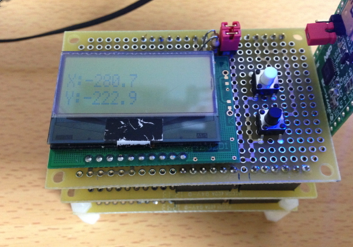
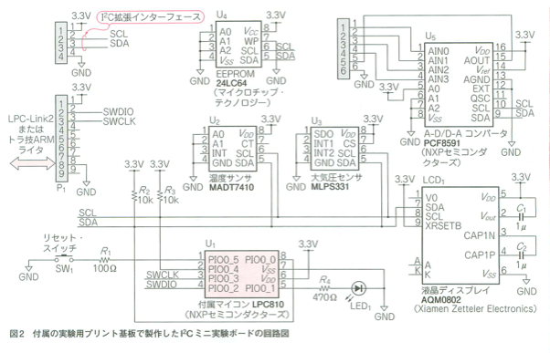
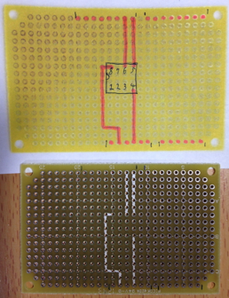
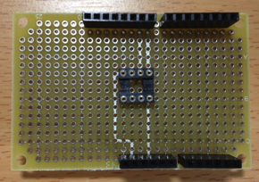
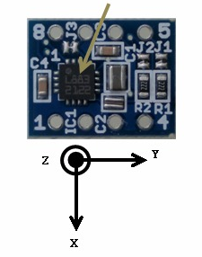

オリジナルの作成：2015/04/19


## 電子コンパス
地磁気センサHM5883Lを使って電子コンパスに挑戦しました。

ライブラリの作成はlbeDuinoの環境で行い、そのままArduino（3.3V版）でも動いています。

<table border=0 style="border: none;">
<tr style="border: none;">
<td style="border: none;"></td>
<td style="border: none;"></td>
</tr>
</table>


### HM5883Lモジュール
いろんなところからHM5883Lを使ったモジュールが販売されていますが、 今回はマルツパーツの3軸ディジタルコンパス用地磁気センサモジュールを使用しました。

- http://www.marutsu.co.jp/pc/i/135436/

このモジュールは、以下のようなピン配置になっており、トラ技2014/02の 【特集　最軽量！8ピンDIP ARMエントリ誕生】内で紹介されている実験基板 のI2Cソケットモジュールと同じ配置になっています。 *1

- 4番ピン：GND
- 5番ピン：SCL
- 6番ピン：SDA
- 8番ピン：VDD(3.3V)



### I2Cソケットシールド
I2Cソケットシールドを以下の様に作成しました。今回はプルアップ抵抗のジャンパーを省略しました。



出来上がったI2Cソケットシールド



## HM5883Lクラス
鈴木哲哉さんの著書 作って遊べるArduino互換機 を参考に、以下のメソッドを実装しました。

```C++
class HMC5883L {
public:
     HMC5883L(PinName sda, PinName scl);
     void                setup();
     void                setGain(int gain);
     void                writeReg(int reg, int val);   // レジスタに値を書き込む
     int                  readReg(int reg);            // レジスタの値を取得
     void                measure();                    // 測定を実行
     float               getAbs();                     // 全磁力を返す
     float               getHead();                    // 北からの方位角を返す（単位 度）
     float               x, y, z;                      // 測定地（単位 mGa）
private:
     I2C                i2c;
     float               ax, ay, az;                   // 測定データを保持
};
```

### HM5883Lの座標
HM5883Lモジュールのx, y, zの座標系は以下の通りです。




### 動作確認
以下のようなサンプルプログラム（スケッチ）で動作を確認しました。

```C++
#include "lbed.h"
#include "AQCM0802.h"
#include "HMC5883L.h"

// D13番ピンにLEDを接続
DigitalOut     led(D13);
// D8番ピンSDA, D9番ピンSCL
AQCM0802     lcd(D8, D9);
HMC5883L     sensor(D8, D9);

// タクトスイッチ
DigitalIn     sw1(D2);
DigitalIn     sw2(D3);

int     showHead = 0;

void setup() {
     sw1.mode(PullUp);
     sw2.mode(PullUp);
     lcd.setup();
     sensor.setup();
     sensor.setGain(1);
     lcd.print("HMC5883L setup");
     wait_ms(1000);
}

void loop() {
     led = !led;
     lcd.cls();
     lcd.locate(0, 1);
     sensor.measure();
     if (!sw1) {
          showHead = !showHead;
     }
     if (showHead) {
          lcd.locate(0, 0);
          lcd.print("Head:");
          lcd.print(sensor.getHead(), 1);
          lcd.locate(0, 1);
          lcd.print("Absolute:");
          lcd.print(sensor.getAbs(), 1);
     }
     else {
          lcd.locate(0, 0);
          lcd.print("X:");
          lcd.print(sensor.x, 1);
          lcd.locate(0, 1);
          lcd.print("Y:");
          lcd.print(sensor.y, 1);
     }
     wait_ms(500);
}
```

### 出力について
X, Yを出力すると、Yの値が1回転してもすべてマイナスの値になるなど、結果が不可解です。 しかし、Arduinoの例題を実行しても同じ傾向がみられました。（古いArduinoのファイルで修正が必要）

- http://sfecdn.s3.amazonaws.com/datasheets/Sensors/Magneto/HMC5883.pde

以下の様に変更しました。

```C++
/*
An Arduino code example for interfacing with the HMC5883

by: Jordan McConnell
 SparkFun Electronics
 created on: 6/30/11
 license: OSHW 1.0, http://freedomdefined.org/OSHW

Analog input 4 I2C SDA
Analog input 5 I2C SCL
*/

#include <Wire.h> //I2C Arduino Library

#define address 0x1E //0011110b, I2C 7bit address of HMC5883

void setup(){
  //Initialize Serial and I2C communications
  Serial.begin(9600);
  while (!Serial) {
    ; // wait for serial port to connect. Needed for Leonardo only
  }
  Wire.begin();
  
  //Put the HMC5883 IC into the correct operating mode
  Wire.beginTransmission(address); //open communication with HMC5883
  Wire.write(0x02); //select mode register
  Wire.write(0x00); //continuous measurement mode
  Wire.endTransmission();
}

void loop(){
  
  int x,y,z; //triple axis data

  //Tell the HMC5883 where to begin reading data
  Wire.beginTransmission(address);
  Wire.write(0x03); //select register 3, X MSB register
  Wire.endTransmission();
  
 
 //Read data from each axis, 2 registers per axis
  Wire.requestFrom(address, 6);
  if(6<=Wire.available()){
    x = Wire.read()<<8; //X msb
    x |= Wire.read(); //X lsb
    z = Wire.read()<<8; //Z msb
    z |= Wire.read(); //Z lsb
    y = Wire.read()<<8; //Y msb
    y |= Wire.read(); //Y lsb
  }
  
  //Print out values of each axis
  Serial.print("x: ");
  Serial.print(x);
  Serial.print("  y: ");
  Serial.print(y);
  Serial.print("  z: ");
  Serial.println(z);
  
  delay(250);
}
```
