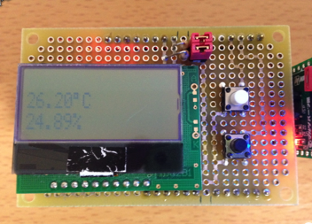
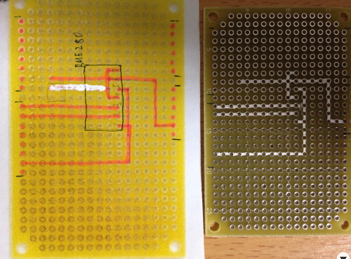
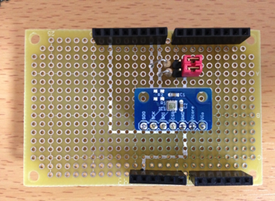
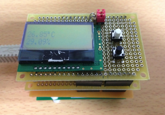

オリジナルの作成：2015/04/29

# 12-気温・気圧・湿度を測ってみる
## 1個で気温、湿度、気圧が測れる便利なモジュールBME280
スイッチサイエンスが販売しているBME280搭載　温湿度・気圧センサモジュールは、 1個のチップで気温、湿度、気圧が測れる便利なセンサーをブレッドボードでも使えるモジュールです。 Arduinoでの使い方も以下のページの「使い方」に紹介されています。

- https://www.switch-science.com/catalog/2236/

今回は、mbedの普及に努めている渡會さんが、BME280モジュールをmbedで使えるライブラリーを公開されたので、 これをlbeDuinoに移植してみました。

- https://developer.mbed.org/users/MACRUM/code/BME280/




### BME280シールドの作成 
BME280とlbeDuinoとの接続は、渡會さんの資料を参考に以下の様に結線しました。

 | lbeDuino	 | BME280 | 
 |---|---|
 | GND	 | 1, 5(SDO, GND) | 
 | 3.3V	 | 4, 6, 7(GSB, Vcore, Vio) | 
 | D8(SDA)	 | 3(SDI) I2CではSDA | 
 | D9(SCL)	 | 2(SCK) I2CではSCL | 
 
 今回も テクノペン を使って秋月の両面基板上に回路を描いています。
 
 
 
 出来上がったMBE280シールドは、以下の様になります。
 
  

## ライブラリーの移植
lbedは、mbedのインタフェースに合わせているので、ライブラリーの移植はインクルードファイルを mbed.hからlbed.hに変え、setup関数を追加するだけで良いのですが、そのままコンパイルするとサイズオーバーで、 LPC1114FNベースのlbeDuinoには載りませんでした。

そこで、i2cのポインタを止めて、デストラクターを削除して、コンストラクターもsda, sclを使用するものに修正しました。

```C++
    // メソッドの修正部分
    BME280(PinName sda, PinName sck, char slave_adr = DEFAULT_SLAVE_ADDRESS);
    void setup();

    // メンバ変数の修正部分（ポインタ部分を削除）
    I2C         i2c;
```

### スケッチ
I2cLCDシールドを上に載せたテスト用のスケッチ（プログラム）は、渡會さんのmain関数を参考に以下の様にしました。

```C++
#include "lbed.h"
#include "AQCM0802.h"
#include "BME280.h"

// D13番ピンにLEDを接続
DigitalOut     led(D13);
// D8番ピンSDA, D9番ピンSCL
AQCM0802     lcd(D8, D9);
BME280          sensor(D8, D9);

// タクトスイッチ
DigitalIn     sw1(D2);
DigitalIn     sw2(D3);

int          last_mode = 0;
char     degree = 0xdf;
void setup() {
     sw1.mode(PullUp);
     sw2.mode(PullUp);
     lcd.setup();
     sensor.setup();
     lcd.locate(0, 0); lcd.print("BME280");
     lcd.locate(0, 1); lcd.print("Demo");
     wait_ms(2000);
}

void loop() {
     led = ! led;
    if (sw1 == 1) {
        if (last_mode == 0)
            lcd.cls();
        lcd.locate(0, 0);
        lcd.print(sensor.getTemperature(), 2);
        lcd.print(degree); lcd.print("C");
        lcd.locate(0, 1);
        lcd.print(sensor.getHumidity(), 2); lcd.print("%");
        last_mode = 1;
    }
    else {
        if (last_mode == 1)
            lcd.cls();
        lcd.locate(0, 0);
        lcd.print(sensor.getTemperature(), 2);
        lcd.print(degree); lcd.print("C");
        lcd.locate(0, 1);
        lcd.print(sensor.getPressure(), 2); lcd.print("hPa");
        last_mode = 0;
    }
    wait_ms(1000);
}
```

## Arduino3.3V版への移植
lbeDuinoは、Arduino3.3V版でも同じように動くことを売りにしているので、 出来上がったBME280のライブラリをArduino版に入れて実行したところ、 湿度を除いて、気温、気圧の値がまったく違ってでてきました。

### mbedからArduino3.3Vへのライブラリの移植の注意点
mbedは、ARMの32bitマイコンを使っているのに対し、Arduinoは、AVRの8bitのAtmega328Pを使っています。

ここで、注意が必要なのがintの評価をするときに、16bitでするか32bitで行うかという点です。 BME280では、気温と気圧は3バイトで返されるため、32bitのlongタイプが必要になります。

スイッチサイエンスで公開されているArduino版の温度センサーの処理は、以下の様になっています。 データの取り込み部分readData()では、Wire.read()で取り込んだ1バイトのデータをuint32_tのdataの配列に セットしています。これで、temp_rawに32bitのデータが正しくセットされます。

```C++
void readData()
{
    int i = 0;
    uint32_t data[8];
    Wire.beginTransmission(BME280_ADDRESS);
    Wire.write(0xF7);
    Wire.endTransmission();
    Wire.requestFrom(BME280_ADDRESS,8);
    while(Wire.available()){
        data[i] = Wire.read();
        i++;
    }
    pres_raw = (data[0] << 12) | (data[1] << 4) | (data[2] >> 4);
    temp_raw = (data[3] << 12) | (data[4] << 4) | (data[5] >> 4);
    hum_raw  = (data[6] << 8) | data[7];
}
```

次に温度に変換するcalibration_Tを見てみると、dig_T1, dig_T2, dig_T3に対して(signed long int)等のキャストが 執拗に施されています。ここが8bitマイコンで32bitデータを扱うときに注意が必要な部分なのです。

```C++
signed long int calibration_T(signed long int adc_T)
{
    
    signed long int var1, var2, T;
    var1 = ((((adc_T >> 3) - ((signed long int)dig_T1<<1))) * ((signed long int)dig_T2)) >> 11;
    var2 = (((((adc_T >> 4) - ((signed long int)dig_T1)) * ((adc_T>>4) - ((signed long int)dig_T1))) >> 12) * ((signed long int)dig_T3)) >> 14;
    
    t_fine = var1 + var2;
    T = (t_fine * 5 + 128) >> 8;
    return T; 
```

渡會さんのgetTemperatureでは、32bitマイコンなので、char cmdの配列をそのまま12bitシフトしても 問題なく、temp_rawにセットされ、dig_T1, dig_T2, dig_T3へのキャストも不要です。

```C++
float BME280::getTemperature()
{
    uint32_t temp_raw;
    float tempf;
    char cmd[4];
 
    cmd[0] = 0xfa; // temp_msb
    i2c.write(address, cmd, 1);
    i2c.read(address, &cmd[1], 1);
 
    cmd[0] = 0xfb; // temp_lsb
    i2c.write(address, cmd, 1);
    i2c.read(address, &cmd[2], 1);
 
    cmd[0] = 0xfc; // temp_xlsb
    i2c.write(address, cmd, 1);
    i2c.read(address, &cmd[3], 1);
 
    temp_raw = (cmd[1] << 12) | (cmd[2] << 4) | (cmd[3] >> 4);
 
    int32_t temp;
 
    temp =
        (((((temp_raw >> 3) - (dig_T1 << 1))) * dig_T2) >> 11) +
        ((((((temp_raw >> 4) - dig_T1) * ((temp_raw >> 4) - dig_T1)) >> 12) * dig_T3) >> 14);
 
    t_fine = temp;
    temp = (temp * 5 + 128) >> 8;
    tempf = (float)temp;
 
    return (tempf/100.0f);
}
```

そこで、lbeDuinoのArduino3.3V版では、以下の様に修正しました。読み込んだcmdをuint32_tのdataにコピーし、 キャストもArduino版と同じように入れています。

```C++
 // Arduino版は、intが16bitなので、キャストがうまく処理できないので、領域を割り当て計算する。
    uint32_t data[4];
    for (int i = 0; i < 4; i++) data[i] = (uint8_t)cmd[i];
    temp_raw = (data[1] << 12) | (data[2] << 4) | (data[3] >> 4);

    int32_t var1, var2, temp;

    // Arduino版では、キャストを追加
    var1 = ((((temp_raw >> 3) - ((int32_t)dig_T1 << 1))) * ((int32_t)dig_T2)) >> 11;
    var2 = (((((temp_raw >> 4) - ((int32_t)dig_T1)) * ((temp_raw >> 4) - ((int32_t)dig_T1))) >> 12) * ((int32_t)dig_T3)) >> 14;
```

### Arduino3.3V版でBME280シールドを動かしてみる
BME280ライブラリが修正でき、最初のスケッチがArduino3.3V版でも無事動作するようになりました。
(ちょっと分かりづらいですが、一番下にArduino3.3V版と変換シールドを載せ、BME280シールド、I2cLCDシールドを載せています)


