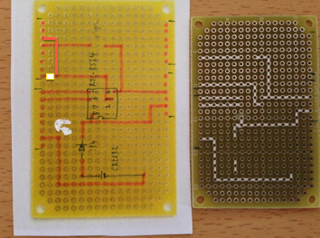
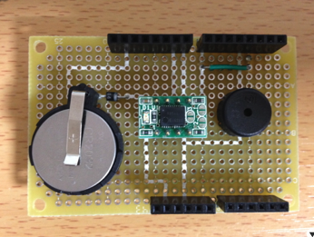
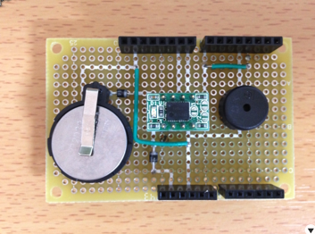
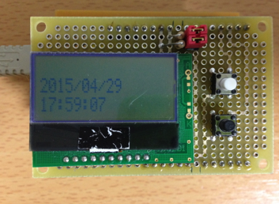
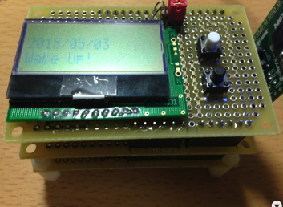
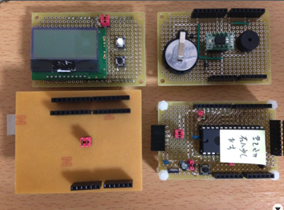

オリジナルの作成：2015/05/04

# 13-リアルタイムクロックでアラーム時計をつくる


## RTC（リアルタイムクロック）シールドをつくる
### RTC8564シールド
リアルタイムクロックは、価格と入手製を考えて秋月のリアルタイムクロック（ＲＴＣ）モジュール を使用しました。

- http://akizukidenshi.com/catalog/g/gI-00233/

いつものようにテクノペンで回路を作成しました。（今回はかなり回路が変わりましたので、これは参考程度に！）



最初は、RTCのアラームの割込をD7に付けていたのですが、Arduinoの割込がD2という制約があったので、 修正しました。



このままだと本体の電源を切ったときに、バックアップ電池から本体に電流が流れてしまうため、 RTC8564のVccと本体の間にダイオードを入れ、シールドを外したときにRTC8564が動くように バックアップ電池のGNDをRTC8564のGNDに接続しました。



## RTC8564ライブラリ
LBEDには、まだ割込クラスInterruptInがないので、珍しくArduino3.3Vでライブラリを 開発しました。

クラス定義は、以下の様にしました。

```C++
#define     NOT_APPLICABLE     (0x80)

class RTC8564 {
public:
     RTC8564(PinName sda, PinName scl);
     void setup();
     ~RTC8564();

     unsigned char s,m,h,D,W,M;
     short            Y;

     void read_rtc();

     void reset();

     void set_time(
               unsigned short Y,     // 年
               unsigned char M,     // 月
               unsigned char D,     // 日
               unsigned char h,     // 時
               unsigned char m,     // 分
               unsigned char s);     // 秒
     void command(unsigned char reg, unsigned char dat);
     void set_alarm(
               unsigned char h,
               unsigned char m
     );
     void clear_alarm_flag();
protected:
     unsigned char read(unsigned char reg);
    I2C    _i2c;
private:
    // 10進から16進のBCDコードに変換
    unsigned char dec2Bcd(unsigned char val) { return (unsigned char)((val/10) << 4 | val%10); }
    // 16進のBCDコードから10進に変換
    unsigned char bcd2Dec(unsigned char val) { return (unsigned char)((val/16) *10 + val%16); }
    // y,m, dから曜日を計算する(０を日曜日として0-6を返す)
    unsigned char zeller(int y, int m, int d) {
         if (m < 3) {
              y--;
              m += 12;
         }
         return (unsigned char)( y + y/4 - y/100 + y/400 + ( 13*m + 8 )/5 + d )%7;
    }
};
```

### 時刻合わせのスケッチ
新規スケッチを開いて、スケッチ→ライブラリ使用からlbeDuinoとlbeDuinoUserをセットします。 次に以下のスケッチをコピーします。rtc.set_time(2015, 4, 29, 18, 51, 0);の部分に数分後の時刻をセットします。

```C++
#include <lbed.h>

#include <AQCM0802.h>
#include <RTC8564.h>

// D8番ピンSDA, D9番ピンSCL
AQCM0802     lcd(D8, D9);
RTC8564          rtc(D8, D9);

// タクトスイッチ
DigitalIn     sw1(D2);
DigitalIn     sw2(D3);
char            buf[12];

int disp_time() {
    lcd.cls();
    lcd.locate(0, 0);
    sprintf(buf, "%d/%02d/%02d", rtc.Y, rtc.M, rtc.D); lcd.print(buf);
    lcd.locate(0, 1);
    sprintf(buf, "%02d:%02d:%02d", rtc.h, rtc.m, rtc.s); lcd.print(buf);
}

void setup() {
    sw1.mode(PullUp);
    sw2.mode(PullUp);
    lcd.setup();
    rtc.setup();
}

void loop() {
    if (!sw1) {
        rtc.set_time(2015, 4, 29, 18, 51, 0);
    }
    rtc.read_rtc();
    disp_time();
    wait_ms(1000);
}
```

スケッチをArduino3.3V版に書き込み、セット時刻近くになったらsw1を押し続け、 時間がきたらsw1を離します。



これで、時刻が正確なリアルタイムクロック・シールドは完成です。

## アラーム機能
リアルタイムクロックへのアラームセットは、set_alarm(h, m)で行います。 アラーム時間になると、D2のピンがLOWになることで、アラームを知らせます。

リアルタイムクロックのアラーム機能のテスト用に、毎分0秒にアラームが鳴るスケッチを作ってみました。

```C++
#include "lbed.h"
#include "I2cLCD.h"
#include "RTC8564.h"


I2cLCD     lcd(A4, A5, 5);  // sda, scl, reset
RTC8564    rtc(A4, A5);
Tone       beep(D3);


int hasWakeup = 0;
int pin2 = 2;


// 割込処理関数
void pin2Interrupt(void)
{
  hasWakeup = 1;
}


int disp_time() {
  lcd.cls();
  lcd.locate(0, 0);
  sprintf(buf, "%d/%02d/%02d", rtc.Y, rtc.M, rtc.D); lcd.print(buf);
  lcd.locate(0, 1);
  sprintf(buf, "%02d:%02d:%02d", rtc.h, rtc.m, rtc.s); lcd.print(buf);
}


void setup()
{
  pinMode(pin2, INPUT_PULLUP);
  lcd.setup(); 
  rtc.setup();
  // rtc.set_time(2014, 12, 31, 23, 59, 45);
  lcd.locate(0, 0);
  lcd.print("Set Alarm!");
  wait_ms(1000);
  // アラームセット時間hに関係なく（0x80）、毎0秒にアラームをセット
  rtc.set_alarm(0x80, 0);
  attachInterrupt (0, pin2Interrupt, FALLING);
}


void loop()
{
  delay(1000);
  rtc.read_rtc();
  disp_time();
 
  if(hasWakeup)
  {
    hasWakeup = 0;
    lcd.locate(0, 1);
    lcd.println("Wake Up!"); 
    beep.tone(440, 500); 
    rtc.set_alarm(0x80, (rtc.m+1)%60);
  }
}
```

## 割込クラス（InterruptIn）の作成
割込処理は、組み込みのシステムでは非常によく使われる技術ですが、 理解するのが難しく、上手く動作しないときのデバッグも大変です。

そのため、lbedではできるだけsetupとloop処理だけでスケッチをまとめて きました。

今回は、リアルタイムクロックのアラームの通知を割込処理を使わないと 実現できないため、割込クラス（InterruptIn）を実装することにしました。

### クラスの定義
InterruptInのクラス定義もmbedにならい、以下の様な簡単なものとしました。

```C++
class InterruptIn : public DigitalIn {
public:
     InterruptIn();
     InterruptIn(PinName pin, const char* name = 0);
     void rise(void (*fptr)(void)) {
          setup_interrupt(fptr, 1);
     }
     void fall(void (*fptr)(void)){
          setup_interrupt(fptr, 0);
     }
private:
     void setup_interrupt(void(*fptr)(void), int rising);
};
```

## lbeDuinoでRTC8564シールドを動かす
lbeDuinoのPrintクラスの#if 0に変えて#if 1に変えて簡易printfが使えるように しました。Arduino版では、XPrintクラスを追加し、printfが使えるようにしました。

以下のスケッチでbeDuinoでRTC8564シールドを動かしてみました。

```C++
#include "lbed.h"
#include "AQCM0802.h"
#include "RTC8564.h"
#include "Tone.h"

AQCM0802 lcd(A4, A5);  // sda, scl, reset
RTC8564 rtc(A4, A5);
Tone beep(D3);
char buf[12];
InterruptIn sw1(D2);

int hasWakeup = 0;
int pin2 = 2;

// 割込処理関数
void pin2Interrupt(void) {
     hasWakeup = 1;
}

int disp_time() {
     lcd.cls();
     lcd.locate(0, 0);
     lcd.printf("%d/%02d/%02d", rtc.Y, rtc.M, rtc.D);
     lcd.locate(0, 1);
     lcd.printf("%02d:%02d:%02d", rtc.h, rtc.m, rtc.s);
}

void setup() {
     sw1.mode(PullUp);
     lcd.setup();
     rtc.setup();
     // rtc.set_time(2014, 12, 31, 23, 59, 45);
     lcd.locate(0, 0);
     lcd.print("Set Alarm!");
     wait_ms(1000);
     // アラームセット時間hに関係なく（0x80）、毎0秒にアラームをセット
     rtc.set_alarm(0x80, 0);
     sw1.fall(pin2Interrupt);
}

void loop() {
     wait_ms(1000);
     rtc.read_rtc();
     disp_time();

     if (hasWakeup) {
          hasWakeup = 0;
          lcd.locate(0, 1);
          lcd.println("Wake Up!");
          beep.tone(440, 500);
          rtc.set_alarm(0x80, (rtc.m + 1) % 60);
     }
}
```



今回の作成したRTC8564ShieldとI2cLCDShield、lbeDuino、Arduino3.3V版です。



## lbeDuinoのソースの取得
ここで紹介しましたlbeDuinoのソースは、以下のGitHubから取得できます。

- https://github.com/take-pwave/lbed

lbeDuinoに必要なフォルダーは以下の通りです。

- CMSISv2p00_LPC11xx
- LBED_lbeDuino
- LBED_lbeDuino_USERLIB
- LBED_lbeDuino_MAIN

サンプルプログラムは、Examplesにあります。詳しくは、Arduino勉強会/0I-lbeDuinoの開発環境構築を参照してください。
