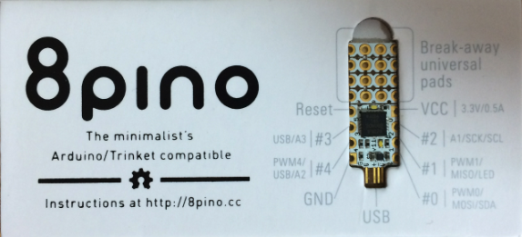
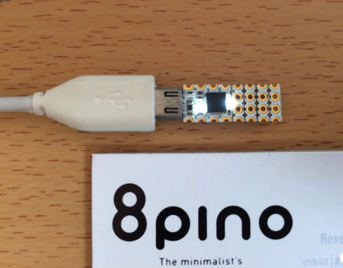
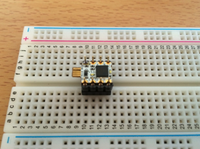
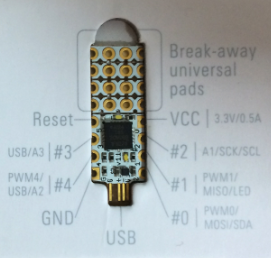
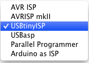
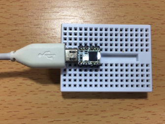
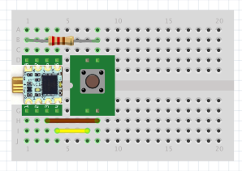
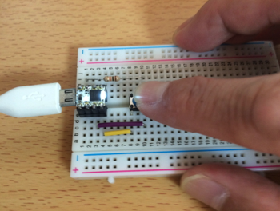
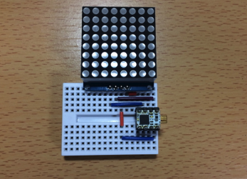
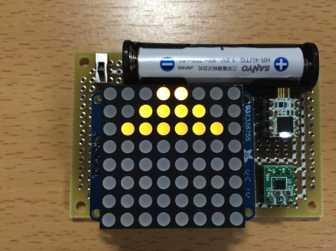

オリジナルの作成：2015/11/23

# 15-8pinoを使ってみる
## 8pino（エイトピノ） 
山手線ガジェットメーカーズで紹介されていた8pinoを遅ればせながら、 試してみました。当初、8pinoの創意工夫に気づかず、単なる小さなArduino と思っていましたが、 
[「8pino」ではじめるミニマム電子工作 ](https://www.kohgakusha.co.jp/books/detail/978-4-7775-1915-6)
（以下ミニマム本と書きます）で8pinoの開発環境や少ないピンで作品を作る著者のパワーに感動しました。



## ミニマム本のお復習い
8pinoの情報は、8pinoのサイトで公開されています。

- http://8pino.cc/

日本語のマニュアルも用意されています。

- http://bit.ly/8pino_pdf_jp

Windows 8/8.1の場合、ドライバーのインストール方法が異なるようです。以下のサイトを参照してください。

- http://mashigure.hateblo.jp/entry/2015/02/06/213634

Mac OSXの場合、ドライバーのインストールは不要です。

### Arduino IDEのインストール
8pino用のArduino IDEは、通常のArduino IDEではなく、Adafruit Trinket用Arduino IDEを使用します。

- http://bit.ly/arduino_trinket

- [Mac Arduino 1.0.5 for Trinket (also for 8pino)](http://adafruit-download.s3.amazonaws.com/Adafruit%20Arduino%201.0.5%20-%20Mac%2011-8-13.zip)
- [Windows Arduino 1.0.5 for Trinket (also for 8pino)](http://adafruit-download.s3.amazonaws.com/Adafruit%20Arduino%201.05%20-%20Win%2011-11-13%20.zip)

### 8pinoを動かしてみる
8pinoは、USB Microケーブルに直接さして、使います。 接続直後は、白いLEDが小刻みに点滅します。これがプログラム書き込み可能なタイミングを知らせています。 その後、8pinoに予め書き込まれているLEDチカチカが動き出します。



### ブレッドボードに差す
次に8pinoをブレッドボードで使えるよう切り目で折り、8ピンソケットにハンダ付け します。



### ピン配置
8pinoのピン配置は、パッケージにも書いてありますが、以下の表にまとめてみます。 ピン番号は、USBに差す突起の左上（以下の画像の右下#0）を1番とします。

 | ピン番号	 | Arduinoの番号	 | 機能 | 
 |---|---|---|
 | 1	 | 0	 | PWM0, MOSI, SDA | 
 | 2	 | 1	 | PWM1, MISO, LED | 
 | 3	 | 2	 | A1, SCK, SCL | 
 | 4	 | -	 | VCC 3.3V/0.5A | 
 | 5	 | -	 | Reset | 
 | 6	 | 3	 | USB, A3 | 
 | 7	 | 4	 | PWM4, USB, A2 | 
 | 8	 | -	 | GND | 



### スケッチを書いてみよう
最初のスケッチは、LEDチカチカです。以下の手順でサンプルのBlinkを修正してください。

- 8pino用Arduino IDEを起動
- ツール→マイコンボード→Adafruit Trinket 8MHzを選択


- ツール→書込装置→USBtinyISPを選択



- ファイル→スケッチの例→01Basic→Blinkを選択

8pinoのLEDは、1に接続されていますので、ledの値は1になります。

```C++
int led = 1;
```

USBケーブルを8pinoに差して、LEDが小刻みに点滅間にファイル→マイコンに書き込むを選択してください。 書き込みが完了すると白色LEDが1秒間隔で点滅します。



### タクトスイッチを使う
次にタクトスイッチをつないで、押したときにLEDが点灯するようにしてみます。

以下の様に配線します。抵抗は10KΩを使用します。



スケッチは、以下の様にします。タクトスイッチのデジタル入力は2（3番ピン）を使用します。

```C++
int led_pin = 1;  // GPIO #1 LED on board
int sw_pin  = 2;  // GPIO #2 SW

void setup() {
  pinMode(led_pin, OUTPUT);
  pinMode(sw_pin, INPUT);
}

void loop() {
  if (digitalRead(sw_pin) == HIGH) {
    digitalWrite(led_pin, HIGH);
    delay(250);
    digitalWrite(led_pin, LOW);
    delay(250);
  }
}
```

書き込みが完了するとスイッチを押して動作を確かめましょう。



### 応用事例
Adafruitのサイトから8x8LEDマトリックスを使ってインベーダーゲームのキャラクタを 表示するスケッチを動かしてみました。

- https://learn.adafruit.com/trinket-slash-gemma-space-invader-pendant/overview



ミニマム本にならって、万能基板にも実装してみました。 残念ながら8x8LEDマトリックスが点灯すると電圧が低くなって途中で止まってしまいました。 （要チェックです）


