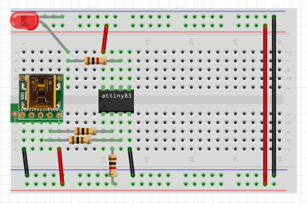
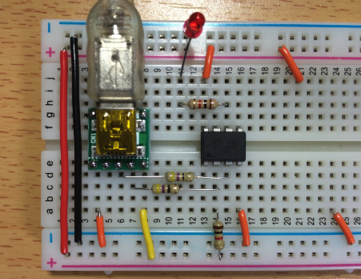
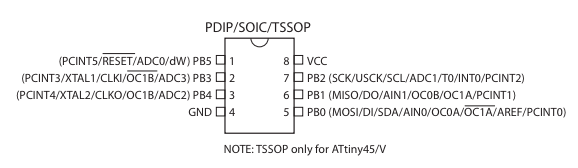
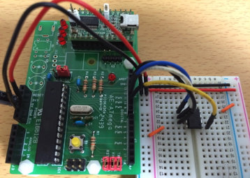
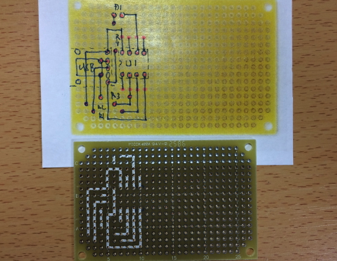
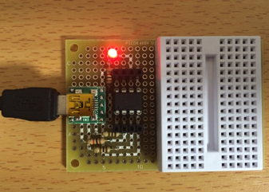
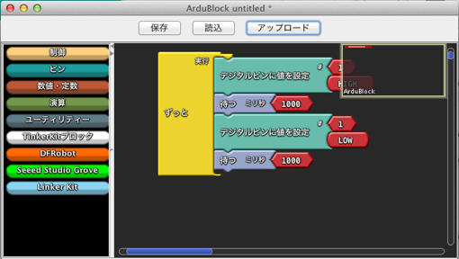
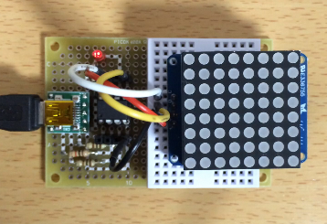
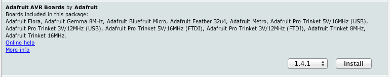

オリジナルの作成：2015/12/20

** trinketloaderのブートローダーを、個人で利用するのは問題ありませんが、このブートローダを商品に利用することはできませんので、ご注意ください **

# 16-ワンコイン・マイコンlbedGemma

## lbedGemmaボード誕生
8pinoに触発されて、ワンコインで作れるArduino（lbedGemma）を作ってみました。 

### 部品表
すべての部品は、 秋月 から購入できます。

 | 部品名	 | 数量	 | 通販コード	 | 価格	 | 備考 | 
 |---|---|---|---|---|
 | ATtiny85	 | 1	 | I-09573	 | 160円	 |  | 
 | ブレッドボード BB-801	 | 1	 | P-05294	 | 200円	 | P-00315でもよい | 
 | ミニＢメスＵＳＢコネクタ	 | 1	 | K-05258	 | 200円	 |  | 
 | 赤色ＬＥＤ	 | 1	 | I-00562	 | 350円	 | 100個入り | 
 | 抵抗 75Ω	 | 2	 | R-25750	 | 100円	 | 100個入り | 
 | 抵抗 1KΩ	 | 2	 | R-25102	 | 100円	 | 100個入り | 
 | ジャンパーワイヤセット	 | 1	 | P-00288	 | 400円	 | 単線ワイヤーでも可 | 

### ブレッドボードで動作を確認
8pinoの回路を参考に最初にブレッドボードでATtiny85を使ったGemmaを組み立てます。 USBとの接続部分は75Ωの抵抗、プルアップとLEDには1KΩの抵抗を使いました。



完成したブレッドボードは、以下のようになりました。



## Adafruit Gemmaのブートローダの書き込み †
Adafruit Gemmaのブートローダは、以下のURLで公開されています。

- https://learn.adafruit.com/introducing-trinket/repairing-bootloader

ブートローダの書き込みには、Arduino UNOが必要になります。 今回は、以前作ったArduino UNO（秋月のAE-ATmegaボード）を使用しました。 Arduino UnoのGNDと3.3Vには10μFの電解コンデンサーを差し、ATtiny85とは 以下の様に接続します。

 | ATtiny85	 | Arduino UNO | 
 |---|---|
 | 8番ピン VCC	 | 5V | 
 | 4番ピン GND	 | GND | 
 | 1番ピン Reset	 | 10番ピン | 
 | 5番ピン PB0	 | 11番ピン | 
 | 6番ピン PB1	 | 12番ピン | 
 | 7番ピン PB2	 | 13番ピン | 

ATtiny85のピンの説明をデータシートから引用します。





### ブートローダ書き込み手順
ダウンロードしたスケッチ（trinketloader）をArduino IDEで開き、Arduino UNOに書き込みます。

シリアルモニターを開き9600 baudにセットし、以下のメッセージが出力されたら、「G」を入力します。

```console
Trinket loader!

Type 'G' or hit BUTTON for next chip
```

書き込みの途中で以下の様なメッセージが出力されます。

```console
Starting Program Mode [OK]

Reading signature:930B
Searching for image...
  Found "blankfull.hex" for attiny85

Setting fuses  Set Low Fuse to: F1 -> A000  Set High Fuse to: D5 -> A800  Set Ext Fuse to: 6 -> A400
Verifying fuses...
Low Fuse: 0xF1 is 0xF1
High Fuse: 0xD5 is 0xD5
Ext Fuse: 0x6 is 0x6


Setting fuses

Verifing flash...
Flash verified correctly!
Verifying fuses...

Fuses verified correctly!
*OK!*
```

ATtiny85をlbedGemma用のブレッドボードに戻し、USBケーブルを接続すると LEDが細かく点滅したら、ブートローダの書き込みが正常に行われています。

## Arduino IDEでATtiny85が使かえるようにする
ハードの準備ができたので、次に開発環境を整えます。

Arduino 1.6から別のハードウェアの環境を簡単にインストールできるようになりました。 私は、1.6.4で動作を確認しています。

- https://www.arduino.cc/en/Main/OldSoftwareReleases#previous

### LED点滅（Blink）で動作確認
定番のLチカ（Blink）で動作を確認してみましょう。 新しいスケッチを作成し、以下のスケッチをコピーしてください。

```C++
int led = 1;

void setup() {                
  pinMode(led, OUTPUT);     
}

void loop() {
  digitalWrite(led, HIGH);   // turn the LED on (HIGH is the voltage level)
  delay(1000);               // wait for a second
  digitalWrite(led, LOW);    // turn the LED off by making the voltage LOW
  delay(1000);               // wait for a second
}
```

書き込みの前に、以下の設定にセットされていることを確認してください。 ボード：Adafruit Gemma 8MHz 書き込み装置：USBtinyISP

lbedGemmaのUSBケーブルをPCにセットし、LEDが細かく点滅している間に、 Arduino IDEのファイル→マイコンボードに書き込むを選択してください。

LEDが1秒間隔で点滅したら成功です。

## lbedGemmaボードの作成
ブレッドボードでの動作が確認できましたので、ユニバーサル基板に組み立てましょう。

いつものようにテクノペンを使って配線をします。



これに、以下の順で部品を配置します。

- 抵抗をセット
- 丸ピンソケット
- LED
- USB変換モジュール
- 分割ソケット

完成したボードのは、以下のとおりです。



## lbedGemmaを動かしてみる

### ArduBlockを使う
Arduino勉強会/C1-ArduBlockをはじめようで紹介したArduBlockをlbedGemmaで動かしてみます。

ツール→ArduBlockを選択し、以下のスケッチを作成します。



### スペース・インベーダーを表示
次に8x88x8マトリックスLEDを使ってスペース・インベーダーのキャラクターを動かしてみましょう。

スケッチは、Ardafruitの以下のURLからダウンロードしてください。

- https://learn.adafruit.com/trinket-slash-gemma-space-invader-pendant/source-code

ATtiny85と8x8マトリックスLEDは、以下の様に接続します。

 | ATtiny85	 | 8x8マトリックスLED | 
 |---|---|
 | 8ピン VCC	 | VCC | 
 | 4ピン GND	 | GND | 
 | 7ピン IO#2(SCL)	 | SCL | 
 | 5ピン IO#0(SDA)	 | SDA | 
 
ブレッドボードに8x8マトリックスLEDを載せたところ



実際に動いているところは、以下のURLを参照してください。

- https://www.facebook.com/hiroshi.takemoto.94/videos/vob.100002911051707/909225982517762/?type=2&theater

ワンコインArduinoと言えどもバカにできませんよ！

### Arduino IDEが1.6.3以下の場合
Arduino Gemmaは、Arduino IDE 1.6.4以降からサポートされました。

Arduino IDEが1.6.3以下でAdafruit AVRを使用するために、以下の手順で環境をダウンロードしてください。

- Arduino 1.6.xを起動し、Arduinoメニューから「preferences...」を選択し、設定ダイアログを表示します
- 下部の「Additional Boards Manager URLs」に以下のURLを指定します。 既にURLが指定されている場合には、カンマの後に追加します。
```
https://adafruit.github.io/arduino-board-index/package_adafruit_index.json
```

- ツール→ボードBoards Mangerを選択します
- Boards Managerの一覧から、「Adafruit AVR Boards by Adafruit」を選択し、installボタンを押します



