オリジナルの作成：2015/12/24

# 17-lbedGemmaで遊ぶ

## 勉強会などで利用する場合のご注意 
** TrinketやGemma使われているブートローダはフリーなのですが、商品やプロジェクトに勝手にAdrafruitのUSB VID/PIDを使ってはいけない との注意書きがあります。**

- https://github.com/adafruit/Adafruit-Trinket-Gemma-Bootloader/tree/3bc1bb561273535d4d493518a233a3a1fccf6b76

Arduino IDE 1.6.4以降Gemmaがサポートされたので、そのままブートローダが使えて便利です。趣味で使う分には問題ないと思うのですが、勉強会はプロジェクトかもしれないので、以下の様な対応を取りました。

勉強会で使う場合に限定したUSB VID/PIDにブートローダを変更したバージョンを用意しました。

USB VID/PIDは、「インターネット・ガジェット設計」の著者が、「ホビーや個人の研究であれば、自由にお使い下さい」 と記述されているご厚意に甘えて使わせて頂きました。

以下のファイルをダウンロードし、展開し、FreeGemma以下のFreeGemmaLoaderとharware2個のフォルダーがあります。 これをユーザのArduinoディレクトリ配下にコピーしてください。

- [fileFreeGemma.zip](data/fileFreeGemma.zip)

[16-ワンコイン・マイコンlbedGemma](https://nbviewer.jupyter.org/github/take-pwave/letsArduino/blob/master/16-LBedGemma.ipynb)
で説明した、

- trinketloaderの代わりにFreeGemmaLoaderを使用し
- ボードの選択で、「Adafruit Gemma 8MHz」の代わりに「Free Gemma」を選択してください。

## ちょっと軽めのmbedライクなライブラリlbed
mbedはとても使い易いライブラリを提供していますが、mbedが提供されていないボードやArduinoなどで、 mbed風のプログラミングを楽しんでもらうために、lbedライブラリを作成しました。

今回は、ブレッドボードで作るATtiny85を使ったワンコインArduino（lbedGemmaと呼びます） を使ってmbed風のプログラミングを体験してみましょう。

lbedGemmaの作り方は、 
[16-ワンコイン・マイコンlbedGemma](https://nbviewer.jupyter.org/github/take-pwave/letsArduino/blob/master/16-LBedGemma.ipynb)
を参照してください。

## デジタル入力
### プルダウン抵抗を使ったスイッチ回路

デジタル入力はスイッチのオン・オフのように０と１だけを入力値とします。 以下の様なスイッチをもちいた回路をlbedGemmaで作ってみましょう。

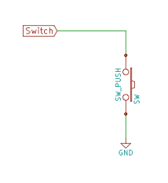

VCCは、電池のプラスを表しlbedGemmaではUSBからの5Vに相当します。その下にタクトスイッチSWが接続され、 10KΩの抵抗を通り、GND（電池のマイナス）につながっています。途中Switchというピンがタクトスイッチと抵抗の間につながれています。

この抵抗のあることで、スイッチが押されたときに電源のプラスとマイナスが直結し、ショートすることを防いでくれます。 この抵抗はスイッチがオフの時に、Switchピンの電圧をマイナス付近に落としてくれるので、プルダウン抵抗と呼ばれています。

この回路をlbedGemmaのブレッドボードに追加してみます。

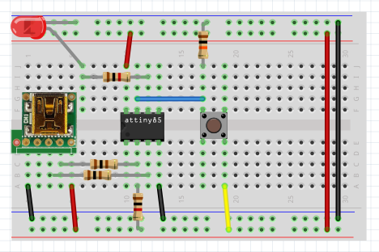

### Arduinoでスケッチを書く
「8pinoではじめるミニマム電子工作」のスイッチ・ボタンのスケッチでは、 以下の様に書いています。

```C++
int led_pin = 1;  // GPIO # LED on board
int sw_pin = 2;  // GPIO #2

void setup() {
  pinMode(led_pin, OUTPUT);
  pinMode(sw_pin, INPUT);
}

void loop() {
  if (digitalRead(sw_pin) == HIGH) {
    digitalWrite(led_pin, HIGH);
    delay(250);
    digitalWrite(led_pin, LOW);
    delay(250);
  }
}
```

### lbedを使ってスケッチを書く
上記のスケッチをlbedを使ったスケッチは以下の様に入力します。 最初の#includeはこれから、TinyWireMとlbedGemmaというライブラリを使うことを 表します。

DigitalOutは、デジタル出力のクラス名で、led(1)は1番ピンをデジタル出力するledという変数を宣言しています。 DigitalInは、デジタル入力のクラス名で、sw(2)は2番ピンをデジタル入力するswという変数を宣言しています。

setup関数では特に処理を行いません。

loop関数では、swがHIGHの時にledにHIGHをセットし、250ミリ秒待ち、 ledにLOWをセットし、250ミリ秒待つように処理します。 これで、スイッチが押されている間、LEDが250ミリ秒間隔で点灯と消灯を繰り返します。

mbed風の変数を参照するとピンから値が読まれ、変数に代入するとピンに値が書き込まれる 書き方の方が直感的で分かりやすいと思うのです。

```C++
#include "TinyWireM.h"
#include "lbedGemma.h"
 
DigitalOut  led(1);  // GPIO #1 LED on board.
DigitalIn   sw(2);   // GPIO #2

void setup() {                
}

void loop() {
  if (sw == HIGH) {
    led = HIGH;
    wait_ms(250);
    led = LOW;
    wait_ms(250);
  }
}
```

実際にブレッドボードでこのスケッチを動かしてみましょう。

スイッチを押すと電源のプラスとSwitchピン2番が接続され、swの値がHIGHになるので、 if文の中の処理が実行され、LEDが点滅します。

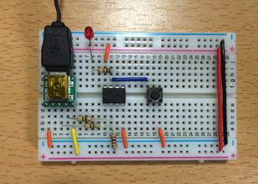

### プルアップ抵抗を使ったスイッチ回路
次に、以下の様な抵抗を電池のプラス側につないだスイッチ回路を作ってみましょう。


ブレッドボードでは、マイナスにつながっていた抵抗をプラス（赤い線）につなぎ、 スイッチのプラスにつながっていた線をマイナスにつなぎます。

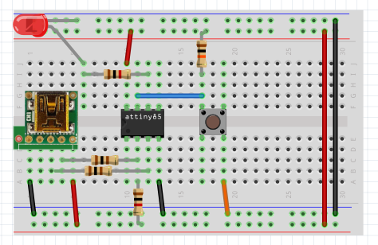

スケッチは、スイッチが押されたときにGND（電池のマイナス）につながるので、 if文のHIGHからLOWに変更します。 これで、先ほどと同じ動作をします。

```C++
#include "TinyWireM.h"
#include "lbedGemma.h"
 
DigitalOut  led(1);  // GPIO #1 LED on board.
DigitalIn   sw(2);   // GPIO #2

void setup() {                
}

void loop() {
  if (sw == LOW) {
    led = HIGH;
    wait_ms(250);
    led = LOW;
    wait_ms(250);
  }
}
```

### 抵抗を使わないスイッチ回路
スイッチを追加するたびに抵抗をつなぐと部品点数が増えるので、 Arduinoなどの最近のマイコンにはデジタル入力端子にプルアップ抵抗を内部で付けてくれる 機能があります。

この機能を使うと回路は以下の様にとても簡単になります。


ブレッドボードも抵抗を外します。

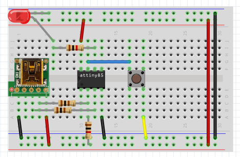

デジタル入力ピンにプルアップ抵抗をセットするには、 setup関数内で、swのmodeをINPUT_PULLUPにセットします。

```C++
#include "TinyWireM.h"
#include "lbedGemma.h"
 
DigitalOut  led(1);  // GPIO #1 LED on board.
DigitalIn   sw(2);   // GPIO #2

void setup() {
  sw.mode(INPUT_PULLUP);
}

void loop() {
  if (sw == LOW) {
    led = HIGH;
    wait_ms(250);
    led = LOW;
    wait_ms(250);
  }
}
```

実際に動かしてみましょう。


もし、modeでPULL_UPの設定をしなかったらどうなるのでしょう。 setupのmodeの設定部分を//でコメントアウトして動かしてみてください。 スイッチを押さなくても点滅しますね。

これはスイッチ端子の電圧が不定となりスイッチを押していなくてもLOWに近い値になっているからです。

## アナログ出力（PWM)
Arduinoでは電圧を変えるアナログ出力機能はありません。その代わりに一定の周期のパルス幅の割合（デューティ比） を変えるパルス幅変調方式を使ってアナログ出力を行っています。

Wikiの
[デューティ比](https://ja.wikipedia.org/wiki/%E3%83%87%E3%83%A5%E3%83%BC%E3%83%86%E3%82%A3%E6%AF%94)
からデューティ比の説明図を引用します。

デューティ比が大きいと電圧が掛かっている時間が長く、 デューティ比が小さいと電圧が掛かっている時間が短くなります。 これで、LEDやモータに流れる電流の量を調整することで、明るさや回転の強さをコントロールしています。 また、抵抗とコンデンサーを使った低周波フィルターを通すとデューティ比の変化が波の形で出力します。

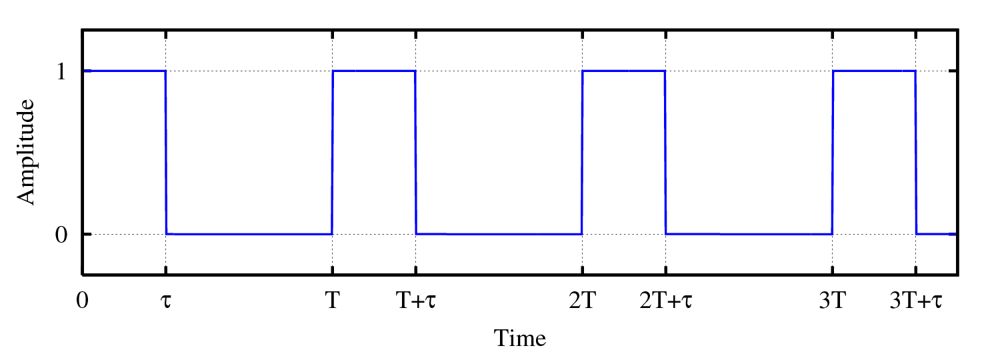

ATtiny85でPWMが使えるのは、3番ピンの#4、5番ピンの#0、6番ピンの#1の３つです。

PWMの回路は、以下の様にします。

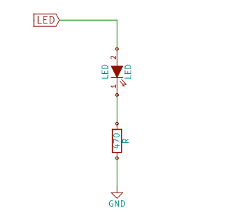

LED出力には、5番ピンの#0を使用します。抵抗値は470Ωにしました。

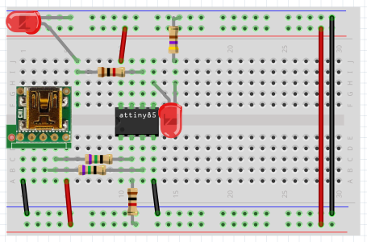

lbedのPWMOutクラスを使ったスケッチを以下に示します。

PwmOutはのクラス名で、led(1)で1番ピンにアナログ出力（PWM）するledという変数を宣言しています。 ledへの代入する値は、デューティ比を実数で与えます。とてもすっきりしたスケッチになります。

```C++
#include "TinyWireM.h"
#include "lbedGemma.h"
 
PwmOut led(0); // PWM LED

void setup() {  
}

void loop() {
  for (led = 0.0; led < 1.0; led = led + 0.02)
    wait_ms(20);
  for (led = 1.0; led > 0.0; led = led - 0.02)
    wait_ms(20);
}
```

電子工作の回路をみるとLEDにつなぐ抵抗の値が330Ωだったり、今回のように470Ωだったりしますが、 この値はどのようにして決めるのでしょうか。

LEDの場合、どの程度の電流を流すかによって抵抗の値が変わります。 LEDに流す電流はデータシート呼ばれる部品の規格を説明した資料で調べます。

秋月のサイトから赤色ＬＥＤ（ＯＳＤＲ３１３３Ａ）をみると、
[「抵抗の計算方法 」](http://akizukidenshi.com/download/led-r-calc.pdf)
があります。これに沿って説明します。

赤色ＬＥＤの順方向電圧(VF)は、2.0Vであり、LEDに電流が流れたときに電圧が2.0V下がることを意味しています。 順方向電流IF（DC Forward Current）30mAとあります。

通常LEDの電流はIFの半分以下の10mA程度で使うのがよいとされおり、 最近のLEDは輝度も高いので5mA程度でも十分と思われます。

470Ωでは、抵抗による電圧降下はオームの法則から抵抗×電流ですから、 以下の等式から電流は6.3mAと求まります。

$$
5V=20+47063mA
$$

スケッチを実際に動かしてみましょう。LEDの明るさが、もわもわっと変わります。

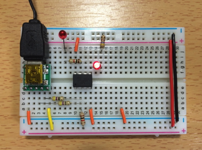

## シリアル通信
シリアル通信には、UART（調歩同期方式）方式が使われています。 UARTでは、送信（TX or TDX）と受信（RX or RDX）と呼ばれる2本の信号線を使って、 双方向に通信します。

UARTのつなぎ方は特徴的でPC側のTXとArduino側のRX、PC側のRXとArduino側のTX を接続します。

### USBシリアル変換モジュール
Arduinoとのシリアル通信には、5Vと3.3Vのどちらでも使える https://www.switch-science.com/catalog/1032/ が便利です。 アマゾンで検索すると、同じ機能のモジュールがワンコイン程度であります。 

- http://www.amazon.co.jp/dp/B00YMDN2Z6/

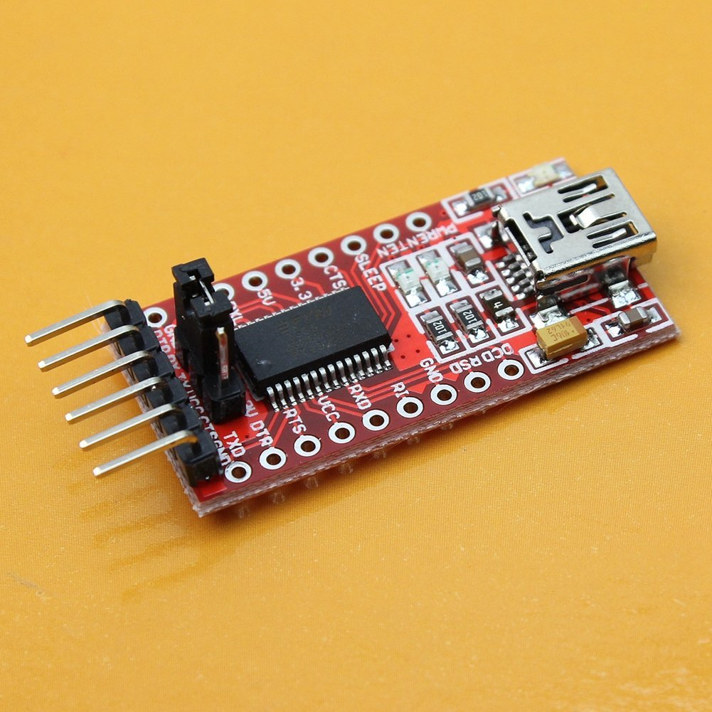

USBシリアル変換モジュールとATtiny85（Gemma）をつないだ回路を作ります。

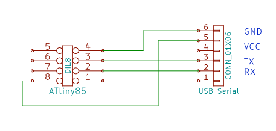

これをブレッドボードで組み立てると以下の様になります。

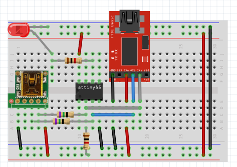

### スケッチを書く
ミニマム本に習って、Arduino IDEのシリアルモニターから数値を入力し、その回数分 LEDを点滅させる例題を作ってみましょう。

ATtiny85にはシリアル通式の機能がないので、ArduinoのSoftwareSerialクラスを使って、 ソフトウェアでシリアル通信を処理します。

- #include "SoftwareSerial.h"は、これからSoftwareSerialを使うことを宣言しています
- SoftwareSerial pc(4,3)は、RXに#4、TXに#3を使ってシリアル通信を行うpc変数を宣言しています
- pc.begin(4800) で通信速度を4800ボー（かなり遅い）にセットします
- pc.available()は、PCからデータ送られているか確認します
- pc.read()は、PCから1バイトのデータを読み込みます
- pc.write()は、PCに1バイトのデータを送ります
- value = recv_value - '0'は、読み込んだでーたrecv_valueの値（ASCIIコード）から数値に変えています

```C++
#include "TinyWireM.h"
#include "lbedGemma.h"
#include "SoftwareSerial.h"
 
DigitalOut led(1); // Gemmaに付属のLED
SoftwareSerial pc(4, 3);  // RX=4, TX=3

void setup() {  
  pc.begin(4800);
}

void loop() {
  if (pc.available()) {
    // PCから受信した値
    int recv_value = pc.read();
    // PCにそのまま送信
    pc.write(recv_value);
    // 数字'0'〜'9'を数値の0〜9に変える
    int value = recv_value - '0';
    if (0 < value && value <= 9) {
      for (int i = 0; i < value; i++) {
        led = HIGH;
        wait_ms(250);
        led = LOW;
        wait_ms(250);
      }
    }
  }
}
```


### 動作確認
電源は、USBシリアルモジュールから取りますので、スケッチを書き込む時にはUSBシリアルを外しておいて、 書き込みが終わったら、lbedGemmaのUSBケーブルを外し、USBシリアルモジュールに付け直してください。

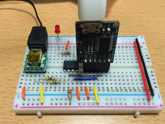

Arduino IDEのシリアルモニターを起動し、ボーレートを4800baud、改行なしにセットして、 数字を入力して「送信」ボタンをおしてみてください。

数値がシリアルモニターにエコーバックされ、数値の回数だけLEDが点滅します。

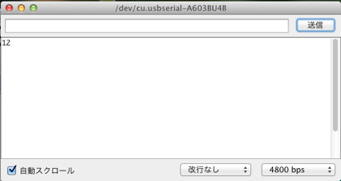

## アナログ入力
ミニマム本では、アナログ入力の例に光センサーCdsセルを使っていますが、 手元にCdsがないので温度センサーLM35を使ってアナログ入力の紹介をします。

LM35は、秋月などで120円程度で買える手軽な温度センサーです。 両端にVCCとGNDをつなぎ、中央の電圧に100倍すると温度になるとてもシンプルなセンサーです。 ピンの配置は平らな部分を上にして、底の左から+Vs, Vout, GNDに割り当てられています。

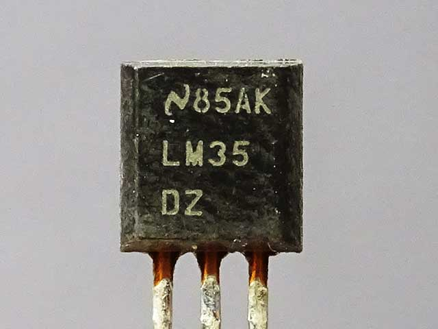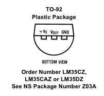

シリアル通信の回路に温度センサーLM35を追加した回路は、以下の様になります。

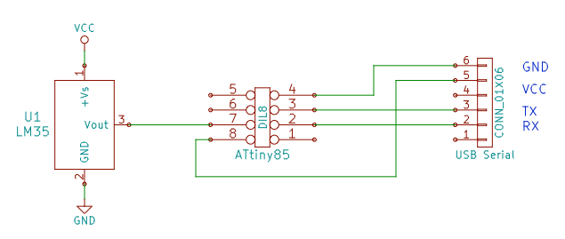

この回路をブレッドボードで組み立てると以下の様になります。

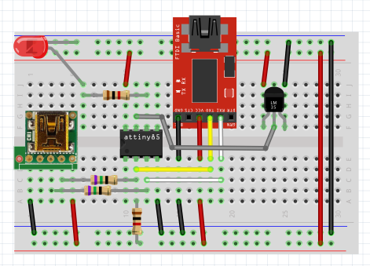


### スケッチを書く
AnalogInはのクラス名で、lm35(1)でアナログ1（6番ピン）にアナログ入力するlm35という変数を宣言しています。 lm35からの入力値は、０V〜稼働電圧（５V）を0.0〜1.0の値で返します。

温度は、lm35の値に5V x 100倍で計算されますので、float value = lm35*5.0*100.0; としています。

```C++
#include "TinyWireM.h"
#include "lbedGemma.h"
#include "SoftwareSerial.h"
 
SoftwareSerial pc(4, 3);  // RX=4, TX=3
AnalogIn lm35(1);

void setup() {  
  pc.begin(4800);
}

void loop() {
  float value = lm35*5.0*100.0; 
  
  pc.print("Temp="); pc.print(value, 1); pc.println("");
  wait_ms(1000);
}
```

### LM35で温度を測ってみる
できたスケッチをブレッドボードに書き込み、USBケーブルをUSBシリアルに付け替えて、 シリアルモニターを開くと、温度が表示されます。

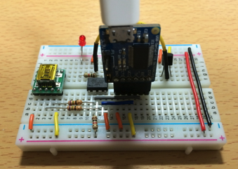

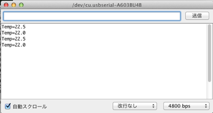

## 超音波センサーで距離を測る
秋月でも400円で購入できる超音波センサーHC-SR04を使って距離を測ってみましょう。 Arduino UNOでは2m程度は測定できましたが、8MHzのATtiny85では測定範囲は1cm~34cm程度でした。

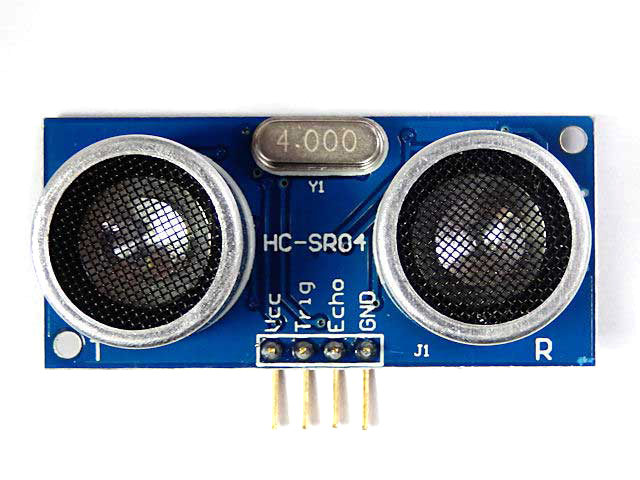

ATtiny85とHC-SR04の結線は、以下の通りです。

 | Gemma	 | HC-SR04 | 
 |---|---|
 | 5V	 | VCC | 
 | 6番ピン #1	 | Echo | 
 | 5番ピン #0	 | Trig | 
 | GND	 | GND | 
 
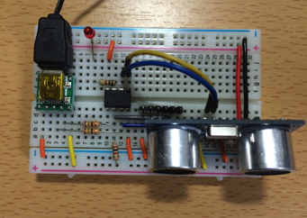

### スケッチを書く
このスケッチは、 Arduino and HC-SR04 ultrasonic sensor のスケッチをATtiny85用に修正したものです。

```C++
#include "SoftwareSerial.h"

#define trigPin 0
#define echoPin 1
SoftwareSerial pc(4, 3);

void setup() {
  pc.begin(4800);
  pinMode(trigPin, OUTPUT);
  pinMode(echoPin, INPUT);
}

void loop() {
  int duration, distance;
  digitalWrite(trigPin, HIGH);
  delayMicroseconds(1000);
  digitalWrite(trigPin, LOW);
  duration = pulseIn(echoPin, HIGH);
  distance = (duration/2) / 29.1;
  if (distance >= 200 || distance <= 0){
    pc.println("Out of range");
  }
  else {
    pc.print(distance);
    pc.println(" cm");
  }
  delay(500);
}
```

pulseInはArduinoの提供する関数で、パルスの種類をHIGHに指定すると、 入力がHIGHからLOWになるまでの時間をマイクロ秒で返します。

この関数を使って、超音波を発信してそのエコーを受信するまでの時間を計測して距離を計算します。

例えば、Δt=500 μ秒だとすると、その半分の 250μ秒が物体まで超音波が届くまでの時間になります。

音の速度ｃは、以下の式で求まります。
$$
c=343.5+0.6 \times 温度 
$$
気温が20℃だとすると、 c = 331.5 + 0.6 * 20 = 343.5 m/s となります。 単位をcm/μ秒に変換すると、
$$
c=343.5 \times 100/1000000=0.0345cm/μs
$$

これを使うとt=500の距離は、D = 250 * 0.03435 = 8.6 cmとなります。

スケッチで使われている29.1という値は、音の伝搬を距離当たりで計算した値（μ秒/cm）です。
$$
音の伝搬の割合=1/0.03435=29.1μs 
$$
パルスが戻ってくるまでの時間tが変数durationにセットされていますので、距離Dは以下の計算できます。
$$
D=(\Delta t/2)29.1
$$

測定結果をシリアルモニターで出力している様子です。

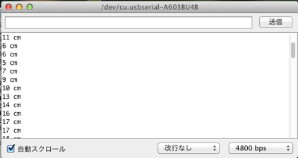

## I2Cでつなぐ
シリアル通信と同じくらいよく使われのが、I2C（正確にはI2Cと書きます）通信方式です。

I2C（アイ・ツー・シー）の接続例をWikipediaから引用します。 SDAとSCLの2本の線に１つのマスターと複数のスレーブが接続しており、 Vdd（電源のプラス）にプルアップ抵抗Rpがつながれています。

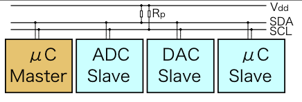

マスターはスレーブに割り当てられたアドレスで通信相手を指定し、 スレーブはマスターからの要求応答を返すような使い方をします。

ATtiny85のように使えるピンが少ない場合、I2C接続の部品はとても重宝します。

### I2C LCD
I2Cの部品として最初に紹介するのは、液晶キャラクタ・ディスプレイです。 電子工作ではLチカのつぎに良く出てくる部品で、とても重宝します。

ここでは、秋月電子で販売されている「Ｉ２Ｃ接続小型ＬＣＤモジュール」（600円）を使用します。

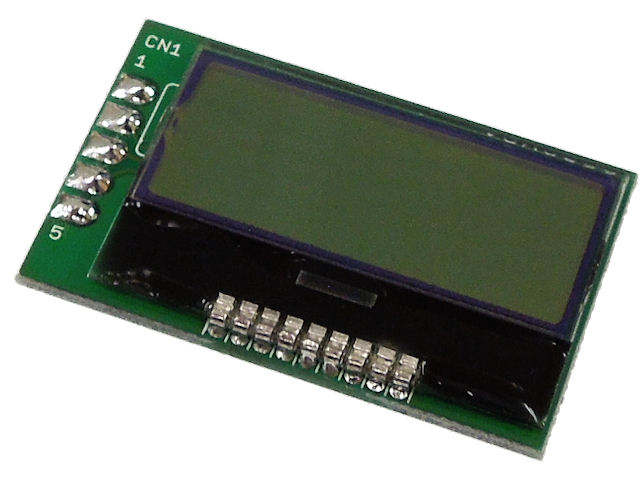

単独でしようケースが多いので、基板のジャンパーにハンダを盛って、プルアップします。

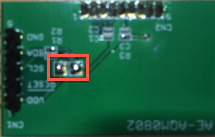


### lbedGemmaの3.3V化
I2C LCDは3.3Vで動作するので、lbedGemmaも3.3Vの電源を使用します。

5Vから3.3Vに変換するには、秋月で100円の低損失三端子レギュレーター（TA48M033F）を使います。

I2CLCDと三端子レギュレーターのブレッドボードでの配置と接続は以下の様になります。

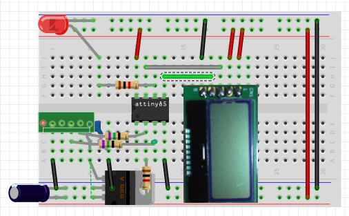

mbedのライブラリからAQCM0802を使わせて頂いたので、スケッチはとても簡単です。 AQCM0802のクラス名で、lcd(0, 2)で#0をSDA、#2をSCLに割り当て、I2C LCDに出力するlcdという変数を宣言しています。

```C++
#include "TinyWireM.h"
#include "lbedGemma.h"
#include "AQCM0802.h"

AQCM0802 lcd(0, 2);  // sda, scl

void setup()
{
    TinyWireM.begin();
    lcd.setup();
    // print Hello Wrold!
    lcd.print("Hello");
    lcd.locate(0, 1);
    lcd.print("World!");
}

void loop()
{
}
```

実際に動かしてみましょう！こんなに簡単にHello World!が表示できました。

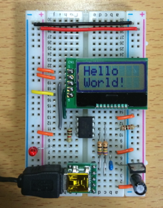

### 温度をLCDに表示する
液晶キャラクタディスプレイが使えるようになったので、温度を表示してみましょう。

LM35で使った#2がI2Cで使ってしまったので、I2C用の温度センサーを使うことにします。 

温度センサーは、秋月の500円で購入できる温度センサモジュールADT7410です。

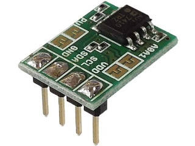


### ブレッドボードへの配置
I2C用のプルアップの抵抗は液晶キャラクタディスプレイに付いているので、 温度センサモジュールADT7410には、VCC, SDA, SCL, GNDをつなぐだけです。

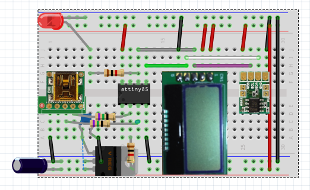

### スケッチを書く
ADT7410のライブラリには、 Tom Kreycheさんがmbed用に公開されている ADT7410ライブラリ を使わせてもらいます。

ADT7410ライブラリの修正箇所は、ADT7410.hのmbed.hのインクルード文をlbedGemma.hに変更し、 getTempメソッドを若干修正しました。

スケッチは、以下の様になります。

```C++
#include "TinyWireM.h"
#include "lbedGemma.h"
#include "AQCM0802.h"
#include "ADT7410.h"

AQCM0802 lcd(0, 2);  // sda, scl
ADT7410  themometer(0, 2, 0x90, 400000); // sda, scl, addr, hz
int I2CAdrs;

void setup()
{
    TinyWireM.begin();
    I2CAdrs = 0x48;     // スレーブアドレス
    lcd.setup();
    themometer.setConfig(ONE_SPS_MODE);
    // print TEXT
    lcd.print("Temp. is");
}

void loop()
{
  float temp = themometer.getTemp();
  lcd.locate(0, 1);
  lcd.print(temp, 2);
  lcd.print(" C.");

  wait_ms(1000);
}
```

### 動作確認
準備ができましたので、動かしてみましょう！ 現在の室温が1秒間隔で、温度を更新しています。

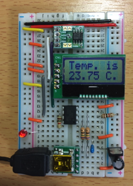
