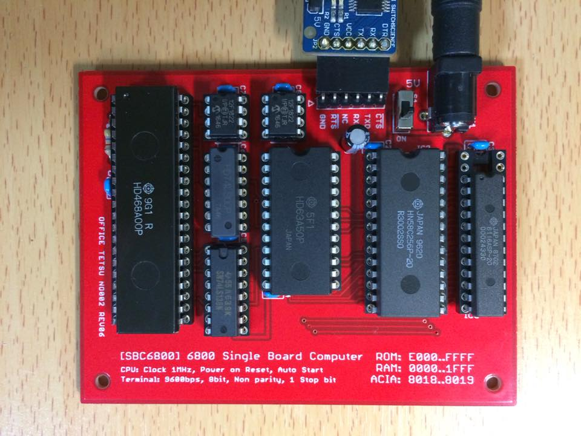
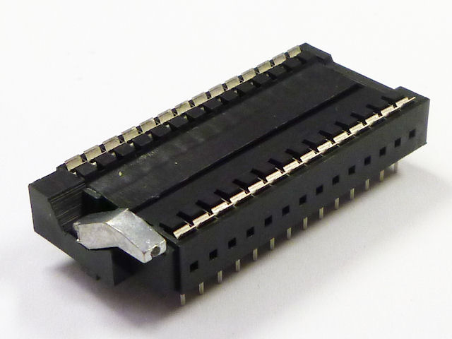
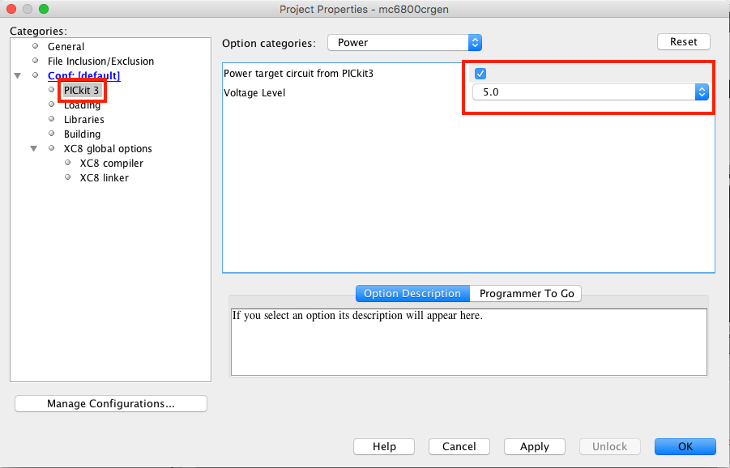
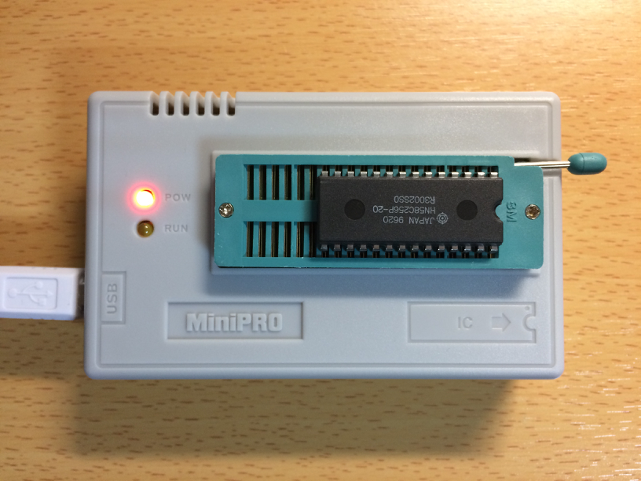
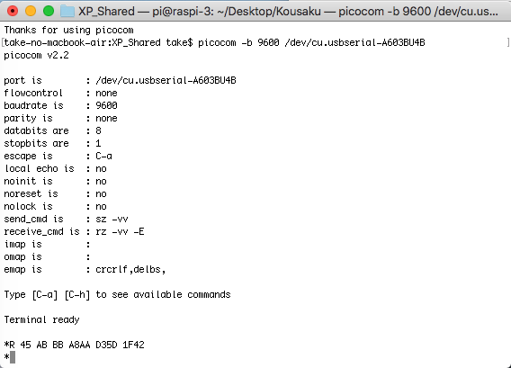

オリジナルの作成：2018/04/08

# 6800伝説のMIKbugが動いた
## モトローラ６８００伝説
前職の同僚の大黒さんから鈴木哲哉さんの 
<a href="https://www.amazon.co.jp/dp/4899774729">モトローラ6800伝説</a>
を紹介してもらいました。

ちょうど6809の時代に社会人となりFM-7を購入したこともあり、 興味深く拝見しました。

特に6800の開発にミニコンを活用した場面がでてくるのに驚きました！

- CAD
- シミュレーター

## 参考サイト
<a href="https://www.amazon.co.jp/dp/4899774729">モトローラ6800伝説</a>
には、スイッチサイエンスから
<a href="https://www.switch-science.com/catalog/list/?plu=3581,3582,3583">ルーズキットおよびROMセット</a>
を購入できるので、初心者でも試すことができます。

また、技術資料とデータパックも充実しており、ルーズキットのお手本のようなプロジェクトだと感じました。

- http://www.amy.hi-ho.ne.jp/officetetsu/storage/sbc6800_techdata.pdf

出来上がった、マイsbc6800ボードです。



### ボード発注
残念ながら私がスイッチサイエンスさんのサイトにアクセスしたときには、 ルーズキットの在庫がありませでしたので、データパックのガーバーファイルをFusion PCB に送ってボードを入手しました（５枚で$7.9なので複数人で作るときにはお勧めです）。

発注から届くまでは20日程みておくといいです。

- Fusionに発注 2018/03/11
- ボード受け取り 2018/03/30

## 部品一覧 
2018/03/21に若松、秋月に注文し、ボードの到着を待つだけのみです。

若松には以下の部品を注文しました（小計 2132円+送料250円）。

| 品名 | 単価 | 
|---|---|
| HD468A00P | 475円 | 
| HN58C256P-20 DIP型 | 472円 | 
| HM6116ASP-20 | 367円 | 
| HD63A50P | 630円 | 
| 74LS00 | 94円 | 
| 74LS138 | 94円 | 

秋月には以下の部品を注文しました。

| 品名 | 型番 | 単価 |
|---|---|---|
|２．１ｍｍ標準ＤＣジャック（４Ａ）　ユニバーサル基板取付用 | C-09408 | 30円 |
| スライドスイッチ　ＳＳ－１２Ｄ００－Ｇ５ | P-08790 | 20円 |
| 丸ピンＩＣソケット　（４０Ｐ） | P-00034 | 80円 |
| 丸ピンＩＣソケット　（２８Ｐ）　６００ｍｉｌ | P-00033 | 60円 |
| 丸ピンＩＣソケット　（２８Ｐ）　３００ｍｉｌ | P-01339 | 70円 |
| 丸ピンＩＣソケット　（２４Ｐ）　６００ｍｉｌ | P-00032 | 60円 |
| 丸ピンＩＣソケット　（１６Ｐ） | P-00029 | 30円 |
| 丸ピンＩＣソケット　（１４Ｐ）	| P-00028 | 25円 |
| 丸ピンＩＣソケット　（　８Ｐ） | P-00035 | 15円 |
| ＰＩＣ１２Ｆ１８２２－Ｉ／Ｐ | I-04557 | 110円 x 2 |

### すぐれもの部品
後で気づいたのですが、ROMのソケット（ロープロファイルゼロプレッシャーＩＣソケット　（２８Ｐ）　６００ｍｉｌ） という優れものがありました。

- http://akizukidenshi.com/catalog/g/gP-05435/



## PIC MPLAB IDEの準備 
以下のリンクを参照して、Mac用のMPLAB IDEをインストールしました。

MPLAB IDEの直リンク
- http://www.microchip.com/mplabx-ide-osx-installer

コンパイラーの直リンク
- http://www.microchip.com/mplabxc8osx
- http://www.microchip.com/mplabxc16osx
- http://www.microchip.com/mplabxc32osx

### PICkit3で書き込むときの注意！ 
PICkit3で書き込むとき、Powerを供給する必要があります。

プロジェクトのPropertyのPICkit3を選択し、「Power」のOptionからPower target circuit from PICkit3をチェックします。



### EEPROMの書込み 
EEPROMの書き込みにはアマゾンで安価に販売していたUSB Mini Proを使用しました。 付属TL866Aの付属のアプリ（minipro.exe）ではどうも書き込みに失敗します。

このEEPROMはとても優れもので、いろんなCPUに対応しており、動かなくなった AVRのヒューズビットの修復も可能だそうです。



### OSSのminiproを使ってみる
フォーラムで似たようなケースの投稿でLinuxベースのminiproを使うと良いとの 記事がありました。

- https://github.com/vdudouyt/minipro

必要なライブラリはlibusbですが、Intel HexとMotorolar S形式の変換用に srecordもインストールします。

```bash
git clone https://github.com/vdudouyt/minipro.git
cd minipro

brew install libusb
brew link libusb
brew install srecord

make -f Makefile.macOS
sudo make install
```

### MIKBUG.HEXの書き込み
試行錯誤の結果、srec_catでアドレスを変更し、 miniprohexで書き込むことでMacbook AirからEEPROMに プログラムを書き込むことができるようになりました。

```bash
$ srec_cat MIKBUG.HEX -Intel -offset -0X8000 -o conv_mikbug.hex -Intel
$ miniprohex -p 28C256 -w conv_mikbug.hex
```

## 6800での動作確認
端末ソフトから通信ソフトpicocom*1 を使ってsbc6800ボードに接続します。

sbc6800ボードのスイッチを入れ、*が表示されればMIKBUGが正常に起動しています。 次にRを入力して、レジスターの場外が表示されることを確認しました。

```bash
$ picocom -b 9600 /dev/cu.usbserial-A603BU4B
途中省略
Terminal ready

*R 45 AB BB A8AA D35D 1F42 
```

端末ソフトでは、こんな感じです。



### Hello Worldの実行
「*」プロンプトの後にLを入力して、HELLO.Sのテキストをコピー＆ペーストする。

画面の先頭がS9なら成功です。

MIKbugの実行開始アドレスをセットしていないので、 そのままGコマンドを入力しても動きません。

```console
$1F48: 実行開始アドレスの（上位）
$1F49: 実行開始アドレスの（下位）
```

MコマンドでRAMを書き換えます。値を変更するときには、 ブランクの後に修正する値を入力します。Mモードを終了するには、 ブランクの後に改行を入力します。
```console
*M 1F48
*1F48 D1  01
*1F49 5D  00
*1F4A 55  08
```

実行にはGコマンドを入力します。

```console
*G
HELLO, WORLD
D4 AB 04 0117 0106 1F42
````

## ソフトウェア環境
いくつかの6800用アセンブラが見つかりました。

- <a href="http://www.retrotechnology.com/restore/a68.html">A68 6800 cross-assembler</a>
- <a href="https://github.com/JimInCA/motorola-6800-assembler">motorola-6800-assembler<a>
- <a href="http://sourceforge.net/projects/asm68c/">asm68c</a>

今回はコンパイル結果をモトローラS形式に出力してくれる、asm68cを使用することにしました。


### asm68cのインストール
sourceforgeのサイトからダウンロードしたasm68c_v00_10a.tgzを展開し、 makeコマンドでコンパイルするだけです。 いくつかのワーニングはできますが、カレントディレクトリにasm68cができます。

```bash
$ make
ワーニングの出力
6 warnings generated.
gcc -o asm68c asm68c.o mne68c.o ops68c.o exp.o
# /usr/local/binにコピー
$ sudo cp asm68c /usr/local/bin/
```

### Hello Worldのコンパイル
以下のようにsbc6800_datapackのHELLO.ASMをコンパイルすると、 カレントディレクトリにHELLO.xというS形式のファイルが作成されます。

```bash
$ asm68c HELLO.ASM
***** pass 1 on HELLO.ASM *****
***** pass 1 on HELLO.ASM done *****
***** pass 2 on HELLO.ASM *****
***** pass 2 on HELLO.ASM done *****
No syntax errors found.
| 0107:MESG             || e07e:PDATA1           || 0100:START            |
$ cat HELLO.x
S10A0100CE0107BDE07E3FC4
S11301070D0A48454C4C4F2C20574F524C440D0A6E
S904011704DF
```

sbc6800_datapackのHELLO.Sと比べるとアドレス（先頭のSxxxの後の４桁） を除くと同じ結果になっていることが分かります。

```
S1130100CE0107BDE07E3F0D0A48454C4C4F2C20E4
S10B0110574F524C440D0A0440
S9
```
