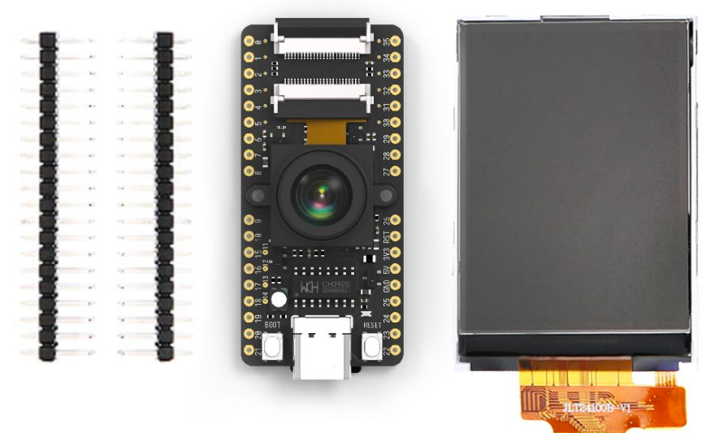
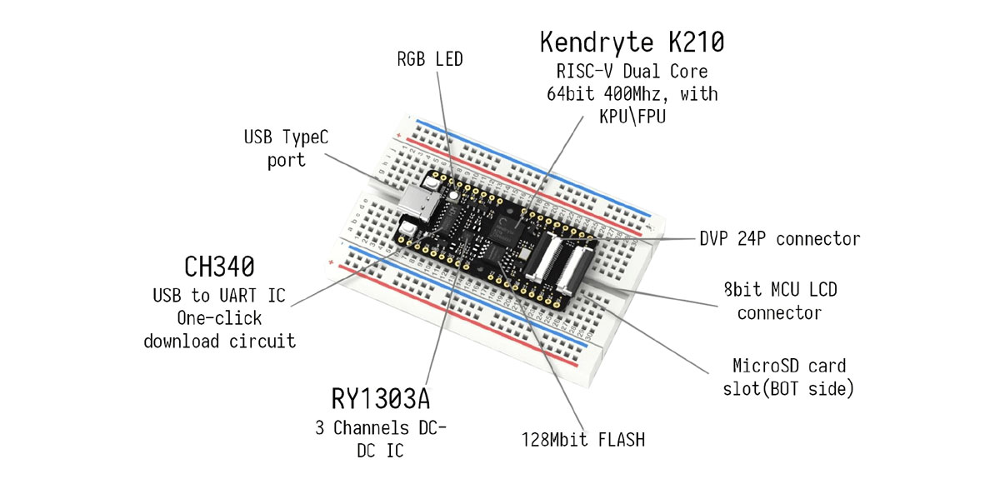
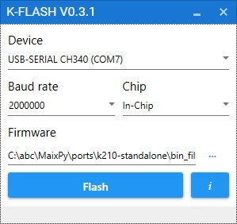
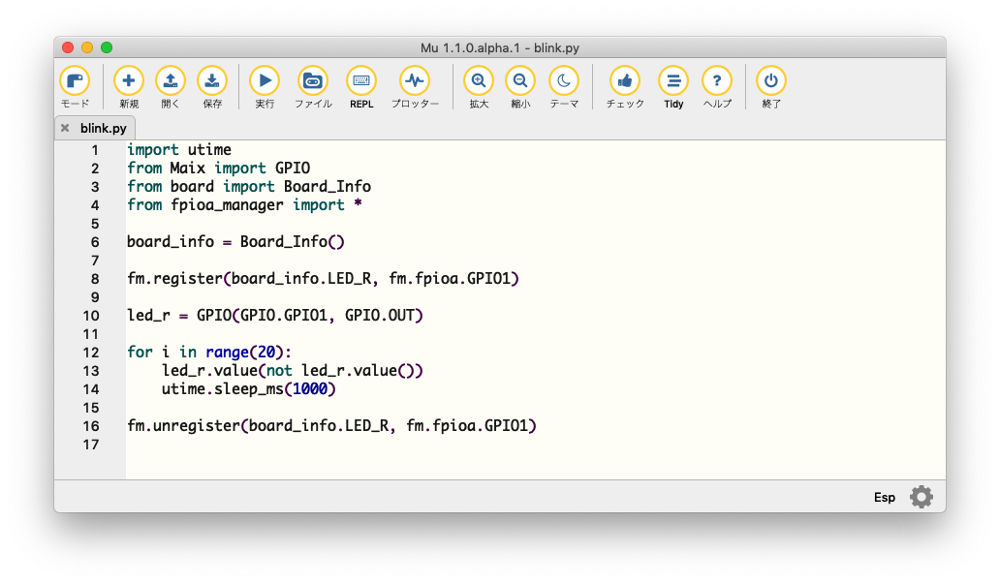
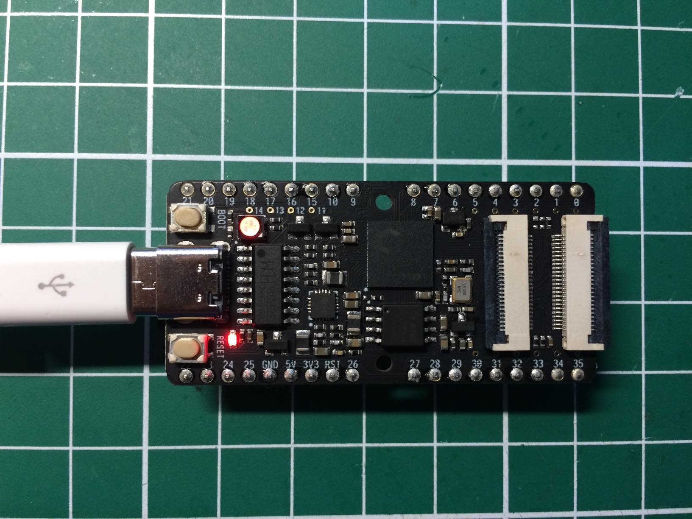
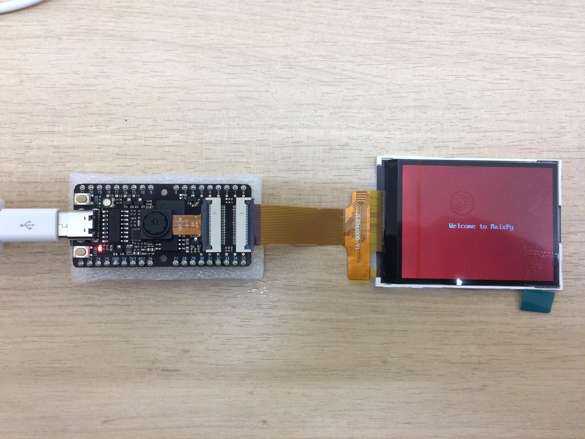
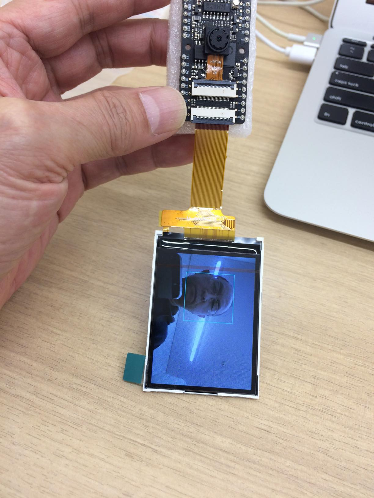
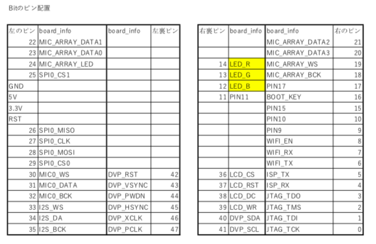

# MaixPy
SipeedのMAIXは、RISC-V64 AIモジュール搭載の非常にユニークなCPUです。
開発用ボードには、以下のラインナップがあります。

- GO: MAIX、カメラ、液晶、アレイマイク、ステレオカメラ、ケースの全部入りキット
- Bit Kit: MAIX、カメラ、液晶のキット
- Dock: MAIX with WiFi、カメラ、液晶のキット

この中でも、Bit KitはWiFiが付いていないので、技適の問題もないので国内でもすぐに
利用できます。

Bit Kitは、$20.9（+送料$14.0）ととてもお得です。
- https://www.seeedstudio.com/Sipeed-MAix-BiT-for-RISC-V-AI-IoT-1-p-2873.html





## ボードの回路図情報
販売されて日が浅いため、中国語以外の情報が少なく、以下のサイトにある回路図から
読み取るしかありません。
- http://dl.sipeed.com/MAIX/HDK/

## MAIXのmicropytho(MaixPy)を動かしてみよう
### バイナリファイルのダウンロード
MaixPyの最新版は、以下のサイトからダウンロードできます。
- https://github.com/sipeed/MaixPy/releases

現在の最新版は、v0.3.0です。以下のURLからmaixpy_v0.3.0_full.binをダウンロードしてください。
- http://dl.sipeed.com/MAIX/MaixPy/release/maixpy_v0.3.0/

### ドキュメント
MaixPyのドキュメントは以下のサイトにあります。
- https://maixpy.sipeed.com/en/

### K-Flashのダウンロード先
バイナリファイルの書き込みには、k-Flashを使用します。

Windowsユーザは、以下のファイルからF-Flashをダウンロードしてください。
- https://kendryte.com/downloads/

K-Flashを起動し、DeviceにMAiX BitのCOMポートを指定し、
Firmwareにダウンロードしたバイナリファイル(maixpy_v0.3.0_full.bin)を指定して
Flashボタンを押してください。



LinuxとMac OSXユーザは、python3にpyserialをインストールし、
gitコマンドでflash.pyをクローンします。

```bash
$ pip install pyserial
$ git clone https://github.com/sipeed/kflash.py kflash
```

私の環境では、MAiX Bitのデバイスは、/dev/cu.wchusbserial1420
なので、以下のようにしてmaixpy_v0.3.0_full.binを書き込みます。

```bash
$ python kflash.py -p /dev/cu.wchusbserial1420 -b 2000000 -B dan maixpy_v0.3.0_full.bin
```

### 動作確認
Windowsユーザは、teraterm、Linux, MacOSXのユーザならpicocom等の通信ソフトでアクセスします。

以下のようにMAiXPyの絵文字がでれば書き込みは成功です。

```bash
$ picocom -b 115200 /dev/cu.wchusbserial1420 
picocom v2.2

途中省略

 __  __              _____  __   __  _____   __     __
|  \/  |     /\     |_   _| \ \ / / |  __ \  \ \   / /
| \  / |    /  \      | |    \ V /  | |__) |  \ \_/ /
| |\/| |   / /\ \     | |     > <   |  ___/    \   /
| |  | |  / ____ \   _| |_   / . \  | |         | |
|_|  |_| /_/    \_\ |_____| /_/ \_\ |_|         |_|

Official Site : https://www.sipeed.com
Wiki          : https://maixpy.sipeed.com

MicroPython v0.3.0 on 2019-04-19; Sipeed_M1 with kendryte-k210
Type "help()" for more information.
>>> 
```


## プログラミング環境
micropythonのプログラミングには、mu-editorが便利です。
MaixPyの他、exp32やmicro:bitもサポートしています。

### mu-editorのダウンロード
mu-editorは、以下のサイトからダウンロードできます。
お使いのOSに合わせてダウンロードしてください。

- https://codewith.mu/en/download

### Lチカに挑戦
定番のLチカをmu-editorを使って試してみましょう。

MAiXのFlashにプログラムを保存することも可能ですが、
転送ボタンの動作が不安定なので、MAiX BitにSDカードを
挿入して、そちらにプログラムを保存することにします。

mu-editorから「新規」ボタンを押して、以下のソースを入力「実行」ボタンを押下します。

```python
import utime
from Maix import GPIO
from board import Board_Info
from fpioa_manager import *

board_info = Board_Info()

fm.register(board_info.LED_R, fm.fpioa.GPIO1)

led_r = GPIO(GPIO.GPIO1, GPIO.OUT)

for i in range(20):
    led_r.value(not led_r.value())
    utime.sleep_ms(1000)

fm.unregister(board_info.LED_R, fm.fpioa.GPIO1)
```




MAiX Bitに搭載されたRBG LEDの赤が点滅すれば成功です。




### ファイルの転送
SDカードにスクリプト（blink.py）を転送し、それを実行するこもできます。

mu-editorの「ファイル」ボタンを押し、転送したファイルを"Files on your device:"に
ドラッグしてください。

ファイルが転送されたら、再度「ファイル」ボタンを押し、編集画面に戻り、
次に「REPL」（インタラクティブモード）を押し、">>>"のプロンプトが表示されたら、
以下のコマンドを入力してください。

もし、スクリプトが動かない場合には、一連の処理を関数で定義し、importの後に関数を呼び出すようにすると、
上手く動きます。

```python
os.chdir('/sd/')
import blink
```


## 顔認識の例題
Lチカが上手く動いたら、カメラとLCDをBitに接続して、顔認識のスクリプトを
実行してみましょう。



以下のスクリプトを入力し、「実行」ボタンを押してください。

顔が認識されるその範囲がREPLのコンソールに表示され、LCDには水色の矩形で
表示されます。

```python
import sensor
import image
import lcd

def face_detect():
    lcd.init()
    sensor.reset()
    sensor.set_pixformat(sensor.RGB565)
    sensor.set_framesize(sensor.QVGA)
    sensor.run(1)
    face_cascade = image.HaarCascade("frontalface", stages=100)
    while True:
      img=sensor.snapshot()
      objects = img.find_features(face_cascade, threshold=1.00, scale=1.1)
      for r in objects:
        img.draw_rectangle(r,color=(0,255,255))
        print(r)
      lcd.display(img)

face_detect()
```




## Sipeed Maix BiTのピン配置
Sipeedのサイト内容では、ピン配置がよく分かりません。

- https://maixpy.sipeed.com/en/hardware/bit.html

以下に、Bitの回路図とboardinfoからBitの各ピンに割り当てられた機能を整理しました。




## MaixPyの環境を準備する
MaixPyをソースからコンパイルするには、大文字・小文字を区別するファイルシステムが必要なため、
dockerのUbuntu環境でMaixPyの開発を構築しました。

以下の手順でイメージ（約２GB）をダウンロードし、作業ディレクトリから起動してください。
maixpyのbashが起動します。

```bash
$ docker run -v `pwd`:/home/maix/workspace -i --name maixpyenv -t takepwave/maixpyenv
```

再度maixpyenvで作業をするには、docker execコマンドを使用します。 起動時に指定したmaixpyenvと名前で実行プロセスを指定します。

```bash
$ docker exec --user maix -it maixpyenv /bin/bash
```

