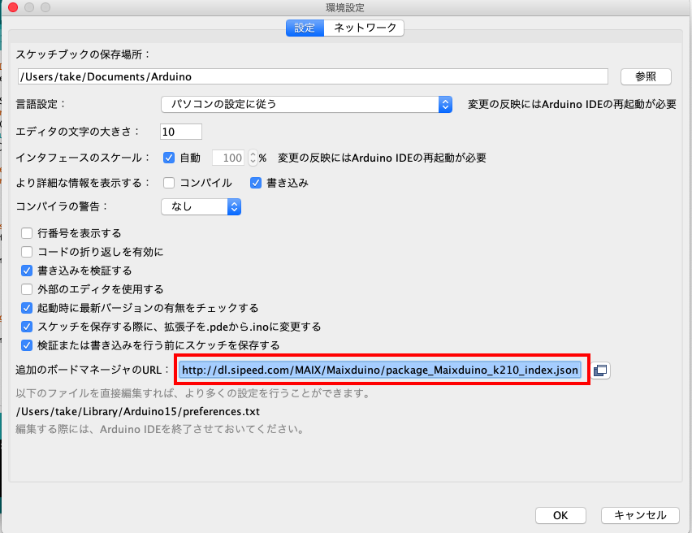
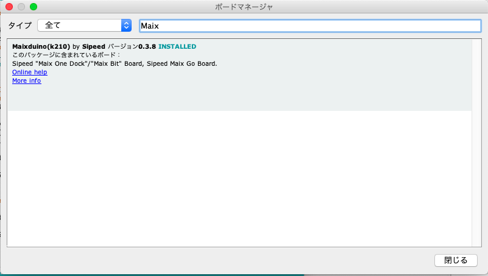
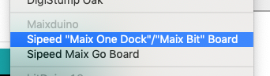
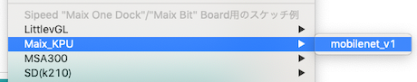
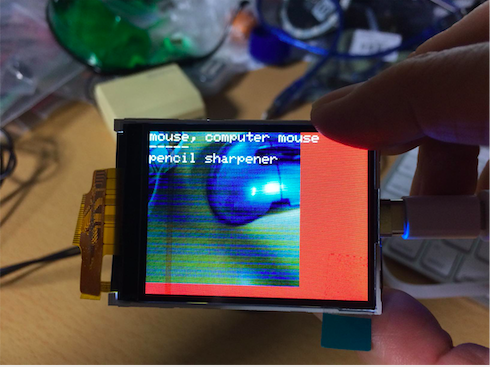

# MaixDuino

先日、SiPEEDにMAiXのArduino IDE対応版Maixduinoのページがあることに気づきました。
- https://maixduino.sipeed.com/en/

電波法の規制からMAiXシリーズで日本で利用できるのは、WiFiを含まないBitボードのみです。


このBitボードにカメラとLCDをセットしたBit Kitが以下のサイトから購入できます。
- https://www.seeedstudio.com/Sipeed-MAix-BiT-for-RISC-V-AI-IoT-1-p-2873.html


## インストール

MaixDuinoをArduino IDEで使えるようにするには、Preferences...を選択し、
以下の１行をカンマ（,）で区切って追加します。

```
http://dl.sipeed.com/MAIX/Maixduino/package_Maixduino_k210_index.json
```



次に「ツール」メニューの「ボード」から「ボードマネージャ...」を選択します。
最新情報の読み込みが終わったら、検索ボックスにMaixと入力すると、Maixduino
の項目が表示されますので、インストールボタンでインストールしてください。




サイドボードマネージャを選択し、Sipeed "Maix OneDock"/"Maix Bit" Boardを選択してくだしい。



同時にシリアルポートも選択してください。
私の場合、「/dev/cu.wchusbserial1420」を選択します。


##  Lチカに挑戦
定番のLチカでインストールを確認してみましょう。
ボードの13番がLEDに接続されているので、スケッチ例から01.Basics>Blinkを選択します。

「スケッチ」メニューから「ボードに書き込む」を選択すると、Bitボードの３色LEDのグリーン
が点滅します。


## KPUを使ってみる
MAiXの売りのニューラルネット・ハードウェアアクセラレータ（KPU）の例題を動かしてみましょう。

この例題を実行するには、mobilenetv1_1.0.kmodelとlabel.txtをSDカードにセットする必要があります。
mobilenetv1_1.0.kmdel、は、以下からダウンロードし、
以下のサイトからmodelsからmobilenetv1_1.0.kmdelを、dataからlabel.txtをダウンロードします。

- https://github.com/kendryte/tensorflow-workspace/tree/master/mobilenetv1

サンプルに合わせるため、mobilenetv1_1.0.kmdelはファイル名を"m"に変更して書き込みます。

### mobilenet_v1を動かす
サンプル例から「Maix_KPU」> 「mobilenet_v1」を選択します。




BitボードにカメラとLCDをセットし、USBケーブルに接続し、
「スケッチ」メニューから「ボードに書き込む」を選択します。

LCDに「Loading ...」とでれば正しく処理が行われています。
しばらくするとカメラ画像が表示され、写しだれたものが何か
識別して表示します。以下の写真は、コンピュータマウスを
正しく認識しています。




