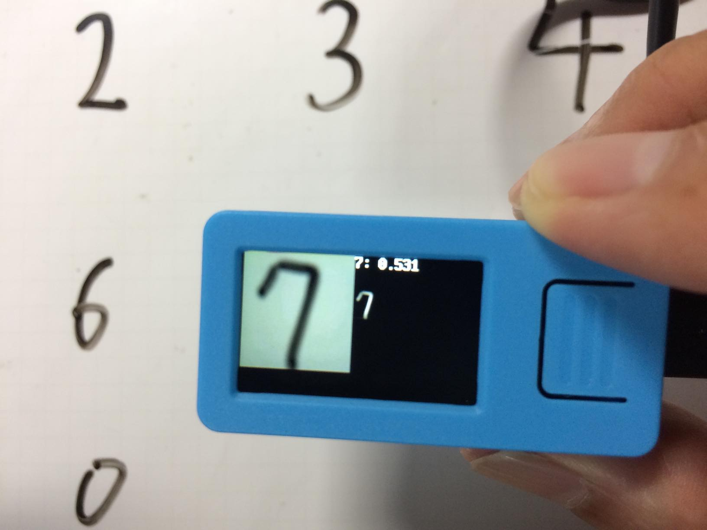

## kmodelの作成手順

kmodelの作成手順を説明したサイトは数少なく、今回は以下のサイトを参考にしました。
- http://blog.shttp://blog.sipeed.com/p/518.html#http://blog.sipeed.com/p/518.html#ipeed.com/p/518.html#


### Docker環境の準備
DockerHubのtakepwave/maixpyenvイメージを使ってmaixpyenvを起動します。
```bash
$ docker run -v `pwd`/workspace:/home/maix/workspace -i --name maixpyenv -t takepwave/maixpyenv
```


## Docker環境の再開

上記の処理で、maixpyenvは実行しますが、一度Docker環境から抜けた場合には、以下のようにして再開します。

```bash
$ docker start maixpyenv
$ docker exec -it maixpyenv /bin/bash
```


## Maix-TF-workspaceでKmodelの作成
準備が整ったので、Maix-TF-workspaceを使ってKmodelを作成してみましょう。

GithubからMaix-TF-workspaceをクローンします。Dockerのシェル環境には、(maix) \$をつけて区別します。
```bash
(maix) $ cd ~/workspace
(maix) $ git clone https://github.com/sipeed/Maix-TF-workspace.git
(maix) $ cd Maix-TF-workspace/mnist
(maix) $ python mnist.py
```

次にMaix-TF-workspaceのmnist例題を実行します。maixpyenvには、あらかじめTensorflowをインストールしていますので、すぐに例題を実行できます。mnist.pyの例題が完了するまで、私のMacbook Airで5分程度でした。

```bash
(maix) $ cd Maix-TF-workspace/mnist
(maix) $ python mnist.py
途中省略
step 4800, train_accuracy 0.86
step 4900, train_accuracy 0.94
WARNING:tensorflow:From /usr/local/lib/python3.7/dist-packages/tensorflow/python/training/saver.py:1276: checkpoint_exists (from tensorflow.python.training.checkpoint_management) is deprecated and will be removed in a future version.
ワーニングが続きます
```

mnist.pyの例題が完了するとmnist.pbファイルが作成されます。

```bash
(maix) $ ls
MNIST_data  logs  mnist.pb  mnist.py  model
```


### mnist.pbからkmodelへの変換
次にMaix_Toolboxを使って、mnist.pbをkmodelに変換します。

最初にmnist.pbを~/Maix_Toolbox/workspaceにコピーします。
```bash
(maix) $ cp mnist.pb ~/Maix_Toolbox/workspace/
```

~/Maix_Toolbox/に移動して、pb2tflite.shを使って.pbファイルから.tflite形式に変換します。
pb2tflite.shを実行すると以下の項目を入力します。
-  .pbファイル名: mnist.pb
- 入力層名称: inputs
- 出力層の名称: output
- 入力画像の幅: 28
- 入力画像の高さ: 28
- 入力画像のチャネル数: 1

```
(maix) $ cd ~/Maix_Toolbox
(maix) $ ./pb2tflite.sh workspace/mnist.pb
This script help you generate cmd to convert *.pb to *.tflite
Please put your pb into workspace dir
1. pb file name: (don't include workspace)
mnist.pb
2. input_arrays name:
inputs
3. output_arrays name:
output
4. input width:
28
5. input height:
28
6. input channel:
1
-----------------------------------
The command you need is:
-----------------------------------
toco --graph_def_file=workspace/mnist.pb --input_format=TENSORFLOW_GRAPHDEF --output_format=TFLITE --output_file=workspace/mnist.tflite --inference_type=FLOAT --input_type=FLOAT --input_arrays=inputs --output_arrays=output --input_shapes=1,28,28,1
以下省略
```


### tflite2kmodel.shは、確認用画像が必要
次にtflite2kmodel.shを使ってtflite形式からkmodelに変換します。

tflite2kmodel.shは、変換を確認するためにテスト用の画像をimagesに入れる必要があります。
このページのgithubのdata/32-dataに10個の画像ファイルがありますので、そちらをimages
ディレクトリにコピーします。

以下のコマンドを実行して、kmodelを作成します。途中ワーニングがでますが、workspaceにmnist.kmodelが作成されます。
```bash
(maix) $ ./tflite2kmodel.sh workspace/mnist.tflite
uasge: ./tflite2kmodel.sh xxx.tflite
2019-09-07 07:40:18.267350: I tensorflow/core/platform/cpu_feature_guard.cc:141] Your CPU supports instructions that this TensorFlow binary was not compiled to use: SSE4.1 SSE4.2 AVX AVX2 FMA
0: InputLayer -> 1x1x28x28
1: K210Conv2d 1x1x28x28 -> 1x16x14x14
2: K210Conv2d 1x16x14x14 -> 1x32x7x7
3: Dequantize 1x32x7x7 -> 1x32x7x7
4: TensorflowFlatten 1x32x7x7 -> 1x1568
5: FullyConnected 1x1568 -> 1x32
6: Quantize 1x32 -> 1x32
7: K210AddPadding 1x32 -> 1x32x4x4
8: K210Conv2d 1x32x4x4 -> 1x10x4x4
9: K210RemovePadding 1x10x4x4 -> 1x10
10: Dequantize 1x10 -> 1x10
11: Softmax 1x10 -> 1x10
12: OutputLayer 1x10
KPU memory usage: 2097152 B
Main memory usage: 14112 B
(maix) $ ls workspace/
mnist.kmodel  mnist.pb  mnist.tflite
```


### 動作確認
出来上がったmnist.kmodelを使って、数字の認識を試してみます。

テストには、M5StickVのmaixpyを使います。
SDカードにmnist.kmodelをmn.kmodelというファイル名でコピーし、M5StickVにSDカードを挿入します。

以下のスクリプトを実行します。

```python
import sensor,lcd,image
import KPU as kpu

lcd.init()
lcd.rotation(2)
sensor.reset()
sensor.set_pixformat(sensor.RGB565)
sensor.set_framesize(sensor.QVGA)
sensor.set_windowing((224, 224))    #set to 224x224 input
sensor.set_hmirror(0)                #flip camera
task = kpu.load("/sd/mn.kmodel")            
sensor.run(1)

def detect():
    img = sensor.snapshot()
    img0=img.resize(112,112)
    lcd.display(img0,oft=(0,0))        #display half picture
    img1=img.to_grayscale(1)        #convert to gray
    img2=img1.resize(28,28)            #resize to mnist input 28x28
    a=img2.invert()                    #invert picture as mnist need
    a=img2.strech_char(1)            #preprocessing pictures, eliminate dark corner
    lcd.display(img2,oft=(112,32))    #display small 28x28 picture
    a=img2.pix_to_ai();                #generate data for ai
    fmap=kpu.forward(task,img2)        #run neural network model
    plist=fmap[:]                    #get result (10 digit's probability)
    pmax=max(plist)                    #get max probability
    max_index=plist.index(pmax)        #get the digit
    lcd.draw_string(112,0,"%d: %.3f"%(max_index,pmax),lcd.WHITE,lcd.BLACK)    #show result

while True:
    detect()
```


### 動作確認
M5StickVを起動すると、以下のようにカメラ画像とそれを28x28の白黒反転させた画像、および認識結果を表示する
画面がでます。

私の手書きした数字を認識させてみました。あまり認識率はよくありませんが、数字は取れているみたいです。

<html>

</html>

## 付録
### Docker環境イメージのビルド方法
GithubからDocker環境を構築する手順を説明します。

- イメージ名: test/maixpyenvとします

```bash
$ git clone https://github.com/take-pwave/maixpy_docker.git
$ cd maixpy_docker
$ docker build -t test/maixpyenv .
```

無事イメージが作成されたら、以下のコマンドを実行します。
```bash
$ mkdir workspace
$ docker run -v `pwd`/workspace:/home/maix/workspace -i --name maixpyenv -t test/maixpyenv
```

