# Arduino UNOのスケッチのソース・デバッグ
Arduino UNOを使い始めて10年あまりが立ちますが、ずっと不思議に思ってことにArduinoのスケッチをソースレベルでデバッグする方法を紹介した記事がないことです。

Arduinoに使われているATmega328P単体ならATMEL Studio（現 Microchip Studio）を使ってC言語のソースデバッグの記事は見かけられますが、
Arduinoとなるとほとんどヒットしません。
また、AVR Studioでソースレベルのデバッグをするには、AVR Dragon（7,350円）やAtmel-ICE(11,000円)と高価なツールが必要でした。

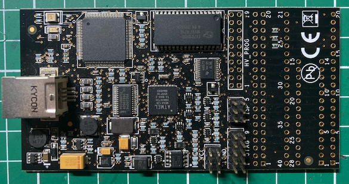

## 安価なデバッグツールMPLAB Snapの登場
トランジスタ技術２０２１年４月号では、基板レベルではありますが安価なMPLAB Snap（2,850円）を使ったデバッグ方法が紹介されました。

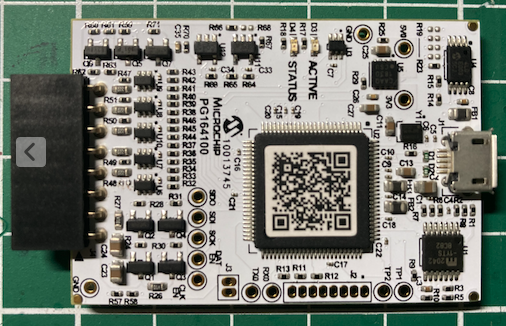

### MPLAB Snapの改造
Microchip StudioでMPLAB Snapを使用するには、少しの準備（改造）が必要です。
- プルダウン抵抗R48の取り外し
- Firmwareの更新

技術２０２１年４月号の写真２（43p）は、少し古いモデルみたいで、私が秋月から購入したものはR48の位置が少し異なっていました。
隙間が狭くピンセットが入らなかったので、チップ抵抗にコテを当てた後ドライバーでずらして、取り外しました。

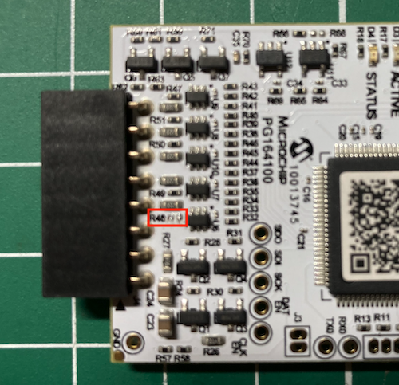

MPLAB SnapのFirmwareの更新には、Windows版のMPLABX IDEが必要です（Mac版では更新できませんでした）。

MPLABX IDEは以下のサイトからMPLABX-v5.45-windows-installer.exeをダウンロードしました。
- https://www.microchip.com/en-us/development-tools-tools-and-software/mplab-x-ide

MPBLAX IDEでATmega328Pのプロジェクトを作成し、MPLAB Snapを接続すると更新できました（すみません画像を取りそこねました）。

更新前のバージョンは
```
Connecting to MPLAB Snap...

Currently loaded versions:
Application version............00.00.17
Boot version...................01.00.00
Script version.................00.04.07
Script build number............59586f4647
Tool pack version .............1.3.305
```

アップグレード後のバージョンは以下のように出力されました。
```
Connecting to MPLAB Snap...

Currently loaded versions:
Application version............00.04.18
Boot version...................01.00.00
Script version.................00.04.07
Script build number............59586f4647
Tool pack version .............1.3.305
```


## Arduino UNOでデバッグツールが動かない理由
Arduino UNOでデバッグツールが動かない理由が以下のサイトに説明されています。
- http://www.solutions-cubed.com/electronic-design-blog/debugging-arduino-sketches-with-atmel-studio-7/

Arduino UNOの公式サイトから回路図の一部を引用します。
- https://www.arduino.cc/en/uploads/Main/Arduino_Uno_Rev3-schematic.pdf

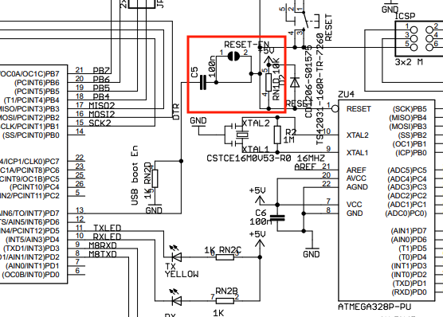

Arduino IDEでスケッチをArduinoにアップロードした後に、Arduinoをリセットする必要があります。
このリセット信号は瞬間的にLOWになるパルスが必要ですが、シリアルの通信でそのような制御はできません。
そこで、CTSをLOWにしたあとC4とRN10のCR回路でリセット信号を作っています。


Arduino IDEにとっては便利なCR回路ですが、これがデバッグツールの制御に悪影響を与え、デバッグできなかったのです。

### シリアルのリセット信号のカット
Arduino UNOの互換器では、CR回路がボードに直付けになっており、切り離すことができません。

しかし、秋月電子から発売されている
<a href="https://akizukidenshi.com/catalog/g/gP-04399/">ＡＴＭＥＧＡ１６８／３２８用マイコンボード（Ｉ／Ｏボード）通販コード：P-04399</a>
を使うとシリアルとの接続（TX, RX, RST）をジャンパーで選択することができます。

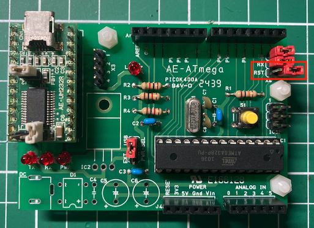


## ArduinoスケッチをMicrochip Studioでデバッグ
残念ながら、Microchip Studioは、Windows版のみが提供されており、MacのVirtualBoxでは動作しませんでした(Paralles, VMwareでは動作が確認されているみたいです)。


### Microchip Studioのインストール
Microchip Studio for AVR and SAM Devices 7.0.2542のオフラインインストーラを以下のURLからダウンロードします。
- https://www.microchip.com/content/dam/mchp/documents/parked-documents/as-installer-7.0.2542-full.exe


### Arduino UNOとMBLAB Snapとの接続
Arduino UNOとMBLAB Snapとの結線は、トランジスタ技術２０２１年４月号の図８から引用します。

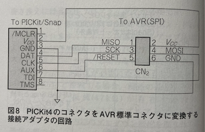

結線を整理すると以下のようになります。

| MPLAB Snap | Arduiono ISPピン |
| :-: | :-- |
| 2: VDD | 2: VCC |
| 3: GND | 6: GND |
| 4: DAT | 1: MISO |
| 5: CLK | 3: SCK |
| 6: AUX | 5: /RESET |
| 7: TDI | 4: MOSI |

自由に切り離せるメス・押すのピンケーブルを使って以下のようにテープでまとめました。

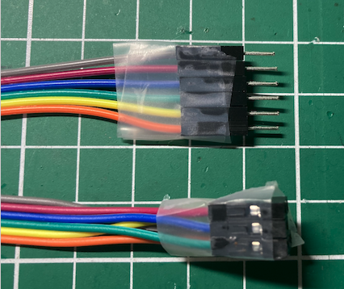


### Arduinoスケッチのインポート
Microchip StudioにArduinoスケッチをインポートする手順は、以下の動画に紹介されています。
- https://onlinedocs.microchip.com/pr/GUID-54E8AE06-C4C4-430C-B316-1C19714D122B-en-US-2/index.html?GUID-438A4502-6265-4930-9D7A-230E3D7BB909

手順としては、以下の通りです。
- File > New > Project...を選択
- プロジェクトの作成ディレクトリを指定
- インポートするスケッチとボード、デバイスを選択

Arduinoプロジェクトの作成画面では、「Create project from Arduino sketch」を選択し、プロジェクト名称、作成ディレクトリを入力して、OKボタンを押下します。

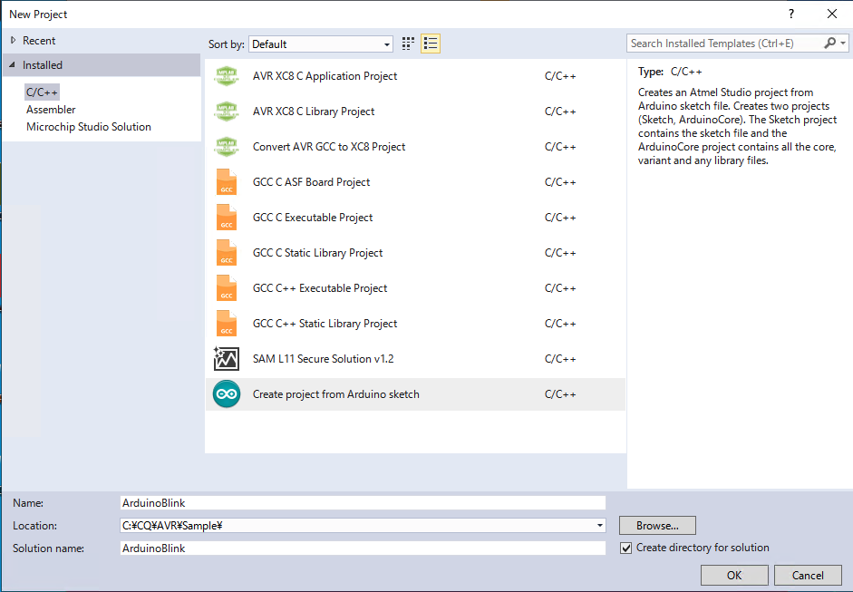


インポートするArduinoのスケッチを指定し、ボードのタイプ、CPUデバイスをセットしてOKボタンを押下します。
必要なライブラリも合わせてインポートされ、Microchip Stduioのプロジェクト画面が表示されます。

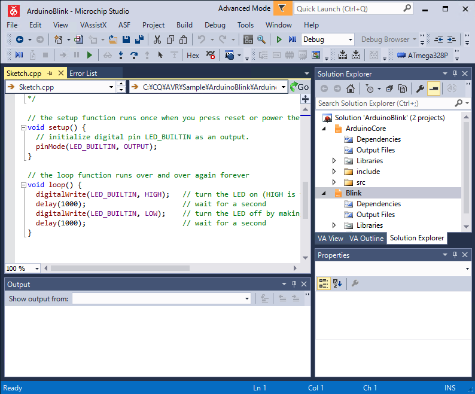


### Arduinoスケッチのデバッグ
Arduinoスケッチをデバッグするときに注意が必要なことにヒューズ・ビットの切り替えです。
ATmega328Pのデバッグには、ISPインタフェースからdebugWIREインタフェースに切り替えるために、
ヒューズ・ビットを書き換える必要があります。

Arduino(ATMEGA168/328用ボード)のジャンパを外して電源をオンにし、MPLAB Snapを接続してください。
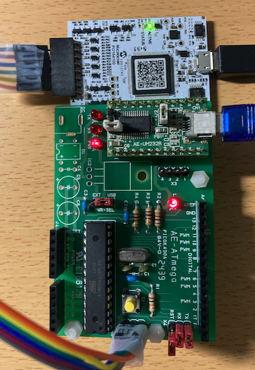


以下の手順でデバッグを開始します。
- Debug > 「プロジェクト名」 Properties...を選択し、debugger/programmerでMPLAB Snapを選択、InterfaceでdebugWIREを選択

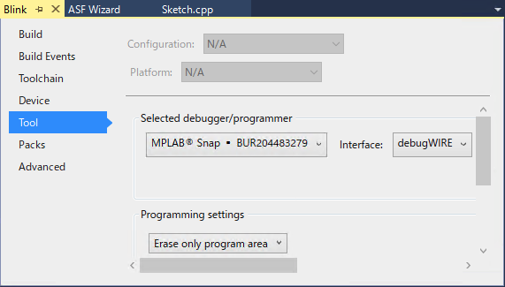


- Debug > Start Debugging and Break(Alt+F5)を選択
- ボードでの最初のデバッグの場合、"Failed to launch debug session with debugWIRE"の警告メッセージがでますので、YESボタンを押下


-「debugWIRE is enabled」情報メッセージができますので、Arduinoの電源を入れ直し後、OKボタンを押下してください。
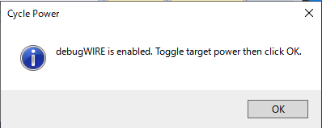


- main関数で停止
Start Debugging and Break(Alt+F5)でデバッグを開始するとmain関数の先頭で停止します。

この後は、Step Over(ステップ実行)、Step Into(関数内に入る)、Step Out (関数を抜ける)、Continue(続ける)等の
デバッグコマンドが使用でき、Autos画面では変数の値が確認できます。

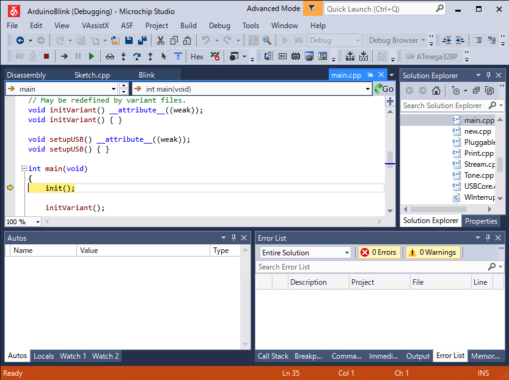


ブレークポイントをセットしておけば、Continueボタンを押下した時にブレークポイントで停止します。

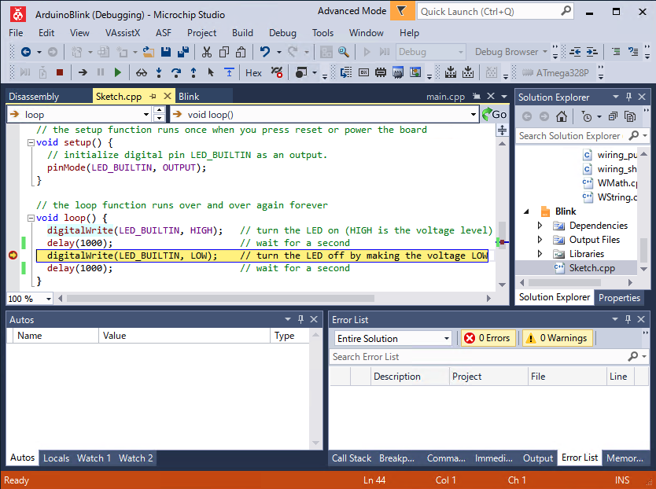


### Launch Failedが出たとき
Launch Failedが出たときには、ターゲットボードの電源またはケーブルの配線をチェックしてください。

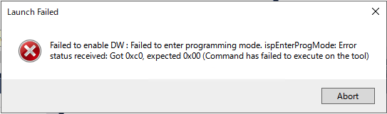


### デバッグ完了時
デバッグを完了したら、必ずISPモードに戻してください。
debugWIREモードからISPモードに戻すには、デバッグの最後に
- Debug > Disable debugWIRE and Closeを選択してください。

