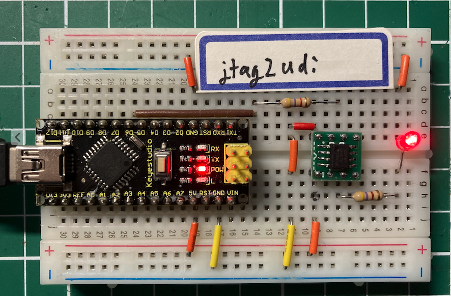
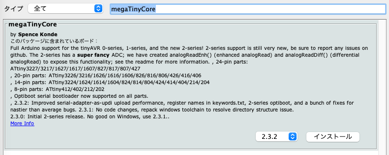
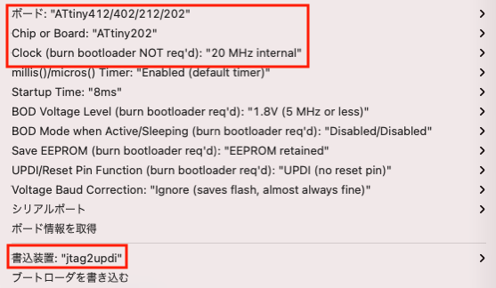
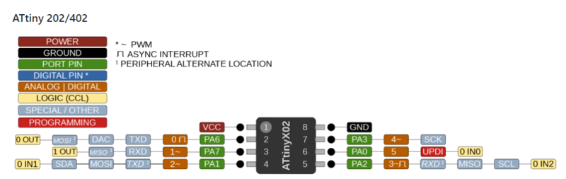

## jtag2updiで最新のATtiny202を使う
ATtiny13Aに代わる８ピンCPUのATtiny202(40円)をArduino IDEでスケッチを書き込めるようにjtag2updi搭載ブレッドボードを作ります。



スケッチの書き込みには、１枚のブレッドボードに収まるArduino Nano（写真左）を使用しました。
右には、SOP8のピッチ変換変換基板(P-05154)に載せたATtiny202とLチカ用のLED,抵抗を接続しています。


### Arduino Nanoのjtag2updi化
Arduino Nanoをjtag2updiの書き込み器にするには、以下のサイトからスケッチをダウンロードして、Arduino Nanoに書き込んでください。
- https://github.com/SpenceKonde/jtag2updi

Arduino NanoとATtiny202の接続は、上記サイトの以下の配線図を参考にしました。
```
                                            V_prog                 V_target
                                              +-+                     +-+
                                               |                       |
 +----------+          +---------------------+ |                       | +--------------------+
 | PC       |          | Programmer          +-+                       +-+  Target            |
 | avrdude  |          |                     |      +----------+         |                    |
 |       TX +----------+ RX              PD6 +------+   4k7    +---------+ UPDI               |
 |          |          |                     |      +----------+         |                    |
 |       RX +----------+ TX                  |                           |                    |
 |          |          |                     |                           |                    |
 |          |          |                     |                           |                    |
 |          |          |                     +--+                     +--+                    |
 +----------+          +---------------------+  |                     |  +--------------------+
             JTAGICE MkII                      +-+     UPDI          +-+
             Protocol                          GND     Protocol      GND

```


### Arduino IDEの設定
Arduino IDEでjtag2updiを使うには、Arduinoメニュー「ツール」>「ボード:」>「ボードマネージャ...」を選択し、ボードマネージャ画面を開き、検索フィールドに「megaTinyCore」と入力するとmegaTinyCoreが検索されます。最新のバージョンを選択し、「インストール」ボタンを押下してください。



### スケッチの書き込み
例題からBlinkを開いて、ボードに「ATtiny412/402/212/202」を選択し、Chip or Board: 「ATtiney2020」を選択、Clockに「20 MHz internal」、書込装置に「jtag2updi」、シリアルポートにArduino Nanoのシリアルをセットして、アップロードを実行してください。




### ATtinyのポート番号
ATtiny2020のピンとArduinoの指定番号と機能を以下に示します。

ArduinoのLED_BUILTINは、３番ピンの1です。

| Pin | Digital | Analog | Function |
|:--:|:--:|:--:|:--|
| 1 | - | - | VCC |
| 2 | 0 | A6 | TXD |
| 3 | 1 | A7 | RXD/LED_BUILTIN |
| 4 | 2 | A1 | SDA/MOSI |
| 5 | 3 | A2 | SCL/MISO |
| 6 | 5 | A0 | SS |
| 7 | 4 | A3 | SCK |
| 8 | - | - | GND |

ピン配置の図を以下から引用します。
- https://miraluna.hatenablog.com/entry/tiny202_shield




## 参考サイト
kosakalabは、古くからAVRの情報を発信されているサイトで、その情報も確かです。
- https://make.kosakalab.com/make/electronic-work/arduino-ide/attiny202-dev/

日本語のデータシート
- https://avr.jp/user/DS/PDF/tiny402.pdf

アプリケーションノート
- https://www.microchip.com/wwwproducts/en/ATTINY202#datasheet-toggle
