## RaspberryPi Picoをはじめよう
Raspberry財団から販売されたRaspberry Pi Pico(以下Picoと省略)が正式にArduino IDEをサポートしました。
それと同時にPlatformIOもPicoをサポートしました。

ここでは、VScodeにPicoの開発環境を構築し、Arduinoフレームワークを使ったアプリの作成とJTAG書き込みツール(jlink-OB)を使ったデバック方法を紹介します。

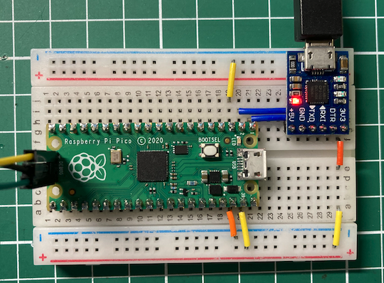

## PlatformIOのインストール
VScodeをまだ使用していない場合は、以下のサイトからダウンロードしてください。
- https://code.visualstudio.com/download


VScodeを起動すると、画面の左側にさまざまなアイコンが並んでいます。PlatformIOは、VScodeのプラグインとして提供されています。プラグインをインストールするには、Extentionsボタンをクリックしてください。

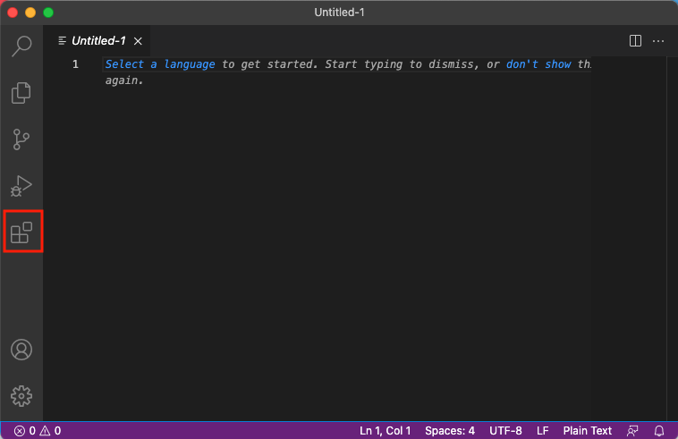

Extenstionの画面では、検索フィールドが表示されるので、「platformio」と入力してください。リストから「PlatformIO IDE」を選択すると、PlatformIO IDEの説明画面が表示されるので、「Install」ボタンをクリックするとインストールが実行されます。

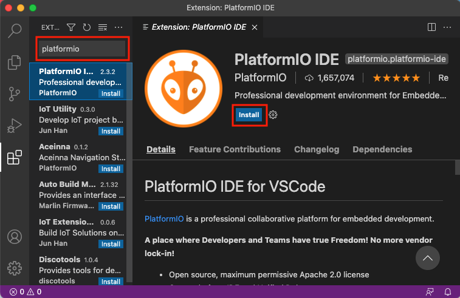


## 新規プロジェクトの作成
PlatformIOがインストールされると左のアイコンリストにアリさん？のようなPlatformIOアイコンが追加されます。

新規のプロジェクトを作成するには、このアイコンをクリックし、「PIO HOME」リストから「Open」を選択すると、以下の画面が表示されます。ここで、「New Project」ボタンをクリックしてください。

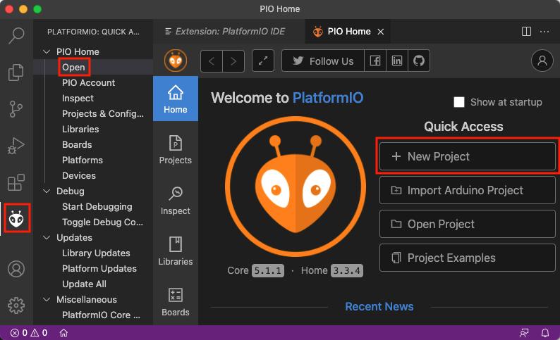

Project Wizard画面に切り替わりますので、プロジェクトの名前をName:フィールドに「L-Chika」と入力し、Boardフィールドには「pico」と入力すると候補が表示されますので「Rasperry Pi Pico」を選択します。Frameworkフィールドには「Arduino」が表示されます。入力が完了したら「Finish」ボタンをクリックしてください。プロジェクトの作成には時間がかかりますので、お茶でも飲みながら待ってください。

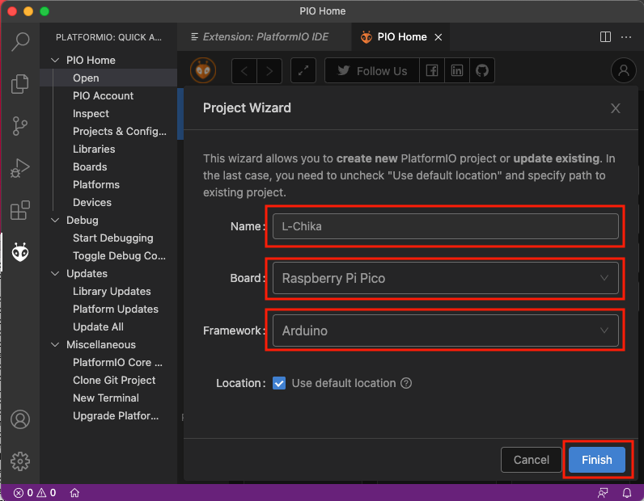


### 設定の変更
プロジェクトが作られると以下のようなplatformio.iniファイルが表示されるます。
このファイルでプロジェクトの設定を行います。

今回は以下の行を追加してください。

```
upload_port = /Volumes/RPI-RP2/

monitor_speed = 115200
build_flags = -g
```

各設定の意味は以下の通りです。
- upload_port: スケッチをアップロードする場所を指定します。MacOSの場合は「/Volumes/RPI-RP2/」とし、Windowsの場合には「COMn」とシリアルポート番号を指定します。
- monitor_speed: Picoとシリアルモニターで通信するときの通信速度を指定します。
- build_flags: C++のビルドコマンドへのオプションを指定します。後でOpenOCDを使ったデバッグを使用するので、「-g」を指定します。

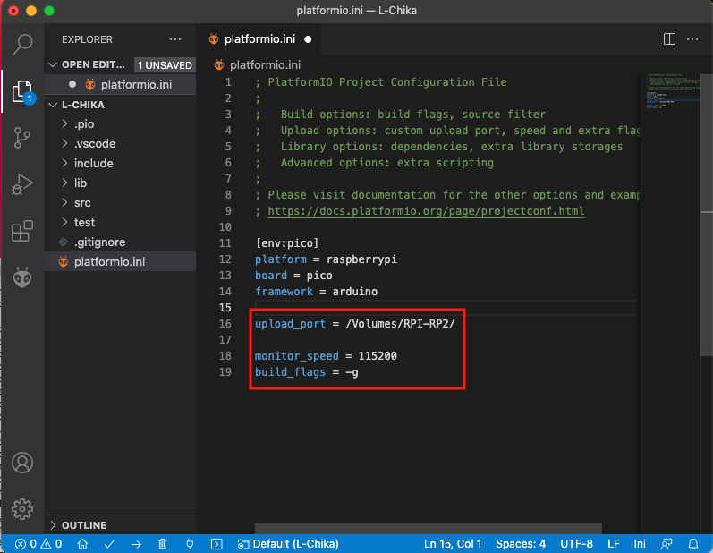

### Lチカスケッチの作成
続いてLチカのスケッチを描きましょう。EXPLORERリストの「src」の中の「main.cpp」をクリックするとArduinoのデフォルトスケッチが表示されますので、以下のLチカスケッチをコピー＆ペーストしてください。

```C++
#include <Arduino.h>

// 起動時に最初に1回だけ実行される関数です
void setup() {
  // ArduinoのデフォルトのLEDピンをデジタル出力に設定します
  pinMode(LED_BUILTIN, OUTPUT);
}

// setup後繰り返し実行されます
void loop() {
  digitalWrite(LED_BUILTIN, HIGH);  // LEDをオン（HIGHは、電圧レベルを指定）
  delay(1000);                      // １秒待ちます
  digitalWrite(LED_BUILTIN, LOW);   // LEDをオフ
  delay(1000);                      // １秒待ちます
}
```

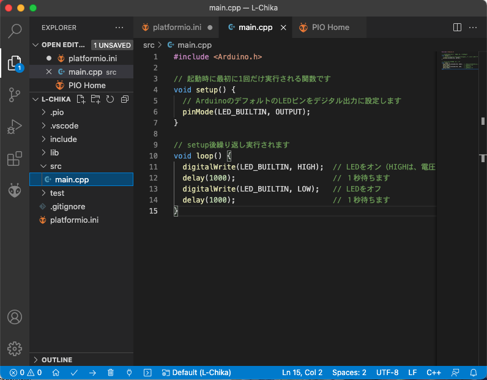


### スケッチのPicoへのアップロード
MacOSの場合、スケッチをアップロードするにはPicoのBOOTSELボタンを押しながらUSBのケーブルを挿入します。USBメモリを差した時と同様にPicoのドライブが現れます。

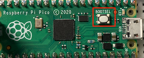

PlatformIOでスケッチをアップロードするには、PlatformIOアイコンをクリックし、QUICK ACCESS>PIO HOMEの中のOpenを選択し、PROJECT TASK>pico>Generalの中のUploadを選択してください。
（以前はすぐにUploadの選択だけでよかったのですが、現在のバージョンではPIO Homeがアクティブの状態でないとUploadが実行されません）

スケッチをコンパイルした後、自動的にアップロードを実行します。

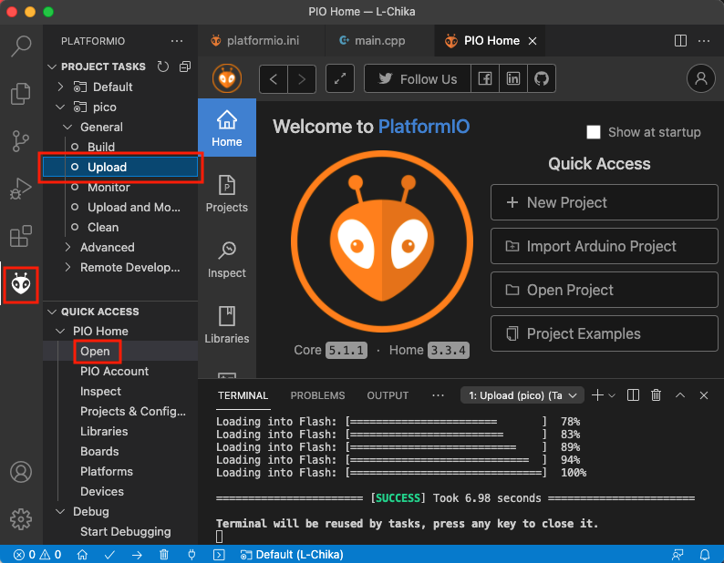

スケッチのアップロードが完了するとPicoのドライブがアンマウントされるので、「ディスクの不正な取り出し」ワーニングがでますが問題ありません。


これでPicoへのLチカスケッチがアップロードが完了し、LEDが１秒間隔で点滅します。

## JTAG書き込みツールを使ったスケッチのデバッグ
Picoにスケッチを書き込むには、JTAG-SWDに対応したJTAG書き込みツールが必要です。

私は自称デバッガーマニア（トランジスタ技術 2012/02 Mac/Linuxでも使える! 簡易デバッガの製作）なので、自作したものを含めいろんなJJTAG書き込みツールを使ってきました。

ここでは、安価なJLink-OBを使います。
aliexpressでは
<a href="https://ja.aliexpress.com/item/32827782488.html">1000円以下</a>
Amazonでも、<a href="https://www.amazon.co.jp/dp/B07F3CV2K2">1990円</a>
で入手できます。

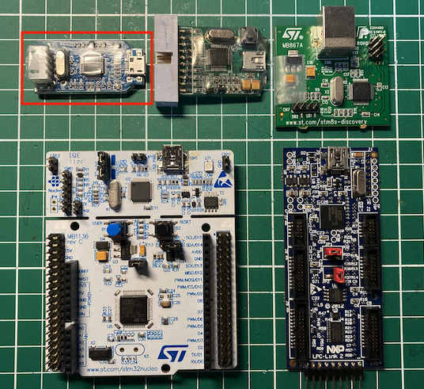

RaspberryPI Pico用のopenocdは以下のJTAG書き込みツールに対応していますが、実際に動作が報告されているものを使うのがよいでしょう。ST-Link V2では、Picoのrp2040.cfgのjwj_newdapでエラーになりました。

```
The following debug adapters are available:
1: ftdi
2: usb_blaster
3: jtag_vpi
4: ft232r
5: presto
6: usbprog
7: openjtag
8: jlink
9: vsllink
10: rlink
11: ulink
12: arm-jtag-ew
13: remote_bitbang
14: hla
15: osbdm
16: opendous
17: aice
18: cmsis-dap
19: kitprog
20: xds110
21: st-link
```

### J-Link OBとの結線
PicoとJ-Link OBとの以下のように接続します。

| pico | J-Link OB |
| :-- | :-: |
| 1 ▼ |  SWCLK |
| 2 | GND |
| 3 | SWDIO |


### OpenOCDコンフィグファイル
Pico用のOpenOCDコンフィグファイル（openocd.cfg）をplatformio.iniと同じディレクトリに作成します。

RP2040の設定については、OpneOCDの大御所<a href="http://nemuisan.blog.bai.ne.jp/?eid=232122">ねむいさん</a>の記事を参考にさせていただきました。

openocd.cfgの内容
```
# インタフェース設定
source [find interface/jlink.cfg]
adapter driver jlink
transport select swd

# RP2040 CPU設定
source [find target/rp2040.cfg]
$_TARGETNAME_0 configure -work-area-phys $_WORKBASE -work-area-size $_WORKSIZE -rtos auto

# デバッガの初期化
adapter speed 1000
gdb_target_description enable
init
reset init
```

### launch設定の変更
PlatformIOのデフォルトデバッガーはPIO debugとなっており、.vscodde配下のlaunch.jsonをOpneOCD用に変更してもVScodeを起動し直すと元に戻ってしまいます。

そこで、左下のギアのアイコン（Manage）>Settingsを選択し、「Search settings」フィールドに「launch」と入力するとUserタブにLaunchが表示されるので、「Edit in setting.json」をクリックしてください。

「configurations」の[]の中をコピー＆ペーストしてください。以下の設定は、Windows10とMacOSXで動作を確認しています。

```
{
    "git.ignoreMissingGitWarning": true,
    "launch": {
    
        "configurations": [
            {
                "name": "Pico debug",
                "type": "cppdbg",
                "request": "launch",
                "program": "${workspaceRoot}/.pio/build/pico/firmware.elf",
                "args": [],
                "stopAtEntry": false,
                "cwd": "${workspaceRoot}",
                "environment": [],
                "externalConsole": false,  
                "debugServerArgs": "-f ${workspaceRoot}/openocd.cfg",
                "serverLaunchTimeout": 20000,
                "filterStderr": true,
                "filterStdout": true,
                // "serverStarted"には、ターゲットの起動が完了した時の出力キーワードを指定する
                "serverStarted": "target halted due to debug-request, current mode: Thread",
                "MIMode": "gdb", 
                "setupCommands": [
                    { "text": "-target-select remote localhost:3333", "description": "connect to target", "ignoreFailures": true },
                    { "text": "-target-download ${workspaceRoot}/.pio/build/pico/firmware.elf", "description": "load image", "ignoreFailures": true },
                ],
                "logging": {
                    "moduleLoad": true,
                    "trace": true,
                    "engineLogging": true,
                    "programOutput": true,
                    "exceptions": true
                },
                "osx": {
                    "MIMode": "gdb",
                    "MIDebuggerPath": "${env:HOME}/.platformio/packages/toolchain-gccarmnoneeabi/bin/arm-none-eabi-gdb",
                    "debugServerPath": "${env:HOME}/.platformio/packages/tool-openocd-raspberrypi/bin/openocd",
                },
                "windows": {
                    "MIMode": "gdb",
                    "miDebuggerPath": "\\Users\\${env:USERNAME}\\.platformio\\packages\\toolchain-gccarmnoneeabi\\bin\\arm-none-eabi-gdb.exe",
                    "debugServerPath": "\\Users\\${env:USERNAME}\\.platformio\\packages\\tool-openocd-raspberrypi\\bin\\openocd.exe",
                }

            }
        ],
        "compounds": []
    }
}
```

### デバッグの開始
準備が整ったで、Lチカ・スケッチをデバッガーで動かしてみましょう。
（MacOSXの人は、これで毎回BOOTSELボタンを押してスケッチを書き込むなくてもよくなります。）

最初にSetup関数の行番号の左をクリックすると赤丸が付きます。これでsetup関数にブレークポイントがセットされます。

左のアイコンリストから「虫と▷」のアイコンを選択し、デバッグプルダウンから「Pico debug」を選択し、「▷」をクリックします。デバッガーが裏でしばらく動いてsetup関数の最初のステップで停止します。

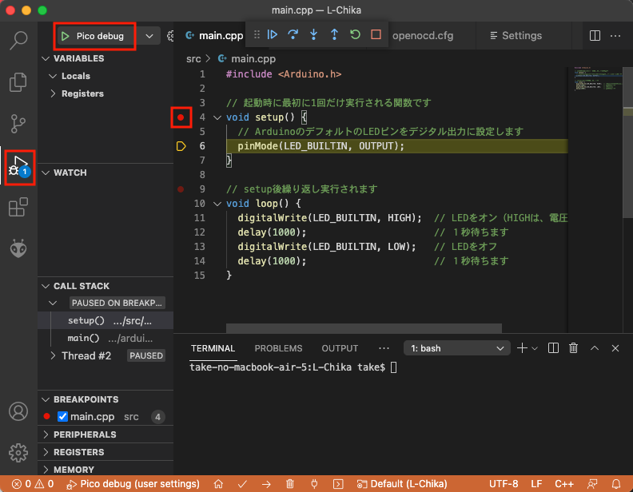

ここで、デバッガーのコマンドパネルで「Continue」や「Step Over」を実行すると、「Exception has occurred」のエラーがでることがあります。

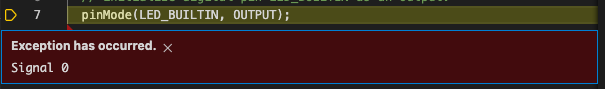

この例外は、ブレークポイントでPicoの２つのCPUのスレッドが両方停止状態になっていないために、発生しているものと思われます。これからの脱出方法として、「Terminal」メニューで「New Terminal」を選択し、ターミナルウィンドウを開き、telnetコマンドを起動し、OpenOCDに接続します。

最初のOpenOCDコマンドhaltは、現在動作しているターゲット（Pico）を停止し、次の「resume」で制御をデバッガに戻しています。

```bash
$ telnet localhost 4444
Trying 127.0.0.1...
Connected to localhost.
Escape character is '^]'.
Open On-Chip Debugger
> halt
> resume
>
```

画面上は何も変わりませんが、これで「Continue」や「Step Over」正常に使えるようになります。

## Windows10固有の設定

### libusbのドライバーの設定
OpenOCDとuploadに使われているコマンドは、libusbのライブラリを使用することを前提に作られているので、Windows10で使用するにはドライバーをセットする必要があります。

通常は、ドライバーのインストーラーが用意されていますが、libusbの場合にはZadigというツールを使用します。

Zadig 2.5は、以下のサイトからダウンロードします。
- https://zadig.akeo.ie/

BOOTSELボタンを押したままPicoにUSBコネクターを差します。
Zadigを起動し、「Options」メニューから「List All Devices」を選択します。

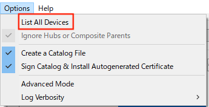

デバイスプルダウンから「RP2 Boot(Interface 1)」を選択し、「libusb-win32(v1.2.6.0)」を選択し、「Install Driver」をクリックします。
インストールはしばらく時間がかかります。

この設定をしておけば、platform.iniでupload_portの指定は不要になります。
;でコメントアウトしてください。

platform.ini
```
; upload_port = COM7
```


同様にJ-LinkをUSBに差してドライバーを「libusb-win32(v1.2.6.0)」に入れ替えます。

### telnetの有効化
Windows10は、そのままではtelnetコマンドが使えません。Windowsの機能画面を開き、「Windowsの機能の有効化または無効化」を選択し、「Telnetクライアント」にチェックを付け、「OK」ボタンをクリックしてください。

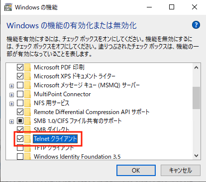


