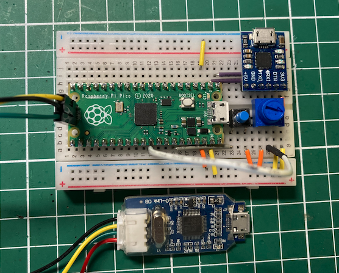
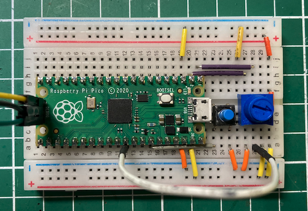
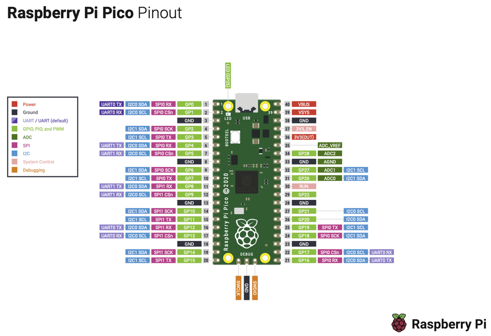
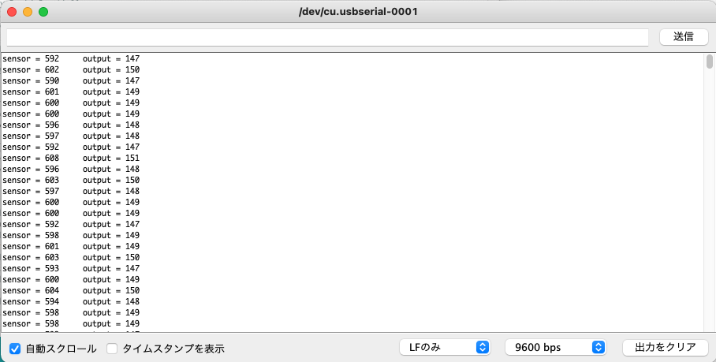
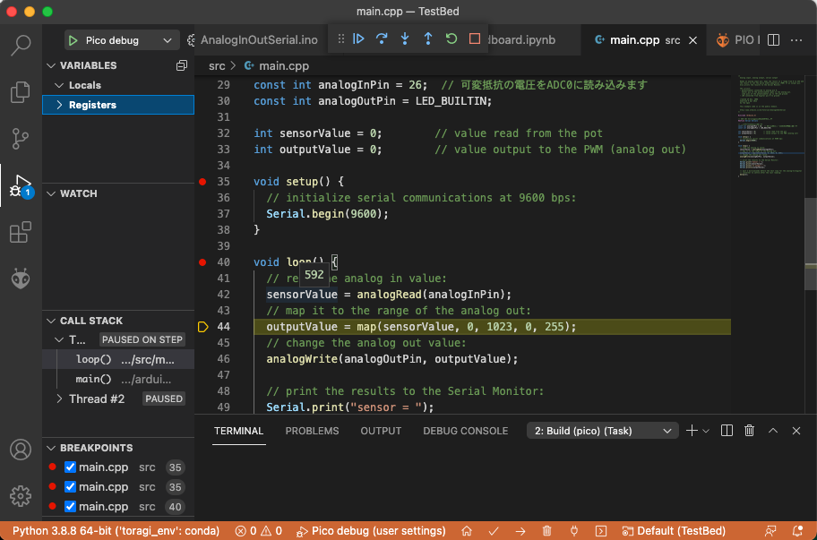
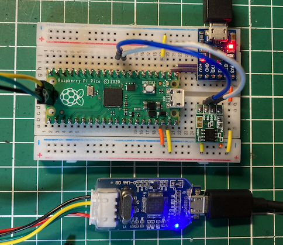
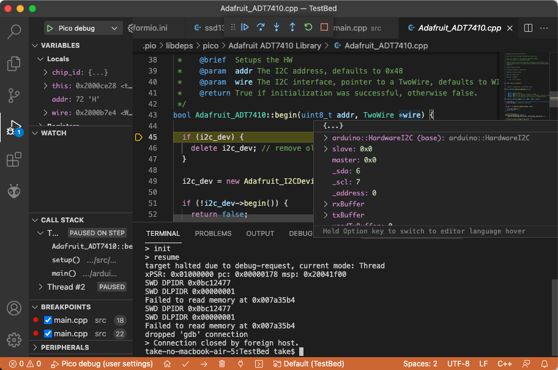
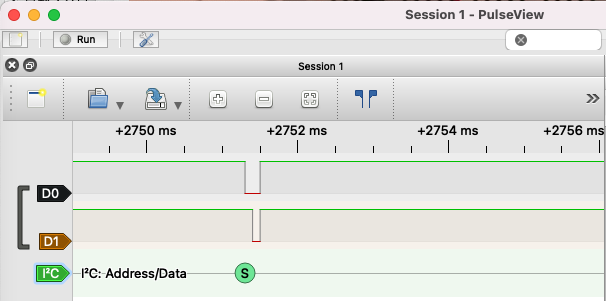
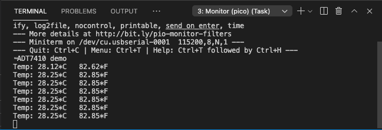
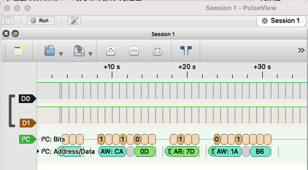

## ブレッドボードでRasPi Picoを使ってみよう
Arduinoと同じようにスケッチを描けるので、ちょっとした動作確認にも
Arduinoの例題スケッチとライブラリが活用できそうです。

前回のLチカに続いて、シリアル通信、スイッチ入力、アナログ入力について、
既存のスケッチを活用して使い方を調べてみましょう。

実験に使うブレッドボードは以下のように組み立てました。



USBシリアル変換を取り除いた配線は、以下のようになります。電源はUSBシリアルから3.3Vを取り込んでいます。



Picoとの結線は以下の通りです。

| Picoピン番号 | GPIO | 接続先 | ピン番号 |
| :-- | :-- | :-- | :-- |
| 1 | GP0(TX) | USBシリアル変換 | RXI |
| 2 | GP1(RX) | USBシリアル変換 | TXD |
| 3 | GND | USBシリアル変換 | GND |
| 31 | GP26(ADC0) | 半固定抵抗 | 2番ピン |
| 34 | GP28 | タクトスイッチ | 1番ピン |
| 38 | GND | ブレッドボード | GND |
| 39 | VSYS | ブレッドボード | 3.3V |

参考にPicoのPinoutをドキュメントから引用します。



## シリアル通信に挑戦
スケッチをデバッグする時にも活躍するシリアル通信から使い方を確認していきましょう。

Arduino IDEのファイル>スケッチ例>04.Communication>ASCIITableの例題を使います。
main.cppにコピーして、先頭に以下の１行を追加します。

```C++
#include <Arduino.h>
```

Arduino IDEの「シリアルモニタ」を開いて待っていても何も表示されません。

こうなったら前回紹介したデバッガーの登場です。setup関数にブレークポイントを付けて調べていくと、
Serial.beginの次のwhile文でずっと廻っています。

```C++
  //Initialize serial and wait for port to open:
  Serial.begin(9600));
  while (!Serial) {
    ; // wait for serial port to connect. Needed for native USB port only
  }
```

### PicoのデフォルトはUSB CDCシリアルだった
Picoは、Arduino Leonardoと同じUSB機能搭載のCPUボードなので、SerialはUSBコネクター使ってシリアル通信を行うUSB CDC(Communications Device Class)シリアルでした。USB CDCシリアルではPicoのUSBポートをつながないとシリアルモニタからシリアルポートを見つけることができません。
私の場合、ASCIIテーブルの一部を取りこぼしました。

これでは都合が悪いので、USB CDCシリアルではなく、外付けのシリアルポートに接続する方法を探しました。
スイッチサイエンスのサイトに以下の情報があったので、試してみました。

「ハードウェアシリアルポート(0番ピンおよび1番ピン、RXおよびTX)を使用するには、Serial1クラスを使って下さい。」
- https://trac.switch-science.com/wiki/Guide/ArduinoLeonardo

そこで、ASCIITableスケッチのsetup関数の前に、以下のdefine文を挿入したところ、無事外付けのUSBシリアルから出力できました。

```C++
// USB CDC Serialではなく、UART0を使う
#define Serial Serial1
```

## スイッチとシリアルポートを使う
シリアルポートが使えるようになったので、シリアルポートから読み取った値シリアルポートに出力するスケッチを試してみます。

スケッチの先頭部分を以下のように変更して動かしてみましょう。

```C++
#include <Arduino.h>

// USB CDC Serialではなく、UART0を使う
#define Serial Serial1

// 使用するピンを定義します
const int analogInPin = 26;  // 可変抵抗の電圧をADC0に読み込むピン
const int analogOutPin = LED_BUILTIN; 

int sensorValue = 0;        // value read from the pot
int outputValue = 0;        // value output to the PWM (analog out)
```

可変抵抗を回すとsensorの値が0から1023の値に変わります。（どうも最低は2までにしか落ちませんでした）



Picoには、12bitのアナログデジタル変換(ADC)ポートが３個用意されており、それぞれ以下のGPIOに割り当てられています。

| Pico GPIO | Picoビン番号 | ADCポート |
| :--: | :--: | :--: |
| GP26 | 31 | ADC0 |
| GP27 | 32 | ADC1 |
| GP28 | 33 | ADC2 |

PicoのADCは12bitなので、解像度は10bitの４倍なのですが、analogRead関数を使うと10bitの値に変換されて返されるようです。

デバッガを使うと変数の値を直接確認できるので、とても便利です。



### タクトスイッチを追加
次にタクトスイッチを押したときにだけ、半固定の値を読み取り、シリアルに出力する例に変更します。

タクトスイッチの入力には、34番ピンのGP28を使用します。

以下のスケッチで動きを見てみましょう。

```C++
#include <Arduino.h>

// USB CDC Serialではなく、UART0を使う
#define Serial Serial1

// 使用するピンを定義します
const int analogInPin = 26; // 可変抵抗の電圧をADC0に読み込むピン
const int analogOutPin = LED_BUILTIN; 
const int switchPin = 28;   // タクトスイッチの入力ピン

int sensorValue = 0;        // 可変抵抗の電圧の読み取り値
int outputValue = 0;        // LEDへのPWMの値（レート）

void setup() {
  Serial.begin(9600);
  pinMode(switchPin, INPUT_PULLUP);
}

void loop() {
  if (digitalRead(switchPin) == LOW) {
    sensorValue = analogRead(analogInPin);
    outputValue = map(sensorValue, 0, 1023, 0, 255);
    analogWrite(analogOutPin, outputValue);

    Serial.print("sensor = ");
    Serial.print(sensorValue);
    Serial.print("\t output = ");
    Serial.println(outputValue);
    }

  delay(500);
}
```

## I2C 温度センサーADT7410を使ってみる
はじめてのCPUボードでI2C接続のテストをするときには、設定項目が少ない温度センサーを使うといいです。

ここでは、秋月で簡単に購入できる
<a href="https://akizukidenshi.com/catalog/g/gM-06675/">
I2C温度センサーADT7410
</a>
を使います。

Arduinoの便利ところは、市販のセンサーに対するライブラリが揃っているところです。今回はAdafruit_ADT7410ライブラリを使用します。

動作確認には、Adafruit_ADT7410ライブラリのサンプルadt7410testを使用します。



最初に確認する項目は、I2Cで使用するピンがどれかを知ることです。PicoのArduinoライブラリは、まだドキュメントが整備されていないため、デバッガを使ってピンを確認してみましょう。

adt7410testのsetupのtempsensor.begin()を呼び出している行にブレークポイントをセットし、Step Intoでbegin関数の中に入っていきます。

```C++
void setup() {
  Serial.begin(115200);
  Serial.println("ADT7410 demo");

  if (!tempsensor.begin()) { 
    Serial.println("Could not find ADT7410!");
    while (1);
  }  
```

Adafruit_ADT7410のbeginの最初のでi2c_devの内容から
- _sda: 6
- _scl: 7

がセットされていることが確認できました。



ピンを確認できたので、実際にADT740をつないで、動かしてみましたがi2c_dev.begin()が失敗していることが分かりました。

こうなると何が悪いのかを調べるのは難しくなります。そこでワンコインで購入できるロジックアナライザーを使って、GIO6, GIO7から信号がでているかを確認しました。



この結果mbedとArduinoのラッパー関数の解釈が異なり、正常に動作しないことが分かりました。

そこで、tempsensor.begin()の戻り値チェックをしないようにし、正常に動作することを確認しました。

```C++
  // if (!tempsensor.begin()) {
  //   Serial.println("Couldn't find ADT7410!");
  //   while (1);
  // }
  tempsensor.begin();
```

VScodeのシリアルモニターに温度と湿度が無事表示されました。



ロジックアナライザーでもI2Cの信号がやり取りされていることが確認できました。


