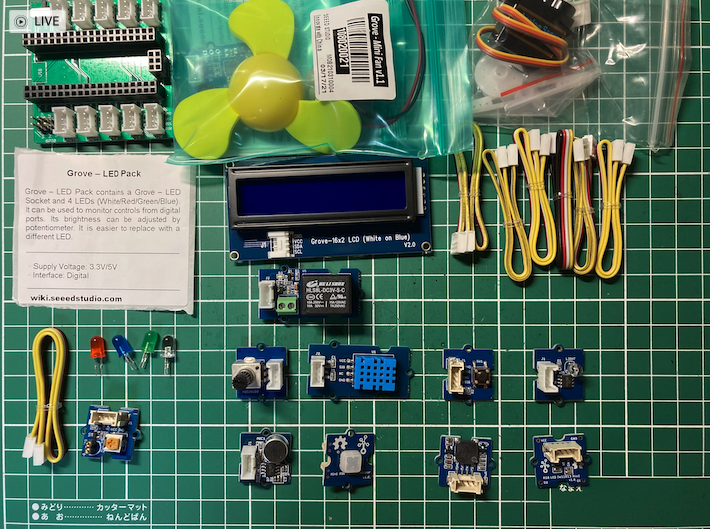
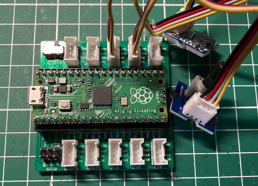

## Grove Starter Kit for Raspberry Pi Pico
Raspberry Pi Picoの使い方を学ぶには、Groveのセンサーを使うのが簡単です。
ここでは、Seeedから販売されている
<a href="https://www.seeedstudio.com/Grove-Starter-Kit-for-Raspberry-Pi-Pico-p-4851.html">Grove Starter Kit for Raspberry Pi Pico</a>
を使いますが、秋月からも購入できる以下の組み合わせもお手軽です。
- <a href="https://akizukidenshi.com/catalog/g/gK-15515/">Grove Beginner Kit for Arduino</a>
- <a href="https://akizukidenshi.com/catalog/g/gM-16336/">Grove Shield for Pi PicoPico</a>

Grove Starter Kit for Raspberry Pi Picoには、以下のアイテムが含まれています。
- Grove - LED Pack
- Grove - RGB LED(WS2813 Mini)
- Grove - Light Sensor
- Grove - Sound Sensor
- Grove - Rotary ANgle Sensor
- Grove - Temperature & Humidity Sensor
- Grove - Button
- Grove - Servo
- Grove - Mini Fan
- Grove - 16x2 LCD
- Grove Shield for Pi Pico
- Grove Cable x 8




## サンプルスケッチ
<a href="https://wiki.seeedstudio.com/Grove_Shield_for_Pi_Pico_V1.0/">
SeeedのWikiサイト
</a>
には、Pythonを使った例題しかないので、ここではArduino IDE（VScode PlatformIOを使用）での
スケッチに書き換えて試してみます。

### Project1(ブザーの音量を調整)
Project1では、以下のアイテムを使用します。
- Grove Buzzer（A1ポートに接続）
- Grove Rotary Angle Sensor（A0ポートに接続）



スケッチは、以下の通りです。

```C++
// Project1 for Pico for Arduino Framework
#include <Arduino.h>

#define ROTARY_ANGLE_SENSOR A0
#define BUZZER 27

void setup() {
  Serial.begin(115200);
  pinMode(ROTARY_ANGLE_SENSOR, INPUT);
  pinMode(BUZZER, OUTPUT); 
}

void loop() {
  // 可変抵抗の電圧を読み取る
  int sensorValue = analogRead(ROTARY_ANGLE_SENSOR);
  // ブザーの音量を計算
  int duty = map(sensorValue, 0, 1023, 0, 255/2);
  Serial.print("Sensor value=");
  Serial.println(sensorValue);
  // ブザーの音量をセット
  analogWrite(BUZZER, duty);
  delay(500);
}
```

Raspberry Pi PicoのADCは、12bitあるのですが、Arduino APIに合わせているため、analogReadの値は、0-1023となっています。

### Project2（温度・湿度の表示）
Project2では、以下のアイテムを使用します。
- Grove - 16x2 LCD（I2C1ポートに接続）
- Grove - Temperature & Humidity Sensor（D18ポートに接続）


Grove - 16x2 LCDは、I2C版の16x2LCDで、以下のライブラリを使用します。
- Grove - LCD RGB Backlight
- Grove - Temperature And Humidity Sensor

VScodeのPlatformIOを使用する場合には、lib_depsを以下のように設定してください。
```
lib_deps =
    seeed-studio/Grove - LCD RGB Backlight @ ^1.0.0
```


