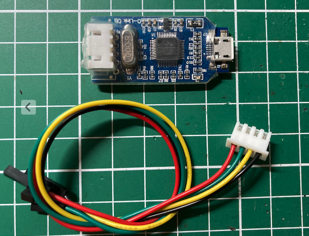
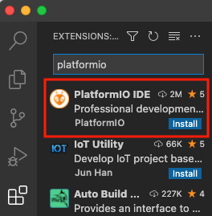
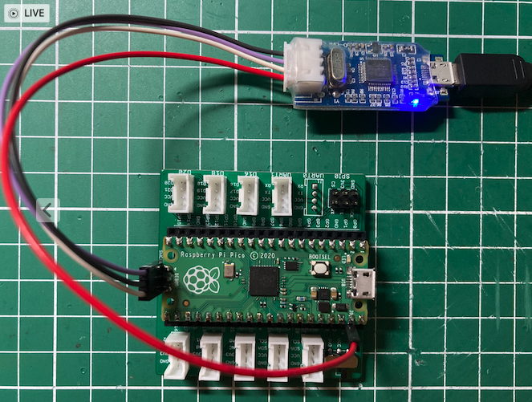
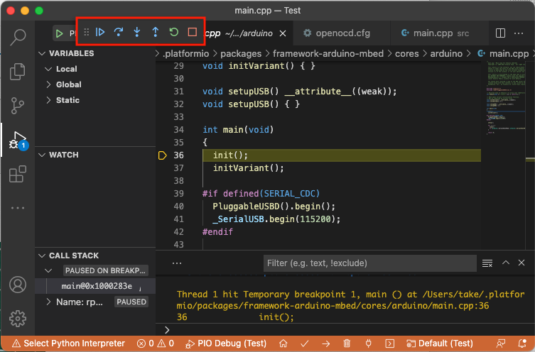
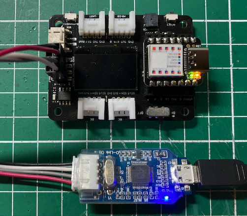
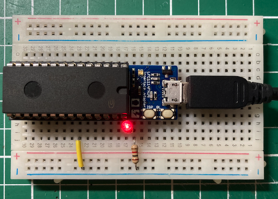
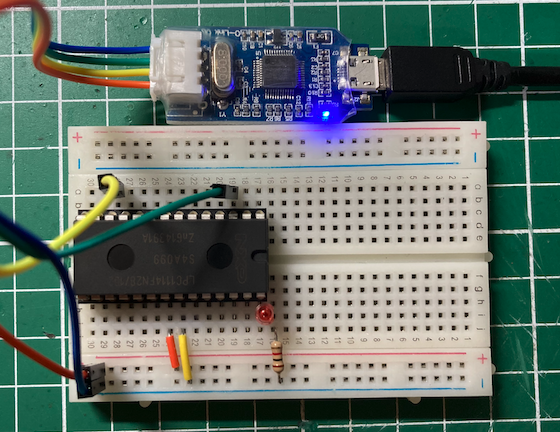
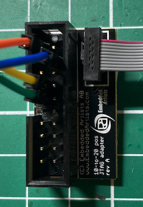
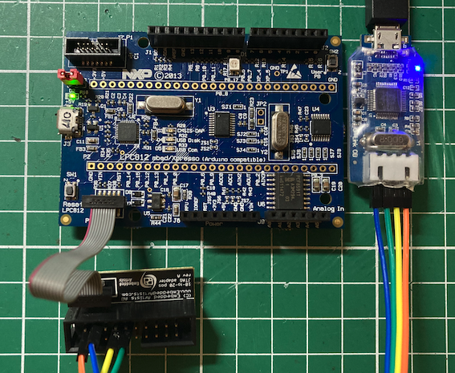
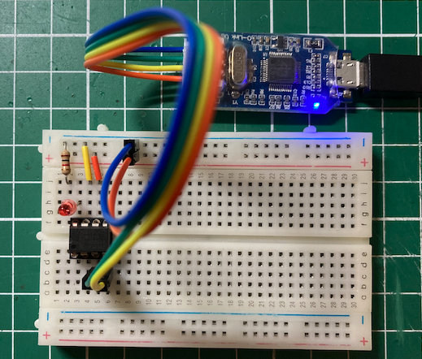

# VScode(PlatformIO)+OpenOCDでjlink-OBを使い尽くす


## jlink-OBとは
jlink-OBは、JTAGデバッガーの一つで、ARMのCortex系のデバッグ方式SWDに対応しています。
そのため、RaspberryPi-Pico, XIAO, LPC11U35, LPC812, LPC810, LPC1114FN28等をデバッグ
できます。




jlink-OBは求めやすい価格でAmazonやAliExpressから購入することができます。

## VScode(PlatformIO)の魅力
VScodeはとても軽く、複数の言語に対して一貫した環境を提供してくれるすばらしいエディタです。
このエディタで使える拡張機能のPlatformIOは、ボードのコンパイラー、アップローダー、デバッガーの開発環境を
platform.iniファイルに記述するだけで整えてくれる優れものです。

## PlatformIOのインストール
VScodeのCode>Prefrences>Extensionsとメニューを選択すると、EXTENSIONSの一覧リストが画面左に表示されます（画面左のExtensionsアイコンでも可）。
ここで、「platformio」と入力すると、先頭にPlatformIO IDEが表示されますの「install」ボタンを押下するだけ、自動的にインストールされます（途中VScodeの再起動を要求されます）。




## Raspberry Pi PicoのBlinkサンプルを動かす
Rasberry Pi PicoのArduino環境が提供され、同時にPlatformIOでも利用できるようになりました。

ここでは、以下の手順でBlink（Lチカ）を動かしてみます。
+ Arduinoの基本サンプルBlinkのビルド
+ BlinkのバイナリのRasberry Pi Picoへのアップロード
+ デバッグ環境の構築

### 新規プロジェクトの作成
PlatformIOの新規プロジェクトの作成は、PlatformIO拡張機能を選択してGUIでもできますが、
VScodeのターミナルからコマンドラインで行った方が手短にできます。

VSCodeでプロジェクトを作成したフォルダーを開きます（File>Open Folder...を選択）。

次にターミナルウィンドウを開き、Raspberry Pi Picoのボードを検索します。
Raspberry Pi PicoのID（pico）をメモします。

``` bash
$ ~/.platformio/penv/bin/pio boards "Raspberry Pi Pico"

Platform: raspberrypi
====================================================================
ID    MCU     Frequency    Flash    RAM    Name
----  ------  -----------  -------  -----  -----------------
pico  RP2040  133MHz       2MB      264KB  Raspberry Pi Pico
pico  RP2040  133MHz       2MB      264KB  Raspberry Pi Pico

Platform: wizio-pico
====================================================================
ID                 MCU     Frequency    Flash    RAM    Name
-----------------  ------  -----------  -------  -----  ---------------------------------------
pico-dap           RP2040  125MHz       2MB      256KB  WizIO - Raspberry Pi Pico ( CMSIS-DAP )
raspberry-pi-pico  RP2040  125MHz       2MB      256KB  WizIO - Raspberry Pi Pico ( PICOPROBE )
```

ボードのID（pico）を使って、pio init --board picoを実行してプロジェクトを作成します。

``` bash
$ ~/.platformio/penv/bin/pio init --board pico

The current working directory /Users/take/Documents/PlatformIO/Projects/Test will be used for the project.

The next files/directories have been created in /Users/take/Documents/PlatformIO/Projects/Test
include - Put project header files here
lib - Put here project specific (private) libraries
src - Put project source files here
platformio.ini - Project Configuration File

Project has been successfully updated! Useful commands:
`pio run` - process/build project from the current directory
`pio run --target upload` or `pio run -t upload` - upload firmware to a target
`pio run --target clean` - clean project (remove compiled files)
`pio run --help` - additional information
```

platformio.iniをみると、以下の設定となっています。

```
[env:pico]
platform = raspberrypi
board = pico
framework = arduino
```

### ソースファイルの作成
srcフォルダーの下にmain.cppを作成し、以下の以下のプログラム（ArduinoのBlinkサンプルから引用）をペーストします。

``` C++
#include <Arduino.h>

#define LED_PIN LED_BUILTIN
// the setup function runs once when you press reset or power the board
void setup() {
  // initialize digital pin LED_BUILTIN as an output.
  pinMode(LED_BUILTIN, OUTPUT);
}

// the loop function runs over and over again forever
void loop() {
  digitalWrite(LED_BUILTIN, HIGH);   // turn the LED on (HIGH is the voltage level)
  delay(1000);                       // wait for a second
  digitalWrite(LED_BUILTIN, LOW);    // turn the LED off by making the voltage LOW
  delay(1000);                       // wait for a second
}
```

### Blinkのビルド
PlatformIOのアイコンをクリックし、PROJECT TASKSからGeneral>Buildを選択するとビルドを実行しますが、
ここでは、コマンドラインからpio runを実行します。

``` bash
$ ~/.platformio/penv/bin/pio run 
Processing pico (platform: raspberrypi; board: pico; framework: arduino)
--------------------------------------------------------------------
Verbose mode can be enabled via `-v, --verbose` option
CONFIGURATION: https://docs.platformio.org/page/boards/raspberrypi/pico.html
PLATFORM: Raspberry Pi RP2040 (1.4.0) > Raspberry Pi Pico
HARDWARE: RP2040 133MHz, 264KB RAM, 2MB Flash
DEBUG: Current (cmsis-dap) External (cmsis-dap, jlink, raspberrypi-swd)
PACKAGES: 
 - framework-arduino-mbed 2.5.2 
 - tool-rp2040tools 1.0.2 
 - toolchain-gccarmnoneeabi 1.90201.191206 (9.2.1)
LDF: Library Dependency Finder -> https://bit.ly/configure-pio-ldf
LDF Modes: Finder ~ chain, Compatibility ~ soft
Found 30 compatible libraries
Scanning dependencies...
No dependencies
Building in release mode
Compiling .pio/build/pico/src/main.cpp.o
Generating LD script .pio/build/pico/cpp.linker_script.ld
Compiling .pio/build/pico/FrameworkArduinoVariant/double_tap_usb_boot.cpp.o
途中省略
Archiving .pio/build/pico/libFrameworkArduino.a
Indexing .pio/build/pico/libFrameworkArduino.a
Linking .pio/build/pico/firmware.elf
Generating UF2 image
elf2uf2 ".pio/build/pico/firmware.elf" ".pio/build/pico/firmware.uf2"
Checking size .pio/build/pico/firmware.elf
Advanced Memory Usage is available via "PlatformIO Home > Project Inspect"
RAM:   [==        ]  15.1% (used 40688 bytes from 270336 bytes)
Flash: [          ]   0.2% (used 4034 bytes from 2097152 bytes)
Building .pio/build/pico/firmware.bin
=================== [SUCCESS] Took 26.56 seconds ===================
```

### バイナリのアップロード
ビルドで作成されたバイナリファイルをRaspberry Pi Picoにアップロードします。
最初にRaspberry Pi Picoの「BOOTSEL」とかかれた白いボタンを押しながら、USBケーブルをPCに接続します。
RPI-RP2というボリュームがマウントされます。Macの場合/Volumes/RPI-RP2にマウントされます。

そこで、platformio.iniに以下の行を追加します。

```
upload_port = /Volumes/RPI-RP2
```

PROJECT TASKSからGeneral>Uploadを選択するとバイナリのアップロードを実行しますが、
ここでは、コマンドラインからpio run -t uploadを実行します。

``` bash
$ ~/.platformio/penv/bin/pio run -t upload 
Processing pico (platform: raspberrypi; board: pico; framework: arduino)
--------------------------------------------------------------------
Verbose mode can be enabled via `-v, --verbose` option
CONFIGURATION: https://docs.platformio.org/page/boards/raspberrypi/pico.html
PLATFORM: Raspberry Pi RP2040 (1.4.0) > Raspberry Pi Pico
HARDWARE: RP2040 133MHz, 264KB RAM, 2MB Flash
DEBUG: Current (cmsis-dap) External (cmsis-dap, jlink, raspberrypi-swd)
PACKAGES: 
 - framework-arduino-mbed 2.5.2 
 - tool-openocd-raspberrypi 2.1100.0 (11.0) 
 - tool-rp2040tools 1.0.2 
 - toolchain-gccarmnoneeabi 1.90201.191206 (9.2.1)
LDF: Library Dependency Finder -> https://bit.ly/configure-pio-ldf
LDF Modes: Finder ~ chain, Compatibility ~ soft
Found 30 compatible libraries
Scanning dependencies...
No dependencies
Building in release mode
Checking size .pio/build/pico/firmware.elf
Advanced Memory Usage is available via "PlatformIO Home > Project Inspect"
RAM:   [==        ]  15.1% (used 40688 bytes from 270336 bytes)
Flash: [          ]   0.2% (used 4034 bytes from 2097152 bytes)
Configuring upload protocol...
AVAILABLE: cmsis-dap, jlink, picotool, raspberrypi-swd
CURRENT: upload_protocol = picotool
Looking for upload port...
Use manually specified: /Volumes/RPI-RP2
Forcing reset using 1200bps open/close on port /Volumes/RPI-RP2
Uploading .pio/build/pico/firmware.elf
rp2040load 1.0.1 - compiled with go1.15.8
.Loading into Flash: [                              ]  0%
Loading into Flash: [=                             ]  5%
Loading into Flash: [===                           ]  11%
Loading into Flash: [====                          ]  16%
Loading into Flash: [======                        ]  22%
Loading into Flash: [========                      ]  28%
Loading into Flash: [=========                     ]  33%
Loading into Flash: [===========                   ]  39%
Loading into Flash: [=============                 ]  45%
Loading into Flash: [===============               ]  50%
Loading into Flash: [================              ]  56%
Loading into Flash: [==================            ]  61%
Loading into Flash: [====================          ]  67%
Loading into Flash: [=====================         ]  73%
Loading into Flash: [=======================       ]  78%
Loading into Flash: [=========================     ]  84%
Loading into Flash: [===========================   ]  90%
Loading into Flash: [============================  ]  95%
Loading into Flash: [==============================]  100%

=================== [SUCCESS] Took 4.51 seconds ===================
```

## OpenOCDを使ったデバッグ
OpenOCDは、様々なJTAGデバッガーとGDBを使ってデバッグできるようにしたツールです。
オープンソースで公開されているため、多くの場面で使われています。

PlatformIOもデバッグにOpenOCDを使用していますが、その設定がユーザからは見えません。
そのため、PlatformIOの環境でサポートされていないJTAGデバッガーを使えないと思っていました。
しかし、カスタム設定を使ってOpenOCDの起動方法を指定することができることが分かりました。

## Jlink-OBを使う
Raspberry Pi Pico用のopenocdは、特別なopenocdを使いますが、PlatformIOがtool-openocd-raspberrypiにインストールしています。

本題のjlink-OBを使ってデバッグできるようにplatformio.iniに以下の行を追加します。

```
debug_tool = custom
debug_server =
  $PLATFORMIO_CORE_DIR/packages/tool-openocd-raspberrypi/bin/openocd
  -f openocd.cfg
```

次にopenocd.cfgファイルを作成し、以下の内容とします。

```
# インタフェース設定
source [find interface/jlink.cfg]
adapter driver jlink
transport select swd

# CPUの設定
source [find target/rp2040.cfg]

# デバッガの初期化
adapter speed 1000
gdb_target_description enable
init
reset init
```

使用するインタフェース（JTAG）は、jlink-obなので、インタフェース設定は他のCPUを使う場合も変わりません。

使用するCPUに合わせて「ターゲットCPUの設定」をします。findコマンドでtarget/rp2040.cfgの場所を探し、そのファイルをsourceコマンドで読み込みます。

```
source [find target/rp2040.cfg]
```

デバッガの初期化もほとんど変わりません。

### jlink-obとRaspberry Pi Picoとの結線
SWD方式のjlink-obが使う信号は、GND, SWDIO, SWCLKの３線です。jlink-obはこれに加えて3.3Vも供給しているので、
jlink-obのUSBケーブル1本でデバッグすることができます。

 jlink-obとRaspberry Pi Picoとの結線は、以下の通りです。

| jlink-ob | Raspberry Pi Pico |
| --- | --- |
| GND | GND |
| SWDIO | SWDIO |
| SWCLK | SWCLK |
| 3.3V | VSYS |





### デバッグの実行
VScodeのメニューからRun>Start Debuggingを選択すると、デバッグ用のバイナリファイルを
作成し、デバッガを起動します。

後は、デバッガー用アイコンとソースファイルのブレークポイントを使ってデバッグを進めます。




デバッガーを使った開発のもう一つの利点は、BOOTSELボタンを押しながらUSBプラグを抜き差ししなくて済むことです。
ただし、バイナリがデバッグ情報を含むため、サイズが大きくなる点に注意が必要です。

## XIAOを試してみる
PlatformIOでのプロジェクトの作り方が分かったところで、SeeedのXIAOボードにBlinkを書き込んでみましょう。

最初にボードのIDを調べます。

``` bash
$ ~/.platformio/penv/bin/pio boards XIAO

Platform: atmelsam
======================================================================
ID          MCU         Frequency    Flash    RAM    Name
----------  ----------  -----------  -------  -----  --------------
seeed_xiao  SAMD21G18A  48MHz        256KB    32KB   Seeeduino XIAO
```

Raspberry Pi Picoと以下のコマンドを実行して、プロジェクトを作成します。

``` bash
$ ~/.platformio/penv/bin/pio init --board seeed_xiao
```

デバッグ用にplatformio.iniに以下を追加します。今回はデフォルトのtool-openocdを使用しています。

```
debug_tool = custom
debug_server =
  $PLATFORMIO_CORE_DIR/packages/tool-openocd/bin/openocd
  -f openocd.cfg
```

src/main.cppもRaspberry Pi Picoのプロジェクトからコピーします。

OpenOCDの設定ファイルopenocd.cfgは、以下のようになります。

```
# インタフェース設定
source [find interface/jlink.cfg]
adapter driver jlink
transport select swd

# CPU設定
source [find target/at91samdXX.cfg]

# デバッガの初期化
adapter speed 1000
gdb_target_description enable
init
reset init
```

CPUの設定ファイルを見つける方法は簡単です。
Googleでplatformio XIAOで検索して、PlatfformIOのページにアクセスします。

Hardwareの項目のMicorcontrollerからCPUがATMEL SAMDシリーズのSAMD21G18Aであることが分かりました。
つぎにsamdをキーワードに以下のコマンドで*.cfgファイルを検索します。

``` bash
$ ls ~/.platformio/packages/tool-openocd/scripts/target/*samd*
/Users/take/.platformio/packages/tool-openocd/scripts/target/at91samdXX.cfg
```
これからtarget/at91samdXX.cfgだと分かります。

### XIAOとjlink-obとの結線
 jlink-obとRaspberry Pi Picoとの結線は、以下の通りです。8ピンソケットの上段を使います。
XIAOのデバッグ用ピンは、基板の裏側にパットとして付いているので、デバッグをする場合には、
XIAO拡張ボードを使用すると便利です。

| jlink-ob | XIAO拡張ボード |
| --- | --- |
| GND | GND |
| SWDIO | SWDIO |
| SWCLK | SWCLK |
| 3.3V | 3V3 |

### デバッグの実行
Raspberry Pi Pico同様、VScodeのメニューからRun>Start Debuggingを選択するとプログラムが
XIAOに書き込まれ、デバッガーが起動します。




## 懐かしのLPC1114FN28で試してみる
少し古くてCPU単体では入手できないLPC1114FN28は、クリスタル不要でIO数も多く、
デバッグもできるとても便利なCPUでした。

ブレッドボードにそのまま挿して使うことがきるボード（mbed LPC1114FN28）が
スイッチサイエンスから販売されています（2021/12/26時点、在庫あり）。
このボードはLPC1114FN28を挿すだけで、mbedのように動く魔法のボードで、mbedの
ブラウザー・コンパイラーでコンパイルし、ダウンロードしてコピーするだけで
プログラムが動く仕組みは画期的でした。しかもmbedのコンパイラーは高性能で、
生成されたバイナリがとてもコンパクトになるのも特徴でした。

### 古いmbed環境の構築
最初にLPC1114FN28のIDを調べます。

``` bash
$ ~/.platformio/penv/bin/pio boards LPC1114FN28

Platform: nxplpc
================================================================================
ID           MCU          Frequency    Flash    RAM    Name
-----------  -----------  -----------  -------  -----  -------------------------------
lpc1114fn28  LPC1114FN28  48MHz        32KB     4KB    Switch Science mbed LPC1114FN28
```

次にIDを元にプロジェクトを作成します。

``` bash
$ ~/.platformio/penv/bin/pio init --board lpc1114fn28
```

生成されたplatformio.iniは、以下のようになります。

```
[env:lpc1114fn28]
platform = nxplpc
board = lpc1114fn28
framework = mbed
```

frameworkにはmbedを使用しているので、mbed版Lチカをmain.cppにコピーします。

``` C++
#include "mbed.h"

DigitalOut myled(LED2);

int main() {
    while(1) {
        myled = 1;
        wait(0.2);
        myled = 0;
        wait(0.2);
    }
}
```

mbedのページを参考にLED2使ってブレッドボードに回路を組み立てます。

https://os.mbed.com/platforms/LPC1114FN28/




### いざコンパイル
準備ができたので、コンパイルするとエラーがでて失敗します。

```
Processing lpc1114fn28 (platform: nxplpc; board: lpc1114fn28; framework: mbed)
-----------------------------------------------------------------------------------------------
Verbose mode can be enabled via `-v, --verbose` option
CONFIGURATION: https://docs.platformio.org/page/boards/nxplpc/lpc1114fn28.html
PLATFORM: NXP LPC (9.0.0) > Switch Science mbed LPC1114FN28
HARDWARE: LPC1114FN28 48MHz, 4KB RAM, 32KB Flash
DEBUG: Current (cmsis-dap) On-board (cmsis-dap) External (blackmagic, jlink)
PACKAGES: 
 - framework-mbed 6.60900.210318 (6.9.0) 
 - toolchain-gccarmnoneeabi 1.90201.191206 (9.2.1)
Collecting mbed sources...
Failed to extract configuration for LPC1114FN28.
It might not be supported in the this Mbed release.
================================= [FAILED] Took 2.21 seconds =================================
```

調べてみるとLPC1115FN28で使用できるmbedのバージョンは古いバージョンのため、
最新のmbed OS（6.9）ではサポートされていないことが分かりました。

そこで、古いmbed（5.5）を使用するために、platformio.iniを以下のように修正します。

```
[env:lpc1114fn28]
platform = nxplpc@3.5.0
board = lpc1114fn28
framework = mbed
```

今度は、うまくコンパイルできました。

``` bash
Processing lpc1114fn28 (platform: nxplpc@3.5.0; board: lpc1114fn28; framework: mbed)
---------------------------------------------------------------------------------
Verbose mode can be enabled via `-v, --verbose` option
CONFIGURATION: https://docs.platformio.org/page/boards/nxplpc/lpc1114fn28.html
PLATFORM: NXP LPC (3.5.0) > Switch Science mbed LPC1114FN28
HARDWARE: LPC1114FN28 48MHz, 4KB RAM, 32KB Flash
DEBUG: Current (cmsis-dap) On-board (cmsis-dap) External (blackmagic, jlink)
PACKAGES: 
 - framework-mbed 5.51001.181029 (5.10.1) 
 - toolchain-gccarmnoneeabi 1.90301.200702 (9.3.1)
LDF: Library Dependency Finder -> https://bit.ly/configure-pio-ldf
LDF Modes: Finder ~ chain, Compatibility ~ soft
Found 39 compatible libraries
Scanning dependencies...
No dependencies
Building in release mode
Compiling .pio/build/lpc1114fn28/FrameworkMbedCore/cmsis/TARGET_CORTEX_M/mbed_tz_context.o
途中省略
Linking .pio/build/lpc1114fn28/firmware.elf
Checking size .pio/build/lpc1114fn28/firmware.elf
Building .pio/build/lpc1114fn28/firmware.bin
Advanced Memory Usage is available via "PlatformIO Home > Project Inspect"
RAM:   [==        ]  16.3% (used 669 bytes from 4096 bytes)
Flash: [===       ]  26.5% (used 8696 bytes from 32768 bytes)
========================= [SUCCESS] Took 16.07 seconds =========================
```

mbed LPC1114FN28は、cmsis-dapのJTAGデバッガを内臓しているため、そのままデバッグできます（少し処理速度は遅い）。

### jlink_obで素のLPC1114FN28を動かす
LPC1114FN28をそのままブレッドボードに挿して、jlink_obでデバッグしてみましょう。

openocd.cfgは、CPU設定は、lpc11xx.cfgを使用するようにします。

```
# インタフェース設定
source [find interface/jlink.cfg]
adapter driver jlink
transport select swd

# CPU設定
source [find target/lpc11xx.cfg]

# デバッガの初期化
adapter speed 1000
gdb_target_description enable
init
reset init
```

platformio.iniには、XIAO同様デバッグカスタム設定を追加します。

```
[env:lpc1114fn28]
platform = nxplpc@3.5.0
board = lpc1114fn28
framework = mbed

debug_tool = custom
debug_server =
  $PLATFORMIO_CORE_DIR/packages/tool-openocd/bin/openocd
  -f openocd.cfg
```

LPC1114FN28とjlink_obの結線は、以下の通りです。

| LPC1114FN28 | jlink_ob |
| --- | --- |
| VIN（dp20の位置） | 3.3V |
| SWDIO（dp12の位置） | SWDIO |
| SWCLK（dp3の位置） | SWCLK |
| GND（dp21の位置） | GND |

たったこれだけで、素のLPC1114FN28が動きます。




## 今入手できるLPC812を試してみる
CPU不足の今でも、秋月から入手可能（2021/12/28現在、130円）なLPC812を使ってみましょう。

LPC812を使ったmbed製品には、LPC812 MAXがあります。
このボードには、トラ技ARMライタで使われているLPC11U35が載っており、そのままmbedのバイナリ
を書き込んだり、デバッグができるようになっています。
手元に素のLPC812がないので、LPC812 MAXを使ってjlink_obが動作するか試しみます。

pio boardsコマンドでLPC812-MAXのIDを調べると、lpc812であることが分かりました。

``` bash
$ ~/.platformio/penv/bin/pio boards LPC812

Platform: nxplpc
================================================================================
ID                MCU     Frequency    Flash    RAM    Name
----------------  ------  -----------  -------  -----  --------------
elektor_cocorico  LPC812  30MHz        16KB     4KB    CoCo-ri-Co!
lpc812            LPC812  30MHz        16KB     4KB    NXP LPC800-MAX
```

プロジェクトを作成します。

``` bash
$ ~/.platformio/penv/bin/pio init --board lpc812
```

LチカのLEDは、LED1を使用するので、main.cppは以下のようになります。

``` C++
#include "mbed.h"

DigitalOut myled(LED1);

int main() {
    while(1) {
        myled = 1;
        wait(0.2);
        myled = 0;
        wait(0.2);
    }
}
```

LPC812もそのままではコンパイルでエラーになりました。

``` bash
Processing lpc812 (platform: nxplpc; board: lpc812; framework: mbed)
--------------------------------------------------------------------------------
Tool Manager: Installing platformio/framework-mbed @ ~6.51506.0
Unpacking  [####################################]  100%          
Tool Manager: framework-mbed @ 6.51506.201227 has been installed!
Verbose mode can be enabled via `-v, --verbose` option
CONFIGURATION: https://docs.platformio.org/page/boards/nxplpc/lpc812.html
PLATFORM: NXP LPC (9.0.0) > NXP LPC800-MAX
HARDWARE: LPC812 30MHz, 4KB RAM, 16KB Flash
DEBUG: Current (cmsis-dap) On-board (cmsis-dap) External (blackmagic, jlink)
PACKAGES: 
 - framework-mbed 6.51506.201227 (5.15.6) 
 - toolchain-gccarmnoneeabi 1.90201.191206 (9.2.1)
途中省略
Linking .pio/build/lpc812/firmware.elf
/Users/take/.platformio/packages/toolchain-gccarmnoneeabi@1.90201.191206/bin/../lib/gcc/arm-none-eabi/9.2.1/../../../../arm-none-eabi/bin/ld:/Users/take/Documents/PlatformIO/Projects/TestLPC812/.pio/build/lpc812/LPC812.ld.link_script.ld:76 cannot move location counter backwards (from 0000000010000448 to 0000000010000000)
collect2: error: ld returned 1 exit status
*** [.pio/build/lpc812/firmware.elf] Error 1
========================= [FAILED] Took 240.11 seconds =========================
```

そこで、LPC1114FN28同様の古いmbedを使用するようにplatformio.iniを修正し、ビルドできるようになりました。

```
[env:lpc812]
platform = nxplpc@3.5.0
board = lpc812
framework = mbed
```

### LPC812 MAXをjlink-obでデバッグ
LPC812 MAXを外部のJTAGデバッガーでデバッグする場合、P3のピッチの狭いソケットを
使用します。また、LPC812 MAX内のLPC11U35が動かないようにするために、
P1のジャンパーを接続します。

ピン変換には、以下のような変換コネクターを使用します。




変換コネクターとjlink-OBの結線は、以下の通りです。

| 変換コネクター | Jlink-OB |
| --- | --- |
| 1 VTref | VCC |
| 7 SWDIO | SWDIO |
| 9 SWCLK | SWCLK |
| 4 GND | GND |

LPC812用のopenocd.cfgは、以下のようになります。

```
# インタフェース設定
source [find interface/jlink.cfg]
transport select swd

# CPU設定
source [find target/lpc8xx.cfg]

# デバッガの初期化
adapter speed 1000
gdb_target_description enable
init
reset init
```

最後にplatformio.iniのdebug_tool, debug_server項目を追加します。

```
[env:lpc812]
platform = nxplpc@3.5.0
board = lpc812
framework = mbed
debug_tool = custom
debug_server =
  $PLATFORMIO_CORE_DIR/packages/tool-openocd/bin/openocd
  -f openocd.cfg
```

無事、デバッガーで動きました。




## LPC810でjlink-OBを試す
こちらも入手できなくなったLPC810で試してみます。
（現在ではLPC812の変換基板も販売されているので、こちらを使う場合は、LPC812 MAX と同じ設定が使えます。）

プロジェクトは、LPC812 MAXを修正することで使えるようになります。

- board_build.mcuにlpc810をセット
- debug_build_flagsでサイズのオプティマイズとリンカスクリプトを指定

残念ながら、mbedの高品質のコンパイラーに比べ、GCCの生成するバイナリは大きく、サイズオプティマイズをしないとうまくフラッシュに収まりません。

platformio.ini

```
[env:lpc810]
platform = nxplpc@3.5.0
board = lpc812
framework = mbed

board_build.mcu = lpc810
debug_build_flags = -Os -g -Wl,-T$PROJECT_DIR/LPC810.ld
debug_tool = custom
debug_server =
  $PLATFORMIO_CORE_DIR/packages/tool-openocd/bin/openocd
  -f openocd.cfg
```

LPC812と810のメモリマップの違いは、フラッシュが16KBから4KB、RAMが4KBから1KBと小さくなった箇所です。
リンカースクリプトの変更は、MEMOERYセクションのみとなります。

```
{
  FLASH (rx) : ORIGIN = 0x0, LENGTH = 0x1000
  RAM (rwx) : ORIGIN = 0x10000000+0xC0, LENGTH = 0x0400-0xC0
}
```

LPC810.ldスクリプトは、mbedのパッケージに含まれているので、それをコピーします。

``` bash
$ cp ~/.platformio/packages/framework-mbed@5.51001.181029/targets/TARGET_NXP/TARGET_LPC81X/TARGET_LPC810/device/TOOLCHAIN_GCC_ARM/LPC810.ld .
```

ピン配置がLPC812と異なるため、
https://os.mbed.com/users/va009039/code/lpc810_helloworld/
のmain.cppを使わせていただきました。

ここに引用させていただきます。

```
#include "mbed.h"
// LPC810 pinout
#define dp1 P0_5  // nRESET
#define dp2 P0_4  // WAKEUP
#define dp3       // SWCLK
#define dp4       // SWDIO
#define dp5 P0_1  // nISP
#define dp6       // VIN
#define dp7       // GND
#define dp8 P0_0

DigitalOut myled(dp8);

int main() {
    while(1) {
        myled = 1;
        wait_ms(200);
        myled = 0;
        wait_ms(200);
    }
}
```

LPC810とjlink-OBの結線は、以下の通りです。

| LPC810 | Jlink-OB |
| --- | --- |
| 6 VIN | VCC |
| 4 SWDIO | SWDIO |
| 3 SWCLK | SWCLK |
| 5 GND | GND |

最後に、デバッグしているLPC810の写真をお見せます。




