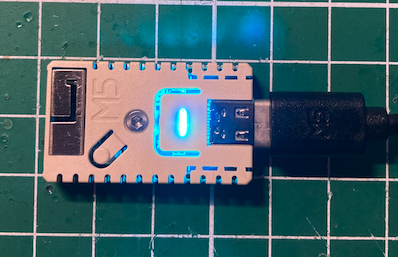
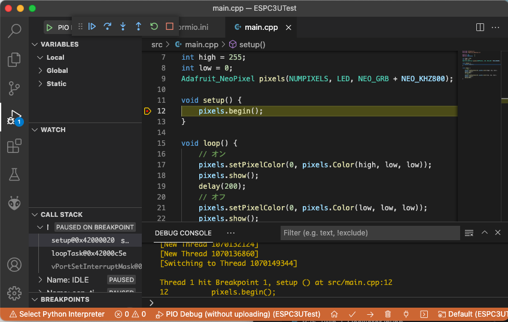
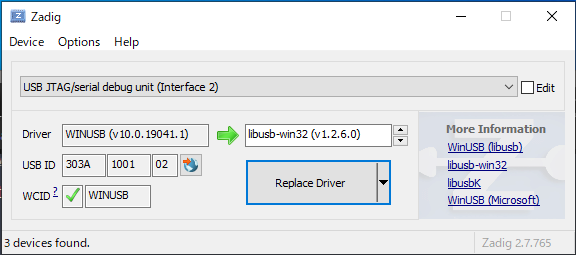

# 41-M5Stamp-C3Uをデバッグする(暫定方法)

## M5Stamp-C3Uの魅力
ESP（240MHz, Dual Core）に比べるとオープンソースのRisc-Vの(160MHz, Single Core)と性能は少し低いですが、
待望のWiFi, Bluetooth搭載Risc-V（ESP32-C3）ということで、リリース情報を聞いてすぐに購入しました。

さらに、M5Stamp-C3UはビルトインのUSB-CDCとJtagデバッガーが使えるので、購入してすぐにデバッガーが使えるます。



## なぜデバッガーが必要なのか
新しいCPUのプラットフォームでの開発は、プラットフォームの情報（ドキュメント）も少なく、ソフトの障害も含まれているため、
アプリのデバッグは大変になります。

そんな時こそ、デバッガーでアプリの動作を確認しながら、障害に対処するのが効率的です。

## PlatformIOを使って簡単環境セットアップ
新しいボードで一番大変な作業は、開発環境の構築ですね。PlatformIOを使うことで面倒な環境開発がコマンド一発で完了します。

ここからの開発はVisual Studio Code(以下VScodeと記す)を使用します。
最初に、新しくプロジェクトを作成するディレクトリをVScodeの「Open Folder...」で選択します。
次にVScodeのTerminalメニューからNew Terminalを選択すると画面下にターミナルウィンドウが開きます。

ここでは、「ESPC3UTest」ディレクトリを作成し、プロジェクトを作成することにします。最初に「ESP32C3」をキーワードに既存の登録ボードを検索します。

```bash
$ mkdir ESPC3UTest
$ cd ESPC3UTest
$ ~/.platformio/penv/bin/pio boards "ESP32C3"

Platform: espressif32
======================================================================================================
ID                  MCU      Frequency    Flash    RAM    Name
------------------  -------  -----------  -------  -----  ----------------------------
esp32-c3-devkitm-1  ESP32C3  160MHz       4MB      320KB  Espressif ESP32-C3-DevKitM-1
esp32-c3-devkitm-1  ESP32C3  160MHz       4MB      320KB  Espressif ESP32-C3-DevKitM-1
```

次に、Espressif ESP32-C3-DevKitM-1のID「esp32-c3-devkitm-1」を使ってプロジェクトを作成します。

```bash
$ ~/.platformio/penv/bin/pio init --board esp32-c3-devkitm-1
```

新しいプロジェクトが作成できたので、VScodeの「Open Folder...」で「ESPC3UTest」を選択します。

platform.iniを見ると以下のようになっていると思います（最初のコメントは省略）。
```
[env:esp32-c3-devkitm-1]
platform = espressif32
board = esp32-c3-devkitm-1
framework = espidf
```

私はespidfのフレームワークは馴染みがないので、Arduinoフレームワークを使えるように以下のように設定を変更します。
このフレームワークは暫定なので、PlatformIOの正式ページからは検索できません。

```
[env:esp32-c3-devkitm-1]
board = esp32-c3-devkitm-1
framework = arduino
platform = https://github.com/Jason2866/platform-espressif32.git
platform_packages = framework-arduinoespressif32 @ https://github.com/espressif/arduino-esp32.git
	tasmota/toolchain-riscv32
```

### Lチカ
M5Stamp-C3Uには、LEDは搭載されておらず、代わりにNeoPixelが１個ついています。

以下のサイトからNeoPixcelを使ったスケッチを参照しました。
- https://github.com/leCandas/M5Stamp-C3

src/main.cをmain.cppに書き換えて

```C++
#include <Arduino.h>
#include <Adafruit_NeoPixel.h>

#define LED         2
#define NUMPIXELS   1

int high = 255;
int low = 0;
Adafruit_NeoPixel pixels(NUMPIXELS, LED, NEO_GRB + NEO_KHZ800);

void setup() {
    pixels.begin();
}

void loop() {
    // オン
    pixels.setPixelColor(0, pixels.Color(high, low, low)); 
    pixels.show();
    delay(1000);
    // オフ
    pixels.setPixelColor(0, pixels.Color(low, low, low)); 
    pixels.show();
    delay(1000);
}
```

NeoPixelを使用するために、lib_deps項をplatformio.iniに追加します。

```
lib_deps = adafruit/Adafruit NeoPixel@^1.10.3
```

### ビルドと書き込み
最初に中央のボタンを押しながら、M5Stamp C3UにUSBケーブルを接続します。

次にVScodeのViewメニューからCommand Palette...を選択し、「PlatformIO: Upload」を選択すると、
スケッチのビルドと書き込みを自動的にしてくれます。

書き込みに成功したらM5Stamp C3Uのリセットボタンを押してください。中央ボタンの裏のNeoPixelが赤く点滅します。

### ピン配置
M5Stamp C3Uのピン配置をM5Stackのサイトから引用します。


SPI, I2Cのピン設定は、以下のURLのソースから取得しました。
- https://github.com/espressif/arduino-esp32/blob/master/variants/esp32c3/pins_arduino.h#L20-L23

整理すると以下のようになります。
| IO番号 | ピン番号 | 機能 |
|---|---|---|
| GPIO0 | G0 | A0 |
| GPIO1 | G1 | A1 |
| GPIO2 | - | NeoPixel |
| GPIO3 | G3 | A3 |
| GPIO4 | G4 | A4, SCK |
| GPIO5 | G5 | A5, MISO |
| GPIO6 | G6 | MOSI |
| GPIO7 | G7 | SS |
| GPIO8 | G8 | SDA |
| GPIO9 | G9 | SCL, Button |
| GPIO10 | G10 | |
| GPIO18 | G18 | D- |
| GPIO19 | G19 | D+ |
| GPIO20 | G20 | Rx0 |
| GPIO21 | G21 | Tx0 |
| CHIP_EN | EN | |


## ビルトイン・デバッガーを使う
最初に、今回のデバッガーの実装は現状で何とかデバッガーを動かそうとした暫定処置だということをご理解ください。

デバッガーを使用する上での１番の障害は、gdbのload機能が正常に機能しないことです。
そのため、プログラムを修正した後アップロードを実行してから、デバッグを開始しなくてはなりません。

### OpenOCDの設定
esp32-c3-devkitm-1ボードのデバッガーとしてUSB-JTAG(ビルトイン・デバッガー)はまだサポートしていないので、
PlatformIOのPio Debugは使えません。

そこで、カスタム・デバッグサーバとしてOpenOCDを使用します。platformio.iniに以下の３項目を追加します。

- build_flags: ビルド時にデバッグ情報を付加するように-gオプションを追加
- debug_tool: customでカスタム設定（debug_serverでデバッグサーバを使用）を宣言
- debug_server: デバッグサーバとして、openocdと起動オプションを指定


```
build_flags = -g
debug_tool = custom
debug_server =
  $PLATFORMIO_CORE_DIR/packages/tool-openocd-esp32/bin/openocd
  -f openocd.cfg
```

次にopneocd.cfgを以下のように作成します。

```
# インタフェース設定
# esp32 USB biltin
set _RTOS auto
source [find interface/esp_usb_jtag.cfg]

# CPUの設定
source [find target/esp32c3.cfg]
adapter_khz 5000

# デバッガの初期化
gdb_target_description enable
init
reset init
```

さらに、ESP32C3のrevisionミスマッチの発生を回避するため、gdbの開始時に以下のコマンドを実行するよう.initdbファイルを作成し、以下の設定を追加します。
- https://github.com/espressif/openocd-esp32/issues/144


```
set arch riscv:rv32
set mem inaccessible-by-default off
```

### デバッガーの実行
デバッグの実行時には、デバッグ情報付きの実行形式を書き込んだ後にリセットボタンを押します。
続いてVScodeのデバッグでは、「Pio debug(without uploading)」を選択し、デバッガーを起動します。

最初のブレークポイントとして、setup関数の最初の行にブレークポイントをセットしてください。

デバッガー正常に起動したら、以下のようにsetup関数の先頭で実行が止まり、デバッグ画面が表示されます。




## Windows固有の設定
Windowsの場合、gitとZadigのインストールが必要です。以下のサイトからダウンロードしてインストールしてください。
git
- https://gitforwindows.org/
Zadig
- https://zadig.akeo.ie/

Zadigを使って、jtagのドライバーをインストールします。
- optionsメニューからList All Devicesを選択
- Driverの右側をlibusb-win32(v1.2.6.0)を選択し、Replace Driverボタンを押下します。



openocdを以下のサイトからダウンロードして、ユーザディレクトリの.platformio/packagesにopenocd-esp32をコピーし、「tool-openocd-esp32」に名前を変更します。
https://github.com/espressif/openocd-esp32/releases/download/v0.11.0-esp32-20211220/openocd-esp32-win32-0.11.0-esp32-20211220.zip


gdbが.initdbを見つけることができるように、PlatformIOフォルダは、Cドライブ直下に置きました。

setup関数で停止するまでのDEBUG CONSOLEのログを追記しておきます(Macでのログ)。
```
Info : esp_usb_jtag: Device found. Base speed 40000KHz, div range 1 to 255
Info : clock speed 5000 kHz
Info : JTAG tap: esp32c3.cpu tap/device found: 0x00005c25 (mfg: 0x612 (Espressif Systems), part: 0x0005, ver: 0x0)
Info : datacount=2 progbufsize=16
Info : Examined RISC-V core; found 1 harts
Info :  hart 0: XLEN=32, misa=0x40101104
Info : JTAG tap: esp32c3.cpu tap/device found: 0x00005c25 (mfg: 0x612 (Espressif Systems), part: 0x0005, ver: 0x0)
adapter speed: 5000 kHz

Info : tcl server disabled
Info : telnet server disabled
Info : accepting 'gdb' connection from pipe
Warn : No symbols for FreeRTOS!
Info : Flash mapping 0: 0x10020 -> 0x3c020020, 35 KB
Info : Flash mapping 1: 0x20020 -> 0x42000020, 103 KB
Info : Auto-detected flash bank 'esp32c3.flash' size 4096 KB
Info : Using flash bank 'esp32c3.flash' size 4096 KB
Info : Flash mapping 0: 0x10020 -> 0x3c020020, 35 KB
Info : Flash mapping 1: 0x20020 -> 0x42000020, 103 KB
Info : Using flash bank 'esp32c3.irom' size 104 KB
Info : Flash mapping 0: 0x10020 -> 0x3c020020, 35 KB
Info : Flash mapping 1: 0x20020 -> 0x42000020, 103 KB
Info : Using flash bank 'esp32c3.drom' size 36 KB
0x40000000 in ?? ()
Info : JTAG tap: esp32c3.cpu tap/device found: 0x00005c25 (mfg: 0x612 (Espressif Systems), part: 0x0005, ver: 0x0)
JTAG tap: esp32c3.cpu tap/device found: 0x00005c25 (mfg: 0x612 (Espressif Systems), part: 0x0005, ver: 0x0)
Function "main" not defined.
Make breakpoint pending on future shared library load? (y or [n]) [answered N; input not from terminal]
PlatformIO: Initialization completed
PlatformIO: Resume the execution to `debug_init_break = tbreak main`
PlatformIO: More configuration options -> https://bit.ly/pio-debug
Note: automatically using hardware breakpoints for read-only addresses.
Info : [0] Found 8 triggers
[New Thread 1070137204]
[New Thread 1070132124]
[New Thread 1070136860]
[Switching to Thread 1070149344]

Thread 1 hit Breakpoint 1, setup () at src/main.cpp:12
12	    pixels.begin();
```


