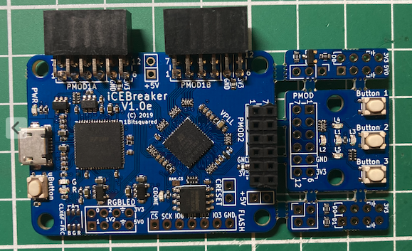
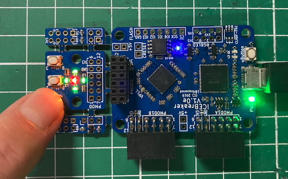
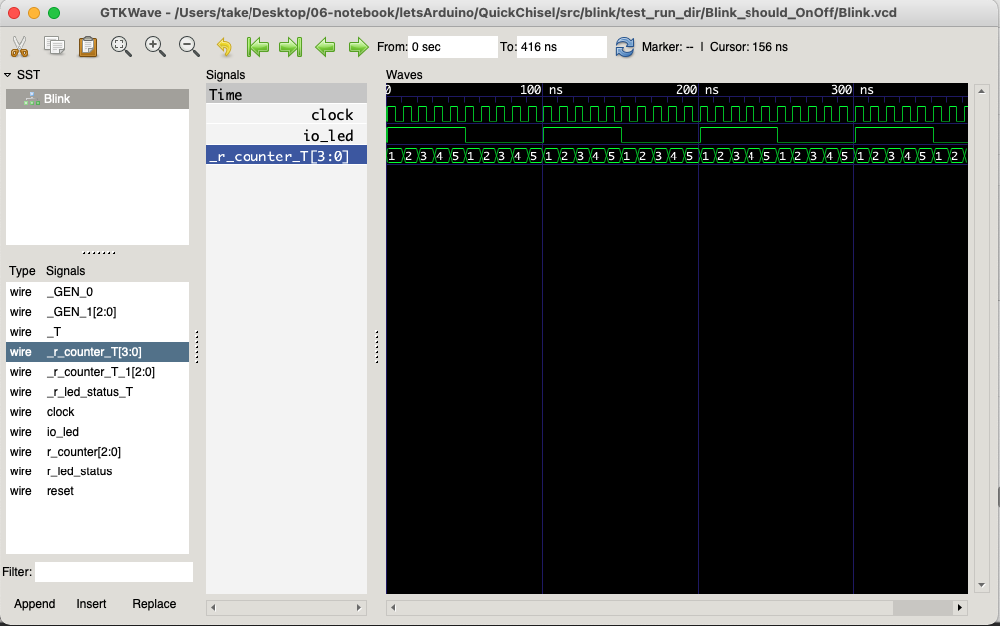
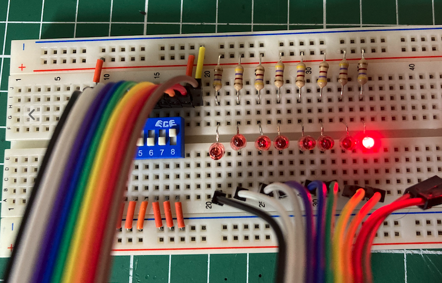

# 動かして学ぶChisel勉強ノート
FPGAでchiselをスパッと簡単に体験する方法をご紹介します。

使用するFPGAは、LatticeのICE40をベースとしたボードで、開発はオープンソースのApioを
使用します。

私が持っているボードは、以下の３つです。
- <a href="https://www.amazon.co.jp/dp/B092HRQZWR" >ICEBreaker 1.0E FPGA Lattice ICE40UP5K開発ボード</a>
- <a href="https://www.mouser.jp/ProductDetail/Crowd-Supply/CS-TINYFPGA-01?qs=0lSvoLzn4L9U5DUEM7Xg6A%3D%3D">TinyFPGA-BX</a>
- <a href="https://www.latticesemi.com/ja-JP/Products/DevelopmentBoardsAndKits/iCEstick">iCEstick 評価キット</a>

TinyFPGA-BXは、ブレッドボードを使ってFPGAで作った回路を確認するのにとても便利ですが、入手が難しいみたいです。iCEstick 評価キットは、以前秋月電子からも購入できたのですが今はありません。

ここでは入手性を考えて、ICEBreaker 1.0を使って説明します。



FPGAの論理合成や書き込みには、オープンソースの
<a href="https://github.com/FPGAwars/apio/wiki/Quick-start" >APIO</a>
を使用します。
APIOを使うことで、論理合成からボードへの書き込みまでがコマンド一発で完了します。

また、
<a href="https://icestudio.io/">icestudio</a>
というツールを使うとブロック図をベースにFPGAを回路を書き込むことができます。

以下に私がTinyFPGA-BXで試した記事があります。
- <a href="https://take-pwave.sakura.ne.jp/index.php?Arduino%E5%8B%89%E5%BC%B7%E4%BC%9A%2F29-TinyFPGA-BX">Arduino勉強会/29-TinyFPGA-BX</a>

## APIOのインストール
APIOを使用するには、Python3.7以上が必要です。私はAnacondaでPython3.7の環境を作って使用していますが、本家のページを参考に各自のPC環境に合わせてイントールしてください。
- https://github.com/FPGAwars/apio/wiki/Quick-start#apio-installation

ここでは、TinyFPGA-BXも使用できるように少し古いバージョンのAPIOとtinyprogをインストールします。
```bash
$ pip install apio==0.4.0b5 tinyprog
$ apio install --all
```

## chisel環境の構築
chiselの環境は、Dockerのイメージを使用します。

docker-composeを使うので、以下のGithubをダウンロードし、QuickChiselディレクトリをコピーして使ってください。
- https://github.com/take-pwave/letsArduino

すぐに使えるようにDocker Hubにアップしたイメージを使用しますが、docker-compose.ymlのbuild以下３行をコメントを外し、imageをコメントすることで、ローカルにイメージを作ることができます。

ターミナルソフトを起動し、コピーしたQuickChiselディレクトリに移動した後に、以下のコマンドを実行してください。
Dockerイメージのダウンロードと起動が自動的に行われます。sbt仮想環境が起動して、"/ #"のプロンプトが表示されます。

```bash
$ docker-compose run sbt
/ # 
```

Dockerイメージでは、ローカルのsrcディレクトリがsbt仮想環境の/srcにマッピングされています。

sbt仮想環境を終了し、sbt仮想環境のインスタンスを削除するには、以下のように入力してください。

```bash
/ # exit
$ docker-compose down
```

docker-compose downを実行しないとsbt仮想環境のインスタンスがたくさん残って無駄にディスクスペースを使います。

## chiselの教科書
chiselを試すときに無料の参考書があると安心です。Chiselの入門書「Digital Design with Chisel」の日本語訳版を以下のサイトから入手できます。
- https://github.com/chisel-jp/chisel-book

英語のPDFは、以下のURLで公開されています。
- http://www.imm.dtu.dk/~masca/chisel-book.pdf

日本語PDFは公開していないので、以下の手順で作成します。

QuickChisel/srcディレクトリに移動して、gitコマンドでchisel-bookを展開します。

sbt仮想環境で以下をコピー＆ペーストして日本語版を作成します。
```
# latexとscala環境をインストール
apk add --no-cache --update git make texlive-full
# scala環境を一時的に構築
export SCALA_VERSION=2.12.4
export SCALA_HOME=/usr/share/scala
apk add --no-cache --virtual=.build-dependencies wget ca-certificates
apk add --no-cache bash curl jq
cd /tmp
wget --no-verbose "https://downloads.typesafe.com/scala/${SCALA_VERSION}/scala-${SCALA_VERSION}.tgz"
tar xzf "scala-${SCALA_VERSION}.tgz"
mkdir "${SCALA_HOME}"
rm "/tmp/scala-${SCALA_VERSION}/bin/"*.bat
mv "/tmp/scala-${SCALA_VERSION}/bin" "/tmp/scala-${SCALA_VERSION}/lib" "${SCALA_HOME}"
ln -s "${SCALA_HOME}/bin/"* "/usr/bin/"
apk del .build-dependencies
rm -rf /tmp/scala-${SCALA_VERSION}*
# chisel-book-jpのPDF作成
git clone https://github.com/chisel-jp/chisel-book.git
cd chisel-book
make
cp chisel-book.pdf /src/
cd /tmp
rm -rf chisel-book
```

途中以下のエラーがでますが、pdfファイルは正常にsrc/chisel-book.pdfに作成されています。
```
Output written on chisel-book.pdf (201 pages, 4082139 bytes).
Transcript written on chisel-book.log.
make: [Makefile:19: book] Error 1 (ignored)
```


## Hello World（wire）を動かす
新しい環境で最初に試すプログラムをHello Worldと呼びますが、FPGAの場合これに相当するのが、
FPGAの外部IOポートを接続するwire処理ではないかと思います。

ICEBreakerのタクトスイッチとLEDを接続する例題をsbt環境で試してみましょう。

### プロジェクトの作成
sbt仮想環境を起動し、/srcに移動してから以下のコマンドを実行して新規プロジェクト「wire」を作成します。

```bash
/ # cd /src
/src # sbt new horie-t/chisel-seed.g8
[info] Set current project to src (in build file:/src/)
[info] Set current project to src (in build file:/src/)
[info] downloading https://repo1.maven.org/maven2/org/foundweekends/giter8/giter8-lib_2.12/0.11.0/giter8-lib_2.12-0.11.0.jar ...
途中省略
[info] 	[SUCCESSFUL ] ch.qos.logback#logback-core;1.2.3!logback-core.jar (607ms)

A minimal Chisel project. 

name [ChiselTemplateProject]: wire

Template applied in /src/./wire

/src # ls
chisel-book.pdf  target           wire
```

targetとwireディレクトリが作成されます。

最初に、使用するsbtのバージョンをDockerのsbt仮想環境に合わせます。

wire/project/build.propertiesのsbt.versionを1.4.4から1.3.10に変更します。

```
sbt.version=1.3.10
```

次に、不要なscalaファイルを削除します。#プロンプトの後のコマンドを入力してください。

```bash
/src # cd wire
/src/wire # rm -rf src/main/scala/* src/test/scala/*
```

### wireのコーディング
次にwireをscala言語で記述します。

wire/src/main/scala/wire.scalaを新規で作成し、以下の内容をコピーします。

```scala
import chisel3._
import chisel3.stage._

import java.io.PrintWriter

class Wire extends RawModule {
    val io = IO(new Bundle {
        val switch = Input(Bool())
        val led = Output(Bool())
    })

    io.led := io.switch
}

object VerilogEmitter extends App {
    val writer = new PrintWriter("target/wire.v")
    writer.write(ChiselStage.emitVerilog(new Wire))
    writer.close()
}
```

scalaコードの最初の2行は、常にimportします。
更にメインのscalaファイルには、Verilogのwire.vファイルを出力するために使用するPrintWirterのimport文が必要になります。

Wireクラス定義では、最初にioを定義し、その中に入力ポートswitch、出力ポートledを定義します。

switchとledの結線が最後の文になります。

```scala
    io.led := io.switch
```

object VerilogEmitterでは、メインのクラスWireと出力Verilogファイルwire.vを指定しています。

### wireのビルド
コーディングが完了したので、stbコマンドを使ってwire.scalaからverilogファイルwire.vを生成します。

```bash
/src/wire # sbt "run"
[info] Loading settings for project wire-build from plugins.sbt ...
[info] Loading project definition from /src/wire/project
[info] Loading settings for project root from build.sbt ...
[info] Set current project to wire (in build file:/src/wire/)
途中省略
[info] running VerilogEmitter 
[info] [0.006] Elaborating design...
[info] [0.202] Done elaborating.
[success] Total time: 8 s, completed Feb 20, 2022 8:18:30 AM
/src/wire # ls target/
scala-2.12  streams     wire.v
```

無事targetディレクトリにwire.vが生成されました。

## APIOプロジェクトの作成
別のターミナルを起動して、QuickChisel/src/wire/ディレクトリに移動します。

最初にtargetディレクトリにAPIOのプロジェクトを作成します。
apio initコマンドの引数--boardにiCEBreakerを指定します。
コマンドを実行すると、apio.iniファイルが生成されます。

```bash
$ cd target
$ apio init --board iCEBreaker
Creating apio.ini file ...
File 'apio.ini' has been successfully created!
$ ls
apio.ini	scala-2.12	streams		wire.v
```

### ボードのIOとピンのマッピング
iCEBreakerのピン番号は、以下のページに詳しく説明されています。
- https://github.com/icebreaker-fpga/icebreaker


switchとledには、Button1とLED1を使用することにします。その他にclockとresetピンも定義します。

- clock: CLOCK(pin 35)
- reset: Button3(pin 18)
- switch: Button1(pin 20)
- led: LED1(pin 25)

APIOにIOとピンマッピングを指定するファイルwire.pcfファイル作成し、以下の内容をコピーします。

```
set_io clock 35
set_io reset 18
set_io io_led 26
set_io io_switch 20
```

### ボードへの書き込み

これでボードへの書き込み準備は、完了です。iCEBreakerのUSBコネクターをPCと接続して、以下のコマンドを実行します。

```bash
$ apio upload
[Sun Feb 20 17:58:41 2022] Processing iCEBreaker
--------------------------------------------------------------------------------
arachne-pnr -d 5k -P sg48 -p wire.pcf -o hardware.asc -q hardware.blif
icepack hardware.asc hardware.bin
iceprog -d i:0x0403:0x6010:0 hardware.bin
init..
cdone: high
reset..
cdone: low
flash ID: 0xEF 0x70 0x18 0x00
file size: 104090
erase 64kB sector at 0x000000..
erase 64kB sector at 0x010000..
programming..
reading..
VERIFY OK
cdone: high
Bye.
========================= [SUCCESS] Took 8.61 seconds =========================

```

無事wireが書き込まれ、Button1を押下するとLED1(赤)が点灯します。




## Lチカ
wire（結線）の次は、もちろんLチカ（LEDの点滅）を試してみましょう。

sbt newコマンドとrmコマンドで、新規プロジェクトblinkを作成し、wireと同様に不要なファイルを削除します。その後、blink/project/build.propertiesのsbt.versionを1.4.4から1.3.10に変更します。
```bash
/src # sbt new horie-t/chisel-seed.g8
途中省略
A minimal Chisel project. 

name [ChiselTemplateProject]: blink

Template applied in /src/./blink

/src # cd blink
/src/wire # rm -rf src/main/scala/* src/test/scala/*
```

次に、src/main/scala/blink.scalaを以下のように作成します。

```scala
import chisel3._
import chisel3.stage._

import java.io.PrintWriter

// １秒ごとにOn/Offを繰り返す
class Blink(clk_frequency: Int) extends Module {
    // I/Oを定義：出力ポートled
    val io = IO(new Bundle {
        val led = Output(Bool())
    })

    // LEDの状態を保持
    val r_led_status = RegInit(true.B)

    // １秒分のクロックカウント
    val MAX_CLOCK_COUNT = (clk_frequency - 1).U

    // １秒分のカウンターに必要なビット数を.getWidthで取得
    val r_counter = RegInit(0.U(MAX_CLOCK_COUNT.getWidth.W))

    // カウンターがMAX_CLOCK_COUNTに達したら、LEDの状態を反転させる
    when (r_counter === MAX_CLOCK_COUNT) {
        // LEDの状態反転
        r_led_status := ~r_led_status
        // カウンターのリセット
        r_counter := 0.U
    } otherwise {
        r_counter := r_counter + 1.U
    }

    // LEDの状態を出力信号にセット
    io.led := r_led_status
}

object VerilogEmitter extends App {
    val writer = new PrintWriter("target/blink.v")

    // iCEBreakerのクロックは12MHz
    writer.write(ChiselStage.emitVerilog(new Blink(12000000)))
    writer.close()
}
```

### テスト
Chiselの最大の特徴は、scala言語を使ったテストベンチの作成にあります。
Junitに似たテスト環境が提供され、これまでのVerilogに比べとても簡単にテストを行うことができます。

```scala
import chisel3._
import org.scalatest._
import chiseltest._

import chiseltest.experimental.TestOptionBuilder._
import chiseltest.internal.WriteVcdAnnotation

class BlinkTest extends FlatSpec with ChiselScalatestTester {

    behavior of "Blink"

    it should "クロック周波数でOn/Offを繰り返す" in {

        // テストのためクロック周波数を5とし、４サイクル分実行する
        val clock_frequency = 5

        test(new Blink(clock_frequency)).withAnnotations(Seq(WriteVcdAnnotation)) { c =>
            // ４サイクル分のOn/Offをセット（期待値に使用）
            val led_cycle = Range(0, 8).map(_ % 2 === 0)
            for (expected_led <- led_cycle) {
                var i = 0
                while(i != clock_frequency) {
                    c.io.led.expect(expected_led.B)
                    c.clock.step()
                    i += 1
                }
            }
        }
    }
}
```

テストの実行は、sbt testコマンドを使って以下のように行います。

```bash
/src/blink # sbt "test"
[info] Loading settings for project blink-build from plugins.sbt ...
[info] Loading project definition from /src/blink/project
[info] Loading settings for project root from build.sbt ...
[info] Set current project to blink (in build file:/src/blink/)
[info] [0.047] Elaborating design...
[info] [1.934] Done elaborating.
file loaded in 0.9735554 seconds, 14 symbols, 12 statements
test Blink Success: 0 tests passed in 42 cycles in 0.925017 seconds 45.40 Hz
[info] BlinkTest:
[info] Blink
[info] - should クロック周波数でOn/Offを繰り返す
[info] ScalaTest
[info] Run completed in 19 seconds, 988 milliseconds.
[info] Total number of tests run: 1
[info] Suites: completed 1, aborted 0
[info] Tests: succeeded 1, failed 0, canceled 0, ignored 0, pending 0
[info] All tests passed.
[info] Passed: Total 1, Failed 0, Errors 0, Passed 1
[success] Total time: 30 s, completed Feb 26, 2022 2:38:29 AM
```

### テスト結果の可視化
テストを実行したときのsignalの状態がtest_run_dir/Blink_should_OnOff/Blink.vcdに記録されているので、フリーのGTKWaveで表示してみましょう。

Macの場合、brewコマンドで以下のようにGTKWaveをインストールできます。

```bash
$ brew install gtkwave
```

GTKWaveがインストールされていれば、est_run_dir/Blink_should_OnOff/Blink.vcdをダブルクリックするとGTKWaveにテスト結果を表示できます。

SSTのBlinkをクリックし、Signalsからclock, io_led, _r_counter_TをSignalsにドラッグすると以下のように波形が表示されます（マイナス虫眼鏡で時間スケールを大きくしています）。



### Lチカのビルド

Dockerのsbtターミナルでsbt runコマンドを実行し、Verilogファイルを生成します。
```bash
/src/blink # sbt "run"
途中省略
[info] running VerilogEmitter 
[info] [0.012] Elaborating design...
[info] [0.501] Done elaborating.
[success] Total time: 29 s, completed Feb 26, 2022 1:26:25 AM
```

次にMacのApioターミナルでtargetディレクトリにapioの初期化を実行します。

```bash
$ cd blink/target
$ apio init --board iCEBreaker
```

IOのピンマッピングをblink.pcfに以下のように定義します。

```
set_io clock 35
set_io reset 18
set_io io_led 26
```

apio uploadコマンドでiCEBreakerに書き込みます。

```bash
$ apio upload
[Sat Feb 26 12:06:45 2022] Processing iCEBreaker
--------------------------------------------------------------------------------
yosys -p "synth_ice40 -blif hardware.blif" -q blink.v
arachne-pnr -d 5k -P sg48 -p blink.pcf -o hardware.asc -q hardware.blif
icepack hardware.asc hardware.bin
iceprog -d i:0x0403:0x6010:0 hardware.bin
init..
cdone: high
reset..
cdone: low
flash ID: 0xEF 0x70 0x18 0x00
file size: 104090
erase 64kB sector at 0x000000..
erase 64kB sector at 0x010000..
programming..
reading..
VERIFY OK
cdone: high
Bye.
========================= [SUCCESS] Took 11.50 seconds =========================
```

無事Lチカが動きました。


## バイナリ演算
最初にバイナリ演算用のプロジェクトbinopsを作ります。
```bash
/ # cd /src
# sbt new horie-t/chisel-seed.g8
[info] Set current project to src (in build file:/src/)
[info] Set current project to src (in build file:/src/)

A minimal Chisel project. 

name [ChiselTemplateProject]: binops

Template applied in /src/./binops

```

binops/projectbuild.propertiesのsbt.versionを1.4.4から1.3.10に変更します。

不要なファイルを削除します。
```bash
/src # cd binops/
/src/binops # rm -rf src/main/scala/* src/test/scala/*
```

### BinOpsTopの定義
最初にBinOpsTopに入力aとbのビットの積演算を行い、その結果をcにセットするBinOpsTopクラスを定義します。

演算結果が確認できるようにprintf文も入れておきます。

```scala
import chisel3._
import chisel3.stage._

import java.io.PrintWriter

class BinOpsTop extends Module {

    val io = IO(new Bundle {
        val a = Input(Bool())
        val b = Input(Bool())
        val c = Output(Bool())
    })

    io.c := io.a && io.b
    printf("io.c = %b\n", io.c)    
}
```

### mainでテスト
今回使っているテンプレートのtest環境は、ChiselTestを想定しているので、ここではmain/scalaのrunでテストする方法を試してみます。

使用するのは、古いテスト環境のiotestersです。io.cの値を確認するために、printf文を使ったのですが、iotester.Driverの中ではエラーが出て使えなかったので、BinOpsTopの中にprintf文を入れました。

先のBinOpsTopクラスの下に、以下のテキストを追加して、実行してみます。

```scala
import chisel3.iotesters._

object TestRun extends App {

    var result = iotesters.Driver.execute(args, () => new BinOpsTop) {
        c => new PeekPokeTester(c) {

            poke(c.io.a, false.B)
            poke(c.io.b, false.B)
            expect(c.io.c, false.B)            
            step(1)

            poke(c.io.a, false.B)
            poke(c.io.b, true.B)
            expect(c.io.c, false.B)            
            step(1)

            poke(c.io.a, true.B)
            poke(c.io.b, false.B)
            expect(c.io.c, false.B)            
            step(1)

            poke(c.io.a, true.B)
            poke(c.io.b, true.B)
            expect(c.io.c, true.B)            
            step(1)

        }
    }
}
```

仮想環境のsbtで実行します。期待通りの値がセットされていました。

```bash
/src/binops # sbt "run"
[info] Loading settings for project binops-build from plugins.sbt ...
[info] Loading project definition from /src/binops/project
[info] Loading settings for project root from build.sbt ...
[info] Set current project to binops (in build file:/src/binops/)
[info] running TestRun 
[info] [0.012] Elaborating design...
[info] [2.446] Done elaborating.
file loaded in 0.501053305 seconds, 17 symbols, 12 statements
[info] [0.004] SEED 1651627133281
io.c = 0
io.c = 0
io.c = 0
io.c = 1
test BinOpsTop Success: 4 tests passed in 9 cycles in 0.074757 seconds 120.39 Hz
[info] [0.030] RAN 4 CYCLES PASSED
[success] Total time: 13 s, completed May 4, 2022 1:19:03 AM
```

## テスト用のブレッドボード

ブレッドボードにディップスイッチとLEDを並べてBinOpsの動作を試してみました。

回路は０が真の負論理です。



Verilogを出力するために、TestRunの代わりに以下のVerilogEmitterを定義します。

```scala
object VerilogEmitter extends App {
    val writer = new PrintWriter("target/binops.v")
    writer.write(ChiselStage.emitVerilog(new BinOpsTop))
    writer.close()
}
```

ボードのIOピンを参考にbinops.pcfを以下のように定義しました。
```
set_io clock 35
set_io reset 18
set_io io_a 44 
set_io io_b 45
set_io io_c 28
```

### 動作確認
sbtの"run"コマンドでbinops.scalaからbinops.vを生成します。

```bash
/src/binops # sbt "run"
[info] Loading settings for project binops-build from plugins.sbt ...
[info] Loading project definition from /src/binops/project
[info] Loading settings for project root from build.sbt ...
[info] Set current project to binops (in build file:/src/binops/)
[info] Compiling 1 Scala source to /src/binops/target/scala-2.12/classes ...
[warn] there were four feature warnings; re-run with -feature for details
[warn] one warning found
[info] running VerilogEmitter 
[info] [0.004] Elaborating design...
[info] [0.210] Done elaborating.
[success] Total time: 22 s, completed May 4, 2022 6:50:49 AM
```

別のターミナルウィンドウでiCEBreakerに書き込みます。

```bash
$ apio upload
[Wed May  4 15:52:04 2022] Processing iCEBreaker
--------------------------------------------------------------------------------
yosys -p "synth_ice40 -blif hardware.blif" -q binops.v
arachne-pnr -d 5k -P sg48 -p binops.pcf -o hardware.asc -q hardware.blif
icepack hardware.asc hardware.bin
iceprog -d i:0x0403:0x6010:0 hardware.bin
init..
cdone: high
reset..
cdone: low
flash ID: 0xEF 0x70 0x18 0x00
file size: 104090
erase 64kB sector at 0x000000..
erase 64kB sector at 0x010000..
programming..
reading..
VERIFY OK
cdone: high
Bye.
========================= [SUCCESS] Took 15.72 seconds =========================
```

ディップスイッチを変えてLEDのOn/Offを見ると以下のようになりました。

| a | b | c |
|---|---|---|
| Off | Off | Off |
| On | Off | On |
| Off | On | On |
| On | On | On |

これとAndの真理表を比べると、真逆になっていることが分かります。

| a | b | a&b |
|---|---|---|
| True | True | True |
| False | True | False |
| True | False | False |
| False | False | False |

## BinOpsTopで負論理から正論理に変換
そこで、実際の演算はBinOpsで行い、BinOpsTopでは負論理の値を正論理に変換してBinOpsに渡すことにします。

そして、BinOpsとBinOpsTopのインタフェースは同じなので、Bundleを拡張してBinOpsIOという集合体を定義します。
ここで戸惑ったのが、binopsインスタンスを生成する時にはBinOpsをModuleでラップしなければならないということです。

```scala
// 集合体BinOpsIOを定義
class BinOpsIO extends Bundle {
    val a = Input(Bool())
    val b = Input(Bool())
    val c = Output(Bool())
}

// ２項演算（積）を行うBinOpsクラス
class BinOps extends Module {
    val io = IO(new BinOpsIO)

    io.c := io.a & io.b
}

// BinOpsのトップクラス（負論理から正論理に変換）
class BinOpsTop extends Module {
    val io = IO(new BinOpsIO)
    // BinOpsをモジュールとして使う時には、Moduleでのラップが必要
    val binops = Module(new BinOps)
    
    // 負論理から正論理への変換
    binops.io.a := ~io.a
    binops.io.b := ~io.b
    io.c := ~binops.io.c
}

```


