## VScodeでArduinoのスケッチをデバッグする
<a href="https://github.com/take-pwave/letsArduino/blob/master/35-Arduino-SourceDebug.ipynb">「35-Arduino UNOのスケッチのソース・デバッグ 」</a>
でArduino Unoでもデバッグできることを紹介しました。

今回は少し遅いですが、とても簡単にArduino Unoのスケッチをデバッグする方法を紹介します。

### 秋月電子のAE-ATmegaボードを使った最小構成のArduino Uno
今回はRESETへの接続をジャンパーで設定できる秋月電子の
<a href="https://akizukidenshi.com/catalog/g/gP-04399/">ＡＴＭＥＧＡ１６８／３２８用マイコンボード（Ｉ／Ｏボード）通販コード：P-04399</a>
に最小構成の部品を載せたArduino Unoを作り、VScodeでのデバッグをします。

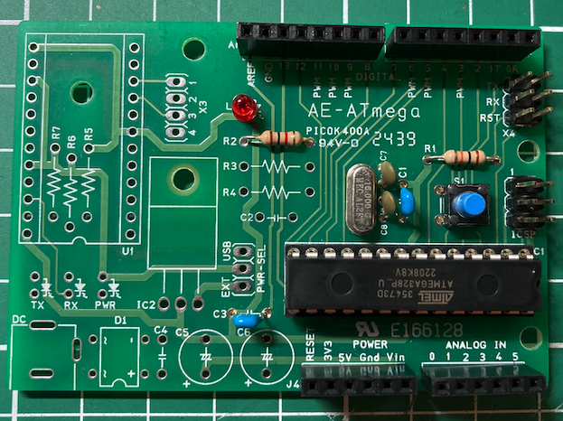


### Arduinoブートローダを書き込む
ブートローダーを書き込むには、別のArduino UnoまたはATmegaマイコンへの書き込み器が必要です。

今回はArduinoをするなら、１個は持っておいた方良いUSBASP(Amazonで検索すれば1000円以下で購入できます)を使います。

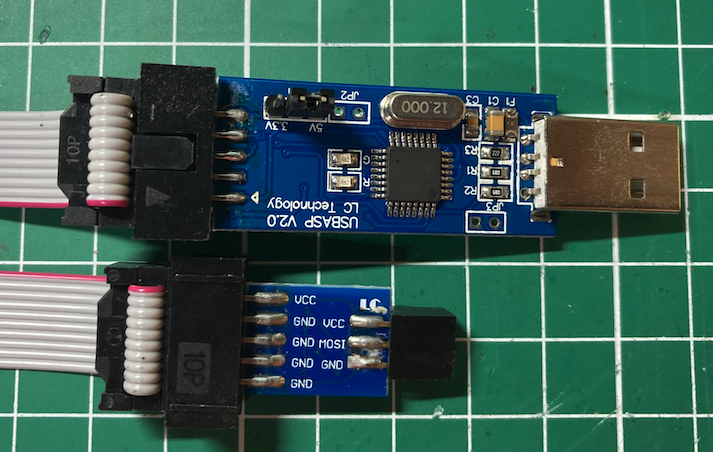

## VScodeの準備
VScodeを以下のURLからダウンロードします。
- https://code.visualstudio.com/download

つぎにVScodeのプラグインからPlatformIOをVScodeにインストールします。

VScodeのCode>Prefrences>Extensionsとメニューを選択すると、EXTENSIONSの一覧リストが画面左に表示されます（画面左のExtensionsアイコンでも可）。
ここで、「platformio」と入力すると、先頭にPlatformIO IDEが表示されますの「install」ボタンを押下するだけ、自動的にインストールされます（途中VScodeの再起動を要求されます）。


これでVScodeの準備は完了です。

### 新規プロジェクトの作成
左メニュのアリ?のようなPlatformIOのアイコンをクリックし、Welcome to PlatformIOの画面から「New Project」を選択します。

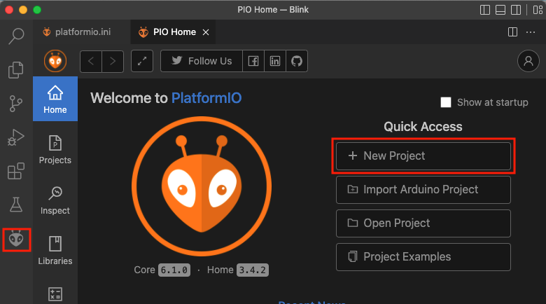

ここで、以下の項目を入力して「Finish」ボタンをクリックします。
- Name: BlinkUno
- Board: Arduino Uno

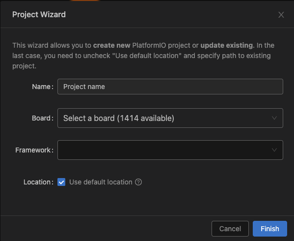


プロジェクトが作成され、platformio.iniファイルがオープンします。


### ブートローダーの書き込み
PlatformIOのメニューで作成されたプロジェクトでは、ブートローダーの書き込みメニューがでないことが分かりました。
VSCodeのターミナルを開いて、以下のコマンドを使ってプロジェクトを作り直します。

```bash
$ rm platformio.ini
$ ~/.platformio/penv/bin/pio init --board uno
```

ブートローダの書き込みのために、platformio.iniに以下の項目を追加します。

今回は、書き込みにUSBASPを使用するため、upload_protocol = usbaspを指定します。

```
board_bootloader.lfuse = 0xFF
board_bootloader.hfuse = 0xDE
board_bootloader.efuse = 0xFD
board_bootloader.lock_bits = 0x0F
board_bootloader.unlock_bits = 0x3F
upload_protocol = usbasp
upload_flags =
  -Pusb
```

FUSEビットと呼ばれる領域は、atmelavrマイコンではとても重要で、設定の意味は以下のサイトをみると分かりやすいです(機能がオンの場合、bitが０なのでちょっと注意が必要です)。
- https://www.engbedded.com/fusecalc/

USBASPをAE-ATmegaボードに接続します。

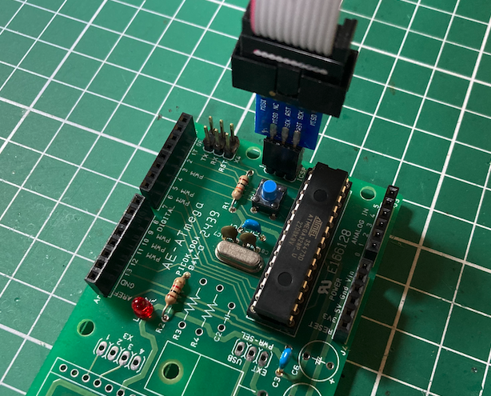

続いてPlatformIOのメニューから「Burn Bootloader」を選択します。
画面下に書き込みのログが表示されます。

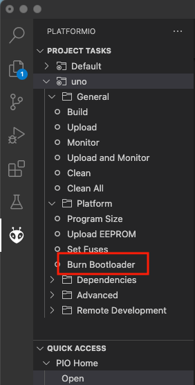

ターミナルに以下のように出力されていれば書き込みは成功です。

```
Uploading bootloader

avrdude: warning: cannot set sck period. please check for usbasp firmware update.
avrdude: AVR device initialized and ready to accept instructions

Reading | ################################################## | 100% 0.00s

avrdude: Device signature = 0x1e950f (probably m328p)
avrdude: NOTE: "flash" memory has been specified, an erase cycle will be performed
         To disable this feature, specify the -D option.
avrdude: erasing chip
avrdude: warning: cannot set sck period. please check for usbasp firmware update.
avrdude: reading input file "/Users/take/.platformio/packages/framework-arduino-avr/bootloaders/optiboot/optiboot_atmega328.hex"
avrdude: writing flash (32768 bytes):

Writing | ################################################## | 100% 0.00s

avrdude: 32768 bytes of flash written
avrdude: verifying flash memory against /Users/take/.platformio/packages/framework-arduino-avr/bootloaders/optiboot/optiboot_atmega328.hex:
avrdude: load data flash data from input file /Users/take/.platformio/packages/framework-arduino-avr/bootloaders/optiboot/optiboot_atmega328.hex:
avrdude: input file /Users/take/.platformio/packages/framework-arduino-avr/bootloaders/optiboot/optiboot_atmega328.hex contains 32768 bytes
avrdude: reading on-chip flash data:

Reading | ################################################## | 100% 0.00s

avrdude: verifying ...
avrdude: 32768 bytes of flash verified
avrdude: reading input file "0x0F"
avrdude: writing lock (1 bytes):

Writing | ################################################## | 100% 0.01s

avrdude: 1 bytes of lock written
avrdude: verifying lock memory against 0x0F:
avrdude: load data lock data from input file 0x0F:
avrdude: input file 0x0F contains 1 bytes
avrdude: reading on-chip lock data:

Reading | ################################################## | 100% 0.00s

avrdude: verifying ...
avrdude: 1 bytes of lock verified

avrdude: safemode: Fuses OK (E:FD, H:DE, L:FF)

avrdude done.  Thank you.
```


### スケッチの書き込み
通常のLチカではdelay関数を使うのですが、後でQEMUでも動くように_deley_msを使います。

main.cppに以下のコードをコピペしてください。

```C++
#include <Arduino.h>

void setup() {
  pinMode(LED_BUILTIN, OUTPUT);
}

void loop() {
  digitalWrite(LED_BUILTIN, HIGH);   
  _delay_ms(1000);                   
  digitalWrite(LED_BUILTIN, LOW);    
  _delay_ms(1000);                   
}
```

PLATFORMIOのメニューから「Upload」をクリックしてください。
書き込みが成功したら、AE-ATmegaボードのLEDが点滅します。


## ダイオードとUSBシリアル１個でできるデバッガー
この記事を書くきっかけになったのは、以下のサイトを見たことでした。
- <a href="https://zenn.dev/74th/articles/b61765bbc9fa17">ArduinoのATmega328pをVS CodeのPlatformIOでデバッグ実行する</a>

「dwire-debug」というデバッガーは、FT232またはCH340を搭載したUSBシリアル変換ボードと１個のダイオードでAVRのマイコンをデバッグできるいうから驚きです。
以下のGithubで公開されています。
- https://github.com/DeqingSun/dwire-debug

次のマイコンで動作が確認されています。
- ATtiny13, ATtiny45, ATtiny84, ATtiny841, ATtiny85, ATmega168PA, ATmega328P

ここでは、秋月電子から入手できる
<a href="https://akizukidenshi.com/catalog/g/gK-14745/">ＣＨ３４０Ｅ　ＵＳＢシリアル変換モジュール　Ｔｙｐｅ－Ｃ</a>
を使います。

配線は以下のようになります。
```
From any generic (i.e. CH340G)    Rx  o----------------+-------o  Reset pin of the AVR MCU to be debugged
arbitrary baudrate speed capable              D1       |
USB to serial (TTL) adapter       Tx  o-------|<-------+
                                            1N4148
```

ブレッドボードを使って以下のようにダイオードを挿します。

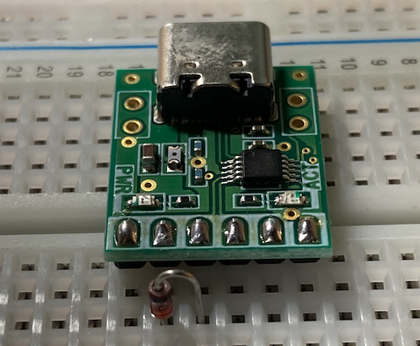

### Arduino Unoとの接続
USBシリアルとArduino Unoを以下のように接続します。

| USBシリアル | Arduino Uno |
|:-- | :-- |
| 2: RXD | nRESET |
| 4: VC | 5V |
| 6: GND | GND |

ブレッドボードに載せたUSBシリアルとAE-ATmega(Arduino Uno相当)接続は以下のようになります。
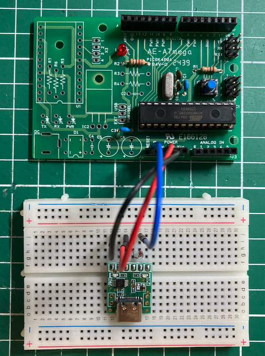

## dwdebugのインストール
dwire-debugは、1-wire双方向インターフェースプロトコルを使ったデバッガーで、これとgdbのプロトコルを処理するプログラムがdwdebugです。

WindowsとMac OSXのバイナリが以下のURLで提供されていますが、Mac OSXのセキュリティが厳しくなりそのままでは動作しませんでした。
- https://github.com/DeqingSun/dwire-debug/releases/tag/v0.1

dwire-debugのコンパイルには、libusbの1.0.23が必要ですが、最近のbrewは最新のバージョンをインストールしてしまうので、
以下のようにタップを使って1.0.23をインストールします。ついでにavrdudeもインストールします。

```bash
$ brew tap-new libusb/taps
$ brew extract libusb libusb/taps --version 1.0.23
$ brew install libusb libusb/taps/libusb@1.0.23
$ brew link --overwrite libusb@1.0.23
```

次にgitコマンドで以下のコマンドでソースをチェックアウトします。
```bash
git clone https://github.com/DeqingSun/dwire-debug
cd dwire-debug
```

libusb@1.0.23を使用するため、Makefileの４９行目を
```
 	$(CC) -std=gnu99 -g -fno-pie -rdynamic -fPIC -Wall -o $(BINARY) src/$(TARGET).c /usr/local/Cellar/libusb/1.0.23/lib/libusb-1.0.a /usr/local/Cellar/libusb-compat/0.1.5_1/lib/libusb.a -ldl -Wl,-framework,IOKit -Wl,-framework,CoreFoundation
```
を以下のように変更してください。
```
 	$(CC) -std=gnu99 -g -fno-pie -rdynamic -fPIC -Wall -o $(BINARY) src/$(TARGET).c /usr/local/Cellar/libusb@1.0.23/1.0.23/lib/libusb-1.0.a /usr/local/Cellar/libusb-compat/0.1.5_1/lib/libusb.a -ldl -Wl,-framework,IOKit -Wl,-framework,CoreFoundation
```

これでmakeが成功するとdwdebugの起動されて>プロンプトが表示されますので、「q」を入力すると終了します。
```
$ make
#gcc -std=gnu99 -g -fno-pie -rdynamic -fPIC -Wall -o dwdebug src/dwdebug.c -lusb -ldl
gcc -std=gnu99 -g -fno-pie -rdynamic -fPIC -Wall -o dwdebug src/dwdebug.c /usr/local/Cellar/libusb@1.0.23/1.0.23/lib/libusb-1.0.a /usr/local/Cellar/libusb-compat/0.1.5_1/lib/libusb.a -ldl -Wl,-framework,IOKit -Wl,-framework,CoreFoundation
ls -lap dwdebug
-rwxr-xr-x  1 take  staff  209720  7 10 18:32 dwdebug
./dwdebug
Unconnected.                             > q
＄
```

コンパイルが成功したら、/usr/local/binにインストールします。
```
$ make install
```

dwdebugのマニュアルは、以下を参照してください。
- https://github.com/dcwbrown/dwire-debug/blob/master/Manual.md

### Arduino Unoの準備
dwdebugを使うには、FUSEでDWEN=0(チェックを付け)、debugwireを有効化する必要があります。
- https://www.engbedded.com/fusecalc/

fusecalcのサイトでDWENを有効にした時のhFuseの値を確認します。

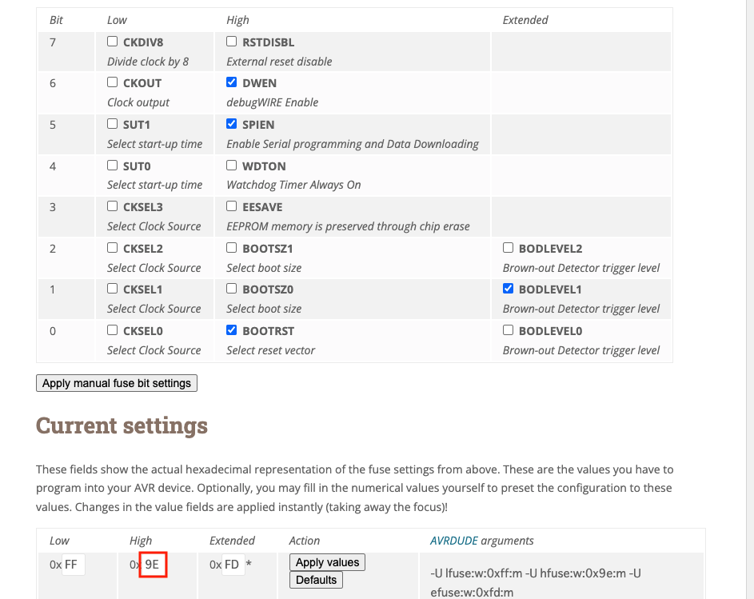

次にUSBaspを使ってhFuseの値を「DE」から「9E」に変更します。

```bash
$ avrdude -patmega328p -cusbasp -U hfuse:w:0x9E:m
```

USBシリアルのデバイス名を確認します。
```bash
$ ls /dev/cu.*
/dev/cu.Bluetooth-Incoming-Port	/dev/cu.wchusbserial14130
/dev/cu.usbserial-14130
```

cu.usbserial-14130からcuをttyに替えた名前をデバイス名としてdwdebugを起動します。
```bash
$ dwdebug device tty.usbserial-14130
Connected to ATmega328P on /dev/tty.usbserial82224 at 128999 baud.
02d0: 5021  subi  r18, $1               >
```

USBシリアルでATmega328pに接続できたのを確認したので、ctrl-Cで終了します。


## Blinkスケッチをデバッグする
デバッグの準備ができたので、VScodeのplatformio.iniに以下を追加して、PIO Debugでavr-gdbが起動するようにします。
私の環境では、ホームディレクトリ以下の~/.platformio/packages/toolchain-atmelavr@1.70300.191015/binにavr-gdb
がインストールされていました。各自の環境に合わせてこの部分は置き換えてください。

```
build_type = debug
debug_tool = custom
debug_server = ${sysenv.HOME}/.platformio/packages/toolchain-atmelavr@1.70300.191015/bin/avr-gdb
debug_init_cmds =
    set remoteaddresssize 32
    target remote localhost:4444
    load
```

main.cppを開いてsetup関数の最初にブレークポイントをセットします。

以下では、LEDの点滅箇所にもブレークポイントをセットしています。

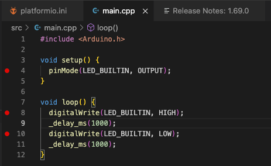

次にターミナルで以下のコマンド入力します。
```bash
$ dwdebug device tty.usbserial-14130,gdbserver,qr
```

VScodeの左のデバッグアイコンを選択し、RUN AND DEBUGから「PIO Debug(without uploading)」を選択し、起動します。

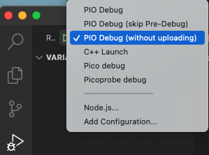

dwdebugには、たくさんのログが出力され、デバッグの準備が行われているが確認できます。
最初のブレークポイントで停止すると以下のような画面になります。

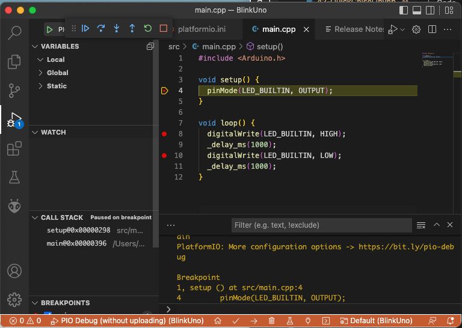

dwdebugは決して速くないので、関数のステップオーバーはとても遅くなります。
式や制御文でのステップ実行に留め、適宜ブレークポイントを付けてデバッグしてください。


### デバッグが終了したら
デバッグを終了したら、DWEN=1(チェックを外し)、debugwireを無効にします。avrdudeでhFuseの値を「９E」から「DE」に戻します。

```bash
$ avrdude -patmega328p -cusbasp -U hfuse:w:0xDE:m
```

## おまけ（QEMUを使ったデバッグ）
Interface 2022年7月号のQEMUの説明ではとても難しそうに説明されていましたが、インストールおよび実行がとても簡単にできることが分かりました。

### QEMUのインストール
ターミナルで以下のbrewコマンドを実行します。

```bash
$ brew install qemu dtc
```

### QEMUでデバッグ
QEMUでデバッグするので、main.cppのスケッチを動きがわかるカウンターとしました。

```C++
#include <arduino.h>

int counter = 0;
void setup()
{
    Serial.begin(9600);
}

void loop()
{
    counter++;
    Serial.print("counter=");
    Serial.println(counter);
    _delay_ms(1000);
}
```

VScodeのターミナルで以下のコマンドを実行します。

```bash
$ qemu-system-avr -machine uno -bios .pio/build/uno/firmware.elf -gdb tcp::4444
```

QEMUのウィンドウが表示します。
Viewメニューから「Serial0」を選択するとシリアルの出力をみることができます。

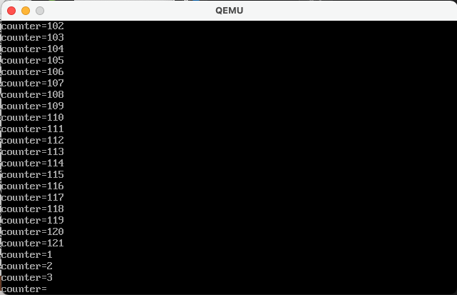

VScodeの左のデバッグアイコンを選択し、RUN AND DEBUGから「PIO Debug(without uploading)」を選択し、起動します。

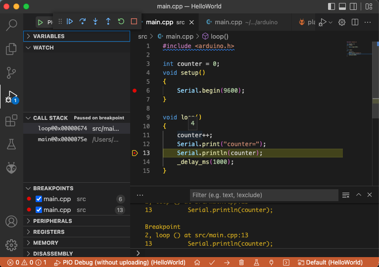


変数の値は、カーソルを変数の上に移動すると表示します。
また、Debug Consoleでもpコマンドで見ることもできます。

```
p counter
$1 = 4
```
