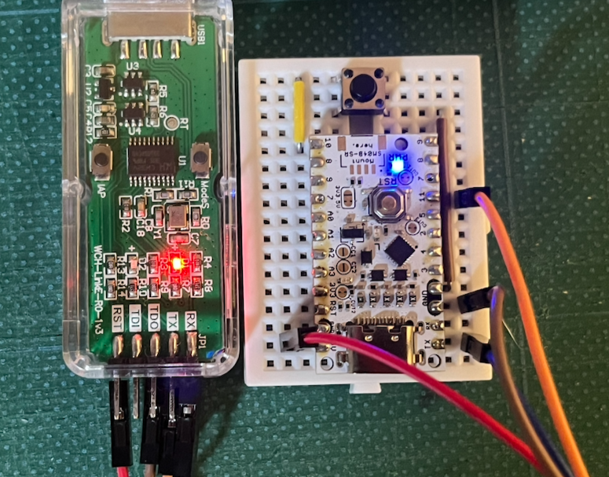
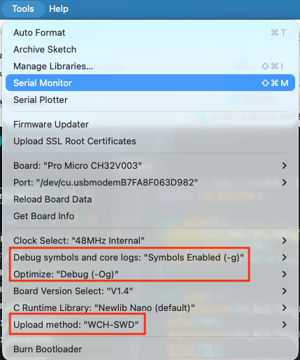
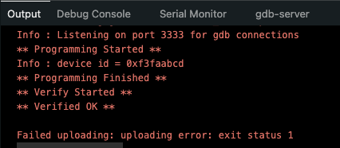
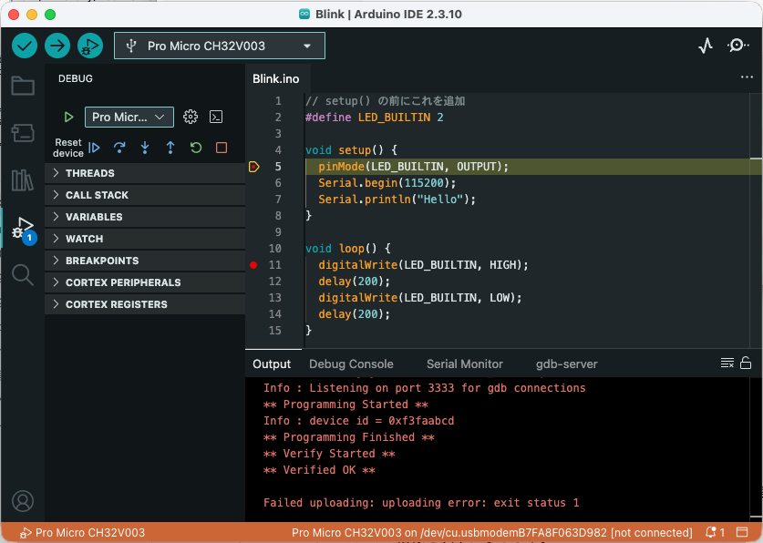
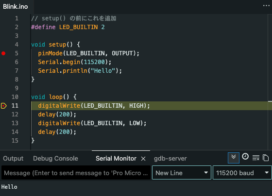

## 格安Arduino　UIAPduinoを使ってみる
1枚270円という格安のArduinoボードUIAPduino Pro Micro v1.4がSwitch Scienceから安定供給されました。


UIAPduinoは、CH32V003というRisc-Vチップを使った本格的なマイコンボードです。しかもWCH-LinkEエミュレータ（秋月電子で1160円）を使ってデバッグができるとなれば使ってみるしかありません。

#### UIAPduinoの使えるピン
UIAPduinoのピン設定をスイッチサイエンスのサイトから引用します。


注意する点では電源の5Vと3V3のどちらを使うかですが、デバッグをする場合には5Vでないと動作しませんでした。また左の7, 8, 9番ピンと右の7, 8, 9番ピンは内部で同じピンに接続されています（ブレッドボードの結線の工夫に使用すると良いでしょう）。
また、内部のLEDに接続されている２番ピンをIOとして使用するときには<a href="https://www.uiap.jp/doc/UIAPduino-Pro-Micro-CH32V006-V1dot1-sch.pdf">回路図</a>をチェックする必要があります。

## Arduino IDE (２．ｘ)のインストール
UIAPduinoのデバッグ機能を使うには最新のArduino IDE（2.x）が必要です。以下のサイトからPCにあったArduino IDEをダウンロードしてください。
- https://support.arduino.cc/hc/en-us/articles/360019833020-Download-and-install-Arduino-IDE

私は、Mac版の2.3.10をダウンロードしました。

### UIAPduino Pro Microのツール・パッケージのインストール
Arduino IDEでUIAPduinoを使うには、ボードマネージャでUIAPduinoのツール・パッケージをダウンロードします。

Arduino IDE > Preferencesを開き"Additional boards manager URLs:"に以下のURLを入力します。
- https://github.com/YuukiUmeta-UIAP/board_manager_files/raw/main/package_uiap.jp_index.json


### Boards Managerでインストール
続いて、Tools > Board > Boards Manager... を選択し、検索フィルターの"Filter your search..."で"UIAPduino"と入力すると最新（現行1.0.42）のUIAPduino 1.0.42が表示されるので、"INSTALL"ボタンをクリックしてください。


### サンプルスケッチ
おなじみのBlinkを作って、アップロードします。

Blink.inoを以下の様に入力します。
```c++
// setup() の前にこれを追加
#define LED_BUILTIN 2 

void setup() {
  pinMode(LED_BUILTIN, OUTPUT);
}

void loop() {
  digitalWrite(LED_BUILTIN, HIGH);
  delay(500);
  digitalWrite(LED_BUILTIN, LOW);
  delay(500);
}
```

### スケッチのアップロード
UPIAduinoのリセットボタンを押しながらUSBソケットをつなぎ、Arduino IDEのアップロードボタンを押します。この時3.3Vピン横のLEDが小さく点滅していることを確認してください。

Image written.と出力されたら、UPIAduinoのリセットボタンを押します。
オレンジのLEDが点滅したら、完成です！

### Macを使っている人だけ
MacのArduinoを使っている人は、1.0.42のツールに含まれているminichlinkで以下のエラーがでます。
この"/Users/ユーザID/Library/Arduino15/packages/UIAP/tools/minichlink-2982dfd/1.0.0/"というディレクトリ名をメモしてください。

```
Failed uploading: cannot execute upload tool: fork/exec /Users/take/Library/Arduino15/packages/UIAP/tools/minichlink-2982dfd/1.0.0/minichlink: exec format error
```

このリポジトリのdata/44-data/minichlink.zipをダウンロードしてください。（これはVScode用に提供されているパッケージからminichlinkを抜粋したものです）

"/Users/ユーザID/Library/Arduino15/packages/UIAP/tools/minichlink-2982dfd/1.0.0/"にminichlinkとminichlink.soをコピーしてください。

再度、アップロードを実行すると今度は以下のエラーメッセージがでます。
```
VID:0x1209, PID:0xb003
Error: Could not initialize any supported programmers
```
これが出力された場合、先ほどのzipファイルのplatform.txtを以下に置き換えてください。（ここでminichlinkに-cオプションとしてVID:PIDを追加し、PID:0xb803となるようにしました）

/Users/ユーザID/Library/Arduino15/packages/UIAP/hardware/ch32v/1.0.42/platform.txt

Arduino IDEを再起動してアップロードしてみてください。
## UIAPduinoのデバッグ
UIAPDuinoは、<a href="https://akizukidenshi.com/catalog/g/g118065/">WCH-LinkEエミュレーター</a>を使ってデバッグすることができます。アマゾン<a href="amazon.co.jp/dp/B0GJ7DPZ25/">(２個で1,725円)</a>や秋月電子（1,160円)で購入することができます。

WCH-LinkEエミュレータは、RISC-VとARMモードによってデバッグできるCPUが異なります。UIAPduinoは、RISC-Vチップですので、RISC-Vモード（PCに接続したときに赤のLEDが点灯）で使用します。

UIAPduino 1.0.42で使用するには、WCH-LinkEのバージョンが2.11以降が必要です。VSCodeのPlatformIOだと途中のメッセージでバージョンを確認することができます。WCH-LinkEのバージョンは以下の項目で確認できます（この例では2.22）。

```
Info : WCH-LinkE  mode:RV version 2.22
```

WCH-LinkEのバージョンアップするには、Windows環境にWCH-LinkUtilityをインストールする必要がありますが、ここでは割愛させて頂きます。
### WCH-LinkEエミュレータの特徴
WCH-LinkEエミュレータはデバッグできるだけでなく、ArduinoのSerial関連のメソッドを使ってシリアルモニターに出力することができます。
別途USBシリアルのアダプターを購入しなくてもよいのは嬉しい限りです。
### WCH-LinkEとUIAPduinoの接続
UIAPduinoは、５Vの電圧を必要とするため、WCH-LinkEとの接続時には注意が必要です。

WCH-LinkEとUIAPduinoの結線を以下に示します。赤は５V、茶はGND、橙はSWDIO、青はRS-TXです。WCH-LinkEのLEDが赤が点灯してるので、RISC-Vモードであることが確認できます。

| WCH-LinkEピン | UIAPduinoピン |
| ----------- | ----------- |
| 5V          | 5V          |
| GND         | GND         |
| SWDIO/TMS   | 11          |
| RS          | TX          |


### Arduino IDEの設定
通常のコンパイルとデバッグするときのコンパイルは異なります。ソースレベルでのデバッグをするには、関数や変数等のシンボル情報をコンパイルと一緒に出力しなくてなりません。
また、WCH-LinkEと接続している場合、アップロードは"WCH-SWD"を選択します。

Arduino IDEの"Tool"メニューで赤枠の箇所を設定してください。




### WCH-SWDでのアップロード
WCH-SWDを選択してアップロードを実行すると以下のエラーメッセージが表示されます。


しかし、このメッセージを消した後のOutput タグを見るとアップロードは、正常に終了し、Verified OK と出力されています。何度か使っていますが今のところ何の問題もないので、アップロードは正常に行われていると思われます。



### デバッグ画面
画面左上の虫の付いた実行ボタンをクリックするとデバッガー実行し、赤○で示したブレークポイントで止まります。



### シリアルモニターの設定
WCH-LinkEによるシリアルポートは、接続時に追加されたものを見ながら判断してください。
今回のスケッチでは、setup関数でSerial.bgein(115200);としているので、シリアルのボーレートは115200に合わせます。

ソース画面下の"Serial Monitor"タグを選択し、ステップ実行で"Serial.println("Hello");の行を過ぎるとシリアルモニターに"Hello"と表示されます。



### デバッグ時の注意点
いいことばかりのデバッガーですが、UIAPduinoは、書き込みできるFlashメモリのサイズが16KBと少ないため、あまり大きなスケッチをデバッガー付きでコンパイルすると動かなくなります。
とくに大きなライブラリをリンクするとAdafruit DHT sensor libraryを使うとすぐにリンクエラーとなってしまいます。

