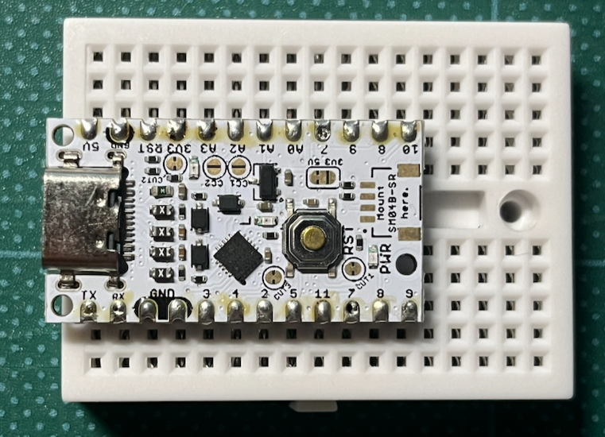
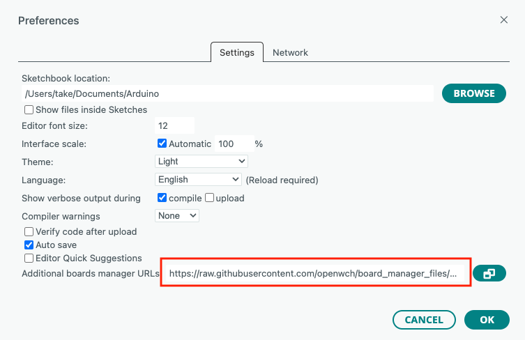
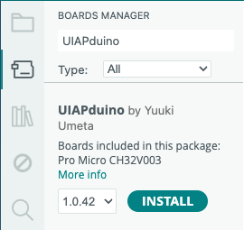

## 格安Arduino　UIAPduinoを使ってみる
1枚270円という格安のArduinoボードUIAPduino Pro Micro v1.4がSwitch Scienceから安定供給されました。



UIAPduinoは、CH32V003というRisc-Vチップを使った本格的なマイコンボードです。しかもWCH-LinkEエミュレータ（秋月電子で1160円）を使ってデバッグができるとなれば使ってみるしかありません。

## Arduino IDE (２．ｘ)のインストール
UIAPduinoのデバッグ機能を使うには最新のArduino IDE（2.x）が必要です。以下のサイトからPCにあったArduino IDEをダウンロードしてください。
- https://support.arduino.cc/hc/en-us/articles/360019833020-Download-and-install-Arduino-IDE

私は、Mac版の2.3.10をダウンロードしました。

### UIAPduino Pro Microのツール・パッケージのインストール
Arduino IDEでUIAPduinoを使うには、ボードマネージャでUIAPduinoのツール・パッケージをダウンロードします。

Arduino IDE > Preferencesを開き"Additional boards manager URLs:"に以下のURLを入力します。
- https://github.com/YuukiUmeta-UIAP/board_manager_files/raw/main/package_uiap.jp_index.json




### Boards Managerでインストール
続いて、Tools > Board > Boards Manager... を選択し、検索フィルターの"Filter your search..."で"UIAPduino"と入力すると最新（現行1.0.42）のUIAPduino 1.0.42が表示されるので、"INSTALL"ボタンをクリックしてください。



### サンプルスケッチ
おなじみのBlinkを作って、アップロードします。

Blink.inoを以下の様に入力します。
```c++
// setup() の前にこれを追加
#define LED_BUILTIN 2 

void setup() {
  pinMode(LED_BUILTIN, OUTPUT);
}

void loop() {
  digitalWrite(LED_BUILTIN, HIGH);
  delay(500);
  digitalWrite(LED_BUILTIN, LOW);
  delay(500);
}
```

### スケッチのアップロード
UPIAduinoのリセットボタンを押しながらUSBソケットをつなぎ、Arduino IDEのアップロードボタンを押します。この時3.3Vピン横のLEDが小さく点滅していることを確認してください。

Image written.と出力されたら、UPIAduinoのリセットボタンを押します。
オレンジのLEDが点滅したら、完成です！

### Macを使っている人だけ
MacのArduinoを使っている人は、1.0.42のツールに含まれている

以下のエラーがでます。この"/Users/ユーザID/Library/Arduino15/packages/UIAP/tools/minichlink-2982dfd/1.0.0/"というディレクトリ名をメモしてください。

```
Failed uploading: cannot execute upload tool: fork/exec /Users/take/Library/Arduino15/packages/UIAP/tools/minichlink-2982dfd/1.0.0/minichlink: exec format error
```
このリポジトリのdata/44-data/minichlink.zipをダウンロードしてください。（これはVScode用に提供されているパッケージからminichlinkを抜粋したものです）


"/Users/ユーザID/Library/Arduino15/packages/UIAP/tools/minichlink-2982dfd/1.0.0/"にminichlinkとminichlink.soをコピーしてください。

再度、アップロードを実行すると今度は以下のエラーメッセージがでます。
```
VID:0x1209, PID:0xb003
Error: Could not initialize any supported programmers
```
これが出力された場合、先ほどのzipファイルのplatform.txtを以下に置き換えてください。
（ここでminichlinkに-cオプションとしてVID:PIDを追加し、PID:0xb803となるようにしました）

/Users/ユーザID/Library/Arduino15/packages/UIAP/hardware/ch32v/1.0.42/platform.txt

Arduino IDEを再起動してアップロードしてみてください。

