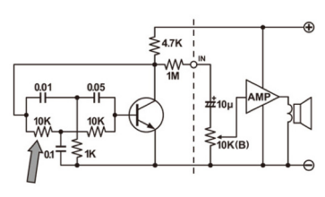
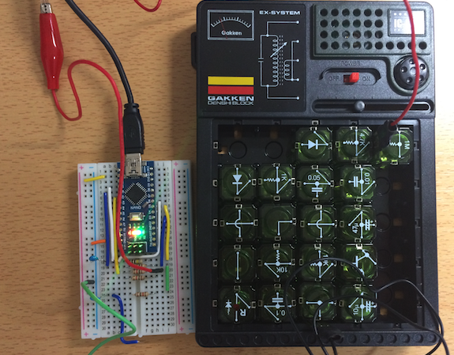
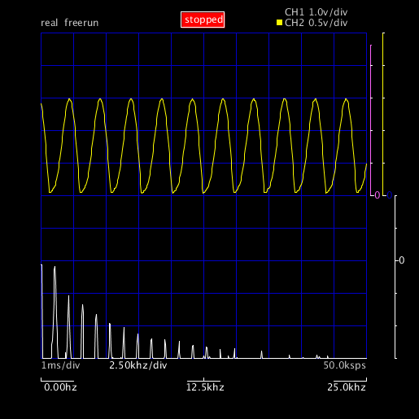
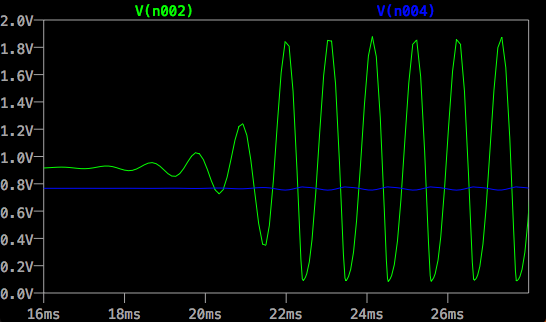
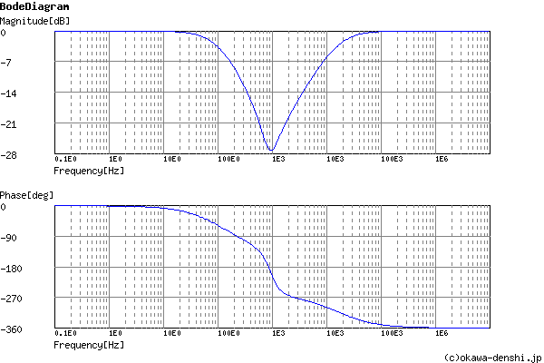
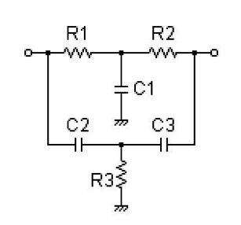
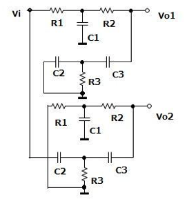
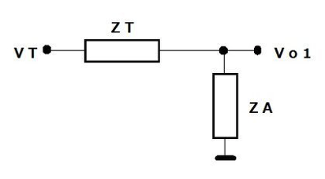

# No.25 Twin-T型発振回路
大人の科学 Vol.32の付録、電子ブロックを使ってTwin-T型発信回路に挑戦してみました。

矢印の抵抗とコンデサーが繋がっているところが、Tの字が２つ並んでみえることからTwin-T型と呼ばれています。



### 動かしてオシロスコープでみてみよう
それでは、回路を電子ブロックで組んで、動かしてみましょう。ポーとやさしい音が聞こえてきます。



九州工大のArduinoオシロスコープで波形とスペクトルをみてみましょう。ちょっと歪んでいますが、正弦波に近いに波形を示しています。FFTの結果から周波数は1kHz近くであることが分かります。



## LTSpiceで計算してみよう
上記の回路をLTSpiceで計算して波形をみてみましょう。
ちょっと分かりづらいですが、ベース電圧V(n004)の青い線とコレクター電圧V(n002)の緑の線で波形が反転しているのが分かります。

- [No.25.asc](data/No.25.asc)



### Twin-T CRフィルタの計算
抵抗とコンデンサーで作られるTwin-T CRフィルタの計算をしてくれる便利なサイトがありました。

- [Twin-T CR・フィルタ計算ツール](http://sim.okawa-denshi.jp/TwinTCRtool.php)

このサイトで計算した伝達関数は、以下のようになります。

$$
G(s) = \frac{s^3+2000s^2+12000000s+200000000000}{s^3+114000s^2+412000000s+200000000000
}
$$

伝達関数のグラフは、バンドパスフィルタがY軸で反転した形を持ち、
振幅が最も小さいところで、位相-180度（反転）となっています。




## Sageでノッチフィルタの伝達関数をプロット
せっかくSageを使っているので、ノッチフィルタの伝達関数のグラフを求めてみましょう。

s, R1, R2, R3, C1, C2, C3の変数を定義して、伝達関数Hを定義します。
伝達関数は、
[ツインＴノッチフィルタの解析](https://note.chiebukuro.yahoo.co.jp/detail/n327729?fr=pc_fb_share_n)
を参考にしました。

```python
## ノッチフィルタ
s, R1, R2, R3, C1, C2, C3 = var('s R1 R2 R3 C1 C2 C3')

H =( s^3*R1*R2*R3*C1*C2*C3 + s^2*(R2*R3*C2*C3  + R1*R3*C2*C3) + s*(C2*R3 + C3*R3) + 1)/(s^3*(C1*C2*C3*R1*R2*R3) + s^2*(C1*C3*R1*R2 + C2*C3*R1*R3 + C2*C3*R2*R3 + C1*C2*R1*R3 + C1*C3*R1*R3) + s*(C3*R1 + C3*R2 + C2*R3 + C1*R1 + C3*R3) + 1)
```

```python
show(H)
```

抵抗とコンデンサーの値をHに代入し、$s=2 \pi i f$として、伝達関数の振幅と位相をグラフに表示してみましょう。振幅はtoDb関数デジベルに変換、位相はtoDeg関数で度に変換して方対数グラフでプロットします。


```python
f = var('f')
vals = {s: 2*i*pi*f,  R1: 10^4, R2: 10^4, R3:10^3, C1:10^-7, C2: 10^-8, C3:5*10^-8}

h(f) = H.subs(vals)

# 電気ではデジベルで表示するため、toDb関数を定義する
def toDb(v):
    return 20*log(abs(v), 10) 

# 位相は以下の様になる
Phi(f) = arctan(imaginary(h(f))/real(h(f)))

# 位相を度で表示
def toDeg(v):
    return v*180/pi
```

```python
plot(toDb(h(f)), [f, 50, 10^5], scale="semilogx", plot_points=1024, figsize=5)
```

```python
# プロットに少し時間がかかります。
plot(toDeg(Phi(f)), [f, 50, 10^5], scale="semilogx", plot_points=300, figsize=5)
```

### フィルタ計算ツールとのクロスチェック
以下のサイトのフィルタの伝達関数とのクロスチェックし、一致することを確認しました。
- http://sim.okawa-denshi.jp/TwinTCRtool.php

```python
vals = {R1: 10^4, R2: 10^4, R3:10^3, C1:10^-7, C2: 10^-8, C3:5*10^-8}

hs(s) = H.subs(vals)
show(hs)
```

## ツインT型ノッチフィルタの伝達関数の求め方
昔の人はどうやってこんな複雑な伝達関数を計算できたのでしょう？

Sageを使って、伝達関数の導出を確認してみましょう。

以下のサイトを参考にしました。
- [ツインＴノッチフィルタの解析](https://note.chiebukuro.yahoo.co.jp/detail/n327729?fr=pc_fb_share_n)



次に重ねの理を使って、Vo = Vo1 + Vo2に分解します。ここがポイントです。



上部のVo1を以下のようにVT, ZT, ZAに整理します。



R1とC1の間の電圧は、テブナンの定理から以下のようになります。

$$
V_T = V_i \frac{\frac{1}{s C_1}}{R_1 + \frac{1}{s C_1}}
$$

$$
Z_T = R_2 + \frac{\frac{1}{s C_1}}{R_1 + \frac{1}{s C_1}}
$$

$$
Z_A = \frac{1}{s C_3} + \frac{\frac{R_3}{s C_2}}{R_3 + \frac{1}{s C_2}}
$$

これをSageで定義します。

```python
s, R1, R2, R3, C1, C2, C3 = var('s R1 R2 R3 C1 C2 C3')
VT, Vi, Vo, Vo1, Vo2, ZT, ZA = var('VT Vi Vo Vo1 Vo2 ZT ZA')

VT = Vi * (1/(s*C1)/(R1 + 1/(s*C1)))
ZT = R2 + (R1/(s*C1))/(R1+1/(s*C1))
ZA = 1/(s*C3) + (R3/(s*C2))/(R3 + 1/(s*C2))
show(VT); show(ZT); show(ZA)
```

Vo1は、VTをZTとZAで分圧しているので、以下のように求まります。

```python
Vo1 = VT*ZA/(ZT+ZA)
show(Vo1)
```

Vo2は、vo1に以下の置換をすると求まります。

$$
R1 → 1/sC2, R2 → 1/sC3, R3 → 1/sC1
$$

$$
C1 → 1/sR3, C2 → 1/sR1, C3→ 1/sR2
$$

```python
# 循環変換を避けるため、一旦R11, R22, R33, C11, C22, C33で置換
R11, R22, R33, C11, C22, C33 = var('R11 R22 R33 C11 C22 C33')
rel1= {R1: 1/(s*C22), R2: 1/(s*C33), R3: 1/(s*C11), C1: 1/(s*R33), C2: 1/(s*R11), C3 : 1/(s*R22)}
Vo2 = Vo1.subs(rel1)
show(Vo2)
# R1, R2, R3, C1, C2, C3に戻す
rel2 = {R11: R1, R22: R2, R33: R3, C11: C1, C22: C2, C33:C3}
Vo2 = Vo2.subs(rel2)
show(Vo2)
```

重ね合わせの理より、Voは、Vo1+Vo2で求まります。

```python
Vo = Vo1 + Vo2
show(Vo)
```

伝達関数 $H(s) = \frac{V_o}{V_i}$を求めると、以下のようになります。

```python
h_hat = Vo/Vi
show(h_hat)
```

h_hatに抵抗、コンデンサーの値を代入し、式を整理すると求める伝達関数となります。

```python
show(h_hat.subs(vals).simplify_full())
```

このようにSageを使うと式のまま計算を進め、グラフの表示や値の計算ができます。
